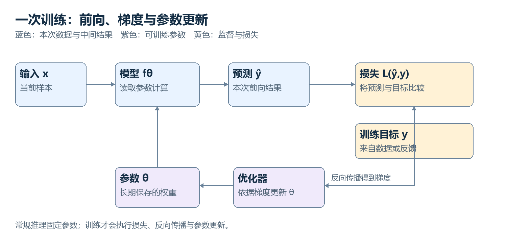
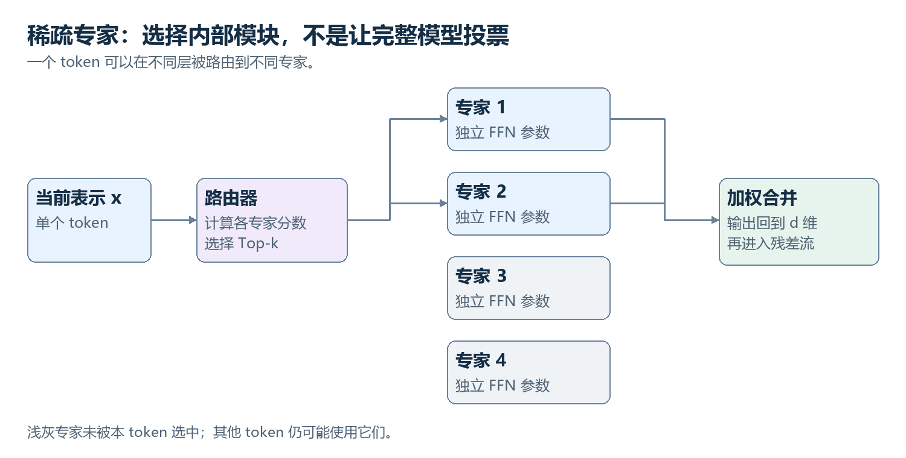
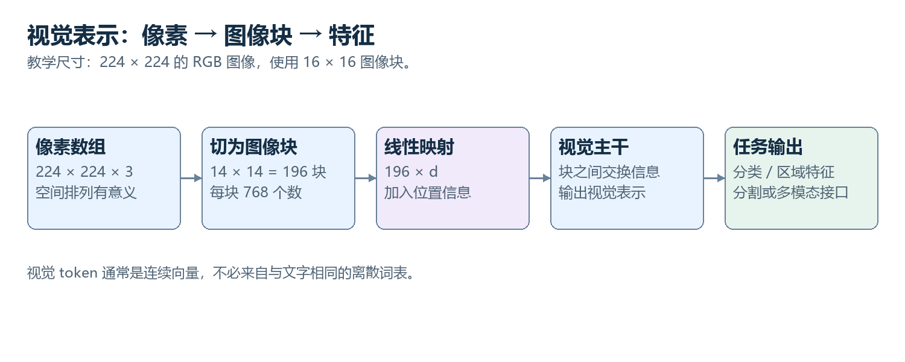
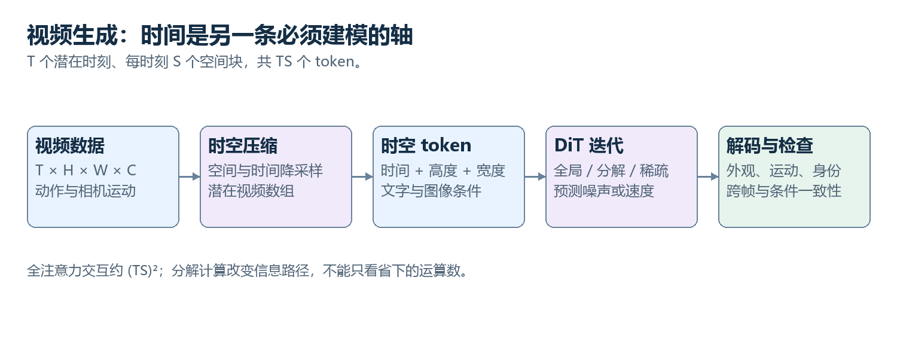
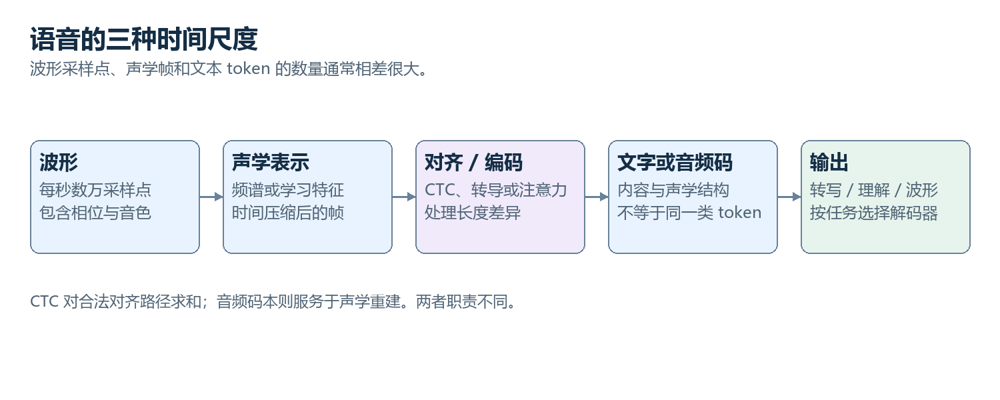

# AI 原理：从早期方法到现代智能系统

合并全文 · 2026-10-03 · 与分章版内容一致

[返回总目录](README.md)　｜　[方法出处](SOURCES.md)

## 合并版目录

- [00　先把 AI 的整张地图放在桌上](#chapter-00)
- [01　从规则、搜索到从数据中学习](#chapter-01)
- [02　模型、数据和目标：学习究竟意味着什么](#chapter-02)
- [03　神经网络：一层层数字变换怎样形成表示](#chapter-03)
- [04　一次训练：误差怎样改变参数](#chapter-04)
- [05　序列问题：从固定窗口、RNN 到注意力](#chapter-05)
- [06　文字怎样进入模型：token、嵌入与位置](#chapter-06)
- [07　把注意力完整算一遍：Q、K、V 到底在做什么](#chapter-07)
- [08　完整的 Transformer 层：信息汇集以后，还要做什么](#chapter-08)
- [09　Encoder、Decoder 与信息访问方式](#chapter-09)
- [10　预训练：为什么预测后续内容能形成广泛能力](#chapter-10)
- [11　生成一个回答：采样、KV Cache 与上下文](#chapter-11)
- [12　规模、数据与计算：大模型为什么变大](#chapter-12)
- [13　从续写模型到助手：指令微调、偏好与对齐](#chapter-13)
- [14　强化学习：动作会改变接下来看到的世界](#chapter-14)
- [15　推理模型：训练与推理时计算怎样共同起作用](#chapter-15)
- [16　MoE：参数很多，为什么每次只用一部分](#chapter-16)
- [17　把大模型算得动：注意力、精度、微调和并行](#chapter-17)
- [18　长上下文、RAG 与记忆：信息怎样在需要时进入计算](#chapter-18)
- [19　Agent：从产生答案到与环境形成闭环](#chapter-19)
- [20　Transformer 之外：状态空间、线性注意力与混合结构](#chapter-20)
- [21　视觉模型：从像素、卷积到 ViT](#chapter-21)
- [22　表示学习：相似性、对比学习与自监督视觉](#chapter-22)
- [23　多模态理解：语言模型怎样读取图像、声音和视频](#chapter-23)
- [24　生成模型的几条路线：自回归、VAE、GAN 与流](#chapter-24)
- [25　扩散模型：为什么学习去噪能够生成图像](#chapter-25)
- [26　Flow Matching 与 DiT：学习从噪声走向数据的速度](#chapter-26)
- [27　条件生成与编辑：让图像满足具体要求](#chapter-27)
- [28　视频生成：空间、时间与一致性怎样一起建模](#chapter-28)
- [29　语音技术：波形、识别、合成与音频 token](#chapter-29)
- [30　实时多模态：怎样一边听、一边看、一边回应](#chapter-30)
- [31　世界模型与机器人：预测未来还不等于会行动](#chapter-31)
- [32　图学习、科学 AI 与因果问题](#chapter-32)
- [33　模型究竟学到了什么：知识、泛化与可解释性](#chapter-33)
- [34　怎样判断模型真的进步了](#chapter-34)
- [35　较新的方向：改变生成顺序、计算分配与学习闭环](#chapter-35)
- [36　把全书接起来：三条完整计算链](#chapter-36)
- [附录 A　符号与形状速查](#appendix-a-symbols)
- [附录 B　概念关系索引](#appendix-b-index)

## 00　先把 AI 的整张地图放在桌上

理解 AI 经常有一种奇怪的体验：单独看一个术语，似乎能够复述；把术语接在一起，过程却突然模糊了。你知道神经网络有参数，知道注意力有 Q、K、V，也知道模型经过预训练和微调，但如果追问“用户输入的一句话究竟怎样变成回答”，这些知识未必能组成一条连续的因果链。本书希望补上的，就是这些连接。

我们会从早期 AI 出发，但不会把大部分篇幅花在年代和人物上。历史的作用是解释问题从哪里来：为什么手工写规则不够，为什么需要从数据中学习，为什么学到了特征还要处理结构，为什么有了大型模型还需要检索、验证和外部环境。后来的方法没有把前面的所有思想一笔勾销。搜索仍然存在于推理系统里，概率仍然存在于生成过程里，控制中的状态与反馈仍然有助于理解智能体。技术发展的实际形状更接近分叉、交汇和重新组合。

### 先区分六件经常被混在一起的事

拿一个能够看图、回答问题、调用计算器的系统来说，“AI”可能同时指六个不同层面的东西。第一层是任务：我们希望系统识别什么、预测什么或完成什么。第二层是数据表示：文字、图像和声音怎样成为可计算的数组。第三层是模型结构：这些数组经过哪些运算，参数放在哪里。第四层是学习目标：怎样的输出算好，怎样把好坏变成训练信号。第五层是训练过程：如何利用信号调整参数。第六层是运行系统：模型怎样同工具、数据库、用户和环境交互。

这些层次之间有关联，但不能相互替代。Transformer 是一种模型结构，扩散是一类生成建模方法，强化学习是一类通过奖励改进决策的方法，RAG 是把检索与生成结合的系统方案。它们不是同一张排行榜上的四种竞争产品。一个视频生成器可以使用 Transformer 结构、采用流匹配训练、通过偏好优化改善视觉质量，再放进带有检索和编辑工具的应用里。描述这个系统时，这几个名字可以同时成立。

| 我们要问的问题 | 对应层面 | 一个具体例子 |
|---|---|---|
| 希望完成什么？ | 任务 | 根据设备日志解释故障原因 |
| 输入输出长什么样？ | 表示 | 日志变成 token 序列 |
| 如何计算？ | 架构 | 多层注意力与前馈网络 |
| 什么叫做得好？ | 目标 | 提高正确后续文本的概率 |
| 怎样改进？ | 优化 | 根据梯度更新参数 |
| 怎样真正完成任务？ | 系统 | 检索手册、调用诊断工具、检查结论 |

这个区分会反复帮助我们辨认新技术。新闻里出现一个新名字时，先问它改变的是哪一层。这样就不会把“模型更会思考”自动理解为发明了全新的神经网络，也不会把“支持更长上下文”误以为系统已经拥有可靠的长期记忆。

### 一次计算与一次学习，发生的是不同的事

先用一个极小的模型建立清楚的边界。假设程序根据温度和振动预测设备异常程度，它内部保存一组数字，把输入乘以这些数字，再组合成输出。这组长期保存、跨样本使用的数字叫参数。一次输入到来时，程序产生许多临时数字，例如某一层的输出，这些叫激活或中间表示。

在常规推理中，参数保持不变，变化的是输入以及由输入计算出的中间结果。训练则多了一个环节：把预测与训练目标比较，计算误差，再改变参数。模型看到同一句话后输出不同结果，可能只是采样不同、上下文不同或者系统提示不同，不一定发生了学习。聊天历史加入上下文，也不等于它被写入了模型权重。

这个区别对于语言模型、图像模型、强化学习策略都适用。后面讲到 Q、K、V 时，它们大多是当前输入经过参数矩阵得到的中间结果；真正长期学习的是产生它们的矩阵。讲到 Agent 的记忆时，记忆可能是一份外部文件；这又不同于调整神经网络参数。

### 为什么不先上完一门数学课

本书会使用公式，因为有些关系靠文字很难准确表达。比如注意力权重必须非负且总和为一，“更关注相关内容”这句话无法说明它具体怎样实现；一个公式和一组数字就能把过程落实。但公式的作用是压缩已经解释过的关系，不是替换解释。

遇到一个公式，我们会先明确对象，然后说明每个符号，再看计算前后发生了什么。矩阵乘法、概率、导数、期望等内容会在需要时引入。你不必先恢复整套高等数学记忆。读到一项暂时不熟悉的数学记号，重点是弄清它表达的是“相加”“选取”“平均”“变化率”还是“条件关系”，再连接到具体计算。

我们也会明确哪些解释只是帮助把握设计。比如把注意力说成“查找信息”有一定价值，但模型没有在每一步生成自然语言搜索词，也没有独立的小人在选择重点。实际发生的是向量映射、点积、归一化和加权求和。理解必须落回这些操作。

### 全书的连续路线

前几章先建立共同底座：从规则到学习，从一个可调函数到神经网络，从误差到参数更新。随后进入序列问题，解释文字如何表示、旧序列模型遇到了什么困难，再把注意力和 Transformer 拆开、接好，直到可以完整追踪一次训练和一次生成。

接着，视角从单个模型扩展到现代语言系统。规模、数据、指令训练、偏好优化、强化学习、推理时计算、MoE、长上下文和工具调用，各自解决不同瓶颈。它们会沿着“基础模型已经会预测，但还缺什么”逐步展开。高效计算放在这里，是因为模型的能力与可负担的计算量并不能分开。

后半部转向视觉、语音、视频和行动。我们不把它们简单说成“把输入换一下就行”。图像有空间结构，声音有高采样率与时间对齐，视频同时包含空间、时间与相机运动，机器人动作会改变下一刻接收到的数据。共同的神经网络工具必须适应这些差异。生成部分还会专门讲清 VAE、GAN、扩散与流匹配的区别，避免把所有生成模型混成一种原理。

最后再回到知识、解释与可靠性：模型到底学到了什么，哪些能力可以被验证，哪些说法仍停留在解释假说。结尾会用完整场景把多种技术重新接起来。全书不是要求记住每个模型名字，而是帮助你在遇到新模型时，能准确追问它的表示、计算、目标、训练与运行过程。

### 关于时间和事实边界

资料核查日期为 2026 年 10 月 3 日。书中优先采用结构和训练细节已经公开、足以解释机制的代表方法；“较新”不等于“在所有任务上更好”。技术报告中的性能陈述只在相应实验范围内成立，商业产品没有公开的内部细节不作补写。教材不是截至某日的完整产品名录，也不把某个阶段的榜单当作技术结论。

正文尽量保持连续阅读，来源集中放在书末的核查说明。那里用于追溯事实，不是额外的学习任务。首次阅读可以直接沿章节读下去。

---

## 01　从规则、搜索到从数据中学习

在神经网络占据大量公众注意力以前，AI 已经面对一组很具体的问题：怎样证明命题，怎样下棋，怎样根据观察诊断故障，怎样从有限信息推断未知情况。理解这些问题，比背诵“第一次浪潮、第二次浪潮”更有用，因为它们今天依然存在，只是使用的实现手段发生了变化。

### 规则系统真正做了什么

考虑一个极简诊断程序：如果设备温度高于阈值、风扇转速偏低，就把散热故障列为候选；如果电流突然升高而转速下降，就检查机械卡滞。输入是经过定义的事实，内部知识是规则，推理过程是寻找哪些规则的条件被满足，再产生新的判断。规则还可以连起来：某个中间结论成为下一条规则的条件。

这种系统的优势很实际。人能检查规则，明确的领域知识可以直接写进去，小规模封闭问题不需要大量训练数据。困难也来自同一处：真实世界的边界不整齐。温度“略高”是多少？不同设备型号是否使用同一阈值？两个传感器互相矛盾怎么办？不断添加例外会使规则相互影响，维护成本迅速增加。问题不是逻辑推理无效，而是把开放世界完整写成规则非常困难。

专家系统把知识库与推理机分开，是这条路线的重要形态。它强调从专家那里提取知识，却会遇到知识获取瓶颈：专家往往能做出判断，但未必能完整说出判断所依据的全部细微线索。视觉与语言尤其如此。我们能够读懂一句含糊的话，却很难列举所有合法表达方式。

### 搜索：有规则以后，仍然可能不知道下一步

下棋的规则容易写清，但“下一步走哪里”远没有被规则直接决定。我们可以把局面作为状态，把合法落子作为状态转换，再搜索未来。每多看一步，候选分支都可能大量增加。即使每个分支的计算很简单，总候选数也会使穷举不可行。

搜索算法的作用是组织探索。启发式函数给一个状态估计值，帮助程序优先考虑更有希望的路线。A* 中常见的形式是 $f(n)=g(n)+h(n)$：$g(n)$ 是走到状态 $n$ 已付出的代价，$h(n)$ 是对剩余代价的估计。这里不需要推导算法，只需看清分工：精确规则决定什么可做，估计函数决定先查哪里。在特定条件下，启发式的性质还能支持最优性保证。

这一思想后来进入现代 AI。神经网络可以学习一个更好的估计函数，再由搜索负责组合与检验。围棋系统中的策略、价值和树搜索不是三种重复的功能，而是分别提供候选、评估未来和组织探索。现代推理系统调用验证器、生成多个候选再筛选，也能看到类似分工。

### 概率让不确定性成为计算的一部分

规则常希望得到“成立或不成立”，但很多现实观察只改变某种解释的可信程度。一个报警可能来自真实故障，也可能来自传感器噪声。贝叶斯公式把已有判断与新证据连接起来：

$$
P(H\mid E)=\frac{P(E\mid H)P(H)}{P(E)}.
$$

$H$ 表示一个假设，例如设备发生某种故障；$E$ 表示观察，例如传感器发出报警。竖线左边是要判断的事件，右边是已知条件。$P(H)$ 是见到本次证据前的概率，$P(E\mid H)$ 表示假设成立时出现该证据的可能性。分母负责把结果归一化成合法概率。

这不意味着所有智能问题都能靠一个公式解决。真正困难的地方包括概率从哪里来、哪些变量互相依赖、计算是否可承受。但它提供了重要转变：不确定性不必被掩盖成绝对规则，可以明确进入模型。后面的语言模型输出概率、生成模型学习分布、强化学习处理随机环境，都与这种思想相通。

### 传统机器学习把哪些工作交给了数据

对于故障判断，我们可以收集历史样本，记录温度、振动、电流以及最终是否发生故障，然后训练一个分类器。线性模型学习每项特征应该有多大权重；决策树学习怎样按条件划分样本；支持向量机寻找具有一定间隔的分界；树的集成方法组合多个弱一些的预测器。

“学习”在这里并不神秘。模型是一类带参数的函数，训练是在候选参数中寻找能较好解释样本的配置。人仍要决定输入特征、模型类别和评估目标。早期不少成功方案依赖特征工程：从原始振动提取频谱能量，从图片提取边缘或局部描述子，从文本统计词频。模型接到的往往已经是人整理过的表示。

不同传统方法留下的思想没有过时。决策树适合处理某些结构化表格问题，线性模型有较容易检查的系数，概率模型能明确表达结构假设。选择模型首先取决于数据和任务，不是年份。深度学习的重要变化，是让更大一部分表示转换也进入可学习系统。

### 神经网络的转变：连“看什么特征”也一起学习

如果输入是图片，手工定义所有有用视觉特征很难。神经网络把原始数组经过多层变换，逐渐形成适合任务的表示。训练误差可以一路影响这些变换，使系统不只学会如何组合现有特征，还能调整特征本身。

这里的“端到端”指从输入到目标之间的许多环节由同一个训练目标联合优化，并不意味着完全没有人工设计。架构、数据清洗、标注方式、损失函数和计算资源都仍由人决定。也不是每一层都能清楚对应人类词汇中的某个概念。我们能观察某些规律，但不能把所有中间向量都读成一份自然语言说明书。

从这一章到下一章，核心变化已经明确：早期方法尝试显式规定知识和推理，统计学习让参数适应样本，深度学习进一步让表示本身适应目标。接下来需要把“适应”讲得具体：输入是什么，输出是什么，训练到底比较什么，又怎样知道模型真的学会了。

---

## 02　模型、数据和目标：学习究竟意味着什么

“从数据里找规律”听上去容易理解，却省略了最重要的约束。数据本身不会告诉程序哪些规律值得保留。相同的设备日志可以用于预测故障、判断设备型号、估计工作负载，也可以用于压缩存储。必须先确定任务，才能定义输出和评价标准。

### 从一个函数开始

我们把模型写成 $\hat y=f_\theta(x)$。$x$ 是输入，$\hat y$ 是预测结果，$\theta$ 是全部可训练参数的统称。上面的帽子表示“估计值”，不是一种特殊运算。$f$ 说明计算怎样组织，$\theta$ 决定这套计算的具体行为。

假设只根据一个输入量预测输出，模型是 $\hat y=wx+b$。$w$ 决定输入改变时预测怎样变化，$b$ 决定整体偏移。同一个计算形式可以对应很多条直线，训练就是利用样本选择合适的 $w$ 和 $b$。神经网络参数更多、函数更复杂，但这个框架没有改变。

参数与超参数也要区分。$w$ 和 $b$ 从训练中更新；网络层数、学习率、批次大小等通常由训练方案设定，叫超参数。有时超参数也通过搜索和外层优化选择，但它们不是一次普通反向传播中被更新的同一类对象。

### 损失把“好坏”变成一个可优化的量

真实值为 $y$，预测为 $\hat y$，一种损失是 $(\hat y-y)^2$。预测越偏离目标，平方误差通常越大；平方还避免了正负误差相互抵消。对于很多样本，把损失求和或取平均，就得到训练目标。

为什么不能只规定“预测正确得一分，错误得零分”？对于某些任务，这样的指标适合最终评估，却不适合直接提供细腻的优化方向。一个预测从严重错误变成接近正确，零一指标可能完全不变。连续损失能告诉优化过程“虽然还没到目标，但已经朝正确方向移动”。

损失是代理目标。降低训练损失不自动等于实现真实需求。预测设备故障时，漏掉一次严重故障的代价可能远高于多报一次警报；训练数据中的平均误差未必体现这个差异。语言模型也是如此：提高常见后续文本的概率，与保证事实正确相关，却不是同一个目标。

### 分类为什么输出概率

对于多个类别，模型常先输出一组任意实数，叫 logits。它们可以为负，也不要求总和为一。Softmax 把它们转成概率：

$$
p_i=\frac{e^{z_i}}{\sum_j e^{z_j}}.
$$

$z_i$ 是第 $i$ 类的分数；$e^{z_i}$ 是指数运算，结果始终为正；$\sum_j$ 表示把所有类别的相应值加起来。每个指数值除以同一个总和，因此所有 $p_i$ 加起来等于一。它保留分数的相对大小，同时把差异转成概率差异。

如果三项 logits 为 $[0,1,2]$，指数值约为 $[1,2.718,7.389]$，总和约为 $11.107$，概率约为 $[0.090,0.245,0.665]$。第三项最大，但并没有变成百分之百。把全部 logits 同时减去最大值，概率不变；实现常这样做以减少数值溢出。

真实类别为第三项时，常用损失为 $-\log p_3$。真实类别概率越接近一，损失越接近零；越接近零，损失越大。这是 one-hot 标签下交叉熵的简化形式。所谓 one-hot，就是把正确类别写成一，其余写成零。更一般地，交叉熵把目标分布与预测分布相比较。语言模型预测词表中的下一个 token，也会使用这套结构。

概率分布是模型的预测分布，不天然等于可信度经过校准的客观概率。一个模型给答案很高概率，可能只是该表达符合训练中的常见模式。要判断概率与真实成功率是否一致，还需要校准和评估。

### 监督、自监督与无监督的区别落在哪里

监督学习使用输入与目标配对的数据，例如图片和类别、日志和故障标签。自监督学习从数据本身构造目标，例如遮住一部分文字让模型恢复，或用前面的文字预测后面的文字。它仍然有明确的监督信号，只是标签不必全部由人逐项标注。

无监督学习是更宽泛的说法，可以包括发现数据结构、聚类和某些分布建模方法。不同文献的分类边界略有差异，关键不在术语争论，而在目标如何产生。强化学习则通过行动获得奖励，后面的数据分布还可能被模型自身行为改变，我们会单独展开。

生成模型与判别模型是另一条分类轴。判别模型常估计输入对应的类别或输出条件分布；生成模型学习数据分布或条件数据分布，并能够从中产生样本。它们不是与“监督/自监督”一一对应的分类。例如条件图像生成可以使用成对数据训练，自回归文本生成常使用自监督训练。

### 为什么必须把数据分开

一个模型可能记住训练样本，却无法处理新样本。我们因此区分训练集、验证集与测试集。训练集用于更新参数，验证集用于选择方案，测试集用于评估最终方案在未参与选择的数据上的表现。如果不断根据测试结果修改模型，测试集也在事实上参与了选择，其估计就会变得乐观。

真正的分割单位必须对应未来使用情形。设备日志按行随机划分，可能把同一次故障前后的高度相似片段分到训练与测试两边。模型看起来泛化很好，实际只是认出了同一个事件。医学图像、用户行为、视频帧也有类似问题。防止泄漏不是文件分开就结束，而是要考虑样本之间共享了什么。

泛化表示模型对未见数据也能工作。它依赖数据分布、结构归纳偏置、训练过程和任务本身。所谓归纳偏置，是模型更容易表示或学到某些规律。例如卷积倾向于在不同位置复用相同局部模式，这对图片很有帮助；如果任务完全不符合这种结构，优势可能减弱。

### 过拟合与分布变化不是同一个问题

过拟合通常指模型过度适应训练样本中的细节，导致新样本表现较差。正则化、数据增广、早停等方法可以缓解。正则化相当于在拟合数据之外对模型施加额外偏好，例如抑制某些过大的权重；增广则把已有样本变成仍符合任务的合理变体。

分布变化更进一步：未来数据可能与训练数据来自不同条件。设备换了传感器，图像来自新相机，文本涉及新法律或新产品，原有关系未必保持。即使没有明显过拟合，模型也可能失效。一个在旧世界表现很好的预测器，不因此自动拥有发现世界已经改变的能力。

至此，学习问题的对象已经齐全：参数化函数产生预测，目标定义误差，数据提供样本，评估检查能否迁移。下一章把函数内部打开，看看多个简单运算如何组成能够学习复杂表示的网络。

---

## 03　神经网络：一层层数字变换怎样形成表示

把神经网络说成模仿大脑，可能帮助理解名称，却不太帮助理解计算。我们直接从数组和函数开始。一个神经网络接收数字，经过线性变换与非线性变换，输出另一组数字。训练改变这些变换的参数，使最后的输出更符合目标。

### 向量不是自带意义的词条

向量可以先理解为有固定顺序的一列数字。例如 $x=[0.8,0.2,0.5]$ 可以表示三个归一化后的传感器读数。顺序必须固定，第一项不能在一个样本里表示温度、另一个样本里表示电流。后面网络生成的向量通常不再有这么直观的逐项意义，但仍然是有序数组。

矩阵是二维数组。我们约定一个样本写成行向量，多个样本叠成矩阵。假设输入有三维，希望生成二维输出，参数矩阵 $W$ 的形状就是 $3\times2$。计算 $xW$ 时，每个输出坐标都由三个输入坐标加权求和得到。结果的形状是 $1\times2$，不是把输入复制两次。

例如：

$$
x=[1,2,3],\qquad
W=\begin{bmatrix}1&0\\0&1\\1&-1\end{bmatrix},
\qquad xW=[4,-1].
$$

第一项是 $1\times1+2\times0+3\times1=4$；第二项是 $1\times0+2\times1+3\times(-1)=-1$。矩阵乘法的本质在这里很明确：按照不同权重组合已有坐标，得到新坐标。网络中的大多数参数都以此类矩阵或张量保存。

“张量”在本书中主要指多维数组。一个批次的图片可按“批次、通道、高、宽”组织成四维数组；文字隐藏状态可按“批次、序列位置、特征维度”组织。张量形状不是旁枝细节，它直接告诉我们当前对象包含几个样本、几个位置，以及每个位置有多少数字。

### 为什么不能只堆矩阵乘法

一层常写作 $h=\phi(xW+b)$。$b$ 是偏置，给每个输出坐标加一个可学习的偏移；$\phi$ 是逐坐标应用的非线性函数。若没有 $\phi$，连续两次线性映射 $xW_1W_2$ 仍然可以合并成一次线性映射。层数增加并没有真正增加同等类型之外的表达能力。

非线性让不同输入区域得到不同的变换行为。ReLU 写成 $\max(0,z)$，负输入变成零，正输入保留。它看起来简单，但多个这样的分段变化可以组合出复杂函数。现代网络也使用平滑激活，例如 GELU、SiLU；它们不必在这里完整推导，重要的是它们让映射不再能全部压缩为单个矩阵乘法。

假设任务需要判断两个条件是否同时以某种组合出现，单层线性边界可能无法完成。中间层可以先构造新的特征，再让后一层根据这些特征作判断。网络由此把“特征提取”和“决策”放进共同训练的计算图里。

### 隐藏层的“表示”到底表示什么

网络第一层接收原始特征，下一层接收上一层的输出。隐藏表示不是预先指定的标签列表，而是在任务压力下形成的坐标系统。对于图片，一个方向可能与某类边缘有关；对于语言，一个方向可能与句法、实体属性或上下文条件有关。然而，大多数真实表示是分布式的：一个概念可能对应许多坐标的组合，一个坐标也可能参与很多概念。

因此，“第 127 维表示快乐”通常过于简单。更准确的描述是：某些输入变化与某些激活方向有统计关系，干预这些方向可能改变特定行为。能找到相关性，与已经理解全部因果机制之间还有距离。我们会在解释性章节重新处理这个问题。

一个隐藏向量是否“有意义”，也取决于后面的计算。两个网络可以用不同坐标系统表示相近的功能。若把某层坐标变换，同时相应调整下一层，最终行为可能几乎不变。这说明解释单个数字时必须小心，不能把坐标编号本身当作自然界固定属性。

### 参数共享为什么重要

同一层的参数通常对一批样本共享。处理第一条日志时使用的矩阵，不会因为换到第二条日志就自动生成一套全新参数。共享使训练中的规律可以迁移：很多样本共同推动同一组参数，未来样本再使用这些参数。

在序列和图像中，共享还发生在位置之间。卷积在不同图像位置使用相同的局部算子；Transformer 的前馈网络通常在每个 token 位置使用同一组矩阵。这不表示各位置输出相同，因为输入向量不同；它表示处理规则被复用。

参数数量与中间结果数量也不同。把一段文字从一百个 token 加长到一千个 token，通常没有增加模型本身的参数数量，却会增加激活、注意力计算和缓存。大模型“有多少参数”描述长期存储的可学习数字；“支持多少上下文”描述一次运行能够处理多长的输入，二者不能混为一谈。

### 深度与宽度各改变什么

增加宽度，就是让一层具有更多特征坐标或更多中间单元，容纳更丰富的并行变换。增加深度，就是增加连续处理的步骤，让后面的运算建立在前面结果之上。它们的能力和代价不同，也不能简单用“神经元越多越聪明”概括。

深度带来优化困难：信号和梯度需要经过很多层，数值尺度可能失衡，早期表示可能被反复破坏。残差连接和归一化后来成为关键技术。这里先记住问题：表达能力更强并不意味着训练必然找到好参数。架构必须同时考虑“能表示什么”和“能否有效学到”。

这也解释了为什么光有一个网络结构还不够。参数开始时通常是随机的，矩阵乘法仍然能运行，但输出没有学到任务规律。要把可计算的函数变成有效模型，还需要知道误差如何作用于成千上万乃至更多参数。下一章只沿着这条线解释梯度和反向传播。

---

## 04　一次训练：误差怎样改变参数

模型已经能够把输入变成输出，但“能够计算”与“算得有用”之间还有整个训练过程。训练不是把正确答案直接写入某个专用格子，而是反复调整共享参数，让许多样本经过同一套计算时，更容易得到符合目标的结果。

### 梯度是在回答一个局部问题

设当前损失为 $L$，某个参数为 $w$。导数 $\frac{\partial L}{\partial w}$ 表示在其他变量按相应计算关系处理时，局部改变 $w$ 会让损失怎样变化。符号 $\partial$ 用于存在多个变量时的偏导数。你可以先把它读成“损失对这个参数的局部变化率”。

如果这个数为正，把 $w$ 略微增大通常会使损失增大；为了降低损失，就把 $w$ 略微减小。如果为负，方向相反。梯度下降写成：

$$
w_{\text{new}}=w_{\text{old}}-\eta\frac{\partial L}{\partial w}.
$$

$\eta$ 是学习率，决定移动幅度。负号表示沿着局部上升方向的反方向走。这里的“局部”非常重要：导数告诉我们当前位置附近的变化，不保证大步移动后仍然有效，也不保证一定找到全局最优点。

### 用一个完整的小例子看参数更新

模型为 $\hat y=wx$，当前 $x=2$、目标 $y=6$、参数 $w=1$。预测是 $2$，损失选择 $L=\frac12(\hat y-y)^2$，所以损失为 $8$。前面的二分之一只是让导数形式简洁。

损失对预测的变化率是 $\hat y-y=-4$，预测对参数的变化率是 $x=2$，两段关系相乘，得到损失对参数的变化率为 $-8$。学习率取 $0.1$，参数更新成 $1-0.1\times(-8)=1.8$。重新预测得到 $3.6$，损失降为 $2.88$。

整个过程没有出现“知道正确参数应该是三”的步骤。算法只利用当前误差和局部变化关系，朝降低损失的方向移动。如果学习率过大，它可能越过合适区域甚至越走越远；如果过小，训练可能进展缓慢。这个小例子也说明，损失函数、梯度和参数更新是三个不同对象，不能都笼统称为“反向传播”。

### 反向传播是在高效计算很多变化率

深层网络中，一个参数影响某层输出，该输出又影响下一层，最终影响损失。链式法则把这条依赖关系连接起来：每一段的局部变化率相乘，多条影响路径则需要相加。反向传播利用计算图，从损失端向输入端传递这些信息，并复用已经算出的结果。

它不是把答案从输出层搬到输入层，也不是反向运行整个模型。前向传播计算输出和必要中间结果；反向传播计算参数梯度；优化器拿到梯度后执行更新。这三个步骤的职责要分清楚。实际训练通常还会清理或累积梯度，处理数值精度，记录优化器状态。

图中的参数在前向计算中被读取，训练目标进入损失计算。反向传播沿依赖关系计算梯度，最后更新箭头才改变参数。用户平时调用模型生成答案，通常只有前向计算与采样，没有右侧的参数更新闭环。

### 为什么一批样本一起训练

若只用一个样本更新，它提供的方向可能对其他样本并不合适。小批量训练取一组样本，计算平均损失或平均梯度。这样既能利用硬件并行，又能降低单样本随机性。批次不需要包含整个数据集；随机小批量给出的方向是总体目标的一种近似。

批次大小影响内存、吞吐和梯度噪声，但不是越大越好。为了得到合适训练动态，学习率、数据顺序和优化器也要配合。把同一批次分成几个微批次，逐次计算并累积梯度，可以在有限显存下接近较大有效批次的更新。

一个 epoch 表示对训练数据的一次遍历，但超大规模训练未必按固定数据集反复遍历来规划。有时更常使用训练 token 数或更新步数。无论用什么单位，都要问模型实际接触了多少有效数据，以及其中有多少重复。

### Adam 为什么还要保存额外状态

普通梯度下降只看当前梯度。Adam 一类优化器还跟踪梯度的移动平均与平方梯度的移动平均，分别反映方向趋势与各参数梯度尺度。更新时根据这些统计量调整每个参数的步幅，因此通常需要保存额外数组。

可以把它理解为对局部更新过程进行平滑和尺度调整，而不是额外学到了一套知识。权重衰减则对参数施加另一个方向的约束，AdamW 对衰减与自适应更新作了特定分离。训练显存为什么远大于模型权重文件，优化器状态就是原因之一。

学习率也常随训练阶段变化。开始时逐步升高的 warmup 有助于避免初期数值和更新不稳定，之后可能逐渐降低，让参数在后期更细致地调整。具体曲线属于训练方案，不存在对所有模型都最优的一种。

### 梯度消失、爆炸与稳定训练

如果许多层的局部变化率连续相乘，结果可能变得极小或极大。极小意味着较早层收到的更新信号很弱，极大意味着更新可能失控。残差连接提供更直接的传播路径，归一化控制某些数值尺度，合适初始化避免一开始就落入极端区域，梯度裁剪限制过大的整体更新信号。

这些措施并没有让所有深层网络自动好训。它们解决的是某些具体障碍。低精度计算、稀疏路由、很长序列和数据异常仍可能导致新的不稳定。因此现代训练不是单纯重复一个公式，还包含对数据、数值和分布式运行的管理。

### 学到了训练集，为什么还不一定学到了世界

梯度只优化提供给它的目标。若训练样本里故障总出现在某个厂区，模型可能借助厂区标识而不是机械状态来预测。若问答数据中“语气自信”经常得到高分，模型可能学习自信表达而没有相应提高事实性。优化过程不会自动分辨我们真正希望的原因与数据中偶然可用的线索。

因此，架构、目标、数据与评估必须一起看。训练过程回答的是“怎样使参数适应给定目标”，不是“怎样保证目标完整代表人类意图”。有了这一边界，我们可以进入语言序列：同样的训练机制面对顺序、长度和上下文时，需要怎样组织计算。

---

## 05　序列问题：从固定窗口、RNN 到注意力

前面的网络可以接收固定长度的输入。但文字、语音、设备事件流都有一个共同特点：长度可变，顺序有意义，当前位置的解释依赖其他位置。仅仅把输入数组加长，没有回答这些关系怎样进入计算。

### 为什么词频不够

“服务器请求客户端重连”和“客户端请求服务器重连”包含几乎相同的词，但主体不同。如果只统计每个词出现了几次，这种差别就消失了。更长的文本还包含指代、否定、条件和跨句关系。处理序列的模型必须在某种形式上保留这些结构。

最直接的语言模型是统计局部片段。二元模型根据前一个词预测下一个词，三元模型根据前两个词预测下一个词。它们把很长的历史压缩为固定短窗口。优点是定义清楚，困难是组合数量增长很快，很多片段在数据里几乎没有出现过，长距离依赖也难以表示。

神经语言模型可以把词映射成向量，再学习局部窗口到下一词分布的映射。相似上下文能够通过共享参数获得一定迁移，不必为每种完全相同的片段单独保存计数。但固定窗口仍限制可直接使用的信息长度。

### RNN 怎样把过去带到现在

循环神经网络引入隐藏状态 $h_t$。在位置 $t$，它接收当前输入 $x_t$ 与上一时刻状态 $h_{t-1}$：

$$
h_t=\phi(x_tW_x+h_{t-1}W_h+b).
$$

这里下标 $t$ 表示序列位置，不是训练步数。$W_x$ 把当前输入映射到状态空间，$W_h$ 变换旧状态，两部分相加后经过非线性。不同位置使用相同的矩阵，因此可以处理不同长度的序列。最终状态，或者每一步状态，可以交给输出层。

举一个简化的事件序列：“阀门关闭”“压力上升”“报警”。模型处理“报警”时，状态中可能还保留前面阀门与压力的信息。但不是把所有过去事件原封不动塞进一个列表，而是反复把新旧信息混合成固定维度的状态。维度固定不意味着一点历史也记不住，而是表示能力和精确回溯受到限制。

RNN 的时间顺序依赖也影响计算。位置 $t$ 的状态需要等 $t-1$，所以训练时即使整段输入已知，状态更新仍存在串行链。较长序列还让梯度经过很多重复变换，造成学习远距离影响的困难。

### LSTM 与 GRU 改善了怎样的记忆

LSTM 引入单独的细胞状态与门控。一个简化的状态更新式是：

$$
c_t=f_t\odot c_{t-1}+i_t\odot \widetilde c_t.
$$

$c_t$ 是细胞状态，$f_t$ 是遗忘门，$i_t$ 是输入门，$\widetilde c_t$ 是候选新内容。$\odot$ 表示逐元素相乘，即同一坐标的数字相乘，不是矩阵乘法。门的值通常通过 sigmoid 映射到零与一之间，于是能够连续控制旧内容保留多少、新内容写入多少。

当某个坐标上的遗忘门接近一、输入门接近零，旧状态可以相对直接地保留。这比每一步都强制经过同样的强非线性变换，更容易维持某些信息和梯度。GRU 用更简化的门控结构实现类似目的。

“门”只是对应这些可微分数值运算的名称，不是网络先理解“这件事很重要”再主动打开机械开关。门值本身由输入与旧状态计算，并通过训练学会对目标有用的行为。门控改善了长期依赖，却没有取消固定状态压缩和顺序计算。

### 编码器—解码器：先理解输入，再产生输出

机器翻译中，输入与输出长度往往不同。编码器处理源语言，解码器按顺序产生目标语言。早期一些结构用编码器最终状态概括整句，再让解码器依赖这个固定表示。问题是源句越长，需要保留的细节越多，全部挤入一个固定摘要会形成瓶颈。

注意力提供了另一种连接方式：不只保留最终状态，而是保留源序列各位置的表示。解码器每产生一个输出位置，根据当前状态计算对源位置的权重，再加权汇总相关信息。翻译某个名词时与源句某些位置建立更强联系，翻译后面的动作时，权重可以改变。

这里已经出现注意力最重要的结构：一个接收信息的位置、若干可提供信息的位置、输入相关的匹配分数、归一化权重以及内容汇总。它最早在这些场景中并不要求抛弃 RNN，而是作为 RNN 编码器与解码器之间的连接。

### 从跨序列注意力到自注意力

如果接收信息的位置与提供信息的位置来自不同序列，是交叉注意力。如果都来自同一序列，就形成自注意力。对于一句话里的每个位置，可以让它根据自己的当前表示，从其他允许访问的位置获取信息。

这改变了信息路径。RNN 中很早位置的影响要经过中间多个状态；自注意力可以在一层内建立两个远距离位置之间的直接联系。训练时同一层不同位置的计算通常可以大规模并行，因为它们都从上一层已经得到的表示出发，而不是等待同层前一个位置先更新。

但“直接联系”不等于必然理解。匹配参数要训练，信息可能被无关位置分散，长序列带来计算和内存代价。自回归生成时，下一个新 token 还不知道，所以整体生成仍常按顺序进行。自注意力取消的是某种层内循环依赖，并没有取消所有时间依赖。

到这里，我们已经知道为什么需要注意力，却还没把具体公式摊开。下一章先解决它处理的输入是什么：文字为什么要经过分词，编号怎样变成向量，以及这些向量与后来不断变化的上下文表示有什么不同。

[本章方法出处](SOURCES.md#chapter-05)

---

## 06　文字怎样进入模型：token、嵌入与位置

神经网络不能直接对屏幕上的汉字作矩阵乘法。文本必须先变成离散编号，再变成连续向量。这两个步骤承担不同职责：分词器建立符号与编号的对应，嵌入层提供可学习的数字表示。

### token 不是天然等于一个词

token 可以是单个字符、字节片段、完整单词的一部分，或常见的多字组合。分词器的词表记录允许使用的片段及其编号。不同分词方案会把同一句话切成不同长度，所以“一个 token 大约等于多少汉字”只能作为具体条件下的估计，不能当固定换算。

BPE 一类方法从较小单元开始，根据训练语料中的统计规律不断合并常见组合；其他方法可以采用不同的概率模型或切分策略。它们解决了逐字符序列太长与逐词词表太大之间的折中。字节级方案能覆盖广泛输入，却可能把罕见字符拆成较多 token。

分词器通常在主模型训练前确定，之后按固定规则使用。它不是每次看到句子都通过语言模型判断词义，再决定最“正确”的语义切分。文本的规范化、空格处理、特殊标记和字节编码也会影响结果。分词差异会影响长度、算力、跨语言效率和某些字符操作任务。

### 一个贯穿后面章节的教学序列

我们使用一句话：“传感器发现电机温度异常”。为了让位置容易追踪，教学中假设切分为：

| 位置 | 教学 token | 假设编号 |
|---|---|---:|
| 1 | 传感器 | 17 |
| 2 | 发现 | 42 |
| 3 | 电机 | 9 |
| 4 | 温度 | 68 |
| 5 | 异常 | 31 |

这不是任何实际产品分词器的输出，编号也没有语义大小关系。编号 68 不表示“温度”比编号 9 的“电机”大或复杂。编号仅用于索引。真实分词可能把“传感器”拆开，或者让某些标点、空格与相邻片段一起出现。

若词表有 $V$ 个 token、嵌入维度为 $d$，嵌入矩阵 $E$ 的形状是 $V\times d$。编号 17 对应取出第 17 行向量，其他编号同理。五个 token 最后组成形状为 $5\times d$ 的矩阵。用 $n$ 表示序列长度，这一般写成 $X\in\mathbb R^{n\times d}$；$\mathbb R$ 只表示元素是实数。

### 嵌入矩阵学到什么

嵌入矩阵属于参数，通常从随机初始化或已有模型参数开始，通过训练更新。某个 token 在大量上下文中参与预测，相关梯度会影响它的嵌入以及其他网络参数，使这种表示逐渐适合任务。

嵌入没有自动等价于人类词典释义。“电机”的初始输入向量在不同句子里通常相同，但经过上下文处理后的向量可以不同。在“电机温度异常”和“电机型号更新”里，它与温度、异常或型号、更新发生不同联系。我们因此区分静态输入嵌入与上下文化表示。

更早的词向量方法利用上下文共现学习连续表示，让相近用法在一定意义上形成相近结构。现代网络保留了连续表示的思想，但使用多层上下文运算。向量接近不代表词义完全相同，可能也反映共同语境、替代关系甚至相反但经常共同出现的概念。

### 为什么位置必须进入计算

如果自注意力只根据内容向量匹配，并对所有位置采用同一规则，在没有掩码和其他位置相关机制时，交换输入位置会相应交换输出，而不会自动出现对原始顺序的理解。这称为置换等变性。它适合某些集合问题，却不足以表示语序。

加入绝对位置嵌入是一种办法：第 $i$ 个位置有向量 $p_i$，输入变成 $x_i+p_i$。内容和位置此后共同进入网络。位置向量可以学习，也可以用固定函数构造。2017 年 Transformer 的一种经典方案使用不同频率的正弦与余弦，使每个位置具有一组变化的坐标。

相加会不会把词义“污染”？这里的坐标本来就是联合训练使用的表示空间，不是每维都已经固定一个人类语义。网络可以学习如何利用组合后的内容和位置线索。问题在于表示是否足够、训练是否有效，而不是是否保持了某个预先存在的纯粹词义向量。

### 相对位置与 RoPE

很多语言关系更依赖两个位置的距离，而不是绝对编号。RoPE，即旋转位置编码，把位置相关旋转施加到注意力的查询和键上。我们将在下一章说明查询和键，此处先看旋转本身：将向量相邻的两个坐标作为一对，根据位置乘以一个二维旋转矩阵，其他坐标对用不同频率旋转。

对一对坐标，旋转可以写成：

$$
\begin{bmatrix}u'\\v'\end{bmatrix}
=
\begin{bmatrix}\cos\theta&-\sin\theta\\\sin\theta&\cos\theta\end{bmatrix}
\begin{bmatrix}u\\v\end{bmatrix}.
$$

不必手算三角函数，重要的是：旋转角与位置有关；两个旋转后向量的点积，可以体现相对角度，也就带入相对位置。RoPE 通常不需要给每个位置单独存一行可训练位置参数，它也不是把字序直接写进 token 编号。

这不意味着任意增加位置编号都能可靠外推。训练中没见过的长距离会改变角度关系和注意力分布，模型对长文的学习也不足。延长上下文往往涉及频率调整、继续训练和实际任务评估，而不是仅改一个最大长度配置。

### 把几个对象放回同一条线

目前的计算链是：文本经分词器得到离散编号，编号从嵌入矩阵取出行向量，位置机制加入或参与后续处理，得到模型使用的序列表示。参数是嵌入矩阵以及可能的可学习位置参数；输入编号和此次产生的向量是当前样本的一部分；它们不是同一类数字。

接下来，注意力不会直接读取“电机”这个汉字字符串，而是操作某一层中对应位置的向量。向量可以携带之前各层整合的上下文，所以越往后，某个位置代表的内容越不能简单等同于孤立词义。理解了这个输入，Q、K、V 才有具体依附的对象。

[本章方法出处](SOURCES.md#chapter-06)

---

## 07　把注意力完整算一遍：Q、K、V 到底在做什么

现在我们有一个形状为 $n\times d$ 的矩阵 $X$：每行对应一个位置，每行有 $d$ 个数字。输入可能刚经过嵌入，也可能已经经过许多层处理。注意力这一层要完成的事情是：让每个位置根据当前内容，从允许访问的位置汇总信息。下面把这件事分成几个计算上真正不同的步骤。

### 先定义“谁接收信息，谁提供信息”

在“传感器／发现／电机／温度／异常”中，处理“异常”对应位置时，模型可能需要结合“温度”和“电机”。但我们不能直接向程序下达“理解语义后找到相关词”的命令，因为语义关联本身正是需要学习的东西。

一种可训练方案是，为接收位置生成一个用于匹配的向量，为每个候选提供位置生成另一个用于匹配的向量，再根据它们的点积产生分数。最后，用分数决定各位置内容的汇总比例。这个方案把抽象需求拆成了可微分操作，训练目标能够影响每一步的参数。

查询 Query 对应接收位置用于匹配的表示；键 Key 对应提供位置用于被匹配的表示；值 Value 对应该位置实际提供的内容表示。“查询、键、值”是功能名称，它们本身仍只是向量，不是自然语言问题、数据库地址与文件内容。

### 三种向量如何从同一个输入得到

在单头自注意力中：

$$
Q=XW_Q,\qquad K=XW_K,\qquad V=XW_V.
$$

为了避免词表大小 $V$ 与值矩阵 $V$ 混淆，本章中的 $V$ 专指值矩阵；词表暂时不参与计算。$W_Q$、$W_K$、$W_V$ 是可训练参数，$Q$、$K$、$V$ 是当前输入通过这些参数算出的中间结果。

| 对象 | 形状 | 此时的职责 |
|---|---|---|
| $X$ | $n\times d$ | 当前层每个位置的输入 |
| $W_Q$ | $d\times d_k$ | 把输入转为查询特征 |
| $W_K$ | $d\times d_k$ | 把输入转为匹配特征 |
| $W_V$ | $d\times d_v$ | 把输入转为可传递内容 |
| $Q,K$ | $n\times d_k$ | 用于计算位置之间的分数 |
| $V$ | $n\times d_v$ | 用于按权重汇总 |

为什么查询和键维度相同？因为后面要计算点积，把相同坐标逐项相乘再求和。值维度可以不同，因为它不参与这次点积，而是作为内容被组合。真实实现为了高效计算，经常把三个映射合并成一次较大的矩阵乘法，再把结果拆开，数学职责仍然相同。

### 为什么不直接让输入与输入做点积

直接使用 $x_i\cdot x_j$ 并非不能计算，但它把“当前表示里有什么”与“这次匹配应重视什么”绑在一起。学习不同映射后，模型可以让匹配关注输入中的某些组合，而让实际传递内容使用另一些组合。

查询与键分开还允许不对称关系。一般而言，$q_i\cdot k_j$ 不必等于 $q_j\cdot k_i$。位置 $i$ 需要从位置 $j$ 获取信息，不意味着位置 $j$ 同样需要从位置 $i$ 获取信息。两者采用独立映射为这种关系提供了表达空间。

但不应把独立 Q、K、V 说成数学上唯一可能或唯一合理的设计。确实存在共享参数、不同匹配函数以及其他注意力变体。这套结构的价值是表达力、可训练性和矩阵计算效率的良好组合。它是一种成功的参数化方式，不是被逻辑证明为所有智能的必然结构。

### 点积给出什么样的分数

设 $q_i=[q_{i1},\ldots,q_{id_k}]$，$k_j=[k_{j1},\ldots,k_{jd_k}]$，点积为：

$$
q_i\cdot k_j=\sum_{r=1}^{d_k}q_{ir}k_{jr}.
$$

这里 $r$ 遍历向量坐标。得到的是一个实数，可能为负，也不是概率。它反映学习到的匹配空间中的一种兼容程度，不能简单理解成日常语义相似度。一个动词可能需要关注名词，二者并非同义，但在当前关系上相容。

把全部查询与全部键一次相乘，得到 $QK^\top$。转置符号 $\top$ 把键矩阵从 $n\times d_k$ 变成 $d_k\times n$，所以结果是 $n\times n$。第 $i$ 行第 $j$ 列对应“接收位置 $i$ 对提供位置 $j$ 的分数”。这一行列约定值得始终保持清楚，否则很容易把谁读取谁看反。

### 为什么除以平方根

常见分数为 $s_{ij}=(q_i\cdot k_j)/\sqrt{d_k}$。如果坐标大致具有合适尺度且相对独立，点积方差会随维度增长。分数差异过大时，Softmax 容易变得非常尖锐，训练中的梯度行为可能不理想。除以 $\sqrt{d_k}$ 是一种尺度控制。

这是初始化和统计假设下的设计解释，不表示每个训练完成的查询与键都严格服从独立同分布。归一化、可学习温度等变体会改变相关处理。你只需把这一项与它解决的问题连接起来：维度增加时，避免匹配分数尺度无控制地扩大。

### 掩码决定“允许看哪里”

自回归语言模型训练时，位置 $i$ 只能使用到 $i$ 为止的输入，不能偷看未来目标。因此在 Softmax 之前加入掩码 $M$：

$$
M_{ij}=
\begin{cases}
0,&j\leq i,\\
-\infty,&j>i.
\end{cases}
$$

加零不改变分数，加负无穷让指数结果为零，于是未来位置权重为零。实现中可能使用专门掩码操作或合适的极小数值，不必真的以常规浮点表示负无穷。

这是因果掩码，其中“因果”表示信息访问的方向约束，不表示模型已经发现现实世界的因果关系。补齐批次长度时还可能有 padding mask；多个独立文档打包时，也可能限制跨文档读取。不同掩码解决不同问题，不能都简单叫“忽略无用词”。

### Softmax 是按每一行做的

对位置 $i$，将允许的分数归一化：

$$
a_{ij}=\frac{\exp(s_{ij}+M_{ij})}
{\sum_{r=1}^{n}\exp(s_{ir}+M_{ir})}.
$$

分母只在该接收位置对应的一行内求和。因此每个位置拥有自己的一组权重，而不是整张注意力矩阵共用一个概率分布。权重非负，每行总和为一，屏蔽位置为零。

Softmax 并不必然只选一个位置。分数相近时，权重比较分散；差异较大时，权重集中。多个头或多层还可以承担不同关系。它也没有保证“正确位置”拿到大权重，正确行为来自训练目标提供的压力，而不是归一化运算本身。

### 汇总时为什么乘的是 V

输出为：

$$
o_i=\sum_{j=1}^{n}a_{ij}v_j,
\qquad
O=AV.
$$

权重矩阵 $A$ 的形状是 $n\times n$，值矩阵是 $n\times d_v$，所以输出是 $n\times d_v$。每个接收位置得到一个新的内容向量。分数阶段使用 Q 与 K 决定混合比例，汇总阶段使用 V 提供被混合的内容。

把所有步骤连起来，就是熟悉的公式：

$$
\operatorname{Attention}(Q,K,V)
=
\operatorname{softmax}\left(\frac{QK^\top}{\sqrt{d_k}}+M\right)V.
$$

这时公式应该已经不再是一团符号：先做匹配，限制可访问位置，将每行变成比例，最后按比例汇总内容。它没有包括残差、前馈网络和所有输出投影，我们稍后还要把这些部分接回来。

### 一个从 X 开始的完整数值例子

为避免复杂乘法遮住过程，取三个位置、四维输入、二维 Q/K/V。下面的数值全部是人为设计的教学数据，不是实际训练出的“电机、温度、异常”的语义编码。

$$
X=
\begin{bmatrix}
1&0&1&0\\
0&1&0&2\\
1&1&1&1
\end{bmatrix},
\quad
W_Q=W_K=
\begin{bmatrix}
1&0\\0&1\\0&0\\0&0
\end{bmatrix},
\quad
W_V=
\begin{bmatrix}
0&0\\0&0\\1&0\\0&1
\end{bmatrix}.
$$

本例让 Q 与 K 暂时使用相同参数，只为容易核对；一般模型不要求它们相同。前两个矩阵取输入的前两维，值映射取后两维，因此：

$$
Q=K=
\begin{bmatrix}1&0\\0&1\\1&1\end{bmatrix},
\qquad
V=
\begin{bmatrix}1&0\\0&2\\1&1\end{bmatrix}.
$$

先看第三个位置。它的查询为 $[1,1]$，与三个键点积依次为 $1,1,2$。除以 $\sqrt2$ 后得到约 $[0.7071,0.7071,1.4142]$。第三行没有未来位置，所以因果掩码不再排除任何一项。

为了方便手算，三个分数同时减去 $0.7071$，得到 $[0,0,0.7071]$，Softmax 不变。指数约为 $[1,1,2.0281]$，归一化后：

$$
a_3\approx[0.2483,0.2483,0.5035].
$$

这组权重作用到三个值向量：

$$
o_3
=0.2483[1,0]+0.2483[0,2]+0.5035[1,1]
\approx[0.7517,1.0000].
$$

输出的第二维为什么接近一？第二个位置贡献约 $0.4966$，第三个位置贡献约 $0.5035$，第一位置贡献零。你可以清楚看到每个输入内容怎样进入结果，不需要假设内部存在一句“重点看温度”的自然语言命令。

再看前两行。第一位置只能读取自身，所以权重是 $[1,0,0]$，输出为 $[1,0]$。第二位置对前两个键的原始点积为 $[0,1]$，缩放并归一化后权重约为 $[0.3302,0.6698,0]$，输出约为 $[0.3302,1.3395]$。完整结果是：

$$
A\approx
\begin{bmatrix}
1&0&0\\
0.3302&0.6698&0\\
0.2483&0.2483&0.5035
\end{bmatrix},
\qquad
O\approx
\begin{bmatrix}
1&0\\
0.3302&1.3395\\
0.7517&1.0000
\end{bmatrix}.
$$

图与这个例子的对应关系是：输入生成三组向量，Q 与 K 决定权重，V 被按权重组合。图中标注的形状可以换成真实模型的较大数字，但运算关系不变。

### 多头不是让多个完整模型投票

一个头只有一组匹配空间和一组值空间。多头注意力让多个头分别投影、匹配、汇总，然后把输出拼接，并通过输出矩阵 $W_O$ 混合：

$$
Y=\operatorname{Concat}(O^{(1)},\ldots,O^{(h)})W_O.
$$

$h$ 表示头数，上标区分头，不是乘方。若每头输出维度为 $d_v$，拼接后的宽度为 $h d_v$，$W_O$ 常将它映回模型宽度 $d$。每个头可能形成不同关联，但不能保证“第一头负责语法、第二头负责情感”。功能可以重叠、分散，也会随层和输入改变。

固定总宽度时增加头数，通常意味着每头变窄，计算资源并非无限增加。多头的价值是允许多种内容相关混合并行存在，再由输出映射组合。它不是多数投票，也不是几个独立语言模型各自完成任务后选答案。

### 进一步深入：同一组内容为什么可以形成不同关系

前面的数值例子特意让 $W_Q=W_K$，实际训练往往不如此。设两个位置原始表示分别包含“需要的属性”与“可提供的属性”，独立投影可以把不同输入坐标映射到同一个匹配坐标。例如一个位置里的动作线索，经查询投影后与另一位置的对象线索匹配；这不要求两个原向量彼此相似。

点积还同时受到方向和长度影响。如果把某个键整体放大，其与查询的分数可能增大或更负。模型可以利用这些尺度，但也可能造成训练不稳。余弦注意力、Q/K归一化或可学习温度对这种自由度作不同控制。因此“注意力就是余弦相似度”并不准确，标准缩放点积没有自动除以每个向量长度。

即使匹配空间学得很好，一次加权平均仍可能混合多项内容。若任务需要从几个位置提取不同属性，多头能用不同权重分别读取，再通过输出映射组合。后续非线性变换可以判断这些组合是否满足某种关系。完整功能来自跨位置读取与位置内加工的交替，而不只是一张漂亮的注意力热图。

### 注意力输出怎样收到最终损失的反馈

设某个输出向量在下游导致错误。沿值路径，梯度会告诉模型各个被汇总内容应如何改变；沿权重路径，梯度会影响混合比例，再影响Q与K及其投影矩阵。两条路径同时存在。

在一个简化情形中，某个值的一个坐标对正确预测有帮助，而当前权重偏小，损失可能推动相关分数上升。但这不是独立、确定的“给正确词加权”规则。所有值坐标、后续矩阵与其他训练样本共同影响梯度，某个头也可能通过负输出投影间接发挥作用。

训练中通常没有人工提供每一层每一个头应该关注谁的标签。模型根据最终预测误差自行形成内部路由。可视化看到一个头经常关联主语和动词，可以帮助研究，但这种功能是训练产物，不是Q/K公式先验规定的内容。

### 注意力与数据库检索相似到哪里为止

二者都有查询与候选内容，但数据库常按离散记录返回结果，注意力通常在连续表示上进行可微混合。模型没有保证一个键唯一对应一条事实，一个值也不是原始文本的无损拷贝。

在交叉注意力里，键值可以来自另一模态或另一序列，因此匹配空间要通过训练对齐。例如文字查询“左边的物体”与图像区域键匹配，值向量传递视觉信息。公式可以相同，但“位置”从词序位置变成空间区域，掩码与位置机制也要相应改变。

这种统一是注意力的重要价值：它给不同信息源提供相似的可训练交互接口。统一的是计算形式，不是宣布文字、图像和声音拥有相同原始结构。

### 这里训练的究竟是什么

注意力权重 $A$ 不是一张训练结束后固定的“词与词关系表”。每次输入不同，$X$ 不同，Q/K/V 及 A 都会改变。长期学习的是投影矩阵，以及周围各层参数。反向传播让最终损失影响这些矩阵，使生成的匹配与内容汇总更有利于任务。

同样的一个词在不同上下文、不同层里可以形成完全不同的注意力分布。这个动态性是注意力区别于固定权重混合的重要方面。另一方面，注意力图并不等于完整解释：值向量、输出投影、残差和后续层共同决定结果。一个位置权重大，不足以单独证明它对最终回答具有多大的因果影响。

最后还有一个结构边界：单头 Softmax 注意力的某个输出是当前值向量的凸组合，但整个 Transformer 不受“只能平均已有内容”的限制。多头输出投影可以使用任意正负权重，前馈网络进行非线性变换，残差保留并组合不同路径。下一章就是把这些缺失部分补齐，看看注意力怎样成为完整的计算层。

[本章方法出处](SOURCES.md#chapter-07)

---

## 08　完整的 Transformer 层：信息汇集以后，还要做什么

上一章的注意力输出让每个位置获得来自其他位置的信息，但一个有效深层网络还要回答三个问题：怎样保留已有表示，怎样把汇集的信息进一步加工，怎样让很多层稳定叠加。残差连接、前馈网络和归一化分别参与这些工作。

### 先看一层的真实连接

现代语言模型常见一种 Pre-Norm 结构：

$$
U=X+\operatorname{Attention}(\operatorname{Norm}(X)),
$$

$$
Y=U+\operatorname{FFN}(\operatorname{Norm}(U)).
$$

这里 Attention 包含 Q/K/V 投影、多头操作和输出投影；Norm 表示归一化；FFN 是逐位置前馈网络。两次加法要求形状一致，因此注意力和 FFN 输出通常都回到 $n\times d$。

顺序需要看清：从 X 计算归一化副本，交给注意力产生更新量，再把更新量加回 X，得到 U；随后在 U 上重复类似流程，但使用 FFN。归一化分支参与计算，残差主路径保留未经该次归一化直接替换的表示。

早期 Transformer 常用 Post-Norm，即残差相加后再归一化。它并非同一个公式随意换个位置，梯度路径与数值行为会改变。这里以现代常见 Pre-Norm 为主线，具体模型仍可能采用其他排序。

### 残差为什么写成“输入加更新”

如果每层都强制用全新结果替换输入，网络必须在进行新加工时重新保存仍有用的信息。残差让层学习增量 $F(X)$，输出为 $X+F(X)$。当某种变换暂时没有用时，增量可以较小，让已有表示保留下来。

对于训练，加法提供更直接的梯度传播路径，减少所有信号必须穿过每个复杂变换的限制。它不能保证梯度永远稳定，也不表示每层必然只作小改动，但为深层优化提供了更有利的结构。

“保留输入”也不等于每层都有原文的无损档案。相加以后，信息在同一向量空间里混合。后续是否能恢复细节，取决于表示和计算。贯穿各层的这些向量常被叫作残差流，许多模块向它写入更新，也从中读取信息。

### LayerNorm 在哪个范围内归一化

对于单个位置的向量 $x$，LayerNorm 常写成：

$$
\operatorname{LN}(x)=\gamma\odot\frac{x-\mu}{\sqrt{\sigma^2+\epsilon}}+\beta.
$$

$\mu$ 是这个向量各坐标的平均值，$\sigma^2$ 是各坐标相对平均值的平方偏差的平均，$\epsilon$ 防止分母过小。$\gamma$ 和 $\beta$ 是可学习的缩放和偏移向量。这通常对每个位置独立进行，不是把整句话的全部 token 混在一起算一个均值。

某个位置数值尺度扩大时，归一化可减轻这种变化对后续映射的影响，再由可学习参数恢复需要的尺度自由度。它不直接使向量“语义正确”，也不把每个坐标限制在零和一之间。

RMSNorm 使用均方根进行缩放，典型形式为：

$$
\operatorname{RMSNorm}(x)=\gamma\odot
\frac{x}{\sqrt{\frac1d\sum_{r=1}^{d}x_r^2+\epsilon}}.
$$

它通常不减均值，也没有同样的偏移项，结构更简化。看到“归一化”时，要继续问对象是什么、沿哪个维度计算、有没有可训练参数。LayerNorm 与 RMSNorm 的具体处理不同，不能用同一个含糊的“让数据变标准”概括。

### 为什么注意力后面还有 FFN

注意力主要负责跨位置的信息交互，FFN 负责位置内部的非线性特征变换。经典形式是：

$$
\operatorname{FFN}(x)=\phi(xW_1+b_1)W_2+b_2.
$$

若输入宽度为 $d$，第一矩阵把它映到更宽的 $d_{\mathrm{ff}}$，在中间使用非线性，再由第二矩阵映回 $d$。扩大中间宽度为特征组合提供空间，恢复原宽度便于残差相加和下一层连接。

FFN 不直接让位置之间通信，所以称为逐位置前馈网络。每个位置使用同一组参数，但注意力已经整合了上下文，不同位置的输入不同，输出也不同。“逐位置”并不表示它只知道孤立词义。

为什么不让注意力一并完成？可以设计不同网络，但固定形式的加权汇总与位置内非线性变换具有不同表达特点。这种交替形成了有效的可训练组合。不要把“注意力理解关系，FFN 储存知识”当作严格分区；功能和知识可以分布在多个模块里。

### 门控前馈网络多出了一条什么路径

现代模型常使用 SwiGLU 一类门控 FFN，简化形式为：

$$
\operatorname{FFN}(x)
=\left[\operatorname{SiLU}(xW_g)\odot(xW_u)\right]W_d.
$$

$W_g$ 产生门控信号，$W_u$ 产生待调制内容，两者逐坐标相乘，再通过 $W_d$ 映回模型宽度。SiLU 是 $z\,\operatorname{sigmoid}(z)$，提供平滑非线性。这里的门控值并不都在零和一之间，不能照搬 LSTM 门的数值解释。

输入不仅产生特征，还调制各特征怎样通过。与普通两矩阵 FFN 相比，参数布局发生变化，所以比较规模不能只看中间宽度倍数。门控的共同思想是用内容相关的乘法控制信息流，但每个架构中的具体取值和作用位置需要分别理解。

### 多层为什么不只是反复做同一件事

第二层处理的是第一层输出，不再是原始词嵌入。它可以依据上一层整合的关系重新匹配和汇总，FFN 也在新表示上构造新特征。因此，后续计算建立在更复杂的条件上。

不同层通常拥有不同参数，并非几十次重复同一个固定函数。有些研究结构共享层参数或循环使用模块，那是特定设计。也不能保证第几层一定负责某个语言学阶段，层功能往往重叠、分布，并依赖具体输入。

深度的意义在于组合：先得到某些中间结果，再以它们为条件做进一步计算。比如第一层可以汇集附近的实体信息，后续层再根据更完整的表示处理指代。这里描述的是一种可能的功能组织，并不是预先写进每层的固定程序。

### 进一步深入：一层里参数主要花在哪里

取模型宽度 d，标准多头注意力在总查询、键、值宽度都等于 d 时，四个主要矩阵 $W_Q,W_K,W_V,W_O$ 大约包含 $4d^2$ 个参数，暂不计偏置与归一化。普通FFN若中间宽度为4d，两次投影约有 $8d^2$ 个参数。

因此FFN往往占一层相当大的参数与计算比例。大量介绍只讲注意力，会让人误以为网络成本几乎都来自QK乘法。长序列时位置交互成本突出，较短序列时投影和FFN也非常重要。具体模型采用GQA、门控FFN或MoE后，计数又会改变。

以d=1024为例，单个1024×1024矩阵约有一百万个参数。多个矩阵、很多层以及词表嵌入叠加，才构成较大规模。一个向量维度1024，不意味着整个模型只有1024个“神经元”，更不能由这个数字直接推算参数量。

### 为什么主干宽度经常保持不变

若每层都改变序列位置数与宽度，残差路径和模块替换会复杂许多。保持 $n\times d$ 的接口，让每个模块专注更新表示，内部可以扩宽、分头或选择专家，输出再回到统一尺寸。

这种规则化接口也适合硬件批处理。然而保持尺寸并非数学必需，一些架构会下采样、压缩token或调整宽度。视觉层级网络尤其常这样做，因为空间分辨率逐渐变化有助于多尺度表示。语言主干常保持位置，是为了持续为每个token形成对应状态和预测。

### 一次前向计算没有在层间生成自然语言草稿

隐藏向量在层间传递，但一般不会先变成一个词，再重新编码为下层输入。直到输出头，才给词表分数。中间层可以用探针或共享输出头观察某些预测趋势，但这属于分析手段，不能自动当作模型正常执行时的离散思考记录。

同理，残差流经过多个模块，也不表示每个模块各自写一句结论。真实运算在连续空间中展开。把它们翻译为“第一层看词、第二层理解语法、第三层推理”，只是过于整齐的教学故事，往往会掩盖实际分布式计算。

### 最后如何变成下一个 token 的分布

经过多层后，最后位置有隐藏向量 $h\in\mathbb R^d$。输出投影映射到词表大小：

$$
z=hW_{\mathrm{out}}+b,\qquad p=\operatorname{softmax}(z).
$$

这次 Softmax 在词表维度上计算；注意力里的 Softmax 在可读取的位置维度上计算。相同数学函数在回答两个不同问题：一处决定怎样汇总信息，另一处预测下一 token。

某些模型将输出权重与输入嵌入矩阵绑定，使用嵌入矩阵的转置作为输出映射。这能节省参数并联系两端表示，但不是所有模型都采用。输出层不是将隐藏向量无损解码成“它原来对应的那个词”，而是为全部候选 token 计算分数。

完整路径现在是：输入表示进入一系列跨位置交互与位置内变换，残差和归一化支持这些运算叠加，最终输出层给出预测分布。下一章需要区分不同访问规则，因为不是所有 Transformer 都使用因果生成结构。

[本章方法出处](SOURCES.md#chapter-08)

---

## 09　Encoder、Decoder 与信息访问方式

Transformer 不只对应一种聊天模型。相似的注意力和前馈模块，通过不同访问规则与训练目标，可以用于理解输入、产生输出或连接两个序列。区分这些结构，最好先看每个位置能读取什么。

### Encoder：输入位置彼此交流

纯编码器通常使用双向自注意力。一个位置可以读取左右两侧内容，所以适合形成依赖完整上下文的表示。分类时可以取专门汇总 token 的表示，或对位置表示池化，再接分类层；序列标注则可以为每个位置输出标签。

BERT 的代表性目标是遮住部分 token，让模型根据周围内容恢复它们。被预测位置不能直接看到正确 token，因此模型需要学习上下文关系。训练时可用左右文，与自回归模型只能用前缀预测后续的条件不同。

这种训练得到的强表示，不等于原生获得标准逐 token 聊天接口。可以设计额外生成过程，但不能把编码器一次计算直接当作从左到右续写。结构与目标共同决定方便支持的用途。

### Decoder-only：从前缀预测下一位置

纯解码器使用因果自注意力。位置 $i$ 的表示只能依赖开头到 $i$ 的输入，再预测第 $i+1$ 个 token。序列概率分解为：

$$
P(x_1,\ldots,x_n)=\prod_{t=1}^{n}P(x_t\mid x_{<t}).
$$

$x_{<t}$ 表示位置 $t$ 之前的 token，$\prod$ 表示把各项相乘。这个分解来自概率链式法则，并非 Transformer 独有。Transformer 是估计这些条件分布的一种结构。

Decoder-only 的 Decoder 不一定含有原始翻译 Transformer 解码器的全部模块，尤其通常没有读取独立编码器结果的交叉注意力。名称沿用生成侧角色，不能只看名称判断内部连接。

把指令、资料、问题与回答放进一个序列，可以将许多任务转换为条件续写。这种统一接口很有价值，却不意味着所有任务都应使用相同结构，也不意味着它在每种识别任务上效率都最高。

### Encoder–Decoder：输入与输出分开组织

原始 Transformer 翻译模型用编码器处理源句，用解码器生成目标句。解码器先做因果自注意力，使用已产生的目标前缀，再通过交叉注意力读取源句。

交叉注意力中 Q 来自解码器状态，K、V 来自编码器输出。如果目标长度为 $m$、源长度为 $n$，分数矩阵就是 $m\times n$，不必是正方形。源句已完整给定，所以读取源句通常不使用目标侧因果掩码，但仍可能有 padding 等掩码。

这把“完整观察输入”和“逐步生成输出”分开。部分语音识别模型也使用类似结构：编码器处理声音特征，解码器生成文字。T5 一类模型则把多种任务统一为文本到文本映射，并使用相应去噪预训练目标。

| 结构 | 可读取内容 | 常见输出 | 代表目标 |
|---|---|---|---|
| Encoder-only | 完整输入中的允许位置 | 类别、向量、逐位置标签 | 遮蔽恢复 |
| Decoder-only | 当前前缀 | 逐 token 生成 | 下一 token 预测 |
| Encoder–Decoder | 编码器读输入；解码器读目标前缀并读取编码结果 | 条件序列 | 翻译、去噪重建 |

### 架构、目标和任务不能一一绑定

同一类 Transformer 主干可以使用不同掩码，同一种去噪思想也能由不同结构实现。视觉 Transformer 接收图像块，扩散 Transformer 接收带噪视觉表示，文本扩散模型可以双向交互来恢复缺失内容。它们共享模块，但并不共享生成过程。

“某模型不再是 Transformer，因为改用了扩散”经常混淆分类层面。扩散说明数据如何扰动、如何学习逆过程；Transformer 说明计算如何组织。一个模型可以同时属于二者。后半部会用这一点连接语言与视觉生成。

### 训练为何可以并行，生成为何仍然逐步进行

训练时完整真实序列已经存在。带因果掩码的前向计算可以一次得到所有位置的预测，位置 $i$ 看不到未来，但训练程序拥有未来标签，用它计算损失。

生成时没有后续真实 token。模型先输出当前分布，选取一个 token，加入前缀，再计算下一步。顺序依赖来自输出尚未确定。训练并行不代表标准自回归采样能够一次确定整段文本。

这里没有两套互相矛盾的模型。相同参数和规则，在“完整训练样本已知”与“未来输出未知”两种条件下，以不同方式执行。接下来会把标签错位、损失掩码与完整训练循环连接起来。

[本章方法出处](SOURCES.md#chapter-09)

---

## 10　预训练：为什么预测后续内容能形成广泛能力

前面已经能解释模型怎样计算一个分布，但一个随机网络也能输出分布。能力来自长期训练，而预训练的关键是找到一个可以从大量原始数据中自动构造、又迫使模型利用丰富结构的目标。下一 token 预测是语言模型中极有代表性的一种。

### 标签其实来自同一段文本

继续使用教学序列“传感器／发现／电机／温度／异常”。为表示开头，加一个教学用开始标记。输入与目标可以这样对齐：

| 用来产生隐藏状态的输入位置 | 这一位置要预测的目标 |
|---|---|
| 开始标记 | 传感器 |
| 传感器 | 发现 |
| 发现 | 电机 |
| 电机 | 温度 |
| 温度 | 异常 |

表中第二列不是模型输入该位置的内容，而是损失计算的标签。因果掩码确保预测“温度”时，当前位置只读到“电机”为止的前缀。实际数据处理中可以采用不同的边界标记和切片方式，但错开一个位置的关系相同。

一次前向计算得到各位置词表分布，再取每个真实目标的负对数概率：

$$
L=-\frac1N\sum_{t=1}^{N}\log p_\theta(x_t\mid x_{<t}).
$$

$N$ 是本次参与损失的目标数，$\theta$ 代表全部模型参数。每项都在提高真实后续 token 的条件概率。程序不需要给每个样本附上一份“这个句子涉及温度异常”的人类分析，监督信号来自文本本身。

### 模型为什么不只学成词频表

如果始终预测常见 token，可以降低一部分最初的损失，但很快会碰到上限。在“电机温度……”之后，“升高”或“异常”的概率与随机上下文不同；在技术文档、诗歌和代码中，后续分布也不同。要继续提高预测质量，模型需要利用更细的条件。

很多条件依赖语法和局部搭配，另一些需要实体关系、长距离指代、常识或算法结构。代码括号是否闭合、变量在何处定义、叙述中的人物做过什么，都会影响后续文本。训练没有直接写入“理解”这个模块，却让能够利用这些结构的参数配置获得更低损失。

但从“任务鼓励学习丰富结构”到“模型完整掌握世界”还有很远。语言中存在偏差、谎言和缺失；许多输出可凭表面模式预测；模型可能学到近似规则而非可靠算法。下一 token 目标能产生广泛能力，是得到大量实验支持的事实；它为何在每种规模和数据条件下产生何种能力，尚无一套完整理论。

### 数据质量不是把文本越收越多

预训练数据通常需要去重、清理格式、识别低质量内容、处理语言与领域比例、控制隐私和不应包含的敏感信息，并防止评测污染。重复数据会消耗计算，也可能强化记忆；过度清洗则可能误删稀有但有价值的语言、形式和知识。

数据混合决定训练信号分布。技术文档有利于专业表达，代码包含明确结构与可检验关系，数学材料包含多步推导，多语言数据扩展覆盖范围。比例不合适会影响其他能力，训练顺序和阶段也可能改变结果。不能用一个“高质量”标签替代具体分析：质量对哪个目标而言，过滤依据是什么，哪些人群或任务被低估了？

文档打包是效率问题。将短文本拼到固定长度序列里可以减少填充浪费，但要处理边界：是否允许不同文档互相读取，是否加入结束标记，标签是否跨越不合理边界。模型实际学习的是处理后序列的分布，不是原始数据文件的抽象集合。

### 一次预训练更新怎样穿过全部模块

输入编号查嵌入，逐层完成注意力与 FFN，输出各位置 logits，计算目标损失，反向传播经过输出层、所有 Transformer 层以及嵌入层，优化器再更新参数。Q/K/V、注意力矩阵和中间激活都处于这条计算图中，它们使梯度能够影响产生它们的参数，但通常不作为长期可训练表单独保存。

同一参数可能同时受到许多位置与样本的梯度影响。例如“温度”嵌入参与不同上下文，最终更新综合这些信号。训练不是给每个词找到一个唯一标准向量，而是在整体预测函数里协调很多共享参数。

因果掩码不阻止梯度影响早期位置的表示。它约束前向信息访问方向；当后续预测利用了早期位置的信息时，损失仍可以沿相应计算路径反传。这两个方向经常被混淆：允许读哪里与梯度往哪里计算，不是同一问题。

### 为什么训练损失下降与能力增加并不一一对应

损失是对大量 token 的平均指标，常见模式占很大权重。一项罕见但重要的推理能力改善，未必使平均损失明显下降；反过来，记住某些重复文本可以降低损失，却未必提升新问题表现。

评测方式也影响所谓“突然出现”。一个需要所有步骤都正确才给分的任务，可能在每步成功率平滑提高时，呈现看似突变的总分。某些能力变化确实值得研究，但不能看到曲线跳跃就认定发生了未知物理式相变。

### 进一步深入：正确标签怎样推动所有词表分数

对某个位置，设输出概率为p，正确类别的one-hot标签为y。Softmax与交叉熵组合后，对logits的梯度有一个简洁形式：第i项为 $p_i-y_i$。

若三个候选概率为[0.2,0.3,0.5]，真实目标是第二项，梯度就是[0.2,-0.7,0.5]。梯度下降会倾向提高第二项分数、降低其他项，但变化幅度还要经过输出参数与前面网络的梯度关系。这个例子说明训练不是只对“选错的那个token”发出一条错误提示，而是对整个分布提供方向。

它也解释了为什么“这次采样输出错了”和“训练损失是多少”不完全相同。训练通常直接对分布计算损失，无需先随机抽一个token再决定对错。即使正确token已经排名第一，提高其概率仍可以继续降低损失。

### 训练序列长度决定模型经历了怎样的上下文

如果一直用很短片段训练，即使位置编码公式允许更大编号，模型也缺乏长距离信息选择的经验。长上下文继续训练让它在更长的条件下优化，但会增加成本，并改变不同位置关系的统计分布。

样本长度还影响计算利用率。大量短样本如果各自填充到最大长度，会浪费位置；打包能够改善，却必须处理跨样本边界和损失。不同样本的有效token数量不同，按样本平均还是按token平均，也会改变训练权重。

这些细节不只是工程实现。它们决定模型在训练中更经常优化长回答还是短回答、常见语言还是稀有语言、文档开头还是中段。训练目标写成一行平均损失，实际数据组织决定这个平均究竟对什么分布计算。

### 继续预训练、领域微调与从零训练

继续预训练通常沿类似自监督目标，在新语料或更长上下文上继续更新参数。领域微调强调适应特定内容或任务，可能使用自监督语料，也可能使用指令对。SFT则明确使用示范型监督。名称会有重叠，关键看数据和损失。

从已有模型开始，可以利用既有表示降低成本，但新训练会在原参数基础上改变行为。旧能力是否保留，需要回测；新知识是否可靠，需要独立评估。模型被更新不代表每条旧知识都被纠正，甚至可能出现新旧规律竞争。

### 预训练结束的模型还缺什么

基础模型学会了在各种文本条件下产生延续，却不一定稳定遵循用户要求。给它一个问题，它可能回答，也可能续写另一个问题、模仿论坛争论或补出更多上下文，因为这些都可能符合训练分布。

成为助手通常还需要明确的对话格式、示范数据与偏好或奖励信号。这些后训练阶段不是从零重新发明语言能力，而是在已有表示与行为基础上调整条件响应。先把预训练与实际生成接好，再讨论这些训练，才能理解“基础模型”和“助手模型”的关系。

---

## 11　生成一个回答：采样、KV Cache 与上下文

现在把训练暂停，固定参数，真正输入一句话。模型怎样从一个分布走到屏幕上的连续回答？这一过程包含模型计算、选取 token、更新上下文与缓存等环节，不能全部缩成“模型输出一句话”。

### Prompt 是实际输入的一部分

系统通常把角色标记、指令、历史消息、工具描述和用户内容组织成模型训练时约定的格式。屏幕上可见的问题往往只是输入的一部分。角色标记与特殊 token 可以帮助模型识别不同文本的功能，但这些功能仍依赖训练和运行系统，并非每个普通单词自带强制权限。

输入经分词后进入模型。处理整段已有前缀的阶段常叫 prefill，得到各层的中间结果，并由最后位置给出下一 token 分布。选出新 token 后进入 decode 阶段，反复生成后续内容，直到结束标记、长度限制或系统停止条件触发。

### 概率分布怎样变成一个选择

最简单的是贪心选择：每次取概率最大的 token。它局部确定，但不保证整段序列概率最大，更不保证回答质量最好。一个局部常见词可能把后续引向重复或不合适的路线。

采样则根据分布随机抽取。温度 $T$ 常作用于 logits：

$$
p_i(T)=\frac{\exp(z_i/T)}{\sum_j\exp(z_j/T)}.
$$

当 $T>1$，分布一般更平；当 $0<T<1$，更尖锐。数学公式不在 $T=0$ 直接使用，接口中的零温度通常表示采用接近贪心的特殊处理。温度改变选取行为，不改变模型参数，也不是直接调节“聪明程度”。

Top-k 只保留最高的 k 个候选再归一化；top-p 按概率从高到低保留累计达到阈值的一组候选。它们限制低概率尾部，但也会删除某些可能有用的输出。重复惩罚等机制进一步改变分数。最终输出因此由模型分布与解码规则共同决定。

### 为什么一次错误会影响后面

生成的新 token 被加入上下文，后续预测以它为条件。若早期写错了一个假设，模型可能在错误前提上继续产生内部看似一致的解释。训练常使用真实前缀，生成却使用自身先前输出，这种条件差异与误差累积有关。

模型可以在后文更正先前文字，但标准自回归流不会自动擦除已经输出的 token。编辑器、搜索、重排或专门的迭代生成方法可以做更大范围修订，那属于额外机制。读到“模型会反思”，应继续问反思发生在文字序列、搜索流程还是参数更新里。

### KV Cache 保存的到底是什么

在因果 Transformer 中，固定前缀某个位置的隐藏状态不依赖后来新增 token。对固定参数、相同位置定义和正常推理设置而言，新增一个 token 后，过去位置在各层产生的 K、V 不必重新计算。系统把它们存下来，称为 KV Cache。

新 token 在某层产生自己的 Q、K、V，把新 K、V 追加到该层缓存，再用新 Q 与所有可见 K 匹配，按权重汇总所有对应 V。随后进入下一层，使用下一层自己的缓存。缓存按层保存，不能把第一层的 K、V 直接给第三层用。

为什么通常不保存历史 Q？新位置只需要自己的查询去读取过去键值；过去位置的查询不会因新 token 出现而重新产生输出。缓存 Q 对这种常规流程没有同样的复用价值。

### 缓存没有把注意力变成常数代价

假设已经有 $n$ 个位置，新增位置仍需要与这些历史键计算分数，并汇总相应值。标准全注意力解码的这部分工作随 $n$ 增长。缓存省去重复计算历史投影及前缀各层输出，不等于不再读取历史。

训练或 prefill 中，完整注意力交互约有 $n^2$ 个位置对；一次新增 token 的注意力交互约有 $n$ 个。整个回答逐步生成很长时，累积成本依然可观。FFN、投影、权重读取和并行策略还会影响实际速度，不能只看这一个复杂度表达式。

KV 缓存元素数可近似写为：

$$
2\,B\,L\,n\,h_{\mathrm{kv}}\,d_{\mathrm{head}}.
$$

2 代表 K 与 V，B 是批次大小，L 是层数，n 是缓存长度，$h_{\mathrm{kv}}$ 是键值头数，$d_{\mathrm{head}}$ 是每头宽度。再乘每个元素的字节数得到存储量。

例如 B=1、L=32、n=8192、8 个键值头、每头 128 维、每元素 2 字节，结果是约 1 GiB。这只算 KV，不包括模型权重、工作区和其他状态。把键值头变为 32，其他不变，缓存变成约 4 GiB。后面 GQA 就会直接改变这一项。

### 什么会使缓存失效

如果修改前缀早期内容，后续位置的状态可能全部变化，不能继续无条件复用原缓存。若换了模型参数、适配器、位置处理方式，也需要重新判断。缓存是一次具体计算结果，不是独立于输入和模型的通用记忆。

前缀缓存可以在多个请求拥有相同起始内容时复用部分计算，但需要准确匹配相关条件。聊天产品记住用户偏好，则通常还有数据库或摘要等其他机制；它与 GPU 中保存键值张量并不是同一件事。

### 上下文窗口为何不等于实际记忆能力

最大上下文长度说明系统允许处理多少 token，不保证任何位置的信息都能被可靠利用。长文包含干扰、矛盾与不显眼的约束，检索一个明确短字符串与综合多个相距很远的事实也不是相同任务。

聊天历史超过窗口时，系统可能截断、总结或检索过去内容。总结会损失细节，检索可能漏掉相关片段。模型看似“忘了”，可能是信息已经不在输入里，也可能是仍在输入却没有正确使用。分析问题需要先区分这两个原因。

从输入组织、prefill、概率选择、decode 到缓存更新，我们已经得到一次常规生成的完整运行过程。下一步转向规模：为什么同一基本结构扩大后能力会变化，成本又增长在哪里。

---

## 12　规模、数据与计算：大模型为什么变大

一个模型是否强，并不能只看参数数量。参数给出可调函数的容量，数据提供学习信号，计算决定能进行多少有效训练，结构与训练方案影响这些资源的使用效率。规模规律试图描述这些因素在一定范围内的经验关系。

### 参数多增加了什么

增加宽度、层数或专家数量，会增加可学习数字，使模型能表示更复杂的条件关系。但更大的候选函数空间不自动保证找到更好的函数。如果数据太少、目标不合适或优化失败，额外参数可能没有得到有效利用。

参数量也不直接等于知识条目数。知识可以分布在很多权重中，不同知识共享表示；部分权重服务于语言形式、计算操作和控制行为。把十亿参数理解为十亿条事实，不符合网络的表示方式。

### 训练 token 数为什么必须一起看

模型越大，通常需要足够数据使容量得到训练。固定计算预算下，把大量资源用于建立很大模型却只训练很少 token，可能不如使用适当较小模型训练更多数据。计算最优的选择取决于经验规律和具体成本模型。

Chinchilla 一类研究强调模型规模与训练数据应协同配置。但这不是永久不变的整数比例公式。训练阶段、数据质量、架构、重复数据以及目标都影响结果。尤其当部署要服务大量请求时，选择训练更久的小模型，即使不属于某个训练预算下的最低损失方案，也可能降低总生命周期成本。

对稠密 Transformer，常见粗略训练计算估计为 $C\approx6ND$，N 是参数量，D 是训练 token 数。它来自对前向和反向主要矩阵运算的近似计数，忽略或简化了若干项，长上下文注意力、MoE、嵌入和硬件效率可能使实际情况偏离。这个公式用于建立数量关系，不是精确费用计算器。

### 规模规律是什么样的规律

在一定实验范围内，验证损失与参数、数据、计算之间常呈现较平滑的经验关系，可用幂律等形式拟合。幂律意味着资源成倍增加，收益按照某种规律递减或变化，不代表存在免费、无限的能力增长。

损失下降与实际任务成绩之间还隔着评测结构。模型可能在常见文本预测上稳定进步，但某个精确推理任务仍需跨过能力门槛。也可能某些任务分数跳变主要来自指标阈值。解释“涌现”时要说明测量对象，不应把它直接当作意识或通用智能的证据。

### 数据瓶颈让合成数据变得重要

人类高质量数据不是无限的。模型可以产生练习题、解释、代码或候选答案，再通过验证器、其他模型或人工筛选形成新训练数据。合成数据的价值取决于是否增加有效学习信号，而不是仅把现有风格复制很多遍。

能够自动验证的领域较有优势。生成程序后运行测试，可以过滤明显错误；生成数学题后用可靠工具验证部分答案，也能提高信号质量。但测试覆盖不完整、验证器有漏洞、任务分布太窄，都会限制收益。

未经控制地反复学习自身输出，可能放大错误并降低多样性。合成数据并不必然导致退化，也不必然带来改进。关键是生成、筛选、覆盖、混合与验证的闭环，而非“是不是机器写的”一个标签。

### 硬件决定能实现怎样的规模

GPU 擅长大规模并行矩阵运算，但训练不只是计算浮点乘加。数据需要从存储读取，权重和激活在显存中移动，多块设备之间交换结果。计算、显存容量、显存带宽和通信带宽可能分别成为瓶颈。

模型再大，若设备经常等待通信，就无法按理论峰值速度运行。结构设计也会受硬件影响：某些理论上减少运算的方法，若引入大量不规则访存，实际可能更慢。理解现代模型，不能把“数学运算数减少”和“真实延迟降低”直接画等号。

规模把基础模型推向更强的表示与预测能力，但仍没有解释它为什么愿意按用户要求回答，或为什么某些回答比另一些更合适。接下来进入后训练，这里改变的不只数据量，还包括训练信号的性质。

[本章方法出处](SOURCES.md#chapter-12)

---

## 13　从续写模型到助手：指令微调、偏好与对齐

基础语言模型学到的是在给定前缀下继续产生文本。用户想要的却是理解任务、按要求回答、在信息不足时表现得合适。这两者有重叠，但目标并不完全相同。后训练利用更有针对性的样本和反馈，改变模型在特定条件下的行为分布。

### SFT 没有换掉预测机制

监督微调 SFT 使用指令与理想回答等示范数据。输入通常包含角色边界和对话格式，模型仍然预测后续 token。区别在于数据更明确地展示“面对这种请求，应当怎样回应”，损失也常只作用于希望模型学习输出的部分。

例如一条训练样本包含系统说明、用户问题和助手答案。如果全部位置都算损失，模型也会学习预测用户问题的分布；如果只对助手回答计算损失，就更集中地优化回答行为。两者都能设计，不能笼统认为微调中的每个输入 token 都必须有同等训练权重。

被遮掉损失的提示词并非不起作用。回答预测仍以提示词为条件，梯度可以经过回答使用提示信息的路径影响参数。损失遮罩决定哪些预测直接被评分，不等于从计算图删除提示内容。

### 为什么较少示范也能明显改变行为

预训练已经提供许多语言和知识能力，SFT 常是在已有能力上选择更适合助手场景的表达和执行模式。它教会角色格式、回答结构、遵循指令的倾向以及领域习惯，而不必从零重学所有词义。

但不能说 SFT 只学格式、不学知识。新数据可以改变事实关联、技能和行为，效果取决于数据量、质量与训练方式。反过来，少量微调也不保证可靠写入大量全新知识，更不保证旧能力完全不受损。灾难性遗忘、过拟合和风格偏移都可能发生。

### 示范与偏好反馈有什么差别

示范给出一个参考答案，偏好反馈则比较多个候选：“对这个请求，A 比 B 更好。”这种比较可以综合正确性、清晰度、遵循要求和其他标准。在很多情形下，判断哪个回答更好比亲自写出完美答案容易。

然而偏好也会受到标注者背景、规则和可见信息影响。语气自信、文字较长、排版整齐可能在不了解事实时获得更高评分。偏好数据并不是自动无噪声的人类真实目标，而是对目标的一种测量。

### 奖励模型怎样学习比较

奖励模型接收提示与候选回答，输出标量分数 $r_\phi(x,y)$。$x$ 是提示，$y$ 是回答，$\phi$ 是奖励模型参数。对偏好数据中的优选回答 $y_w$ 和落选回答 $y_l$，一种常见目标为：

$$
L_{\mathrm{RM}}
=-\log\sigma\left(r_\phi(x,y_w)-r_\phi(x,y_l)\right).
$$

$\sigma(z)=1/(1+e^{-z})$ 是 sigmoid，把实数映到零与一之间。让优选答案分数高于落选答案，会降低损失。这里学到的分数首先用于比较，不应直接解释为“答案有 90 分客观正确性”。

奖励模型与回答模型可以结构相似，也可以不同。评分时看到完整候选，不必逐 token 从零生成回答。它仍有泛化误差，而且可能在回答模型主动寻找高分输出以后，遇到训练时少见的输入。

### RLHF 怎样使用奖励模型

典型 RLHF 流程包含示范微调、偏好收集、奖励模型训练，以及利用奖励优化回答策略。回答模型生成候选，奖励模型评分，强化学习方法提高高奖励行为的概率，并常用参考模型约束防止分布过度漂移。

可把目标概念性地写成：

$$
\max_\theta\ \mathbb E_{y\sim\pi_\theta(\cdot\mid x)}
\left[r(x,y)-\beta\log
\frac{\pi_\theta(y\mid x)}{\pi_{\mathrm{ref}}(y\mid x)}\right].
$$

$\pi_\theta$ 是当前回答策略，$\pi_{\mathrm{ref}}$ 是参考策略，$\mathbb E$ 表示对采样回答取平均意义上的目标。奖励鼓励更好回答，后一项在期望下构成 KL 约束，限制偏离参考分布的程度。这个式子是目标层面的概括，实际算法还包含估计、裁剪和批次处理。

这里真正更新的是回答模型参数。部署时通常不需要每次都运行整个 RLHF 训练流程，也不一定在每个回答后调用训练时的奖励模型。

### DPO 为什么可以不显式训练奖励模型

直接偏好优化 DPO 从一个带参考策略约束的偏好建模框架出发，把偏好训练转为直接调整优选与落选回答的相对概率。常见形式为：

$$
L_{\mathrm{DPO}}=
-\log\sigma\left[
\beta\left(
\log\frac{\pi_\theta(y_w\mid x)}{\pi_{\mathrm{ref}}(y_w\mid x)}
-\log\frac{\pi_\theta(y_l\mid x)}{\pi_{\mathrm{ref}}(y_l\mid x)}
\right)\right].
$$

无需推导，逐项看即可：分别比较当前模型相对参考模型对优选和落选答案的概率变化，再鼓励前者比后者更大。不是简单把所有落选回答概率降到零，也不意味着数据里的两个回答就是世界上唯一可能的输出。

标准离线 DPO 可以直接利用固定偏好对训练，不需要像典型在线策略优化那样持续采样完整轨迹、拟合价值网络。它有训练简化的优势，但不会自动解决偏好数据质量、分布覆盖和长度偏差问题。不同后续变体会调整目标和采样方式，不能把所有偏好方法视为完全相同。

### 进一步深入：用两个回答看DPO在比较什么

假设同一个问题有优选回答A和落选回答B。为了便于理解，假设参考策略对它们给出的完整序列概率分别为0.02和0.04，当前策略给出0.04和0.02。这里的数值仅用于演示，真实长序列概率通常非常小。

当前策略对A相对参考提升了两倍，对B降到一半。因此DPO方括号中的两个对数比之差为 $\log 2-\log(1/2)=\log4$。若取 $\beta=1$，sigmoid结果为0.8，相应损失约为0.223。这里的0.8是目标内部的配对偏好建模量，不是“回答A有80%事实正确”的客观保证。

如果当前与参考完全相同，两项对数比都是零，sigmoid为0.5，损失约0.693。训练倾向把优选相对落选的关系推向更大值。参考模型提供的是相对变化基准，而不是逐token禁止模型偏离。

### 长答案的概率为什么不能直接与短答案直观比较

完整序列概率是许多条件概率的乘积，长度增加通常使数值变小。因此评估、偏好目标和训练归一化怎样处理长度，会影响结果。真实实现常在对数空间求和，避免乘积下溢；这解决数值问题，但不自动解决长度偏差。

偏好数据中的“更长所以看起来更好”又是另一种偏差。它来自标注与裁判，而不是仅来自概率乘积。两者可能叠加。处理时需要明确是修改数据、评分准则、损失归一化，还是采样长度控制。

### 为什么偏好优化可能让模型更会说却未必更会做

评分器看到的是可见输出。如果没有运行程序，它可能无法区分正确代码与看起来专业的代码；如果没有核查来源，它可能奖励漂亮引用。优化会加强容易被评分的信号。

这不是强化学习或DPO独有的问题，SFT示范同样可能包含表面模式。区别在于强优化会更积极寻找目标中的可利用空间。因此后训练通常需要事实性数据、可验证任务、不同维度评估和合理混合，避免单一反馈主导全部行为。

### 对齐不是单个开关

“对齐”可能包括遵循指令、帮助用户、保持事实性、处理风险、尊重约束，以及符合特定应用的行为标准。不同目标会冲突，反馈也可能不完整。因此它是多种训练和系统机制共同形成的行为特征，不是某个矩阵中存有“对齐值”。

一个容易忽略的后果是迎合：若模型因赞同用户而获得较高反馈，它可能倾向确认错误前提。另一个是奖励投机：模型找到评分器偏爱的表达，但没有更好完成任务。要解决这些问题，需要改善反馈、评估和训练设计，不能只加大同一奖励权重。

我们已经知道人类偏好如何进入训练，但强化学习的作用远不止让语言更讨喜。下一章从状态、行动、奖励和价值重新建立它的基本逻辑，再回到推理模型。

[本章方法出处](SOURCES.md#chapter-13)

---

## 14　强化学习：动作会改变接下来看到的世界

在监督学习里，训练样本通常已给定。强化学习中，系统的动作会影响下一步状态，也会改变未来能得到的奖励与数据。这让“选当前动作”变成一个关于未来后果的问题。

### 一个温控过程可以说明基本对象

设系统观察温度、目标值、过去变化和执行器状态，选择加热功率。动作影响下一时刻温度，温度又影响下一次决策。状态 $s_t$ 描述时刻 t 的环境情况，动作 $a_t$ 是选择，奖励 $r_t$ 衡量当下结果，例如跟踪误差、能耗与约束的组合。

策略 $\pi(a\mid s)$ 给出状态下各动作的概率或动作值。状态转移由环境决定，可以有噪声。若当前状态足以概括与未来相关的信息，可用马尔可夫决策过程描述；实际系统常只能看到部分状态，所以需要历史、状态估计或循环表示。

强化学习不是自动替代控制理论。已知可靠动力学、明确稳定性与约束时，经典或现代控制方法可能更合适。它提供的是从交互或离线经验优化决策的一组方法，常与模型预测控制、估计和安全约束组合。

### 为什么不能只最大化即时奖励

过大的加热功率可能短期迅速降低误差，却导致之后超调。我们因此关心累计回报：

$$
G_t=r_t+\gamma r_{t+1}+\gamma^2r_{t+2}+\cdots.
$$

$\gamma$ 是折扣因子，常取零到一之间；它控制较远奖励的权重，也在某些数学设置中帮助处理无限时域。它不是“模型耐心”的完整心理解释，具体选择还与任务时间尺度相关。

价值函数 $V^\pi(s)$ 估计从状态 s 开始按策略行动能获得的期望回报。动作价值 $Q^\pi(s,a)$ 进一步指定第一步动作。这里 Q 与注意力里的 Query 没有关系；同一个字母在不同章节承担不同含义。

### Bellman 关系把长远问题拆成一步

状态价值满足一种递归关系：当前预期奖励，加上下一状态价值的折扣平均。这不意味着未来已经知道，而是提供一致性条件。Q-learning 的典型目标用“当前奖励加下一状态最大 Q 值”构造更新方向。

如果使用神经网络估计 Q，就形成深度强化学习的一类方法。经验回放复用过去交互数据，目标网络减轻目标随当前参数快速变化造成的不稳定。但回放不自动消除分布问题，旧数据是否适合当前策略仍要考虑。

价值学习也可能对未见动作过于乐观。离线强化学习只从已有数据训练，不能随意通过真实交互纠正估计，这种外推问题尤其重要。收集到的数据覆盖了什么，比算法名称更直接决定许多失败边界。

### 策略梯度怎样改善动作概率

另一条路线直接调整策略参数。一个简化策略梯度关系是：

$$
\nabla_\theta J
=\mathbb E\left[
\nabla_\theta\log\pi_\theta(a_t\mid s_t)\,A_t
\right].
$$

$\nabla$ 表示所有参数的梯度，$A_t$ 是优势估计，表示该动作比某个基线好多少。优势为正，训练倾向提高动作概率；为负，倾向降低。用对数概率只是形成可计算更新关系，不要求奖励本身能对动作求导。

优势常可理解为动作价值减状态价值：$A(s,a)=Q(s,a)-V(s)$。基线帮助减少估计噪声。演员—评论家结构中，策略负责行动，价值网络帮助评估。评论家不是全知裁判，它同样从有限经验学习。

PPO 使用新旧策略概率比，并裁剪目标中的某些过大变化，以减轻一次更新过激的问题。裁剪是经验上有效的稳定机制，不是对最终性能或所有状态安全性的严格保证。

### 进一步深入：一次价值更新的具体数值

假设当前状态动作的Q估计为5，执行后得到奖励1，下一状态的最大Q估计为6，折扣因子0.9。一步目标为 $1+0.9\times6=6.4$，时间差分误差为 $6.4-5=1.4$。

若表格式更新步长为0.1，Q从5变成5.14。神经网络情形用类似目标构造损失，再通过梯度更新共享参数。它没有等整个任务全部完成才学习，而是用当前下一状态估计“自举”出目标。

自举提高数据利用，却也把估计误差带入目标。下一状态Q过高，会传播到当前状态。目标网络、双Q估计或保守方法针对不同偏差和稳定问题，不能把Bellman关系本身当成数值估计永远正确的保证。

### PPO的裁剪怎样限制更新诱因

设旧策略对某动作概率为0.2，新策略为0.3，概率比 $r=1.5$。如果优势为正，原始目标会奖励继续增大这个比值；PPO在常见裁剪范围[0.8,1.2]下，对这一有利方向的收益作截断。

目标常写为：
$$
\mathbb E[\min(r_tA_t,\operatorname{clip}(r_t,1-\epsilon,1+\epsilon)A_t)].
$$

这里$\epsilon$控制裁剪范围，r表示新旧策略对同一已采样动作的概率比。对于负优势，最小值的选择方式不同，但目的仍是避免目标鼓励过大的有利更新。不是简单把模型所有新概率硬限制在旧概率的某个区间，真实参数更新仍可能影响其他动作。

旧策略提供采样分布，当前策略在这些数据上更新。多轮更新以后两者差距增大，因此何时重新收集数据、如何估计优势和控制KL都影响训练。算法名称不会自动保证每次更新都温和。

### 信用分配为什么比最终打分难

一个任务可能前面九步正确、第十步失败，也可能早在第二步就设下错误条件，后面只是延续。最终奖励只告诉整体成败，不能直接告诉每步贡献。

价值函数、过程监督、分解任务和更密集反馈都试图改善这个问题，但密集奖励也可能改变目标。例如为了鼓励机器人接近物体而持续奖励距离缩短，它可能学会反复靠近却不完成抓取。设计辅助奖励时，需要检查它是否与最终目标一致。

### 探索为什么不可省略

如果策略从未尝试某类动作，就可能不知道它在某些状态更好。探索与利用的冲突来自信息不足：当前最优估计未必真实最优。随机策略、熵奖励、乐观估计和各种探索设计都是应对方式。

但随机并不等于有效探索。复杂任务可能需要连续一串恰当动作才得到奖励，盲目随机的成功概率很低。课程学习、示范、分层策略和环境设计可以改善信号。语言推理训练也会遇到类似问题：如果一组候选全部错误，某些相对奖励方法几乎得不到区分方向。

### 搜索与学习怎样组合

在棋类等环境中，规则可精确模拟。策略网络给出值得探索的动作，价值网络估计局面，树搜索分配额外计算并利用模拟结果。训练可以再使用搜索改进后的行为作为目标，形成学习与规划互相促进的循环。

这不是神经网络独自在一次前向计算中完成全部推演。系统的性能来自网络、搜索、模拟器和训练数据的组合。类似地，一个语言模型加上多候选搜索与验证器，可能显著强于同一模型直接输出一次。

### 强化学习进入语言模型时，环境在哪里

把生成过程看成决策：状态是提示加当前前缀，动作是选择下一个 token，整段答案完成后获得评分或可验证奖励。策略就是语言模型。奖励可以来自人类偏好、数学答案校验、代码测试或外部任务是否完成。

如果工具调用会改变文件、网页或其他环境，状态转移变得更接近真实交互。若只是生成文本后评分，环境相对简化，但长序列信用分配仍然困难：最终答错了，哪一步导致错误？最终答对了，是可靠推导还是猜中？

强化学习不凭空提供全部知识。初始策略的能力、奖励可验证性和探索空间决定它能学到什么。下一章会说明这些条件怎样共同形成现代推理模型。

[本章方法出处](SOURCES.md#chapter-14)

---

## 15　推理模型：训练与推理时计算怎样共同起作用

普通语言模型也能进行一些多步求解，所以“推理模型”并不是与语言模型完全无关的物种。这个名称通常强调一种能力配置：通过特定后训练和运行方式，让模型在回答前进行更多有用的中间计算，并能从可验证任务中改进求解行为。

### 中间文本怎样参与计算

标准自回归模型每产生一个 token，就增加一次新的序列位置计算。若先写中间步骤，再给最终答案，后续位置就可以读取这些步骤。因此中间文本不仅是给人看的解释，也可能作为外部化的临时表示，帮助后续计算组合信息。

例如一个问题要求比较几项约束，直接输出答案需要在固定生成步内完成较多内部整合；先列出相关条件、计算中间量、再检查冲突，可以把工作分散到更多步骤。这里增加的是实际网络前向调用和上下文内容，不是单纯把答案写长。

不过，长文本可以包含错误、重复与自我说服。产生“让我检查一下”的句子，并不保证发生了有效检查。必须看它是否读取了可靠证据、执行了验证，或使可衡量的成功率提高。

### 提示出推理与训练出推理有何不同

给普通模型示范分步解题，可能诱导它使用预训练中已有的模式；这没有更新参数。监督训练大量高质量解题轨迹，会让这种行为在更多条件下更容易出现。强化学习则可以直接根据结果或过程评分，提高有效策略的概率。

这几种方法可以组合。示范帮助提供可探索的初始路径，强化学习根据任务成功信号选择并调整行为，蒸馏再把较强模型产生的有效轨迹迁移给较小模型。不能把任何一种描述成独立于预训练知识和其他训练阶段的万能来源。

### 可验证奖励为何特别有吸引力

数学中的某些最终答案、程序测试结果、形式化证明检查，可以提供相对明确的反馈。与纯风格偏好相比，这减少了一部分主观判断，让训练信号更接近“是否完成任务”。

但可验证不等于验证器完美。程序通过已有测试，不代表全部边界条件正确；最终数值正确，也不保证中间论证有效；回答格式解析器可能被特殊输出欺骗。训练会寻找奖励上的优势，所以必须考虑模型是否学会利用评分漏洞。

结果奖励只在完成后给分，过程奖励对中间步骤提供反馈。过程信号有机会改善信用分配，但标注和验证更难，也可能把合理但不同的解法判成错误。二者的好坏取决于可获得反馈的质量。

### GRPO 在相同问题的多个候选之间比较

一类方法对同一个问题采样一组回答，计算各自奖励，再相对组内基线形成优势。GRPO 的常见简化优势形式为：

$$
A_i=\frac{r_i-\operatorname{mean}(r_1,\ldots,r_G)}
{\operatorname{std}(r_1,\ldots,r_G)+\epsilon}.
$$

G 是组内候选数，$r_i$ 是第 i 个回答的奖励。高于组内平均的回答得到正优势，低于平均得到负优势。随后在带有新旧策略概率比、裁剪以及可能的参考约束的目标中使用这些优势。

它减少对独立价值模型的依赖，但这个优势式并不是完整训练算法，也不是所有新实现都使用完全相同的标准差或长度处理。如果所有回答奖励一样，组内差异信号就很弱；若奖励有噪声，标准化也会影响更新。不同改进会针对这些问题调整采样和目标。

DeepSeek-R1 系列公开工作使这条路线广受关注。其中“从基础模型直接进行强化学习”的实验，不是从随机参数开始、不需要预训练，更不是没有任何人类知识来源。基础模型已经包含大量预训练所得；正式模型训练还可以包含冷启动数据和多阶段处理。

### 推理时增加计算有几种方式

第一种是让单条解答轨迹更长，进行更多步骤。第二种是并行生成多个候选，再由多数一致性、验证器或评分器选择。第三种是搜索，在部分解答处扩展不同分支，分配更多计算给有希望的路径。第四种是调用工具，让计算器、解释器或检索提供外部结果。

这些方法增加的资源不同。多候选提高至少一次成功的机会，却要求能够识别成功答案。若每条路径都犯同一种系统性错误，多数票会更加坚定地选错。弱验证器甚至可能随着候选数量增加，更容易选到能骗过评分的答案。

把计算分配给困难问题而不是所有问题同样重要。简单问题进行冗长搜索可能只增加延迟和错误机会。自适应预算需要判断当前任务的难度、候选的不确定性，以及继续计算的边际收益，这些判断本身也有误差。

### 推理痕迹不等于内部机制的完整记录

模型可见的解题步骤是生成结果的一部分。它们可能在计算中发挥作用，却不自动忠实解释参数和隐藏表示的全部因果过程。模型可以事后编出合理理由，也可能把真实使用的线索省略。判断一段解释是否忠实，需要干预、对照或专门评估，不能只看是否读起来通顺。

因此，“展示步骤”“内部进行了更多计算”“步骤逻辑有效”“最终答案正确”是四个相关但不同的判断。把它们混成一个“会思考”，会使能力边界变得模糊。

### 进一步深入：一组奖励怎样变成更新方向

同一问题生成四条回答，验证奖励是[0,0,1,1]。组内平均0.5，使用总体标准差时为0.5，于是忽略微小稳定项后，标准化优势约为[-1,-1,1,1]。训练会倾向降低前两条轨迹的相对概率，提高后两条，具体幅度仍受概率比、裁剪和其他项影响。

若奖励变成[0,0,0,0]，组内没有差异。继续重复同样失败路径，几乎没有方向信号。更好的初始能力、适当难度的问题、增加有效探索或引入辅助反馈，可能比单纯延长训练更重要。

如果一个简单题全部答对，情况也类似：组内奖励没有区别。模型需要接触适当难度分布。难度并不是一个固定标签，它会随模型能力变化，因此训练数据和采样策略可能需要逐阶段调整。

### 结果正确怎样分配给一整段token

最简单的序列级奖励给整条回答一个优势，再作用于这条回答的多个生成位置。这种做法能提高成功轨迹总体概率，但并没有准确知道哪几个token真正贡献了成功。

若长回答包含许多无用步骤，它们也可能随成功答案一起被强化。若短回答只是猜中，也可能收到高奖励。长度处理、过程验证与多样化任务共同影响模型学到怎样的解题习惯。看到平均推理长度增长，不足以单独判断能力增长的原因。

### 为什么“多想一会儿”可能变差

模型可能从正确直觉出发，随后被不可靠的自我批评推翻；也可能在长上下文里不断重复同一错误，越来越受自己生成的错误条件影响。额外计算只有在有效执行搜索、分解或检验时才有价值。

停止策略因此是一项能力：何时已经获得足够证据，何时继续计算可能改善，何时需要外部工具或承认无法确定。对容易问题与困难问题使用同一固定长预算，通常不能代表最有效的资源分配。

### 蒸馏推理轨迹与训练结果策略的区别

学习教师轨迹可以把求解表达和部分结构迁移给学生，学生每一步仍是按自己的分布预测。它可能学会模仿“检查、回溯”的外形，却没有同等检验能力。因此高质量筛选、任务多样性和学生自己的结果验证都很重要。

只提供最终答案可能减少轨迹噪声，却也失去中间结构监督。两种数据如何混合取决于学生规模、任务和训练方案。不存在“推理文本越长越好”或“只要最终答案就够”这样的普遍结论。

### 还有不把所有中间过程写成文字的方向

有些研究让模型在连续隐藏状态中迭代，或者反复使用部分网络模块，在不输出同等数量自然语言 token 的情况下增加计算。它们需要解决训练信号、停止条件、稳定性以及可解释性问题。

这种方向提醒我们：人类可读文本只是实现中间计算的一种载体，并非推理的逻辑必要条件。另一方面，不能因为某模型不展示思考过程，就推断它一定在使用特殊潜在推理架构；产品是否公开过程与底层结构是不同问题。

推理能力最终是预训练表示、后训练目标、计算预算、候选选择和验证机制共同作用的结果。接下来转向架构效率：当能力和规模都在增长，怎样让每个 token 不必经过全部参数？

[本章方法出处](SOURCES.md#chapter-15)

---

## 16　MoE：参数很多，为什么每次只用一部分

稠密 Transformer 的一个位置通常经过该层完整的前馈网络。模型越大，每个 token 的计算也随之增加。混合专家 MoE 尝试把容量与单次计算部分分开：保存多组可训练模块，但对每个 token 只选择其中若干组运行。

### 专家通常是一组前馈网络

先把一层普通 FFN 替换为 E 个 FFN，记为 $F_1,\ldots,F_E$。路由器根据当前隐藏向量 x 计算各专家分数，选择其中 k 个，再组合输出：

$$
y=\sum_{e\in\operatorname{TopK}(g(x))}a_e(x)F_e(x).
$$

$g(x)$ 是路由分数，$a_e(x)$ 是组合权重。不同实现可能在选择前后采用不同归一化，或加入共享专家。核心是：选择依赖当前 token 的表示，被选专家执行真实计算，未选专家通常不为这个 token 计算完整 FFN。

这里的专家不一定是“法律专家”“数学专家”等人类职业模块。它们可能在训练中形成某些输入偏好，但功能可以交叉、难以命名。路由器处理的是隐藏向量，不是先读一份领域标签再按部门分工。

### 路由是逐 token、逐层发生的

一个句子中的“温度”“异常”和标点可以走不同专家；同一个 token 在不同上下文、不同层也可以走不同专家。因为隐藏表示已经上下文化，路由不等于静态词表分区。

若每个 token 选两个专家，两个输出可能按 0.6 和 0.4 混合，再写入残差流。下层重新路由。它并不是选出两个完整大模型，让它们各写一份答案；专家通常嵌在模型内部，只负责某个子层的特征变换。

### 总参数与激活参数必须分别读

总参数表示模型需要保存的全部权重。激活参数描述处理一个 token 时参与的子集，但具体统计是否包含共享模块、嵌入等要看报告口径。较低激活参数意味着某些计算可减少，却不表示完整模型只需装入同样少的权重。

当很多 token 同时到来，它们可能覆盖大量专家，所以系统整体仍可能访问很大一部分参数。MoE 的部署要求取决于批次、路由分布、设备布局与缓存，而不是把总参数直接替换成激活参数计算显存。

例如公开 DeepSeek-V3 报告同时给出总参数与每 token 激活参数，正是在强调这两个量的区别。相关数字仅描述该模型配置，不能推出相同激活量的任意 MoE 与稠密模型具有完全相同速度或能力。

### 训练为什么容易路由失衡

如果早期少数专家稍微更有效，路由可能越来越偏向它们。这些专家收到更多训练，其他专家缺乏样本，差距进一步扩大。结果是容量闲置，同时热门专家排队，吞吐下降。

负载均衡损失、容量约束、路由噪声或动态偏置等方法可以缓解。均衡不要求每个瞬间绝对平均，而是避免严重失衡损害训练和系统效率。过度强制均衡也可能让路由偏离最有利于任务的选择，因此存在取舍。

硬 Top-k 选择本身不处处可微，实际训练通过所选权重和模块计算传递梯度，并配合特定路由设计。不能把离散选择想成所有专家都得到同等充分梯度。具体算法怎样处理未选专家和边界，是 MoE 训练的一个真实技术问题。

### 专家并行把计算问题变成通信问题

专家可以放在不同设备上。每个设备先计算 token 应该去哪，再把对应隐藏向量发送给专家所在设备，运行专家后把结果送回组合。这种分发与回收经常涉及 all-to-all 通信。

理论浮点运算减少，却可能被网络传输、专家负载不均和小批次运算效率抵消。设备越多不必然越快，路由是否局部、每个专家一次收到多少 token、通信能否与计算重叠都很重要。

### 进一步深入：一个token的实际路由

假设四个专家的路由logits为[2,1,0,-1]，Softmax约为[0.644,0.237,0.087,0.032]。选择前两个专家，若在所选集合内重新归一化，组合权重约为[0.731,0.269]。实际模型可能采用不同归一化方式，这里明确使用这一种。

两个专家分别输出同样宽度的向量，按上述权重相加。如果输出某个坐标分别为2和-1，该坐标混合结果约为1.193。负值并不奇怪，专家输出是连续特征，不是非负概率。混合结果再进入残差结构。

路由分数不是这两个专家答案正确率的校准估计，也不表示它们天然最懂某个学科。它们是在整体训练中学出的计算分配权重。某个token路由改变，会影响该层输出和下游行为，但不一定具有清楚的人类语义边界。

### 容量限制怎样影响批次

一个批次里若大量token都选择同一专家，该专家可能超过预设容量。某些实现丢弃超额路由、改走其他专家或使用无丢弃调度。不同策略影响训练信号与吞吐，不能把它们当成无关实现差异。

如果一个专家常处理很少token，单独运行的小矩阵计算也可能无法充分利用硬件。更大的批次有助于聚集，但会改变延迟和内存需求。这解释了同一个MoE在离线批处理与单用户低延迟服务中的速度可能差别很大。

### 为什么激活计算少仍然需要大量设备

所有专家权重总要放在某处。若都放GPU显存，容量成本高；若部分放主存或磁盘，调入会增加延迟。路由随输入变化，难以总提前知道未来专家需求。

因此MoE把一部分成本从每token乘加转向总权重存储与通信调度。它能非常有效，却不等于把一个巨大模型免费压成小模型。稀疏容量与稠密容量的公平比较需要同时报告资源与任务表现。

### 共享专家与细粒度专家为什么出现

共享专家让每个 token 都经过某些公共模块，用于处理广泛需要的变换；路由专家补充选择性容量。细粒度专家把大 FFN 拆得更细，在相近激活成本下增加组合可能性。

这些设计试图在公共处理与专门处理之间找到更好平衡。并不存在先验保证：共享部分可能过强，路由部分可能冗余，组合还需要数据与优化支持。MoE 的本质收益是提供一种可扩展容量分配方式，而不是保证所有参数都学会独立、清晰且互补的知识。

从这里可以看出，现代架构创新常常与运行效率相连。下一章把注意力、权重、激活和跨设备通信分别拆开，理解加速究竟省掉了什么。

[本章方法出处](SOURCES.md#chapter-16)

---

## 17　把大模型算得动：注意力、精度、微调和并行

模型文件大小、训练显存、生成延迟和吞吐量是四个不同指标。一种技术可能改善其中一个，却使另一个变差。理解效率方法，先明确它针对的资源：参数存储、中间激活、KV 缓存、计算量、访存还是通信。

### GQA 与 MQA 缩减的是键值头

标准多头注意力让每个查询头有对应的键和值头。多查询注意力 MQA 让多个查询头共享一组 K/V；分组查询注意力 GQA 则把查询头分组，每组共享一组 K/V。Q 头仍可保留多组，所以不同查询仍能形成不同权重。

这直接降低 KV 缓存和读取量。它不是把所有注意力头输出强行设成相同，因为查询不同，读出的内容组合也不同。共享可能限制表达自由，模型通常需要按相应结构训练或适配。它代表效率与容量之间的一种实用折中。

MLA，即多头潜在注意力，在特定架构中通过低秩联合压缩保存键值相关信息，并用相应计算布局恢复所需作用。它与 GQA 的“少几组键值头”不是同一个操作。位置机制和投影吸收方式影响是否能真正避免展开缓存，必须结合具体结构理解。

### FlashAttention 为什么仍然是注意力

直接实现注意力时，可能先把完整 $n\times n$ 分数矩阵写到较慢显存，再读出做 Softmax，再写出权重并读取做汇总。这导致大量内存访问。

FlashAttention 一类算法把计算分块放到更快的片上存储，在线维护 Softmax 所需的统计量和输出累积，避免完整注意力矩阵在显存中反复物化。它通常计算同一个标准注意力结果，仅存在浮点运算顺序造成的数值差异；不是把大部分关系近似删除。

在线 Softmax 的关键很直观：处理新块时维护当前最大分数 m 与指数和 l。如果最大值变化，旧块的累计量按新的参考尺度重新缩放，再加上新块。这样不必先看到全部分数，也能得到稳定的全局归一化结果。

它显著改善访存和中间存储，却没有消除标准全注意力的二次位置对计算。稀疏注意力才进一步限制哪些位置对参与；两种方法可以组合，但应区分“更有效地计算同一个操作”和“改变参与计算的结构”。

### 量化改变数字的表示方式

常规权重可用较高精度浮点数保存，量化则用较少位数的离散数值近似。一个简单均匀量化形式是：

$$
q=\operatorname{round}(w/s)+z,\qquad \widehat w=s(q-z).
$$

s 是尺度，z 是零点，q 是有限范围整数，$\widehat w$ 是重建近似。位数越低，可用刻度通常越少，误差与节省存储之间存在取舍。分组或逐通道尺度可以适应不同权重范围。

异常大的少数值可能使统一尺度浪费分辨率。校准、混合精度、异常值处理和量化感知训练都是应对手段。权重量化、激活量化、KV 量化作用于不同对象，不能因为模型“4 bit”就认为所有中间计算都是四位。

内存减少不必然按同倍数加速。硬件是否支持对应算子，解量化开销多大，当前瓶颈是不是带宽，都会影响收益。某些任务也会对低精度更敏感，必须检查实际能力损失。

### LoRA 为什么只训练少量参数

微调一个大矩阵 W 需要为大量参数保存梯度与优化器状态。LoRA 冻结原矩阵，用低秩增量表示变化：

$$
W'=W+BA.
$$

若 W 形状为 $d_{\mathrm{in}}\times d_{\mathrm{out}}$，可以取 B 为 $d_{\mathrm{in}}\times r$、A 为 $r\times d_{\mathrm{out}}$，其中 r 远小于两侧宽度。训练参数由原来的乘积规模变为约 $r(d_{\mathrm{in}}+d_{\mathrm{out}})$。

这里低秩的是增量，不是宣布原模型矩阵本身没有复杂结构。它假设许多适配任务所需变化可被较小子空间有效表达。秩太小可能不足，目标模块与数据也影响效果。可兼容时还能把增量合并回权重，推理不一定长期保留额外分支。

QLoRA 将低精度保存的冻结基础权重与低秩适配训练组合，重点是减少微调资源。它没有把训练大模型从零所需的全部成本压缩到同等水平，也不是对所有参数进行同样的低位梯度训练。

### 蒸馏迁移的是行为或表示

教师模型可以提供软概率、示范回答、中间表示或推理轨迹，让学生学习。软概率包含类别之间的相对关系；高质量轨迹提供原数据没有明确展示的求解方式。学生不需要与教师结构完全相同。

蒸馏不是把教师权重逐一压缩搬过去，也不保证保留全部能力。教师错误会传递，覆盖不足会导致学生只学到狭窄模式。结合可验证筛选，可以提高训练信号质量，但最终仍要检查学生对新问题的表现。

### 推测解码怎样保持目标分布

小草稿模型先提出多个 token，大模型用一次较并行的验证计算判断这些候选能否接受。严格的推测采样算法通过接受概率与拒绝后的残差分布处理，在满足相应条件时保留目标模型采样分布。

关键不是“大模型一次随便检查一下就放行”，而是精确的概率校正。若草稿经常与目标一致，能减少昂贵模型的串行调用；若任务困难导致接受率低，草稿计算和验证开销可能抵消收益。一些工程变体追求近似速度，必须分别判断是否仍有分布保持性质。

### 进一步深入：一个模型的显存账单

假设模型有70亿参数，每个权重用2字节，光权重约14GB十进制存储。训练时还可能需要梯度、主权重副本、优化器的一阶和二阶状态；若其中多项使用4字节，总量会远大于14GB。具体是否保存主副本、采用何种状态精度和分片方案，要看实现。

激活是另一笔账。为了反向传播，需要保存或重算一些前向中间结果；批次更大、序列更长、层更多通常增加开销。注意力矩阵是否物化，又会使增长方式不同。训练显存不能从下载的权重文件大小直接推断。

推理不需要训练优化器状态，但需要KV缓存、临时工作区和服务调度开销。多个并发请求的历史不同，缓存可能各自增长。权重常可共享，缓存往往与请求相关，所以服务容量不只由模型能否单独装入显存决定。

### 带宽瓶颈与计算瓶颈

每生成一个token都要读取许多权重。小批次解码中，权重读取量相对乘加量很大，可能受显存带宽限制；较大批次让同一次权重加载服务更多token，提高算术强度。prefill有很多位置可以并行，往往呈现不同的性能特征。

这解释了为什么降低权重位数在某些场景非常有利，在另一些场景却收益有限。也解释了为什么每秒总token吞吐提高，单个用户等待时间不一定同时降低。延迟与吞吐必须分别看。

### PagedAttention管理的是缓存布局

不同请求的长度与生命周期不同，若为每条请求预留连续最大缓存空间，会浪费显存并产生碎片。分页式KV管理把逻辑序列与物理内存块分开，按需分配，并可支持某些共享。

它不是新的语义注意力公式，而是让注意力读取缓存时配合更灵活的内存管理。连续批处理则在请求完成或新请求到来时动态调度，提高设备利用率。它们与FlashAttention解决的具体问题不同，可以在同一服务中组合。

### 为什么量化前后的回答不必逐字一致

很小的logit变化可能改变边界附近的采样或最大值选择，新token不同又改变后续全部条件。输出逐字不同，不必然说明能力显著下降；反过来，几次演示相同也不证明没有损失。

应评估任务成功率、误差分布、长序列稳定性与特殊领域表现，而不是只比一个提示的文本。数值近似通过自回归路径被放大，是生成系统固有的敏感性之一。

### 训练为什么需要多种并行

数据并行让多设备分别处理不同样本，再同步梯度。张量并行把同一层大矩阵运算拆到多设备，需交换部分结果。流水线并行把不同层放在不同设备上，通过微批次形成流水，但有空闲气泡和调度问题。专家并行按 MoE 模块分布，序列或上下文并行则拆长序列相关工作。

参数、梯度和优化器状态也可以分片，减少每设备存储。激活检查点在反向传播时重算部分前向结果，以计算换显存。低精度训练进一步降低存储与运算成本，却需要处理溢出、尺度与累积精度。

这些方法不互相排斥，真实系统常组合使用。最终速度取决于计算与通信如何重叠、硬件拓扑、批次和序列长度。读到某个模型“训练便宜”时，应分清报告的是最终一次训练、全部研发实验，还是包含硬件和服务的完整成本。

[本章方法出处](SOURCES.md#chapter-17)

---

## 18　长上下文、RAG 与记忆：信息怎样在需要时进入计算

一个模型可能在训练时见过某类知识，却不知道最新设备手册的改动。可以继续训练，也可以在推理时把资料放进上下文。两种方法改变的对象不同：前者改变参数，后者改变本次计算条件。

### 长上下文首先是访问范围

扩大上下文允许把更多内容直接交给模型，但需要位置机制、训练分布与计算系统共同支持。滑动窗口注意力让每个位置只读取附近范围，降低交互成本；若干全局位置、分块结构或跨层连接可以提供更远信息通道。

稀疏结构改变可直接建立的关系。多层窗口可能逐渐传播远处信息，但传递路径和信息保真不同于一层全连接。没有任何一种“支持百万 token”的数字能够单独保证长文推理可靠；必须测试信息在不同位置、干扰强度和任务结构下的实际使用。

### 检索为什么能节省上下文

如果知识库有几百万份文档，全部放进一次输入既昂贵又包含大量无关信息。检索先用较低成本缩小候选，再把相关片段交给生成模型。RAG 的核心是这种条件生成流程，而不是一种新的神经网络层。

一个典型系统先将文档切块，为块保存内容、来源和元数据，再构建索引。用户问题到来时，检索候选，必要时重排，将选定片段与问题组合，最后生成回答。更新知识可以发生在文档和索引层，不必立即修改模型权重。

### 关键词检索与向量检索各擅长什么

关键词检索利用词项匹配与统计权重，对精确型号、错误码和少见术语很有效。向量检索用嵌入模型把查询和文档变成向量，根据相似度寻找语义相关内容，能够弥补措辞不同的问题。

但相似不等于能回答问题。一个介绍同类设备的片段可能语义接近，却型号不对；包含相反结论的文段可能共享大量表达。混合检索、元数据过滤和重排序用于进一步提高候选质量。

重排模型可以同时读取问题与候选片段，细致判断相关性，比独立向量比较更昂贵，因此常只用于少量候选。这里又出现分层计算：便宜方法覆盖大范围，昂贵方法处理缩小后的集合。

### 文档切块不是无关紧要的预处理

块太短，定义与例外容易分离；块太长，检索精度和上下文利用下降。标题、章节层级、表格、代码和跨段引用都影响意义。重叠窗口可以缓解边界切断，但也增加重复内容。

对于“某参数在固件升级后何时有效”这样的提问，答案可能分散在版本说明、配置表与例外条款中。系统需要多步检索或问题分解。简单取相似度最高的几个片段不保证覆盖全部证据。

### 引用了来源，为什么仍然可能说错

RAG 至少存在三类错误：检索没找到正确内容；找到了，但上下文组织丢失限制条件；证据正确，却被模型错误解释或与参数记忆混合。链接存在并不证明链接支持所述结论。

因此“证据是否支持答案”需要单独评估。一个可靠系统应能区分没有找到资料与找到了反证，也要处理多个来源互相矛盾和日期不同的情况。检索提高可核查性，但不自动把生成变成逻辑证明。

### 进一步深入：一次故障码检索怎样出错

用户问“固件3.2的E042是否必须立即停机”。关键词检索很可能命中E042，但库里同时有固件2.8的旧手册、新版说明与论坛讨论。语义检索也会找到“过温告警”相关片段，却未必保留版本条件。

系统需要先明确设备型号和版本，再用元数据过滤或重排。若最新说明写着“在传感器自检期间出现不代表实际过温”，只取包含“E042”和“停机”的孤立句子会得出相反结论。块边界与来源优先级在这里直接决定正确性。

生成阶段应把每个结论与证据对应，而不是把所有片段平均成一个听起来合理的答案。若来源冲突，应保留条件和差异；若缺少版本信息，不能把旧手册的确定语气当作新情况的证据。

### 多跳检索怎样逐步构造问题

有时第一次检索只找出故障码属于哪个模块，再根据模块名找到电路说明，最后查特定传感器的异常处理。后一次查询依赖前一次结果，这叫多跳检索的一种形式。

它与一次扩大top-k不同。更多候选会增加噪声，而逐步查询可以利用新信息缩小范围。但每跳都可能引入错误假设，所以应保存来源和查询依据，必要时回溯。检索型Agent也不能因为调用了很多次搜索就自动更可靠。

### 长上下文与RAG如何组合

可以先检索相关章节，再把完整章节和邻近上下文放进较长窗口，兼顾覆盖与成本。也可以让长上下文先生成索引或摘要，未来再检索原文。这些方法把粗筛、细读和证据检查分层安排。

摘要适合保存主旨，不适合保证精确参数和例外条款无损。若用户要求数值或原始条件，系统应回到原文。外部记忆中的每次压缩都应被视为有损变换，而不是免费的无限上下文扩展。

### 记忆可以放在不同位置

参数记忆来自训练更新，适合广泛能力和长期统计关系，但写入与删除不容易精确定位。上下文记忆在本次输入里，读取方便，却受窗口与注意力利用能力限制。外部记忆可以是文档、数据库、事件日志或摘要，持久存储后按需要检索。

KV Cache 属于计算复用，通常是某段上下文的临时表示；它与外部可检索记忆在生命周期和作用上不同。用户偏好保存到数据库，是系统记忆；微调后行为长期改变，是参数变化。两者可以共同使用。

记忆系统还要判断写什么、什么时候更新、发现矛盾怎样修订。无条件保存全部模型猜测会把错误变成未来证据。能够记住与能够辨别记忆可信度，是两项不同能力。

长上下文与检索让更多信息可用，但要完成实际任务，还需要选择行动并根据结果继续计算。下一章把生成模型放进这样的循环。

[本章方法出处](SOURCES.md#chapter-18)

---

## 19　Agent：从产生答案到与环境形成闭环

语言模型输出一句“我已经检查文件”不代表文件真的被检查。要让模型完成任务，系统必须把生成内容中的某些结构解释为动作，执行动作，取得真实结果，再把结果反馈给模型。这是理解 Agent 的关键起点。

### 工具调用怎样跨过文本边界

模型可以生成结构化调用，例如工具名与参数。外部运行程序验证格式和权限，执行实际操作，把返回值写入新的上下文。随后模型继续计算，决定下一步或生成最终答复。

模型没有凭空长出文件系统和网络连接。工具接口把某些输出映射到具体能力。工具调用训练通常展示何时调用、怎样填参数、如何阅读返回信息，也可以通过任务完成奖励进一步优化。

结构化输出合法不等于行动语义正确。调用格式可以完全符合 JSON，却查询错文件或误解返回内容。因此语法约束、参数校验、环境反馈和任务验证分别解决不同层面的问题。

### 一条完整循环

给定目标和当前观察，策略选择行动；运行器执行；环境产生新观察；策略更新接下来要做的事。直到达到停止条件、任务完成、预算耗尽或需要额外输入。

这里的更新通常指上下文和计划变化，不是每次工具调用后都做梯度训练。如果系统从失败中写下一条经验再在下一轮读取，这可以改善后续行为，但“写经验”与强化学习更新权重仍然不同。

### 规划为什么需要与反馈交替

一开始生成完整计划很方便，但环境状态可能与预期不同。文件不存在、接口返回错误、网页布局变化或前一步结果改变了可行路径，都要求修正。

闭环系统会根据实际观察重新决定，而不是只把预先写好的步骤机械执行完。规划的作用是组织目标与依赖，反馈的作用是校正假设。自动化领域熟悉的“开环与闭环”区分在这里很有帮助，但语言系统的状态、观测与动作通常更不规则，也难以建立同样明确的稳定性保证。

层级规划把长期目标分成较小子目标，降低单步决策负担。它也会引入分解错误：子任务都完成，整体目标未必实现；局部最优路径可能与整体约束冲突。因此子目标必须能回到原始目标接受检查。

### 工作流与自主决策是程度差异

固定工作流由人规定主要流程，模型在某些节点分类、提取或生成。更自主的 Agent 由模型选择下一步工具和顺序。现实系统常介于两者之间，对重要阶段设置固定约束，对开放问题留出选择空间。

自主性增加灵活性，也增加状态空间和失败可能。一个定义清楚、变化较少的任务，固定流程可能更可靠。不是工具多、循环长、会写计划就自动更高级，关键是这些机制是否改善目标完成率。

### 多个 Agent 并不自动组成更聪明的系统

可以让不同实例分别检索、编写、审查或提出候选。它们通过消息共享结果，能分工处理独立部分。但如果基础模型相同、信息来源相同，错误可能高度相关，不等于得到真正独立的意见。

协调还有成本：任务边界不清导致重复劳动，共享状态变化造成冲突，摘要传递丢失关键条件，讨论可能把未经验证的猜测放大成共识。多实例系统应有明确产物、验证和协调机制，不能仅靠“互相讨论”保证正确。

### 可靠执行依赖可检查的状态

系统需要知道动作是否真的发生、结果是否满足要求、能否安全重试。读取操作与具有副作用的写入不同；重试支付或发送消息与重试一次搜索不同。幂等性意味着相同操作重复执行不会额外改变结果，是很多工具接口的重要设计。

提示注入则来自指令与外部数据混合：网页、文档或工具结果可能包含试图改变系统行为的文本。模型需要处理这些内容，但运行系统不应让任意检索文本获得与用户授权相同的地位。来源标识、工具权限、隔离和验证共同约束风险。

这些不是附加在能力之后的装饰。若系统无法区分观察、计划和已完成行动，就无法可靠执行长期任务。Agent 的有效性因此来自模型能力与外部结构共同作用，而非单独一段更长的提示词。

### 评价要看任务轨迹与最终状态

评估可以检查最终文件、测试结果、环境状态和用户要求，而不只评判最终文字是否流畅。还要记录时间、成本、工具调用次数、失败恢复和是否需要人工介入。

一次成功示范不能代表稳定成功率。任务长度增加时，多个环节的小错误可能累积。更强模型、短反馈周期、可验证子目标和合适的停止条件，才有机会把长流程变得可控。理解了系统闭环，我们再回到架构：除了注意力，还有哪些方式保持历史信息？

[本章方法出处](SOURCES.md#chapter-19)

---

## 20　Transformer 之外：状态空间、线性注意力与混合结构

标准全注意力保存大量历史位置，并根据当前查询重新读取。它擅长灵活访问，但长序列的计算与缓存代价明显。另一条路线把历史持续压缩进状态，让每个新输入通过固定规模的状态更新影响未来。

### 状态空间模型的共同形式

线性离散状态空间模型可写为：

$$
h_t=Ah_{t-1}+Bx_t,\qquad y_t=Ch_t+Dx_t.
$$

$h_t$ 是内部状态，$x_t$ 是当前输入，$y_t$ 是输出。A 决定旧状态怎样演化，B 决定输入怎样写入，C 决定怎样读取，D 是可能存在的直接通路。它与控制、信号处理中的状态模型有直接数学联系，但用于序列学习时，参数与结构可以通过训练选择。

如果状态维度固定，每步存储不必随历史长度无限增加。代价是过去信息经过压缩，某些精确细节可能丢失。固定状态可以表达有用长期统计，却不能简单等同于任意长度原始记录的无损保存。

### 为什么不只是回到普通 RNN

一般 RNN 的非线性递推不容易在时间维度并行。某些具有特定结构的状态更新可以利用卷积表示、并行扫描或分块算法提高训练效率。例如仿射变换的复合具有结合性，可以把长序列计算组织成树状或分块组合。

这不表示所有状态空间模型都一样，也不意味着有递推式就自动获得高速。矩阵结构、参数化、离散化以及硬件实现共同决定效率。S4 等工作强调有结构的长程动态，后来的选择性模型进一步让更新依赖输入。

### Mamba 的“选择性”解决什么

固定线性系统对每个输入使用相同动态，难以根据内容决定哪些信息保留、哪些忽略。选择性状态空间模型让部分参数或时间步相关量依赖当前输入，使状态更新对内容敏感。

可以把它理解为输入不仅写入一个值，还影响写入与遗忘的方式。但具体公式比“一个遗忘门”更有结构，不能把它完全等同于 LSTM。高效扫描与硬件实现也是这条路线的重要组成部分。

Mamba-2 的状态空间对偶框架揭示某些结构化状态空间计算与特定注意力形式之间的联系。标题中的“Transformers are SSMs”不表示所有标准 Softmax Transformer 与任意固定状态模型完全等价，也不表示二者在任意任务上可无损互换。联系有明确的模型类别与数学条件。

### 线性注意力怎样避免显式构造全部位置对

标准注意力含有对全部位置分数进行 Softmax 的步骤，通常不能随意交换矩阵乘法顺序。某些线性注意力使用特征映射 $\phi$ 构造另一种核匹配，让计算能写成累计统计：

$$
S_t=S_{t-1}+\phi(k_t)v_t^\top,\qquad
z_t=z_{t-1}+\phi(k_t),
$$

$$
o_t=\frac{\phi(q_t)^\top S_t}{\phi(q_t)^\top z_t}.
$$

此处把向量写成列向量以方便外积。S 累计键特征与值的关联，z 累计归一化项。新查询读取这些统计，不必逐一重新访问全部过去 token。

它通常不是对标准 Softmax 的简单恒等重排，而是采用不同核形式或近似。状态大小取决于特征和内容维度，序列长度上的线性不表示所有维度成本都很小。表达能力、数值稳定性与精确检索行为也需要分别考察。

### 遗忘与快速权重更新

纯累加会让旧信息不断混合，一些模型引入衰减、门控或类似误差修正的更新，让状态更有选择地覆盖和保留。Delta-rule 风格方法会根据当前状态对某个键的预测误差，修正关联表示，而不是只做无条件叠加。

这使序列处理与在线学习的某些思想相连。要小心区分：推理过程中更新的是临时状态或快速权重，不一定是预训练长期参数。名称里出现“学习”，也可能指内部状态适应，而非标准优化器对模型权重做长期训练。

### 进一步深入：固定状态如何保留与遗忘

考虑一个最简单的标量状态：$h_t=0.9h_{t-1}+x_t$，初值为零。输入依次是1、0、0，状态依次为1、0.9、0.81。第一项输入的影响逐步衰减，十步以后仍有残余，却不再保持原始幅度。

若后面不断有新输入，状态包含许多历史项按不同衰减系数加权的和。它适合估计平滑趋势，但仅凭一个数字通常无法恢复每项原始输入。增加多个状态坐标、使用不同动态，可以保留不同时间尺度的结构，但仍需面对表示容量。

注意力缓存则保留多个历史位置的键和值，当前查询可直接区分它们。两条路线的取舍不是“一个有记忆、一个没记忆”，而是记忆以压缩状态还是显式位置集合保存，以及如何被读取。

### 结合性怎样帮助并行扫描

把某一步更新写成 $h'=ah+b$。两步复合得到 $h''=a_2a_1h+a_2b_1+b_2$，仍是同类仿射变换。多个变换可以先分组计算，再组合，只要保持原始顺序。

这种结合性允许树状前缀扫描，减少严格逐步执行的依赖深度。对矩阵或结构化状态可推广，但实际效率取决于中间对象大小和结构。并行扫描并没有取消序列顺序，它只是以等价的计算组织方式利用硬件。

如果更新中的某些系数由当前输入产生，但不依赖尚未计算的完整前一状态，仍可能构造高效扫描。若存在一般非线性状态依赖，情况会更困难。这是不同递推架构训练效率差异的一个来源。

### 测试长期记忆不能只问序列能不能输入

持续输入很长序列与准确回忆其中任意细节是不同要求。平滑信号预测可以从紧凑状态获益，逐字复制某个远处随机字符串则需要更精确存储。

比较架构应同时包含选择性检索、顺序推理、连续预测和噪声干扰等任务。否则某个模型在一种长序列任务表现好，容易被误读为它解决了所有长上下文问题。

### 混合架构为何自然出现

注意力善于灵活检索历史，状态模型善于以较小存储持续处理长流。混合架构可以在某些层使用注意力，在其他层使用递推或线性模块，兼顾不同需求。

这种组合不是折中就必然最好。各模块比例、训练规模、任务类型、位置处理和缓存系统都影响结果。某些长文检索任务可能偏好保留显式历史，某些持续信号任务更适合紧凑状态。评价需要在相同资源与任务下比较。

### 不把“替代者”当作历史必然

许多架构研究解决特定瓶颈，并不需要宣布 Transformer 已失效才有价值。模型也可能保留 Transformer 的残差、归一化和 FFN，只更换序列交互模块。此时“是不是 Transformer”取决于命名习惯，真正重要的是计算图改变了哪里。

到这里，语言和序列的共同基础已建立。后面进入图像：输入不再是一维 token 序列，空间结构与分辨率开始成为主要约束。

[本章方法出处](SOURCES.md#chapter-20)

---

## 21　视觉模型：从像素、卷积到 ViT

一张图片本质上是有空间排列的数值数组。彩色图像通常有三个颜色通道，每个像素记录相应强度。网络看到的不是“电机”“螺丝”这些物体，而是经过编码和预处理的数组。视觉学习要从这些数值中建立对位置、形状、材质和语义有用的表示。

### 为什么直接把所有像素接到全连接层很昂贵

若图像有 H×W 个位置、C 个通道，拉直后有 HWC 个输入。一个全连接层把每个像素与每个输出单元连接，参数量迅速增加，也没有直接利用邻近像素之间更强的局部关系。

图像中的边缘、纹理和小结构经常在不同位置重复出现。卷积通过局部连接与权重共享利用这个特点：同一组核权重在不同位置滑动，对附近区域计算相似的特征。它给模型加入适合图像的归纳偏置。

### 卷积到底计算什么

一个小卷积核覆盖局部窗口，把对应输入值与核权重逐项相乘再相加，得到一个输出位置。多输入通道时，还要跨通道累加；多个输出通道对应多组核。

假设二维单通道核强调左右差异，它可能对竖直边缘产生明显响应。但训练中的核通常由目标学习，不需要人提前指定所有边缘算子。严格数学上的卷积涉及翻转核，深度学习库里常实现互相关并沿用卷积名称，理解实际乘加比纠结名称更重要。

步幅决定窗口移动距离，padding 决定边界补充方式，膨胀卷积扩大采样间距。输出空间尺寸因此改变。共享核带来一定平移等变性：输入平移，特征响应也相应平移；下采样、边界与具体操作会影响这种性质，不能直接说模型对所有平移完全不变。

### 感受野怎样逐层扩大

一层小卷积只看局部，叠加多层后，较深单元可以受到更大输入区域影响。这个可能影响范围叫感受野。下采样进一步扩展覆盖，但会丢失空间细节。

分类需要知道图里有什么，分割需要知道每个像素属于什么，所以对分辨率的要求不同。编码器逐渐压缩形成语义表示，解码路径恢复空间分辨率，跳跃连接把早期细节传给后期，是 U-Net 等结构的重要思路。它后来也成为扩散模型常用主干。

### 从分类走向检测与分割

分类为整张图给标签；检测还要给出对象位置，常用边界框；语义分割为每个像素分类；实例分割进一步区分同类的不同个体。这些任务共享视觉表示，却需要不同输出结构和损失。

检测中对象数量可变，预测框与真实对象要建立对应关系。某些方法先生成候选再分类，另一些直接预测一组对象并做集合匹配。DETR 把 Transformer 与对象查询结合，让输出槽位通过训练学习预测对象，而不是把“查询”简单理解成用户输入的一句话。

### ViT 怎样把图像变成序列

Vision Transformer 将图片切成固定大小的块，每个块展平后通过线性映射成为向量，再加入位置相关信息，送入 Transformer。

若图像为 224×224、块大小为 16×16，有 14×14=196 个块；每个 RGB 块包含 16×16×3=768 个数，映射到模型宽度 d 后，得到 196×d 的序列。这里图像块称为视觉 token，但它通常是连续向量，不必来自离散词表。

类别汇总可以使用专门 token 或平均池化。二维位置要以某种方式进入模型，否则块的空间排列无法仅靠内容顺序可靠表达。更高分辨率产生更多块，注意力成本也会增加。

### 卷积与自注意力的差别

卷积使用局部、共享且相对固定的连接模式；自注意力根据当前内容计算远近位置的联系。前者较强地编码空间局部性，后者更灵活但可能需要更多数据和计算来学到合适结构。

这不构成“卷积过时、ViT 全面替代”的结论。现代视觉系统常用层级结构、窗口注意力、卷积与注意力混合。局部窗口控制成本，跨窗口连接传播信息，多尺度特征支持不同大小对象。

### 进一步深入：算一个真实局部窗口

取单通道输入
$$
I=\begin{bmatrix}0&0&1\\0&1&1\\1&1&1\end{bmatrix},
\qquad
K=\begin{bmatrix}1&-1\\1&-1\end{bmatrix}.
$$
按深度学习常用的不翻转核的互相关约定，步幅1、无padding，输出为
$$
\begin{bmatrix}-1&-1\\-1&0\end{bmatrix}.
$$

左上窗口的结果为 $0\times1+0\times(-1)+0\times1+1\times(-1)=-1$。这个核比较局部左右差异，而不是判断整张图有没有电机。后续层将许多局部响应进一步组合，训练决定哪些局部模式有助于任务。

一般单轴输出尺寸可写为
$$
\left\lfloor\frac{H+2P-D(K-1)-1}{S}+1\right\rfloor.
$$
H是输入长度，P是padding，K是核宽，D是膨胀率，S是步幅，向下取整符号表示只计入完整可计算位置。它说明特征图尺寸由具体操作决定，不是所有卷积都保持大小。

### 多尺度为何对对象大小重要

同一个3×3窗口可能覆盖一颗螺丝的较大部分，却只覆盖整台设备的一小块。较高分辨率特征保留细节，较低分辨率特征拥有更大上下文。特征金字塔将不同尺度结合，帮助同时处理小对象和大结构。

下采样若过早，细小对象的信息可能在浅层就丢失；只保持高分辨率，又会使计算昂贵并难以高效汇集全局语义。视觉架构因此常在层级中逐步改变分辨率和通道宽度。

### 对象查询不是预先写好的类别名

在集合式检测里，模型可以维护若干可学习查询，经过与图像特征交互后输出框和类别。这些查询是输出槽位，不必每个永远对应某一类对象。训练通过预测集合与真实对象集合的匹配建立监督。

如果没有匹配机制，多个槽位可能重复预测同一个目标。不同检测方法通过不同方式处理重复和对象分配。Transformer提供交互工具，但检测仍需要合适的目标与输出约束。

### 分割基础模型怎样使用提示

某些分割系统接受点、框或粗掩码，结合图像表示输出对象区域。提示告诉模型这次关注哪个对象，图像编码提供边界和语义特征。模型能快速响应新提示，不代表每次重新训练全部视觉网络。

这类交互式接口把通用视觉表示与任务条件结合，适合标注和编辑。但遮挡、透明物体、细长结构和模糊边界仍可能困难。分割结果的像素精度需要按实际任务检查，不能只看是否大致圈对。

### 预训练改变视觉学习方式

如果只给每张图一个类别标签，监督信息比较粗。自监督学习可以通过恢复被遮蔽图像块、对齐不同增强视图、学习教师表示等方式，利用更多无标签数据。图文对比学习则利用图片与自然语言描述，把视觉与语言联系起来。

这些方法的目标各不相同。恢复像素容易强调局部纹理，对比学习强调哪些样本应接近，教师学生方法依赖表示稳定性与避免塌缩的机制。下一章会把它们放到共同的表示学习框架里，为多模态打基础。

[本章方法出处](SOURCES.md#chapter-21)

---

## 22　表示学习：相似性、对比学习与自监督视觉

一张图片可以被用来识别对象、匹配文字、判断两张图是否包含同一物体，也可以为机器人决策提供状态。一个好的表示应保留与目标有关的变化，并尽量减少无关变化的干扰。但“有关”由任务决定，不存在对所有用途都最优的单一表示。

### 距离需要学习才有用

把两张图片直接逐像素比较，微小位移就会造成很大差异；语义完全不同却颜色相近的图片，像素距离可能较小。嵌入模型通过训练把输入映射到特征空间，希望某种距离与任务相关关系更一致。

常用余弦相似度：

$$
\operatorname{sim}(u,v)=\frac{u^\top v}{\|u\|\|v\|}.
$$

$\|u\|$ 是向量长度。除以长度后，比较更侧重方向而非整体幅度。它并非天然衡量意义，只是在训练目标塑造空间后，才可能成为有用的相关性指标。

### 对比学习怎样组织训练信号

选择一对应当相关的表示作为正样本，同时提供一些其他候选作为负样本，让正确配对相对更容易区分。一个典型目标是：

$$
L_i=-\log
\frac{\exp(\operatorname{sim}(u_i,v_i)/\tau)}
{\sum_j\exp(\operatorname{sim}(u_i,v_j)/\tau)}.
$$

分母包含当前候选集合，$\tau$ 是温度。这个式子与分类交叉熵相似：模型需要在一组候选中找出匹配对象。正样本变近有帮助，但仅让所有向量都相同会使候选无法区分，因此负样本结构提供了防止这种塌缩的压力。

负样本未必真的无关。一个批次可能有两张同类物体图片，却被当作互不匹配；如何选择样本、定义正相关，会影响学到的空间。因此“拉近相似、推远不同”仍只是概括，必须说明相似关系来自何处。

### CLIP 如何连接图像与文字

图像编码器把图片变成向量，文本编码器把描述变成向量，在同一批图文配对中训练匹配。通常同时做图到文与文到图的对比目标，使两个表示空间能够在共同相似度下比较。

训练后，可以把“这是一台电机”“这是一个阀门”等类别描述编码成向量，再与图像向量比较，形成零样本分类。零样本表示没有为当前分类任务专门提供同样的标注训练，并不表示模型从未见过相关概念或图像。

CLIP 本身不是一个会逐字回答问题的语言解码器。它提供跨模态对齐表示，适合检索、分类与作为其他模型组件。把图文相似度学习与视觉问答生成区分开，后面才不会误以为所有多模态模型内部只有一个 CLIP。

### 遮蔽重建学到的是另一类约束

遮住图像中的部分块，再让模型重建，迫使表示利用可见区域推断缺失内容。MAE 一类方法可以让编码器只处理可见块，再用较轻解码器恢复目标，从而节约部分预训练计算。

恢复目标可以是像素、量化 token 或某种教师特征。像素重建要求细节，语义特征重建更强调抽象关系。哪一种更好取决于目标用途；很会补纹理不必然意味着最擅长对象关系推理。

文字遮蔽、图像遮蔽与扩散去噪有共同的“根据不完整输入恢复信息”思想，但噪声过程、目标、生成解释和采样流程不同。相似训练直觉不能替代具体概率模型的差别。

### 没有负样本，怎样避免全部输出相同

一些教师—学生自监督方法让学生匹配教师在另一视图上的表示，教师可能通过学生参数的指数移动平均更新。停止梯度、输出归一化、中心化、温度、预测头和方差约束等机制共同影响稳定性。

若只要求两种视图输出相同，所有输入输出同一个常数也能满足目标，所以必须有额外机制防止表示塌缩。不同方法依赖不同组合，不能把“教师用平均参数更新”单独视为所有成功的完整原因。

DINO 系列等视觉自监督工作展示了无需人工逐图类别标注也能获得有用视觉特征的路线。具体版本的数据、结构与训练目标有差别，本书关心的是表示对齐、避免塌缩和大规模数据共同作用的机制。

### 进一步深入：批次里的一张图怎样获得训练信号

假设某图片对三条文字的相似度经温度缩放后为[3,1,0]，正确文字是第一条。Softmax概率约为[0.844,0.114,0.042]，交叉熵约为0.170。若正确文字换成第二条而分数不变，损失就大得多。

梯度会同时影响图像编码器和文本编码器，让正确配对相对其他候选提高分数。不是先用固定词义空间给图片贴标签，而是两个编码系统在配对目标下共同形成可比较表示。

对称训练再让每条文字从图像候选中找匹配。批次大小、负例难度与温度都会影响学习压力，很多近似重复样本或错误配对也会改变信号。一个简单公式背后，数据组织决定了什么被当成“相同”与“不同”。

### 为什么重建特征有时不同于重建像素

预测缺失区域的精确像素，需要猜测许多对语义不重要的纹理细节；预测教师编码的特征，可以将目标集中到更抽象的结构。联合嵌入预测架构等方向利用这一思路，尝试在表示空间里学习缺失或未来部分。

目标更抽象可能减少无关细节负担，但也可能遗漏任务需要的信息。教师特征的质量、预测区域、避免塌缩机制和训练数据共同决定效果。“不生成像素”不能直接等同于“已经学到了世界模型”。

### 表示迁移为什么需要检查冻结与微调

如果冻结编码器只训练一个简单输出头，表现好说明现有表示容易支持该任务。若允许全模型微调，表示会适应新任务，结果同时反映预训练基础与适配过程。

因此线性评估、少样本适配和全量微调成绩回答不同问题。某个模型在一种设置领先，不保证另一种设置相同。理解评测协议，才能判断表示是否真的更通用。

### 表示的好坏要看保留了什么

对于对象识别，轻微颜色变化可能应被忽略；对于缺陷检测，颜色变化可能正是异常证据。数据增强如果错误地把关键差异视为无关，模型会学到不适合任务的不变性。

图像文字描述也常遗漏细节。一句“桌上有杯子”不说明杯柄朝向、材质或精确位置，所以图文对比目标未必充分训练所有细粒度视觉能力。把表示接入语言模型以后，这些缺失不会自动全部补齐。

下一章沿着这个问题继续：如何把视觉表示交给语言模型，让它不仅判断图文相关，还能依据图像回答具体问题。

[本章方法出处](SOURCES.md#chapter-22)

---

## 23　多模态理解：语言模型怎样读取图像、声音和视频

多模态不等于把不同文件的字节直接拼起来。每种数据有自己的结构和尺度，系统必须决定怎样编码、怎样对齐、怎样让生成模块读取，以及怎样通过训练学会使用这些信息。

### 一个典型视觉语言模型的通路

图像经过视觉编码器，得到一组视觉特征；连接模块把特征映射到语言模型可处理的宽度；视觉向量与文本嵌入以约定方式进入语言模型；语言模型根据问题和视觉内容生成回答。

连接模块可以是线性投影、小型多层网络、查询压缩器或其他结构。它不是简单“把图片翻译成一段中文”。输入语言模型的通常仍是连续向量，包含信息的方式与自然语言句子不同。

假设视觉编码器输出 576 个 d_v 维特征，语言模型宽度为 d_l，投影矩阵可以把 576×d_v 映射成 576×d_l。位置数不一定改变；若使用压缩器，则可能用较少的输出 token 汇总。压缩节约计算，也可能丢失小字或局部细节。

### 拼接与交叉注意力是两种连接方式

一种方案把视觉向量放入语言序列，模型通过自注意力使用它们。另一种方案保留独立视觉表示，在语言层里增加交叉注意力读取。还有更深的联合主干，让不同模态在多个阶段交互。

它们在缓存、输入长度、训练参数与信息瓶颈方面不同。拼接较直接，但高分辨率产生大量视觉 token；交叉注意力提供明确接口，却增加模块和训练协调。不能只用“模型能看图”判断内部是哪一种。

图像向量通常不从语言词表查表获得，所以“所有东西都是 token”容易遮住真实差别。共同的是离散位置与连续特征组成的序列接口，并不要求所有模态都用同一套离散符号词典。

### 对齐训练与指令训练各解决什么

初期可以冻结部分预训练模块，只训练连接层，让视觉特征进入语言模型可利用的空间。随后使用图像描述、视觉问答、文档理解或多轮对话等数据，训练模型按指令使用视觉证据。也可以采用更广泛的联合训练，阶段划分不是唯一标准。

如果语言模型很强、视觉信号较弱，它可能凭问题中的常识猜答案。比如问“图中的停车标志是什么颜色”，它可能依靠常见颜色而没有真正辨认。这种捷径会在常见场景看起来有效，在反常图像上暴露问题。

要让模型确实使用图像，需要数据设计、困难负例、定位任务和评估。把同一问题配不同图片，看答案是否随证据合理变化，比只看单张演示图更能测试视觉依赖。

### 高分辨率为什么改变问题

把整张文档缩到固定小尺寸，会丢失小字。切成多个高分辨率块可以保留细节，但增加 token 数，并要求模型知道块的空间关系。动态分辨率、局部裁剪、层级编码和视觉 token 压缩都在处理这个取舍。

OCR 还涉及字符、版面、表格和阅读顺序。识别每个字不等于理解表格哪一列对应哪一行；模型回答数字问题可能需要结合位置与结构。图像语言能力因此不能只用“识图准确率”一个指标概括。

### 空间定位与 grounding

把语言中的对象指向图像区域称为视觉定位或 grounding。模型可能输出边界框、点、分割掩码，或通过外部检测分割组件完成。这些输出需要坐标体系和适当训练信号，不是普通文本描述自然附带的精确能力。

“左边第二个按钮”要求识别对象、排序、理解参照系。镜像、视角变化和多个相似对象会增加难度。即使模型能说出图片内容，也未必能可靠点击指定对象，所以视觉理解与界面操作还需要系统验证。

### 视频理解增加了时间关系

将视频抽帧后交给视觉语言模型，可以利用已有图像编码器，但抽样间隔可能漏掉短暂事件。帧越多，上下文越长；压缩越强，细节越少。视频表示还要区分相机移动、对象运动与场景切换。

“有人先打开阀门再启动电机”需要时间顺序；“是否一直保持关闭”需要覆盖整个区间。一个几帧图集不一定足以回答。专门视频编码器、时间位置编码和分层摘要可以改进，但仍需评估具体时间分辨率和证据覆盖。

### 进一步深入：混合序列的掩码怎样安排

假设输入由一组视觉token、用户问题token和助手回答token组成。助手位置需要读取图像与问题，回答内部通常保持因果性。视觉位置之间是否双向交流，可能已由视觉编码器完成，也可能在联合主干中使用专门掩码。

如果把所有位置机械使用同一种下三角掩码，放在后面的视觉块就无法影响前面的视觉位置；这未必符合设计目标。不同系统可以使用前缀双向、输出因果等组合。必须看具体计算图，不能因为都叫decoder就忽略模态内部访问规则。

同一条样本可以在文本回答上使用交叉熵，在视觉或音频侧使用其他辅助目标。损失加权决定各任务如何推动共享参数。如果一种模态数据量远大于其他模态，采样比例也会成为实际能力分配的一部分。

### 视觉幻觉如何被语言先验放大

问题里出现“警告标志”，模型可能预期红色三角形；若图片很小或模糊，这种先验会压过弱视觉证据。输出可能非常符合常识，却没有忠实描述当前图片。

验证可以使用反常图像、改变文字诱导、遮住关键区域或交换图片，观察回答是否相应变化。还可以要求定位证据，但模型给出的框也需要检查。一个带解释的错误回答仍然是错误，解释并不能自行证明视觉依赖。

### 模态之间的信息不总对称

图片可能包含无法由短标题表达的空间细节，声音可能包含转写丢失的情绪，文字可能提供图像看不见的时间和身份信息。对齐不是把所有模态压成完全相同的内容，而是建立可共享部分，同时保留专门信息。

因此某些架构使用共享表示加模态专用分支。过度压缩到单一公共空间，可能损害专门任务；完全分开又难以形成跨模态推理。模型设计在共享与保留之间寻找平衡。

### 原生多模态不是一个统一的精确定义

某些系统先用独立编码器再连接语言模型，另一些从较早阶段就联合训练多种模态。产品所说的“原生”可能强调联合训练、直接音频输入或共享生成主干，具体含义要看公开结构。

同样，理解图像与生成图像是不同能力。一个模型可以读图后输出文字，却没有图像生成器；可以通过工具调用另一个生成模型，也可以内部联合生成。接下来需要离开理解任务，详细讨论数据分布怎样被用来产生新样本。

[本章方法出处](SOURCES.md#chapter-23)

---

## 24　生成模型的几条路线：自回归、VAE、GAN 与流

分类模型把输入映射到标签，生成模型要产生具有数据结构的新样本。图像有大量可能像素组合，但几乎所有随意排列都不像真实图像。生成学习的目标，是把概率质量集中到与训练数据规律相符的区域，并在条件约束下采样。

### 生成分布不等于保存每张样本

模型可以记忆部分训练数据，也可能通过共享结构生成未见组合。两种现象都可能发生，不能用“生成的一定原创”或“生成只是检索拼贴”一概而论。

概率建模关心哪些样本更可能、不同因素如何共同变化。条件生成进一步考虑文字、图像、类别或其他输入：$p(x\mid c)$ 表示条件 c 下数据 x 的分布。条件相同仍可有很多合理输出，所以随机性并非纯粹噪声错误，而是表达多种可能结果。

### 自回归把大对象拆成一串条件选择

语言模型已经使用链式分解。图像也可以按像素、离散图像 token 或其他顺序生成。优点是似然和采样定义清楚，训练通常能利用已知完整样本；缺点是长输出的串行生成和序列顺序设计。

将图像先压缩成离散代码可以缩短序列，但压缩本身会产生信息损失，解码器还要把代码还原为视觉细节。自回归不是只能用于文字，Transformer 也不是只能配自回归目标。

### 自动编码器为何还不是完整生成模型

普通自动编码器把输入 x 编码成 z，再解码得到重建 $\hat x$。如果只训练重建，潜在空间里哪些位置对应合理图像并不一定有良好结构。随便从一个标准高斯分布采样 z，再解码，可能得到无意义结果。

重建能力说明编码与解码能配合保留信息，生成能力还需要定义可采样的潜在分布，并使它与有效表示相匹配。VAE 就在这一步加入明确概率结构。

### VAE 的编码器输出一个分布

变分自动编码器用 $q_\phi(z\mid x)$ 近似潜在变量后验，常让编码器输出均值与尺度，再采样 z。解码器定义 $p_\theta(x\mid z)$，潜在先验常选标准高斯。

一个常见负 ELBO 目标为：

$$
L=
\mathbb E_{z\sim q_\phi(z\mid x)}[-\log p_\theta(x\mid z)]
+\operatorname{KL}\big(q_\phi(z\mid x)\|p(z)\big).
$$

第一项要求从 z 能够解释或重建输入，第二项让编码分布不要任意偏离可采样先验。KL 散度衡量两个分布在特定方向上的差异，非负但不对称，不是普通几何距离。

如果只强调重建，潜在表示可能缺乏采样结构；若过强强调先验，表示可能丢失重要信息。这是压缩与生成结构之间的取舍，具体还与解码器似然、模型容量和训练策略有关。

### 随机采样怎样允许梯度通过

对高斯潜变量，可以写成 $z=\mu+\sigma\odot\epsilon$，其中 $\epsilon$ 从标准高斯采样。随机性放在独立噪声里，均值和尺度通过可微计算影响 z，这叫重参数化技巧。

它不是消除随机性，而是以便于求梯度的方式组织随机变量。现代图像压缩器未必严格照搬最基础 VAE 的全部设定，可能加入感知与对抗损失，但潜在压缩思想仍很重要，后面潜在扩散会依赖它。

### GAN 用对抗学习提供生成压力

生成器 $G(z)$ 把随机输入变成样本，判别器 $D(x)$ 区分真实样本与生成样本。经典目标可概括为生成器与判别器围绕分类反馈相互优化，原始形式为：

$$
\min_G\max_D\ 
\mathbb E_{x\sim p_{\mathrm{data}}}\log D(x)
+\mathbb E_{z\sim p(z)}\log(1-D(G(z))).
$$

实际训练常使用改善梯度的替代损失。生成器不必显式计算每张图的归一化概率，而通过判别器反馈学习产生难以区分的样本。

困难在于两边同时变化。判别器太强或太弱、训练不平衡，都可能影响梯度。模式坍塌指生成器只覆盖数据中的部分变化，反复产生少数类型却骗过当前判别器。图像看起来锐利，不代表数据分布被完整覆盖。

### 可逆流怎样连接简单分布与复杂分布

Normalizing Flow 用一系列可逆变换把简单随机变量映射到数据。可逆性允许通过变量变换公式计算密度，雅可比行列式描述局部体积缩放。

这给出清楚的似然结构，但为了让逆变换和行列式计算可行，架构常受到约束。它与后面 Flow Matching 有思想联系，却不是同一种训练方案：后者直接学习连续变换的速度场，通常无需逐层采用相同的显式可逆网络设计。

### 进一步深入：平均预测为什么会模糊

假设同一条件下有两个合理图像，一个物体偏左，一个偏右。若模型直接以像素平方误差预测单一确定输出，最优结果可能接近两种图像的逐像素平均，出现重影或模糊。

这不是网络不够努力，而是目标把多种可能压成一个平均。生成模型通过潜变量或随机过程表示多个模式，让一次采样选择其中一种合理实现。平方误差仍可用于噪声或速度预测，因为它作用于生成过程中的条件场，而不是简单要求一次输出所有可能图像的像素平均。

VAE的观感也受解码似然与信息瓶颈影响。采用简单逐像素高斯假设可能倾向平均，感知和对抗目标则强调其他特征。不能把“VAE一定模糊”当作任何现代潜在压缩器的必然性质。

### 潜在变量为什么能承担不同因素

同一文字描述允许不同角度、光照和背景，潜变量可以为这些未指定因素提供随机自由度。训练会决定它怎样影响输出，但不同坐标通常不会自动分别对应“角度、光照、背景”。

解耦需要目标、结构、数据或额外约束支持。对潜变量某方向插值产生平滑变化，说明模型学到了某种连续关系，却不意味着整个空间每一点都具有清楚语义。高维分布的有效区域也不能凭二维散点图完整展示。

### GAN的分布覆盖怎样被误判

如果只看少量最好的生成样本，一个覆盖很窄但质量很高的模型可能显得非常优秀。要判断是否遗漏某类对象或构图，需要大量随机样本与分布分析。

判别器也会不断变化，所以一次生成器更新是在适应当前反馈，而不是直接拿到真实数据分布的完整梯度。训练稳定方法改善这一博弈，但不能让样本视觉质量与覆盖率自动同时达到最佳。评价生成模型应同时考虑保真度、多样性和条件符合度。

### 这些路线的差异落在哪里

| 路线 | 学习时主要约束 | 生成时主要过程 | 常见困难 |
|---|---|---|---|
| 自回归 | 条件似然 | 按序采样 | 串行长度与误差累积 |
| VAE | 重建与潜在分布约束 | 采样潜变量再解码 | 压缩、细节与分布匹配 |
| GAN | 对抗反馈 | 一次或较少次数映射 | 稳定性与模式覆盖 |
| 可逆流 | 变量变换下的密度 | 可逆映射 | 架构与计算限制 |
| 扩散/流匹配 | 扰动恢复或速度预测 | 多步演化，也可蒸馏缩短 | 步数、成本与条件一致性 |

没有一种路线从定义上保证最好。近年来扩散和流匹配在视觉生成中非常重要，原因之一是将困难的高维生成转化为大量较规则的局部学习问题。下一章从加噪开始，完整接到采样。

[本章方法出处](SOURCES.md#chapter-24)

---

## 25　扩散模型：为什么学习去噪能够生成图像

“先把图片加噪，再学会去噪”概括了一个重要思路，但还没有解释最关键的问题：训练时有原图，生成时没有原图，模型凭什么知道噪声应该变成什么？要回答它，必须区分一个具体样本的扰动过程，与整个数据分布上的逆向生成过程。

### 从真实图像构造可控扰动

设真实图像或潜在表示为 $x_0$。前向扩散逐步加入高斯噪声，一种常见步骤写成：

$$
x_t=\sqrt{1-\beta_t}\,x_{t-1}+\sqrt{\beta_t}\,\epsilon_t,
\qquad \epsilon_t\sim\mathcal N(0,I).
$$

t 是噪声阶段，$\beta_t$ 控制该步扰动强度。$\mathcal N(0,I)$ 表示各坐标按标准高斯采样。前一项缩小已有信号，后一项加入随机扰动。适当安排很多步后，样本分布逐渐接近一个简单噪声分布。

训练时不必真的逐步算到随机 t。定义 $\alpha_t=1-\beta_t$，$\bar\alpha_t=\prod_{s=1}^t\alpha_s$，可直接构造：

$$
x_t=\sqrt{\bar\alpha_t}\,x_0+
\sqrt{1-\bar\alpha_t}\,\epsilon.
$$

$\bar\alpha_t$ 是前 t 步保留系数的乘积。它越小，原图信号越弱；$\epsilon$ 是这次直接构造所用的标准高斯噪声。这个公式让训练能够随机抽噪声阶段，避免每个样本都模拟整条链。

### 网络接收什么，预测什么

在常见噪声预测参数化中，网络输入带噪样本 $x_t$、阶段 t，以及可选条件 c，输出噪声估计 $\epsilon_\theta(x_t,t,c)$。t 必须进入模型，因为同样强度的视觉变化在不同噪声阶段含义不同。

训练目标可写为：

$$
L=\mathbb E_{x_0,t,\epsilon}
\left[\|\epsilon-\epsilon_\theta(x_t,t,c)\|^2\right].
$$

平方范数表示把各坐标误差平方后加起来或按实现平均。训练程序知道真实 $x_0$，也知道自己采样的 $\epsilon$，所以能够构造监督。网络通常没有把真实原图作为可直接读取的答案输入。

也可以预测干净样本、速度参数化或其他等价相关量，但损失加权与数值行为会变化。“扩散模型都在预测噪声”并不适用于全部实现。共同目标是学到足以构造逆向生成过程的信息。

### 一个一维数字例子

暂时用一个数字替代图片中的大量坐标。令 $x_0=2$，$\sqrt{\bar\alpha_t}=0.8$，因此噪声系数为 0.6。采到 $\epsilon=-1$，得到 $x_t=0.8\times2+0.6\times(-1)=1$。

训练网络看到带噪值 1 和对应阶段，目标噪声是 -1。若它恰好预测正确，可以用：

$$
\widehat x_0=
\frac{x_t-\sqrt{1-\bar\alpha_t}\,\widehat\epsilon}
{\sqrt{\bar\alpha_t}}
$$

得到 2。但真实图像中的网络不会总知道这次噪声的精确值，尤其高噪声时许多原图都可能产生相似观察。训练的最优平方误差预测与条件平均有关，不是背后存在唯一可确定的原图等待解锁。

这正是理解生成的关键：网络学到的是整个数据分布如何约束带噪观察，而不是给每个随机噪声事先绑定一张目标照片。

### 生成时为什么可以从陌生噪声开始

训练跨越许多真实样本与噪声阶段，使网络学到各阶段分布中的恢复方向。生成时从简单噪声分布采样 $x_T$，按学到的逆向过程逐步移动到低噪声区域。最终落在哪一种合理图像上，由初始随机性、条件和采样过程共同决定。

它不是恢复一张被系统提前选定并藏起来的原图。更准确地说，我们在近似地从学习到的数据分布采样。某些训练数据记忆可能造成复现，但那是模型与数据导致的现象，不是扩散定义要求检索某张原图。

### 一步逆向更新包含什么

在 DDPM 的一种常见形式中，逆向均值可由噪声预测构造：

$$
\mu_\theta(x_t,t)=
\frac{1}{\sqrt{\alpha_t}}
\left(x_t-
\frac{\beta_t}{\sqrt{1-\bar\alpha_t}}
\epsilon_\theta(x_t,t)\right).
$$

再根据该阶段方差加入随机项，得到下一阶段样本。我们不推导系数，重点是看职责：网络估计与数据分布有关的方向，采样公式根据噪声日程决定移动和随机程度。最后阶段的随机项有专门处理，不是每一步都任意加同样噪声。

把预测噪声直接从 $x_t$ 全量减掉，并不等同于正确采样。不同阶段的缩放、均值和方差是构成概率过程的一部分。为什么需要多步，也在这里体现：高噪声时不确定性很大，逐步细化比要求一次恢复全部细节更容易学习和控制。

### Score 提供另一种看法

某个噪声阶段的 score 为 $\nabla_x\log p_t(x)$，表示该阶段样本的对数密度在输入空间中的局部变化方向。它不是对参数求梯度，而是对样本坐标求梯度。

在高斯扰动设定下，噪声预测与 score 存在明确联系，可概括为经适当尺度变换后的负噪声估计。于是去噪网络也可以理解为学习分布的局部几何信息。这个视角连接随机微分方程、概率流 ODE 与更多采样方法。

不需要掌握随机微积分才能抓住关系：噪声预测不是凭直觉把画面“抹干净”，而是在学习能够推动整个样本分布演化的信息。它与数据分布的关系，才使去噪成为生成方法。

### DDIM 和更快采样为什么不只是随便跳步

某些采样器可以使用较少阶段，或沿确定性路径生成，同时利用训练好的预测网络。DDIM 提供一种相关的非马尔可夫构造；更高阶求解器利用多个估计提高积分效率。

步骤减少会改变近似误差、细节和稳定性，采样器要与参数化和噪声日程匹配。不能任意删掉大部分步骤，再假定分布完全不变。蒸馏和一致性模型进一步把多步行为压缩到更少步，但那常涉及额外训练。

### 潜在扩散把昂贵运算放在哪里

直接在高分辨率像素空间迭代，成本很高。潜在扩散先用图像编码器把 x 压缩为 z，在 z 空间训练和运行扩散，再用解码器恢复图片。

若空间长宽各压缩若干倍，位置数量显著降低，迭代模型更容易承受。潜在通道也会改变，实际压缩比例不能只看长宽。但无论如何，压缩器形成信息瓶颈，细小文字和精确局部结构可能在此受损。

生成模型学的是压缩表示分布，解码器负责视觉重建。这让 VAE 与扩散成为同一个系统的不同部件，二者不是只能二选一的完整产品类别。

### 进一步深入：为什么高噪声时不能确定原图

设数据只包含两个一维点：-2和2，概率各半。加入足够强噪声后，观察到接近0的值，可能来自左边点，也可能来自右边点。仅凭这个观察，不可能唯一确定原来是哪一个。

平方误差最优的干净值估计可能接近0，但0并不是数据中的任何模式。为什么扩散最后仍能生成接近-2或2的样本？因为它不只把一次条件均值当成最终输出，而是在完整逆过程、随机性和逐渐更明确的条件下演化分布。随着状态离开模糊区域，后续方向可以更加偏向其中一个模式。

这也是理解“去噪”时最容易漏掉的层次：局部估计与完整采样程序共同决定分布。拿一个噪声阶段的重建图看起来模糊，并不直接说明最终样本同样模糊；相反，随意把局部估计替换采样公式，也可能破坏分布。

### 噪声日程改变学习难度的分布

低噪声时，模型更多处理细节恢复；高噪声时，输入几乎不给出具体内容，需要依赖整体数据先验和条件。中间阶段兼有结构与细节任务。

如果训练过度强调某一范围，模型可能在其他阶段不够准确。信噪比描述信号与噪声的相对强度，目标参数化和损失加权常与它有关。采样器跨越的时间分布与训练时看到的阶段也需要相容。

速度参数化中的v不一定等于流匹配的速度场符号v。某些扩散文献用v表示原图与噪声的特定线性组合，用于改善不同信噪比下的目标尺度。相同字母不能作为方法相同的依据，应检查它的定义。

### 条件平均怎样形成有用的分布方向

网络在同一个带噪位置附近见过许多训练样本，学到怎样的恢复方向在统计上合理。对高维图像，方向可以同时涉及边缘、材质和对象布局，但这些语义不是单独贴在梯度上的标签，而是通过训练分布共同体现。

这与“先画轮廓，再画细节”的观感有联系，却不应把每个时间步严格指定为某个艺术阶段。不同采样器、噪声日程和表示空间中，语义与频率结构的变化会不同。观察到的生成动画只是某种参数化下的可视化，不是所有扩散模型共享的固定绘画程序。

### 为什么潜在解码器不能补回任意丢失信息

压缩器若把两种不同小字编码成几乎相同潜在向量，后续生成主干就难以稳定区分它们。解码器可以根据先验产生看似合理的细节，但那不一定是输入中真正存在的细节。

因此提高生成主干规模，未必解决全部文字或精密结构问题。改进压缩表示、提高潜在分辨率、加入字符级条件或采用不同输出机制，都可能更直接。生成系统的瓶颈可能在主干之前或之后，而不只在扩散网络内部。

### 图与整条过程对应起来

上半条是训练：真实样本加已知噪声，网络预测，误差更新参数。下半条是生成：没有真实目标图，只有初始噪声、条件与训练后的参数，反复更新样本再解码。两条线共享预测网络，却拥有不同已知信息。

接下来讨论流匹配。它同样从简单分布走向数据，但直接训练“沿路径怎样移动”的速度，这能让我们更清楚地区分生成轨迹、网络结构与采样器。

[本章方法出处](SOURCES.md#chapter-25)

---

## 26　Flow Matching 与 DiT：学习从噪声走向数据的速度

扩散已经提供一条分布演化路线。流匹配从另一个角度组织训练：先选择连接简单分布与数据分布的概率路径，再训练向量场描述沿路径的移动速度。它与扩散具有深刻联系，但不能仅凭“都从噪声生成”就认为训练目标完全相同。

### 先明确这章的时间方向

本章用 $x_{\mathrm{noise}}$ 表示噪声端点，用 $x_{\mathrm{data}}$ 表示数据端点，t 从 0 走到 1。注意这与上一章 $x_0$ 为干净图的编号习惯不同。我们故意写出完整下标，避免符号复用造成误解。

选择简单线性插值：

$$
x_t=(1-t)x_{\mathrm{noise}}+t x_{\mathrm{data}}.
$$

沿这条特定样本路径，速度是：

$$
u_t=x_{\mathrm{data}}-x_{\mathrm{noise}}.
$$

因为 t 每增加一点，噪声权重减少同样一点，数据权重增加同样一点。这里不用复杂求导也能理解速度由两端差决定。

### 网络学习的是条件速度的平均结构

随机取一对端点和一个时间 t，构造中间点，训练网络 $v_\theta(x_t,t,c)$ 预测对应速度：

$$
L=\mathbb E\left[
\|v_\theta(x_t,t,c)-(x_{\mathrm{data}}-x_{\mathrm{noise}})\|^2
\right].
$$

单个中间位置可能来自多种端点配对，因此模型无法对每次输入识别全部隐藏端点。在平方误差意义下，它学习的是给定位置与时间时的条件平均速度，而这与边缘概率路径的整体运输有关。

这个区别解释了一个常见误解：训练样本的路径是直线，不表示生成时每个噪声都沿一条已知直线走到预先指定照片。学到的向量场把许多条件路径的统计关系组合起来，实际积分轨迹可以弯曲。

### 生成时怎样使用速度

采样一个噪声起点，沿 ODE：

$$
\frac{dx}{dt}=v_\theta(x,t,c)
$$

从零积分到一。最简单的欧拉更新为：

$$
x_{t+\Delta t}\approx x_t+\Delta t\,v_\theta(x_t,t,c).
$$

$\Delta t$ 是一步的时间跨度。预测速度告诉当前样本应向哪个方向移动多少。更高阶求解器多做一些场评估，以改善近似。步数、网络误差和路径复杂度共同决定质量与速度。

模型每一步输入当前样本，而不是始终输入初始噪声；因此前面误差会影响后续轨迹。一次步数极少的采样，不会因为公式简洁就自然准确。减少步骤通常需要更直的有效路径、更好求解器或额外蒸馏。

### Rectified Flow 与流匹配的关系

Rectified Flow 强调通过相应学习或重新配对，让运输轨迹更接近直线，以便用较少步骤求解。它与使用线性插值的流匹配关系密切，但具体训练与再训练方案有区别。

更广义的 Flow Matching 允许选择其他概率路径，并不只限于独立噪声与数据之间的直线。路径选择影响目标难度、采样效率和与扩散的对应关系。把所有方法叫“去噪”在口语上方便，却会掩盖真正预测量的差别。

### DiT 改变的是预测网络

Diffusion Transformer 使用 Transformer 作为扩散或相关生成过程的主干。带噪图像潜在表示被切成块，映射为 token，加入空间位置信息，经过注意力与前馈层，输出每个块对应的噪声、速度或其他目标。

因此 DiT 并不是独立于扩散的另一种生成数学原理。它替换或重构的是网络结构，许多较早扩散系统使用 U-Net，而 DiT 让 Transformer 处理视觉潜在序列。它也常与流匹配目标组合。

### 时间和文字条件怎样影响每一层

时间 t 可以先编码成向量，再通过小网络产生各层调制参数。自适应归一化 AdaLN 一类机制让时间或条件影响特征的缩放、偏移和门控，使同一个网络在不同生成阶段执行不同运算。

文字条件可以通过交叉注意力进入，也可以与图像 token 联合交互。MMDiT 等多模态结构允许文本与图像保留某些独立参数，同时在注意力中交流信息。具体设计决定不同模态在哪些层、以何种方式混合。

加入文字向量不等于模型必然严格遵循提示。训练数据的描述质量、对象绑定、计数和空间关系监督都影响条件控制。模型可能画出正确对象却放错位置，这不是一个更低噪声误差必然解决的问题。

### 进一步深入：一条线性训练路径的数值

设噪声端点为[-1,0]，数据端点为[1,2]，t=0.25，则中间点为[-0.5,0.5]，目标速度是[2,2]。如果网络在这个点预测完全准确，取步长0.1，一步欧拉更新得到[-0.3,0.7]，对应这条训练直线上的t=0.35位置。

但生成时网络只看到当前点、t和条件，看不到选定的两个端点。实际学到的边缘速度由许多训练配对共同决定，所以离开这个特定教学例子后，不能保证整条路径速度都固定为[2,2]。这就是“每条条件路径很简单”与“汇总后的生成场仍复杂”的区别。

### 配对方式也会改变路径

最简单训练可独立采样噪声与数据，它们之间没有预先对应关系。若改变端点耦合方式，使整体运输更有组织，可能改变路径交叉和平均速度的复杂度。最优传输相关方法与重新配对方案研究这些问题。

这里的目标不是为每张训练图找到唯一正确噪声码，而是选择便于学习、稳定采样且覆盖数据的分布路径。不同路径可以连接相同两端分布，却具有不同数值难度。

### ODE确定性与生成随机性并不矛盾

固定初始噪声、条件、模型与确定性求解器，轨迹可以确定；换一个噪声起点，得到另一种结果。因此确定性ODE仍然可以定义随机生成，因为随机性来自初始分布。

加入随机采样机制则可能进一步改变路径探索。是否随机、用了多少步、是否条件引导，都影响输出分布。把“确定性采样”理解为所有用户得到同一张图，是混淆了条件固定与随机种子固定。

### 时间嵌入为什么不能省略

同一个潜在数组数值，在生成早期与晚期可能需要不同处理：早期总体结构还不确定，晚期则应修正较细偏差。t让网络知道自己正在逼近哪一阶段的分布。

时间嵌入可以使用频率特征再经可学习映射，类似位置编码的数学工具，但表达的对象是生成阶段，不是图像空间位置。网络还同时接收时空位置与文字条件，这些信号的功能必须区分。

### 一致性与蒸馏为何能进一步减少步骤

多步教师可以提供某些时刻之间的转换关系，让学生学习更大步移动。Consistency 类方法利用同一路径上不同噪声状态应对应一致输出的约束，尝试实现少步或单步生成。

这些方法通常在速度与细节、多样性、条件遵循之间作取舍。单步模型不是证明多步模型原本做了无用工作，而是把部分迭代计算通过额外学习压入参数。类似的“用训练换运行成本”思想也出现在语言模型蒸馏中。

至此，我们可以分开描述一个现代图像生成系统：压缩器决定表示，DiT 决定网络，流匹配或扩散决定训练目标，ODE 或其他采样器决定运行轨迹，条件模块决定如何接受文本和图像控制。下一章继续看条件控制和编辑。

[本章方法出处](SOURCES.md#chapter-26)

---

## 27　条件生成与编辑：让图像满足具体要求

从噪声生成一张合理图片，与生成“指定对象、指定位置、保持某个人身份”的图片，是不同难度。条件模型学习 $p(x\mid c)$，但条件 c 可能只粗略描述结果，模型仍有大量自由度。

### Classifier-free guidance 怎样加强条件影响

训练时有一定概率丢弃条件，使同一个模型既学习条件预测，也学习无条件预测。采样时分别计算两者，再组合。例如在噪声预测参数化下：

$$
\widehat\epsilon=
\epsilon_{\mathrm{uncond}}
+s(\epsilon_{\mathrm{cond}}-\epsilon_{\mathrm{uncond}}).
$$

s=1 时得到条件预测，s=0 时得到无条件预测，s>1 对条件与无条件之间的差异作外推。这里使用的是这一常见系数约定，其他资料可能用不同重参数化。

较强引导可能提高文字符合度，也可能降低多样性、造成过饱和或不自然细节，并不保证更大的 s 总更好。它也没有为每个提示词分别设置精确约束，而是在预测场层面改变采样方向。

独立分类器引导是另一种路线，利用分类器对当前带噪样本的梯度调整生成。Classifier-free 名称中的“free”表示无需单独训练那类分类器，不表示采样没有额外计算。

### 图生图为什么要重新加入噪声

把已有图片编码到潜在空间，加入一定程度噪声，再在新条件下生成，可以同时利用原图结构与新提示。噪声较少，通常更容易保留原图；噪声较大，允许更大改变，也更可能丢失细节与身份。

这个强度是控制自由度的一种方式，不等于“修改百分之多少像素”。采样路径是联合的高维过程，小变化也可能在语义上很明显。精确保留需要更专门的训练、掩码和条件设计。

### 局部编辑要处理边界与一致性

Inpainting 给出需要编辑区域的掩码，让模型根据未遮挡区域和文字生成缺失部分。保留区域可能通过固定观测、特殊通道或采样时合成等方式参与。

新区域不仅要自身合理，还要与光照、透视、材质和边界接合。若只把最终两张图硬拼，边缘容易不自然；因此许多方法在生成过程中让周围上下文参与。具体哪些像素被严格保留，需要看系统实现，不能由“局部编辑”名称保证。

### 结构控制提供比文字更具体的约束

边缘图、深度图、姿态关键点、分割图和参考图可以给出空间结构。ControlNet 类方法通过额外可训练分支把这些条件注入预训练生成网络，让已有视觉先验与新控制信号结合。

文字“举起左手”可能有歧义，明确姿态关键点能减少一部分自由度。但控制图自身可能不准确，不同条件也可能互相矛盾。模型需要在满足控制与保持合理视觉之间协调，不是机械地复制线条。

### 身份、风格与内容为什么容易缠在一起

用少量参考图适配一个对象时，模型可能同时学习人物、背景、姿态和拍摄风格。如果训练样本总在同一场景，生成其他场景时也可能带出原背景。

LoRA、专门参考编码器或主体微调可以帮助，但无法仅凭方法名称保证解耦。更丰富视角和背景、多种约束与评估有助于判断究竟学到了主体，还是记住了几张构图。

### 生成文字与计数为何仍然特殊

图像中的文字需要局部像素严格形成符号序列，普通图文描述未必提供充分字符级约束。计数要求全局对象数量稳定，局部逼真并不足够。高分辨率编码、更精细标注、OCR 反馈和专门条件可以改善这些任务。

这也说明评价图像不该只看漂亮程度。对设计、文档或技术示意图，准确关系、文本和尺寸可能比写实纹理重要。生成方法的目标与实际任务必须匹配。

从单图控制进入视频以后，约束还会沿时间延伸：不仅这一帧合理，前后帧还必须保持身份与运动一致。下一章把这个额外维度展开。

[本章方法出处](SOURCES.md#chapter-27)

---

## 28　视频生成：空间、时间与一致性怎样一起建模

视频不是互不相关的图片集合。同一个物体在相邻帧应该保持身份，遮挡以后应以合理方式重新出现，相机移动不应让物体随意变形，动作还要与前后状态一致。把单张图生成做得好，并不足以自动满足这些约束。

### 数据规模先发生了什么变化

视频可以写成 T×H×W×C 的数组，T 是帧数。若直接把所有像素展平，序列和计算量都非常大。现代系统常先用视频压缩器，在空间和时间上降低分辨率，形成较短的潜在表示。

空间压缩减少每帧位置，时间压缩减少潜在帧数，通道则保存相应信息。压缩不会免费保留所有细节：快速运动、细小纹理和短暂事件都可能受影响。视频生成的清晰度上限，部分已经由表示与解码器决定。

### 视频 VAE 与逐帧图像编码有什么不同

逐帧编码只在后续模型中处理时间关系，而时空编码器可以在压缩阶段就利用相邻帧的冗余。三维卷积等操作同时覆盖时间和空间，有助于学习运动相关结构。

因果视频编码器或解码器限制某一时刻只使用过去和当前信息，便于流式处理；非因果结构可以读取未来帧，可能利用更多上下文，却不适合直接实时输出。因果设计与压缩窗口之间还要处理边界和缓存，不能简单把一个图像 VAE 在时间轴上多调用几次就视为完全等价。

### 视频 token 怎样进入 Transformer

潜在视频被分成时空块，每个块映射成 token，位置编码同时表达时间、高度和宽度。全部位置可在一个 DiT 中联合处理，也可以把空间交互与时间交互分开。

假设有 T 个潜在时刻，每时刻 S 个空间块，全注意力位置对数量约为 $(TS)^2$。若先在帧内做空间注意力，再沿相应空间位置做时间注意力，相关量级可近似拆为 $TS^2+ST^2$。这种分解节约计算，却改变了直接交互路径，不是与全注意力完全相同。

局部窗口、滑动块、选择性稀疏连接和分层结构进一步控制成本。它们需要在可负担计算与远距离一致性之间取舍。长镜头中的同一对象可能移动到不同位置，固定空间对应的时间交互未必足够。

### 模型预测的仍是高维场

无论采用扩散噪声预测还是流匹配速度预测，网络输出都对应整段视频潜在表示中的大量坐标。文字条件、起始图片或其他控制信息影响这个场，使采样向符合条件的视频分布移动。

训练时通常从真实视频抽片段、处理分辨率与帧率，再构造带噪样本和目标。片段长度、动作多样性、字幕质量、镜头切换和运动强度分布都会影响学到什么。只有漂亮静态镜头，无法充分训练复杂动态。

### 为什么需要图片数据与分阶段训练

高质量图片数量较多，能提供外观与构图知识；视频提供运动与时间一致性。模型可以通过联合数据或阶段化训练结合这些信号，先学习较容易的低分辨率或短片段，再扩展时长与清晰度。

阶段化降低某些优化难度，却可能产生迁移问题。长视频不是短视频简单重复，高分辨率也会显露此前不明显的细节错误。各阶段必须让表示、位置和数据分布相互适应。

### 文生视频与图生视频的条件不同

文生视频只有抽象描述，许多外观与镜头细节由采样决定。图生视频固定了起始外观或部分帧，要求后续延续这些条件。模型需要处理“哪些信息要保持，哪些可以变化”，例如保持身份却允许姿态和光照变化。

给定起始和结束帧的插值生成增加了终点约束，但中间路径仍不唯一。动作轨迹、相机路径、深度与姿态控制可以进一步缩小自由度。条件越多，也越容易出现互相不一致的输入，模型需要有相应训练经验。

### 为什么容易发生对象消失和身份漂移

生成模型优化统计上合理的视频分布，但未必显式维护一个“对象表”，记录每个实体的身份、位置和物理状态。遮挡后重现需要保留不可见期间的信息，长时间身份一致性需要跨越许多帧和运动变化。

注意力能连接远处帧，不等于已经学会稳定对象追踪。潜在压缩、局部注意力和训练片段长度都可能限制记忆。某些方法加入参考特征、轨迹约束或显式三维表示，用额外结构改善一致性，但没有一种简单技巧彻底解决所有情况。

### 物理合理与视觉自然不是同一个指标

液体、碰撞、重力、接触与遮挡具有真实动力学约束。视频可以在局部纹理上非常自然，却出现手穿过物体、数量改变或不合理加速。人类在短暂观看时也可能忽略这些错误。

训练视频包含物理规律的视觉痕迹，但从观察相关性学到可靠的可干预动力学并不容易。物理约束、模拟数据、动作条件与闭环评测是进一步方向。下一部分的世界模型会专门讨论为什么“能生成视频”不自动等于“能模拟世界”。

### 进一步深入：联合生成与自回归视频不是同一种时序约束

如果一次对整段潜在视频去噪，早期帧可以通过非因果注意力受到后期帧影响，模型共同协调整段画面。它适合离线生成，但增加时长时计算和内存迅速增长。

另一类方案按帧或视频块自回归扩展，只使用已有过去生成未来。它便于延长和流式输出，却会累积误差，并需要保持跨块身份和场景状态。混合方案可以在块内使用扩散，在块间自回归，结合两种组织方式。

“视频有时间轴”不意味着所有视频模型必须使用因果注意力。因果性取决于生成与交互要求，而不是数据名叫视频。训练目标、注意力掩码和输出顺序三者需要一起看。

### 长视频为什么容易在拼接处暴露问题

分段生成再拼接，可以降低单次计算，但两段对对象位置、光照、相机速度或动作阶段的理解可能不同。保留重叠帧、共享条件、缓存历史表示和逐段约束都能帮助。

重叠区看起来一致，也不能保证后面长时间身份不漂移。模型可能保留近期外观，却失去更早场景中的对象关系。这与语言长上下文中的信息压缩问题相通，只是错误表现为视觉变化。

### 帧率不是纯粹的播放设置

同一个动作在不同帧率下相邻帧差异不同。若训练数据帧率混杂却没有说明时间间隔，模型可能对速度形成混乱关系。时间戳、帧率条件与采样策略帮助模型理解物理时间。

插帧可以让运动看起来更平滑，却不能凭空修正原轨迹中的错误物理事件。空间超分改善分辨率也不等于修正对象数量。后处理解决的是特定表示问题，不能替代主生成过程的全部语义和动力学约束。

### 观察到的相机运动怎样与对象运动区分

像素变化可能来自物体移动，也可能来自镜头旋转、相机平移或焦距变化。仅看二维光流，很多情况具有歧义。多视角、深度、相机参数与长期对象一致性提供额外约束。

模型可从大量视频学习常见关系，但遇到罕见运动或复杂遮挡时仍可能把两者混淆。显式相机控制通常需要相应条件表示与训练，不是只在提示词里加入“专业运镜”就获得准确几何控制。

### 音画联合生成增加同步约束

一个落下的物体何时撞击、说话者嘴形怎样对应语音、相机远近怎样影响声音，都涉及跨模态时间关系。可以先生成视频再条件生成声音，也可以联合建模音视频。

两阶段方案模块清楚，但后生成的声音只能适应已有画面；联合方案有机会共同协调，却增加训练和计算复杂度。同步质量要独立评估，不能只看画面清晰度或单独声音质量。

视频生成的进步来自表示、网络、目标、数据、采样与控制共同演化。它不是在图像模型后面加一个播放按钮。接下来转向声音，看看同样的生成思想面对高采样率时间信号时怎样变化。

[本章方法出处](SOURCES.md#chapter-28)

---

## 29　语音技术：波形、识别、合成与音频 token

声音在数字系统中是一串按时间采样的振幅。16 kHz 表示每秒一万六千个采样点，不是每秒一万六千个语义单位。一秒钟语音可能只有几个字，但对应大量波形细节，所以语音建模首先要解决时间尺度差异。

### 波形为什么常先变成频谱

语音里的音素与发声特征常体现为短时间频率结构。短时傅里叶变换将信号分成有重叠的小窗，分析每段中不同频率的成分，得到随时间变化的频谱。Mel 滤波组把频率按与听觉感知相关的尺度汇集，取对数后形成常见的 log-Mel 特征。

这不是把声音识别成文字，而是把波形重排为更便于模型利用的时间—频率表示。不同窗口大小会影响时间与频率分辨率；幅度频谱又丢掉了部分相位信息。识别可以不需要完整重建波形，而合成最终必须面对听感与相位相关细节。

神经网络也可以直接从波形学习前端特征。固定频谱与可学习前端各有取舍，不能把 Mel 特征视为所有语音模型的必要输入。

### 识别的难点是时间对齐

一句“电机异常”可以说快、说慢、停顿或连读，声音帧数远多于文字 token 数。训练通常只有整段音频与转写，不一定知道每个字精确对应哪几帧。

CTC 为此引入 blank 符号，并把多种帧级路径映射到同一文字序列。折叠规则先合并连续重复标签，再删除 blank。例如路径“电／电／blank／机”变成“电机”；若真正需要两个相同标签，中间 blank 可以把它们分开。

训练目标把所有能折叠成正确转写的路径概率相加，再最大化这个总概率，通过动态规划有效计算。这样不必为每一帧人工提供标签。CTC 的输出条件独立结构有其限制，但编码器本身可以利用丰富上下文。

### Transducer 怎样同时处理声学与历史输出

RNN-T 一类转导模型结合音频编码结果与已有文本历史，通过联合网络决定输出下一个符号还是前进到下一音频位置。它适合某些流式识别场景，也能比简单 CTC 更直接地建模输出依赖。

编码器—解码器则用音频编码器表示声音，文本解码器通过交叉注意力逐 token 生成转写。Whisper 代表的大规模弱监督路线说明，数据规模、语言覆盖和任务组织可以显著影响鲁棒性。不同架构仍要在延迟、上下文与流式要求之间选择。

### 识别不是只看词错误率

词错误率统计替换、删除和插入；中文也常用字符错误率。它们衡量转写差异，却未必充分反映人名、数字、否定和专业术语的任务代价。

模型可能在静音或噪声里生成流畅但不存在的文字，因为解码器具有强语言先验。前端语音活动检测、训练数据、拒绝机制和上下文控制都会影响这种幻觉。语言先验既帮助补足模糊发音，也可能覆盖真实但少见的内容。

### 文本转语音需要决定的不只是读什么

TTS 接收文字后，要决定发音、时长、停顿、音高、能量、韵律和说话者特征。同一句话可以用多种语气表达，因此文本并不唯一决定声音。

早期和许多现代系统分为声学模型与声码器：声学模型产生频谱或其他声学表示，声码器把它变成波形。时长模型显式控制每个音素持续多久，或由注意力自动形成对齐。并行生成、扩散或流匹配可以在连续声学表示中产生细节。

一个系统发音正确却语气不自然，可能是韵律和时长建模不足；声音逼真却漏字，可能是文本—声音对齐出错。不能只用“音质”概括全部问题。

### 神经音频编解码器如何缩短序列

编码器把高采样率波形压缩成低频率潜在帧，再用向量量化把每帧映射到有限码本中的向量索引。解码器根据这些索引恢复波形。索引序列可以交给语言模型式的离散预测器生成。

残差向量量化 RVQ 使用多个码本：第一个近似主要内容，后一个量化前面没有解释好的残差，逐步提高重建质量。多个码本意味着每个时间帧有多组代码，如何排序与并行预测影响延迟。

这些音频 token 通常包含音色、韵律与声学细节，不等于一个 token 就是一个音素或汉字。语义 token 更强调语言内容，声学 token 更强调可重建声音，但实际信息可能交叠。

### 音频生成怎样使用这些表示

可以先生成文本，再预测与文本对齐的音频代码；也可以直接根据音频或多模态上下文生成代码。连续潜在表示则可使用扩散和流匹配。不同方案把语言内容规划与声学实现分开到不同程度。

若序列排序把某一帧全部码本依次生成，串行长度可能很长；延迟模式、并行残差预测或专门解码头可以提高效率。但声学细节与内容对齐的依赖仍在，不能任意并行而不影响质量。

### 进一步深入：对齐的路径概率为什么要相加

同一个“电机”可以对应不同帧级路径：某次把“电”延续三帧，另一次延续五帧，中间还可以有blank。只挑一条假定路径，会把不确定对齐当成事实。

CTC把所有合法路径概率加起来，训练的是整个文字序列的概率。动态规划复用前缀路径的累计结果，避免枚举指数数量组合。这是一种将隐含对齐变量边缘化的思想：不必明确知道每帧真标签，也能用整句监督训练。

但是CTC通常对帧输出采用特定条件分解，不能任意建模输出标签之间的所有依赖。语言模型融合、转导模型或注意力解码器从不同方向补充。不同方法的优势需要放在准确率、流式性和计算预算下比较。

### 声学表示的三个时间尺度

原始波形可能每秒数万采样；压缩声学帧可能每秒几十或上百个；文字token则通常少得多。中间模型必须协调这些速率。一个字持续多长，并不由token编号直接决定。

若音频编解码器每秒输出50帧、每帧8个码本索引，完全串行展开就是每秒400个离散选择。实际系统可以通过码本并行、延迟排列或专门头减少串行深度，但依赖与质量限制仍然存在。这个例子是速率说明，不代表所有编解码器配置。

### 流匹配也可以生成语音

把目标声学表示看成连续数组，从噪声到数据学习速度场，并以文字、说话者和已有音频为条件，就能使用与图像类似的流匹配工具。不同之处在于时间对齐、音素持续和高频听感要求。

模型可能先确定输出长度，再生成整段声学表示；也可能与时长预测或其他模块协同。一次生成整段可并行计算，却未必满足最低首包延迟。实时方案常需要分块或专门因果设计。

### 韵律与语义为什么不能彻底分开

强调不同词会改变一句话含义，疑问和陈述的语调不同，停顿也可能改变句法分组。如果TTS只根据局部发音生成自然音色，却忽略长句语义，就可能出现听起来顺滑但表达不对的韵律。

反过来，语音理解若只看转写，也会失去这些信息。现代多模态系统因此尝试在更高层联系文本意图与声学结构。但情绪识别和语气解释具有文化、说话人和场景差异，不能把某个声学模式固定解释为唯一心理状态。

### 声音克隆与身份表示的边界

参考声音可以提供说话者嵌入或声学前缀，让模型保持音色。它不一定复制原始录音，也不保证任何文本上都稳定保持身份。录音噪声、口音、情绪和说话人特征可能纠缠。

对语音模型的评估应分别看内容准确、自然度、身份一致性、情绪控制和延迟。下一章把识别、语言推理与语音生成接成实时对话，并讨论为什么“边听边说”是另一类系统问题。

[本章方法出处](SOURCES.md#chapter-29)

---

## 30　实时多模态：怎样一边听、一边看、一边回应

把语音识别、语言模型和语音合成串起来，就能得到基础语音助手。但每个阶段等待上个阶段结束，会增加延迟；转写还会丢失语气、笑声、停顿和环境声音。实时多模态系统尝试让更多原始信息直接参与理解与生成。

### 级联系统的优点与信息瓶颈

级联流程是音频转文字，文字模型生成回复，再把回复转成声音。模块可独立优化、检查和替换，转写也方便追踪错误。但语言模型主要看到文字，用户是否犹豫、讽刺或处于噪声环境可能被丢掉。

加入声学标签能补充部分信息，却依赖前一模块提取是否准确。直接音频条件模型将声音特征交给共同主干，有机会保留更多副语言信息，但训练数据与对齐更复杂，也更难把错误清楚归到某一个模块。

### 多模态对齐还包含时间轴

文字 token、音频帧和视频帧没有天然一一对应。视频每秒几十帧，音频特征每秒可能更多，文字速度随内容变化。系统需要时间戳、位置机制、分块策略或对齐训练，让“现在说的这个”与画面对象关联。

如果音画不同步，模型可能把一个动作与错误时间的声音配对。离线完整输入允许双向利用未来信息，实时系统只能使用已到达内容，这会改变模型设计和能力边界。

### 首包延迟与持续吞吐不是同一个指标

首包延迟是从输入到第一段可播放音频的等待，持续吞吐决定后续能否跟上播放速度。一个系统整体生成很快，却先等完整句子规划完，首包仍可能慢；另一个系统很快开口，却中途频繁停顿。

分块生成让模型边产生边播放，但块边界要保持音色、韵律和内容连续。太小的块缺乏上下文，太大的块增加等待。流式声码器与缓存机制解决一部分工程问题，语言层如何提早作出稳定承诺仍然重要。

### Turn-taking：什么时候轮到系统说话

语音活动检测识别是否有人说话，端点检测判断一句话是否结束，但短暂停顿不一定表示用户说完。模型可能需要结合语义、语气与历史互动决定是否回应。

全双工系统允许用户在助手说话时打断。它需要继续监听、区分自身回声与用户输入、停止或调整输出，并保留已经说出的内容状态。这个闭环不是单次“音频输入→音频输出”函数能够完整描述的。

### 理解与发声可以使用不同模块

有些系统使用负责理解和文字规划的模块，再用专门发声模块产生音频代码；共享隐藏表示使两者紧密配合。Qwen3-Omni 的公开报告提供了 Thinker–Talker 组织及多码本音频生成的一种具体例子，但这不是所有实时系统的统一内部结构。

把发声模块与理解模块分开，可以分别考虑复杂推理和低延迟声学输出。两者仍需同步：如果文字规划修改了后半句，声音不能无代价撤回已经播出的前半句。

### 同一个主干为什么会出现任务干扰

文字、视觉和声音共享参数有利于迁移，但数据比例、损失尺度和模态难度不同，可能让一种任务主导训练。模型容量、专门专家、独立编码器和阶段化训练都是协调方式。

“统一模型”不必意味着所有输入经过同一组最底层算子。它可以保留模态专用前端，再共享高层推理；也可以部分共享、部分分离。是否统一应根据具体接口和参数共享范围说明。

### 怎样判断它真的使用了多模态证据

给相同转写但不同语气的语音，看回答是否合理变化；给相同问题但不同视频片段，看结论是否跟随画面；把音画故意错开，检查系统是否意识到矛盾。这些对照比单次自然演示更能揭示实际依赖。

实时能力最终涉及感知、推理、生成、调度与交互。它为机器人和环境智能提供了更丰富输入，但“能够讨论看到的世界”距离“能够可靠行动”仍有一步。下一章把动作和动力学加入。

[本章方法出处](SOURCES.md#chapter-30)

---

## 31　世界模型与机器人：预测未来还不等于会行动

机器人看到图像、听到指令，还需要输出会改变真实世界的动作。抓取一个物体涉及位置、接触、摩擦、执行器限制与观测误差。语言描述只规定目标的一部分，控制过程还必须面对连续时间与反馈。

### 观察、状态与动作不在同一个空间

观察可能是相机图像、关节角、力传感器和历史信息；状态是对环境和自身情况的描述；动作可能是关节目标、速度、末端位姿或更抽象的命令。不同机器人具有不同动作空间，不能直接把一个机器人的输出数字复制到另一个。

一个视觉语言动作模型 VLA 将视觉和语言条件映射到动作。动作可以离散化为 token，用类似自回归方式生成；也可以由连续动作头、扩散或流匹配模型产生。把动作写成 token 方便复用序列工具，却引入精度和序列长度取舍。

### 行为克隆怎样学习示范

给定专家观测与动作对，训练策略预测专家动作，这是监督学习。它不要求奖励函数，可以利用遥操作和已有轨迹。困难是部署时策略会进入示范未覆盖的状态。

例如抓取位置偏了一点，下一帧就与专家轨迹不同，后续动作误差继续累积。收集策略实际访问状态下的反馈、加入扰动、扩大示范覆盖或使用交互训练，可以缓解这种分布偏移。但真实机器人试错有成本，不能像纯软件环境无限探索。

### 为什么一次预测一段动作

高频逐步生成动作容易受延迟影响。动作分块让模型一次输出未来若干步，再执行其中一部分后重新观察、重新规划。它降低调用频率，也让模型直接学习连续动作结构。

这种滚动执行与模型预测控制在组织上相似：规划一个时域，只执行前部，再用新反馈修正。相似不等于具备相同稳定性理论，学习策略的模型误差和约束处理仍需独立分析。

### Diffusion Policy 如何生成连续动作

把一段未来动作视为高维数组，以当前观察为条件，训练扩散模型从噪声逐步产生动作序列。动作分布可能有多个合理模式，例如从左侧或右侧绕过障碍；简单均方误差预测容易平均成不合适的中间动作，生成式策略能表达多模态选择。

采样得到动作后，系统仍要检查范围、速度和碰撞等约束。生成分布中概率较高，不等于物理上绝对安全。延迟也限制采样步数，少步生成与控制频率需要共同设计。

### 世界模型究竟预测什么

一种动力学世界模型学习：

$$
p(s_{t+1}\mid s_t,a_t),
$$

或在潜在状态中学习类似转移，再预测奖励、终止和观测。动作是条件，模型可以用于比较“如果这样做，可能发生什么”。预测多个未来构成规划基础。

视频生成模型若只根据起始图和描述续写，有一定世界知识，但未必具备准确动作接口、可校准不确定性或可用于控制的因果响应。称它为世界模型时，应说明具体能力：视觉未来预测、可交互模拟，还是完整决策模型。

### 在想象中训练为什么有风险

学习到的环境模型可以产生大量虚拟轨迹，让策略在其中优化，减少真实交互。这是模型式强化学习的重要方向。Dreamer 等路线在潜在空间中学习动态，并利用想象轨迹改进策略。

模型误差会随长时预测累积，策略还可能主动找到模拟器不真实但高奖励的漏洞。短期预测准确也不保证长期规划可靠。限制想象时域、估计不确定性、持续真实校正和保守决策，都与这个问题有关。

### 视频世界模型正在向动作条件发展

公开的较新研究尝试把自然语言动作、机器人操作、驾驶或导航与未来视觉轨迹联系起来。2026 年的 Qwen-RobotWorld 报告就是一种语言条件视频世界建模实例，展示了面向具身场景的数据与架构组织。

这类报告中的基准提升支持特定实验结论，不能推出已获得普适物理模拟器。语言动作较抽象，真实控制仍需要明确的执行接口和反馈。生成稳定画面、预测动作后果、迁移到真实机器人，是逐步增加要求的三种检验。

### 三维表示为何仍然有价值

神经辐射场 NeRF 学习空间位置与视角到密度和颜色的映射，通过体渲染合成新视角。三维高斯表示用一组带位置、形状、颜色和透明度的高斯基元表达场景，便于某些快速渲染操作。

这些方法显式保留部分空间结构，有助于多视角一致性与重建。它们不自动理解物体功能或动力学，静态重建尤其不能直接推导碰撞后果。但与生成模型结合，可以对“场景是什么样”与“场景怎样变化”施加更清楚的结构约束。

### 进一步深入：用学习动力学做一次规划

假设模型能够根据当前潜在状态和一段候选动作预测未来状态，规划器可以比较多条动作序列的累计代价：
$$
J(a_{t:t+H-1})=
\sum_{k=0}^{H-1}c(\widehat s_{t+k},a_{t+k})
+c_{\mathrm{final}}(\widehat s_{t+H}).
$$
H是规划时域，c包含目标误差、能耗或其他要求，带帽状态来自模型预测。选择较低代价方案，只执行前一步或前几步，再用真实观察重新估计状态。

如果预测不确定，规划还要考虑风险与约束。仅最小化平均代价可能选择偶尔严重失败的路线。分布预测、模型集成和保守约束可以提供信息，但不应将不确定性数字自动视为充分校准。

### 潜在状态为什么需要保留控制相关信息

用于图像重建的表示可能重视纹理，却忽略微小接触状态；用于语言描述的表示可能知道“杯子在桌上”，却缺少精确位姿。控制需要哪些信息，应通过动作结果和动力学目标进入训练。

部分可观测环境还要求记住不可见状态，例如物体刚被遮挡、执行器存在滞后。状态估计可以结合历史与传感器，而不能只用当前一帧截图。世界模型若忽略这些变量，预测误差可能表现为似乎随机的变化。

### 模仿、强化学习与规划怎样组合

示范提供可用初始行为，强化学习根据任务奖励改进，模型式规划在运行时评估具体候选。底层控制器处理高频稳定执行，上层模型处理较慢的语义目标。这些层次可以在不同频率运行。

例如上层每几百毫秒选择一个抓取子目标，底层以更高频率跟踪关节或力目标。具体频率由硬件和任务决定。大型语言模型不必也通常不适合直接承担每个高频电流控制周期，但可以参与目标理解和任务协调。

### 仿真到现实的差距来自哪里

仿真中的摩擦、质量、传感器噪声、接触和延迟可能与真实情况不同。域随机化在训练中变化这些因素，使策略不只依赖单一精确模拟；系统辨识尝试根据真实数据校准动力学。

两者都不能保证覆盖所有现实变化。软物体、复杂接触和长期磨损尤其困难。因此离线漂亮轨迹、仿真高成功率与真实长期可靠性是不同级别证据，必须逐步验证。

### 真实闭环为何是最终检验

机器人动作改变物体状态，新的观测再影响动作。可靠性取决于误差是否被反馈纠正、约束是否持续满足，而不是某次离线动作预测与专家接近多少。

这也给 AI 研究一个更广阔视角：语言与图像模型提供丰富表示，控制、规划、几何与系统工程提供结构和验证。后来的大型模型没有取消这些领域，反而需要与它们连接。

[本章方法出处](SOURCES.md#chapter-31)

---

## 32　图学习、科学 AI 与因果问题

不是所有数据都自然排列成文字序列或规则网格。分子由原子与化学键组成，电路由器件与连接组成，交通网络与知识关系也有不规则结构。图模型让这种连接关系直接参与计算。

### 消息传递怎样推广邻域计算

图包含节点、边以及各自特征。每一层中，节点从邻居收集消息，再更新自己的表示：

$$
m_i=\operatorname{Aggregate}_{j\in\mathcal N(i)}
M(h_i,h_j,e_{ij}),\qquad
h_i'=U(h_i,m_i).
$$

$\mathcal N(i)$ 是节点 i 的邻居集合，$e_{ij}$ 是边特征。M 计算消息，Aggregate 用求和、平均或注意力等方式聚合，U 更新节点。参数在图中共享。

邻居没有天然顺序，所以聚合通常要对排列不敏感。节点重编号不应改变图的实际预测。图网络的归纳偏置来自已知连接，而标准序列注意力往往允许更广泛交互。二者可以结合，形成图注意力或图 Transformer。

### 多层传播的边界

一层通常只能直接接触一跳邻居，多层扩大范围。但层数过多可能使节点表示变得相似，称为过平滑；大量远处信息挤入有限维表示，也可能形成过压缩或瓶颈。

加长层数不等于无限可靠地理解整个图。位置、全局节点、子图结构和更丰富算子都可能改进。图的连接本身是否正确也很关键：知识图谱中的错误关系不会因为用了图神经网络而自动消失。

### 对称性怎样成为模型结构

物理系统常具有旋转、平移或置换对称性。对一个分子整体旋转，能量应保持不变，而力向量应该随坐标旋转。前者叫不变性，后者叫等变性。

等变网络把这些关系写进计算约束，减少模型需要从数据中重新学到的内容。它有助于数据效率和物理一致性，却不能替代准确数据与正确目标。对称性只规定一部分结构，不会直接给出完整动力学。

### 蛋白质结构预测说明了什么

蛋白质结构预测结合序列、进化信息、几何约束与深度网络，后续系统还扩展到不同分子和相互作用。它体现的是领域结构、数据和模型设计协同，而不是把普通聊天模型直接用于任何科学问题。

预测结构与实验确定功能之间仍有距离。静态构象不完全描述动态过程，置信度也要按模型定义理解。科学 AI 的成功往往来自把问题表达成可学习目标，并建立与实验或物理事实的验证关系。

### PINN 把方程残差放进损失

物理信息神经网络可以用网络近似解函数，把观测误差、边界条件误差和微分方程残差共同作为训练目标。自动微分计算网络输出对输入坐标的导数，而不是只对参数求导。

这让已知物理知识直接进入优化，但不同损失尺度、复杂边界、刚性方程和高频结构都可能导致训练困难。并非用神经网络写出 PDE 残差就一定比数值方法更准确高效。

神经算子进一步尝试学习从函数到函数的映射，例如不同初始条件到解场。它服务于一类问题的快速近似，仍需要考察训练分布之外的可靠性和守恒性质。

### 相关预测与因果干预的差别

预测 $P(Y\mid X)$ 问的是观察到 X 后 Y 如何分布；因果问题问主动改变 X 会怎样。二者在混杂变量存在时不同。某种药物使用者病情较重，不表示药物导致病情更重；某设备报警与维修同时出现，也不表示维修导致报警。

大模型从观察数据学到丰富关系，不自动识别所有因果结构。干预数据、领域假设、因果图与实验设计提供额外信息。模型可以辅助提出假说、整理证据或拟合关系，但生成一个合理因果故事不是完成因果识别。

### 科学模型为什么尤其需要不确定性

训练数据覆盖有限，模型在陌生化学空间、极端条件或新设备上可能过度自信。集成、概率建模、保形预测和其他不确定性方法各有条件与边界，无法仅凭一个置信分数保证可靠。

科学 AI 的任务往往不是替人产生流畅解释，而是给出可重复、可检验的预测与设计。模型结构越复杂，越需要明确输入条件、误差范围和独立验证。这个要求也适用于一般 AI，只是在科学场景中更容易被量化地暴露。

[本章方法出处](SOURCES.md#chapter-32)

---

## 33　模型究竟学到了什么：知识、泛化与可解释性

我们已经见过许多具体计算，但从权重矩阵到“知道一个事实”之间仍然有解释距离。模型不是一份按主题索引的百科全书，也不是完全不可研究的黑盒。需要区分行为层面的证据与内部机制层面的证据。

### 知识可以以分布式方式影响输出

训练使某些输入模式更容易触发特定中间表示与输出分布。一个事实可能依赖多个层和参数共同作用，相关事实也可能共享子结构。我们因此可以通过问答观察知识，但不能据此假设内部存在一格独立存储该句事实。

某些实验能够定位与特定事实输出关系较强的模块，并进行模型编辑。这说明知识并非完全无法干预，但成功编辑一个回答不保证所有表达方式都改变，也不保证无副作用。参数共享使局部修改可能影响其他行为。

### 记忆与泛化可以同时发生

模型可能记住频繁或特殊的训练片段，同时学会将结构迁移到新组合。能够逐字复现某段材料，支持某种记忆现象；能够解决从未见过的新实例，支持某种泛化。但评估必须排除近似重复和数据泄漏。

“它只是记忆”与“它从不记忆”都不准确。问题在于某种行为主要依赖什么机制、对分布变化多稳健，以及在何种意义上超出了训练样本的直接复现。

### 上下文学习为何不需要立即更新权重

给模型几个示例，它可能在同一上下文中推断任务规则，再处理新输入。参数保持不变，变化的是激活和条件分布。这是模型在预训练中学到“怎样利用提示中的模式”的一种表现。

某些理论和实验把特定上下文学习行为联系到贝叶斯推断、隐式优化或匹配算法。这些解释可能适用于某类任务与模型，不应直接推广为所有大模型都在内部运行同一学习算法。

若示例顺序改变、标签名称改变或加入无关内容，表现可能明显变化，说明这种适应并不总等同于稳健掌握抽象规则。需要用系统对照判断它到底利用了哪些信息。

### 线性探针能读到信息，不证明模型使用了信息

我们可以在冻结表示上训练一个简单分类器，看看能否预测某属性。这叫探针。探针表现好，说明表示中包含可被该探针利用的相关信息。

但主模型后续计算可能没有实际使用它。反过来，简单探针读不到，不表示信息完全不存在，可能编码方式更复杂。观察表示与解释行为之间，需要进一步因果干预。

### 消融和激活干预提供更强证据

删除一个头、修改一个激活方向、把一条输入运行中的中间结果替换到另一条运行里，再观察输出变化，可以测试模块的因果作用。激活修补等方法帮助定位某些行为路径。

干预也会制造模型训练时从未见过的异常状态。大幅破坏后性能下降，并不充分说明被破坏模块只负责某个概念。解释需要控制干预范围、比较替代假设，并在多个样本上检查稳定性。

### 叠加表示与稀疏特征

有限维空间可以用许多非正交方向表达比坐标数更多的特征，这种叠加让单一神经元难以解释。稀疏自动编码器尝试用更高维但稀疏激活的特征字典重建模型激活，分离某些可读方向。

得到一个与“某类概念”相关的稀疏特征，不意味着已经发现模型唯一真实的语义单位。字典大小、训练损失、样本分布和解释者命名都影响结果。特征也可能多义，模型在不同上下文使用不同组合。

### 幻觉为什么不只是缺少知识

模型可能不知道事实，却仍被训练或提示驱动输出完整答案；也可能知道相关信息却检索失败、上下文冲突、推理失误，或采样到不正确延续。流畅语言能力与事实校验机制不完全一致。

检索、可验证工具、拒答校准和更好训练可以降低不同类型错误，但没有一种方法消除全部幻觉。模型自己的口头置信度也可能不可靠，需要与实际正确率比较。

### “理解”应尽量转成可检验问题

与其先争论模型是否像人一样理解，不如问：能否在改写后保持关系，能否处理反事实条件，能否组合已知规则，能否识别自身信息不足，能否把表述迁移到行动验证？

这些测试不必解决意识或主观体验问题，却能更清楚刻画功能。现有内部分析提供了很多局部机制证据，但尚不足以给所有大型模型行为一个完整统一解释。承认这个边界，不会削弱我们对具体矩阵运算和训练过程的理解。

下一章把这种证据意识落到评估：怎样知道一个模型真的更好，而不是更擅长某张试卷或更会显得正确。

---

## 34　怎样判断模型真的进步了

一个演示可以显示模型能做某件事，却不能说明它多稳定、在什么条件下失败、是否使用了预期信息。评估要把“看起来会”变成具体可测的行为，并说明测试范围。

### 首先确定评价单位

语言模型可以测下一 token 损失，也可以测问答正确率、指令遵循或任务完成。图像模型可以测分布指标、人工偏好、文字准确、对象计数和条件一致性。Agent 可以检查环境最终状态、耗时和成本。

这些单位不等价。损失更低不保证每个推理任务都更强，图像更漂亮不保证关系正确，最后文字更满意不保证外部任务真的完成。评估应围绕目标，而不是只选择容易取得的分数。

### 测试集污染怎样制造虚假提升

如果训练数据包含评测题、答案或高度相似变体，得分可能反映记忆。即使没有逐字重复，模板、来源和标签规律也可能泄漏。

时间切分、去重、私有测试、动态生成和新任务都有帮助，但各自有局限。新题也可能沿用熟悉结构，动态生成器可能产生不自然分布。没有一种简单标记能够证明完全无污染，需要记录数据来源与评测设计。

### 多次采样的成绩不能冒充单次表现

pass@1 通常关注一次尝试成功的概率，pass@k 关注 k 次候选中至少一次成功的可能性。后者可能需要能够验证候选，且消耗更多计算。把高预算多次采样结果与另一个模型单次结果直接比较，会误导。

多数投票、最佳候选选择、搜索和工具调用也应写明。模型本身、推理预算和运行系统共同决定得分，不能只保留一个模型名称。

### 模型当裁判有什么局限

自动评审模型可以低成本比较大量回答，但可能偏好某种长度、措辞或与自身类似的风格，也可能无法发现专业错误。候选顺序和提示形式会影响结果。

可交换候选顺序、使用多个评审、对照人工或规则验证，并分析分歧。即便如此，裁判一致也不代表事实正确，尤其当它们共享同样知识缺口。对可执行任务，直接运行验证通常提供另一种更强证据。

### 校准让置信度接受检验

如果模型对很多答案都给出 80% 置信度，其中大约 80% 是否真的正确？这是校准问题。概率校准不等于高准确率：一个低能力模型也可以诚实地给出较低概率，而高准确模型可能对剩余错误非常自信。

对于语言生成，整段答案置信度并不直接等于单个 token 概率。需要定义事件、评分方法与验证数据。口头说“我很确定”首先是一段生成文本，不能未经检查就当作校准数值。

### 鲁棒性要求改变条件再看

改写问题、打乱无关顺序、增加干扰、改变语言或图像背景，可以测试模型是否依赖脆弱线索。但扰动必须保持任务含义，否则性能变化可能合理。

对长上下文，应改变证据位置、数量、冲突程度和需要综合的范围；对视频，应改变事件持续时间和抽帧条件；对机器人，应测试视角、物体位置和动力学变化。只有贴合机制的测试，才能解释为什么失败。

### 消融实验让改进来源更清楚

一个新系统同时换了数据、模型、训练和推理预算，最终分数提高，无法单独说明哪项贡献最大。消融逐项移除或替换组件，尝试隔离作用。

消融也要公平：移除组件后若不重新调参，可能让对照处于不合理配置；训练随机性和资源差异也会影响结论。它不是完美证明，但比单一完整系统对比提供更多因果线索。

### 最后必须把成本写回来

用户关心的往往是一定延迟与费用下的正确率。训练预算、推理 token、采样次数、显存与人工介入率都影响实际价值。一个模型更大但更快，一个模型较小却需要很长搜索，不能只按参数量判断效率。

面对未来的新报告，可以依次看任务、数据、预算、对照、指标和失败案例。这样既能承认真实进步，也不会把一个漂亮数字误读成所有问题都已解决。

---

## 35　较新的方向：改变生成顺序、计算分配与学习闭环

理解了前面的共同基础，新技术就不必靠记住名字来掌握。我们可以看它改变哪个瓶颈：是否必须从左到右生成，历史信息怎样保存，难题如何获得更多计算，训练反馈怎样更接近实际任务。

### 文本扩散不是把字母加上高斯噪声

文字 token 是离散类别，不能直接把编号 10 与编号 20 平均成编号 15 并解释为中间词义。文本扩散可以在离散状态上定义扰动，例如随机把部分 token 替换为掩码，再学习恢复。

LLaDA 等工作展示了以 Transformer 预测被掩码 token、结合预训练和指令训练的离散扩散语言建模路线。训练目标涉及噪声或掩码程度的采样与相应权重，不只是随便遮几个词做分类。

生成可以从一组掩码位置开始，多轮预测并逐渐确定或重新遮蔽一些位置。已知前后条件可以共同参与，所以编辑与填空自然具有双向条件优势。序列长度如何确定、哪些 token 先固定、是否重掩码，都是生成算法的一部分。

### 它与 BERT 的区别不只在规模

BERT 也恢复掩码，但一个完整扩散生成模型还要定义扰动过程、对应训练目标与从噪声状态生成数据的采样程序。相似的单步预测任务，不意味着模型已经拥有相同的生成分布解释。

一次并行预测许多位置，也不代表这些位置的联合依赖一次就处理完了。多个位置可能给出彼此不兼容的选择，需要后续迭代协调。模型虽然可以减少长序列串行步数，每一步却可能处理整段序列，速度取决于长度、轮数、缓存复用和硬件。

因此正确比较应在相近质量、任务和预算下进行，而不是把“每步输出很多 token”直接换算成固定倍数加速。自回归、块状生成、扩散与混合方式可能长期并存。

### 推理与学习之间的边界正在变得更丰富

普通推理固定长期参数，使用临时激活和缓存。某些新路线允许在运行时进行状态优化、快速权重更新或额外内循环，以适应当前输入。它们可能与元学习、在线学习和递推计算联系起来。

这增加灵活性，也引入稳定性、成本和信息泄漏问题。当前任务上的适应可能损害其他行为，外部输入也可能操纵更新。是否真的改进泛化，需要区分短期适应与长期参数变化，明确重置和保存哪些状态。

### 原生稀疏计算与更精细的预算分配

MoE 在模块选择上稀疏，稀疏注意力在位置对上稀疏，动态深度在层数上选择性计算，推理预算在运行步骤上分配资源。它们在不同轴上减少不必要工作。

真正困难的是选择器自身能否准确判断哪里值得花计算。选择错了可能删去关键证据；选择开销过大又抵消收益。动态计算不是“只算重要部分”一句话，而是一套需要训练、评估和硬件配合的具体机制。

### 数据生成、验证和再训练形成新循环

较强模型生成候选，工具或环境验证，筛选后的结果训练下一模型，再产生更好的候选。这种闭环可以扩大可验证任务中的学习信号，尤其代码、数学和结构化操作。

但循环不能无中生有地解决验证不足。若评分器只识别表面正确，系统可能反复强化同一漏洞。持续引入独立评估、真实任务与分布覆盖，比机械增加循环次数更重要。

### 世界模型把生成与行动更紧密连接

2026 年已公开的具身世界建模研究继续探索以动作或语言条件预测未来视觉轨迹，用于数据生成、规划辅助与虚拟评测。它与视频生成、强化学习和机器人控制形成交叉。

值得关注的是模型是否支持反事实动作、是否保持长时状态、能否估计不确定性，以及虚拟成功能否迁移到真实闭环。漂亮视频只是其中一个观察维度，不能代替全部检验。

### 怎样读下一次技术发布

拿到一个新报告，可以先把它放回六个问题：输入如何表示，主干如何计算，训练目标是什么，反馈从哪里来，运行时增加什么步骤，结论在哪些条件下得到验证。

如果只有产品演示而没有内部资料，可以准确描述观察到的行为，却不应据此猜完整架构。若报告提供新模块，就把它与已有计算链对接；若主要改进来自数据与后训练，也应如实认识这种贡献。现代 AI 的进展经常来自多项细节协同，而非每次都出现一个足以替换全部旧知识的全新原理。

[本章方法出处](SOURCES.md#chapter-35)

---

## 36　把全书接起来：三条完整计算链

最后回到最初的问题：概念分别理解以后，能不能连续追踪一个真实任务？这一章不引入一批新名词，而把前面学到的对象放回完整过程。我们分别看文本、视频与行动，明确每一步收到什么、产生什么、是否改变参数。

### 第一条链：模型解释一段设备日志

假设用户问：“日志写着温度持续升高，但转速没有下降，可能是什么原因？”系统还提供一份设备手册。为了追踪形状，设语言主干宽度 d=1024，16 个查询头，每头64维，使用4个键值头，24层，词表大小50000。这里是教学配置，不对应某个实际产品。

系统首先把指令、手册片段、历史和问题组织成文本序列，分词后假设有400个 token。编号形状是 1×400，其中1表示一个样本。查嵌入后是1×400×1024。参数矩阵从模型文件载入，输入长度变化不会把1024维或24层自动改掉。

进入第一层，归一化保持形状。查询投影产生16组64维，键值投影各产生4组64维。在 GQA 中，16个查询头分成4组，共享相应K/V；每个查询头仍会得到自己的注意力权重。根据掩码限制可读取位置，汇总后拼接查询头对应输出，投影回1024维并加到残差流。

FFN 在400个位置分别使用共享矩阵处理1024维输入，中间可能更宽，输出回1024维，再作残差相加。第二层接收到的仍是1×400×1024，但数字已经包含第一层计算的结果。形状不变不表示内容不变，也不表示每层重复了同一关系。

这种过程重复24层。每层的K/V可以缓存，供新增token使用。最后位置经最终归一化与输出投影得到50000个logits，Softmax变成下一token分布。采样策略选择一个编号，解码器把编号对应片段显示出来或暂时缓冲。

下一步只为新增位置进行新的层间计算，同时读取各层缓存。生成的每个token都进入未来条件。模型逐渐写出可能原因、需要检查的证据和不确定性，但整个过程中长期权重保持不变。

#### 手册在这条链中起了什么作用

如果手册片段已经在上下文，注意力可以让相关位置的信息影响回答。但模型仍需要学会使用条件、区分型号、处理否定并避免把常见故障强行套上去。

如果手册太大，检索先选候选片段，重排再选更相关内容。模型拿到的是检索结果，而不是完整知识库的神奇访问权。检索漏掉一个例外条款，生成部分再强也可能缺少必要证据。

如果调用诊断工具，模型先产生结构化参数，外部程序执行，结果作为新上下文返回。工具计算本身在模型之外发生。例如统计温度曲线斜率可以由程序精确完成，模型解释它与手册关系。不要把工具正确算出的数值与模型独立心算混为一谈。

#### 如果这个模型后来被继续训练

训练数据可能包含问题、资料和经审核的答案。SFT 使模型更愿意按这种格式使用证据；偏好训练可以鼓励保留不确定性；可验证奖励可以评分是否引用正确条款或完成某些检查。

损失产生梯度，梯度才更新参数。把手册在聊天中读了一遍，与用很多样本继续训练模型，是两条不同过程。前者提供本次证据，后者改变未来计算行为。

### 第二条链：根据文字生成一段设备运行视频

用户要求“镜头从左向右移动，展示正在旋转的电机，温度显示屏保持数字稳定”。文字编码器先生成条件表示。模型并没有先拍摄真实电机再修改，而是要在训练形成的视觉与动态先验下，采样符合条件的潜在视频。

系统确定时长、分辨率与帧率，选择相应潜在尺寸，从高斯分布采样初始潜在噪声。这里的数组有时间、空间和通道维度，经过时空分块后进入 DiT。每个token代表潜在区域，不是“电机”“旋转”这样的离散词。

时间步嵌入说明当前生成阶段；文字条件通过交叉或联合注意力影响预测。若使用流匹配，网络输出当前潜在状态的速度，求解器据此推进一小步。若使用扩散噪声参数化，则按对应噪声日程构造更新。二者不能在公式上随意混用。

多次更新后得到低噪声或数据端潜在视频，视频解码器还原像素帧。若有超分模块，它进一步恢复高分辨率细节；若需要声音，专门音频模型或联合模块根据条件与画面生成声学表示，再解码波形。

#### 哪些要求最可能发生偏差

“电机”是常见外观语义，“旋转”要求时间动态，“镜头移动”要求区分相机与对象运动，“显示屏数字稳定”要求细粒度符号跨帧一致。它们不是同等难度的约束。

模型可能画出逼真的金属，却把屏幕数字改来改去。局部纹理损失、压缩表示和图文描述可能不足以强制字符稳定。增加帧数或采样步数不必然解决，因为问题可能来自表示与训练信号。

如果给定参考图、数字区域掩码和相机轨迹，系统获得更明确控制，但仍需相应模块和训练。外部视频检查器可以发现闪烁或文字变化，重新采样与筛选能提高选中结果质量，但增加计算且依赖检查器准确性。

#### 训练这类系统时知道什么

训练程序拥有真实视频及描述，编码成潜在样本，采样噪声和阶段，构造目标噪声或速度。网络根据损失更新，逐渐学习条件分布。生成时不拥有真实目标视频，只拥有条件、随机起点和训练后的参数。

这与语言自回归的区别很明确：语言常逐token承诺输出，视频扩散或流匹配反复更新整段潜在数组；二者可能都用Transformer，但输出过程和目标不同。

### 第三条链：机器人根据观察处理一个物体

用户说“把桌上的红色零件放进左侧盒子”。视觉编码器识别场景相关表示，语言编码建立目标条件，策略结合机器人关节与历史信息，产生动作或动作块。

动作可能是末端位姿目标，由底层控制器转成电机命令。执行器移动后，相机和传感器产生新观察。若零件被遮住、夹持失败或盒子位置改变，下一轮需要据反馈调整，不能只把最初轨迹完整执行到底。

世界模型可以在执行前预测几个候选动作的后果，价值或代价模型比较它们，再选择一个方案。但预测模型也有误差，真实反馈必须持续参与。控制约束与碰撞检查不能仅靠语言上“看起来合理”的计划替代。

#### 为什么动作生成可能使用扩散

抓取路线有多种合理方式，平均轨迹可能穿过障碍。条件扩散策略能采样一段具有整体一致性的动作，执行前部后重新规划。这复用了生成模型表达多峰分布的能力，却服务于连续控制。

它与视频扩散共享部分数学工具，但输出单位和验证标准完全不同。像素错误可能影响画面质量，动作错误可能改变物理状态。控制频率、执行器范围和反馈延迟进入了目标，不能照搬图像采样设置。

### 三条链中不变的骨架

它们都需要表示、可训练计算、目标、数据和验证，却在不同环节采用不同技术。语言主干的下一个token分布、视频的速度场、机器人的动作分布，都是参数化函数输出；但不能因为都由神经网络实现，就忽略各自的概率结构和运行约束。

每遇到新系统，沿着以下顺序追踪，通常就能恢复连续理解：原始输入变成什么数组，参数在哪些操作中参与，临时结果怎样传递，输出如何被选取或积分，训练目标如何产生，外部系统又做了哪些事。

到这里，Transformer 不再是一幅孤立的方框图，扩散也不再只是“从噪声里画图”，Agent 更不是一个会自己完成所有工作的拟人角色。它们成为可以拆解、连接和检验的技术机制。之后出现的新方法，可以放到这张地图里继续理解。

---

## 附录 A　符号与形状速查

这份附录用于忘记符号时回看，不是正文前的数学门槛。读正文时只需理解当前操作在做什么，不需要先背下所有记号。

### 数字、向量、矩阵与张量

标量是一个数；向量是一组有序数；矩阵是二维数组；张量在本书中泛指按多个轴组织的数组。形状 $B\times n\times d$ 表示B个样本，每个样本n个位置，每个位置d个特征。

本书多数线性层使用行向量约定：$x$ 为 $1\times d_{\mathrm{in}}$，W为 $d_{\mathrm{in}}\times d_{\mathrm{out}}$，则xW为 $1\times d_{\mathrm{out}}$。有些资料用列向量，写成Wx。两种约定都可以，关键是维度相容。少数外积公式会明确说明采用列向量。

转置 $K^\top$ 交换行列。矩阵乘法要求内侧维度相等，结果保留外侧维度；$n\times d$ 乘 $d\times m$ 得到 $n\times m$。逐元素乘法 $\odot$ 则是对应坐标相乘，不能混淆。

### 求和、平均与乘积

$\sum_i a_i$ 表示把指定范围各项相加；$\frac1n\sum_i a_i$ 是平均。$\prod_i a_i$ 是连乘。语言序列概率用条件概率连乘，对数后变成条件对数概率求和，这既便于优化，也避免极小乘积的数值下溢。

下标i、j、t通常用于位置或编号，上标可能用于层或头，正文会说明。$x^2$ 通常表示平方，但 $O^{(h)}$ 中的括号上标表示第h个头。不要只凭位置判断运算意义。

### 概率中的条件与期望

$P(A\mid B)$ 表示已知B时A的概率。竖线不是除号。$x\sim p(x)$ 表示按分布p采样。$\mathbb E_{x\sim p}[f(x)]$ 表示按照p的概率权重对f取平均；实际训练常用有限样本平均估计它。

离散概率对所有事件求和为一，连续概率密度则通过积分得到区间概率。密度在某一点可以大于一，并不违反概率规则。本书多数分类公式使用离散分布，扩散与流中的潜在数组则通常是连续变量。

$\mathcal N(0,I)$ 表示均值为零、协方差为单位矩阵的高斯分布，常作为简单噪声。I是单位矩阵，对角为一、其他为零。

### 导数与梯度

$\frac{\partial L}{\partial w}$ 是损失对某参数的局部变化率；$\nabla_\theta L$ 将全部参数的相应变化率组织起来。它提供当前位置附近的信息，不保证大幅修改后仍遵循同样关系。

链式法则把多段依赖的局部变化率连接起来，是反向传播的基础。正文只用它解释训练过程，不要求手工推导整个网络。

注意 $\nabla_x\log p(x)$ 是对输入样本求梯度，$\nabla_\theta L$ 是对参数求梯度。前者出现在score等概念里，后者用于训练更新。运算符相同，求导对象不同。

### 常见函数

$\exp(z)=e^z$ 是指数函数，将实数映到正数。$\log$ 通常指自然对数，满足乘积的对数等于对数之和。Softmax对一组logits指数化再归一化；sigmoid把一个实数映到零与一之间。

$\|x\|$ 常指欧氏长度，$\|x\|^2$ 是坐标平方和。$\operatorname{KL}(p\|q)$ 衡量两个分布的差异，方向不可随意交换。交叉熵则评估目标分布在预测分布下的负对数概率。

这些量具有特定数学含义，不应分别拟人化成“信心”“惊讶”“记忆”。这些词可以帮助直觉，但技术判断要回到分布与公式。

### 符号会按局部上下文复用

V在词表语境可能表示词表大小，在注意力语境可能表示值矩阵，在强化学习中V又可能是状态价值。Q在注意力是查询，在强化学习是动作价值。t可能是序列位置、环境时刻或生成阶段。

这不是同一个对象贯穿所有技术，而是不同领域的常见记号。遇到新公式，先确定对象和形状，再理解符号，比试图给每个字母永久分配唯一含义更可靠。

---

## 附录 B　概念关系索引

这个索引用于找到概念在主线中的位置，不要求独立背诵。链接指向相应完整章节。

| 概念 | 应怎样定位 | 主要章节 |
|---|---|---|
| 人工智能 | 广泛任务与方法领域，不等于某一种神经网络 | [全书地图](#chapter-00) |
| 符号主义、专家系统 | 显式知识与推理规则 | [早期路线](#chapter-01) |
| 搜索、规划 | 组织候选行动或解答的探索 | [历史](#chapter-01)、[强化学习](#chapter-14) |
| 参数 | 跨输入长期共享、通常通过训练调整的数字 | [神经网络](#chapter-03) |
| 激活 | 当前输入经过网络产生的中间结果 | [神经网络](#chapter-03) |
| 损失 | 训练优化的代理目标 | [学习目标](#chapter-02) |
| 反向传播 | 高效计算参数梯度 | [训练](#chapter-04) |
| 优化器 | 根据梯度及状态修改参数 | [训练](#chapter-04) |
| Token | 分词或其他编码方案定义的处理单位 | [文字表示](#chapter-06) |
| Embedding | 输入符号或对象的连续表示 | [文字表示](#chapter-06) |
| 自注意力 | 同一序列内部的信息汇集 | [注意力](#chapter-07) |
| 交叉注意力 | 一个序列读取另一个序列表示 | [架构](#chapter-09) |
| Q/K/V | 匹配接收方、匹配提供方和传递内容 | [完整计算](#chapter-07) |
| 残差 | 将模块更新量加回已有表示 | [完整层](#chapter-08) |
| FFN | 每个位置内部的非线性变换 | [完整层](#chapter-08) |
| LayerNorm/RMSNorm | 特定轴上的数值尺度处理 | [完整层](#chapter-08) |
| RoPE | 用位置相关旋转影响查询键匹配 | [位置](#chapter-06) |
| 因果掩码 | 限制信息读取方向 | [注意力](#chapter-07) |
| 预训练 | 形成广泛基础表示与预测能力 | [预训练](#chapter-10) |
| 自回归 | 用已有前缀逐步确定后续变量 | [架构](#chapter-09) |
| 温度、top-p | 从预测分布选择输出的规则 | [推理](#chapter-11) |
| KV Cache | 缓存可复用的历史键值计算 | [推理](#chapter-11) |
| SFT | 利用示范调整条件响应行为 | [后训练](#chapter-13) |
| RLHF | 使用人类反馈构造奖励并优化策略的一类流程 | [后训练](#chapter-13) |
| DPO | 相对参考策略直接学习偏好对 | [后训练](#chapter-13) |
| PPO/GRPO | 不同策略优化组织方式 | [强化学习](#chapter-14)、[推理模型](#chapter-15) |
| 推理时计算 | 在运行阶段增加步骤、候选、搜索或验证 | [推理模型](#chapter-15) |
| MoE | 按输入选择部分专家模块执行 | [混合专家](#chapter-16) |
| FlashAttention | 改善注意力的访存与计算组织 | [效率](#chapter-17) |
| GQA/MQA | 多查询头共享较少键值头 | [效率](#chapter-17) |
| 量化 | 用低位表示近似权重或其他数值 | [效率](#chapter-17) |
| LoRA | 用低秩参数表达微调增量 | [效率](#chapter-17) |
| 蒸馏 | 让学生学习教师行为或表示 | [效率](#chapter-17) |
| RAG | 检索证据后进行条件生成 | [检索与记忆](#chapter-18) |
| Agent | 模型、工具与环境形成行动反馈循环 | [智能体](#chapter-19) |
| SSM/Mamba | 以结构化或选择性状态更新处理序列 | [其他架构](#chapter-20) |
| CNN | 局部连接与共享核的视觉或序列结构 | [视觉](#chapter-21) |
| ViT | 把图像块作为token处理的Transformer | [视觉](#chapter-21) |
| CLIP | 通过图文对比形成可比较表示 | [表示学习](#chapter-22) |
| 多模态理解 | 连接不同模态表示以完成理解任务 | [多模态](#chapter-23) |
| VAE | 带潜在分布约束的概率编码解码模型 | [生成路线](#chapter-24) |
| GAN | 通过生成器与判别器的对抗反馈学习 | [生成路线](#chapter-24) |
| Diffusion | 学习扰动过程对应的逆向生成 | [扩散](#chapter-25) |
| Score | 对数密度对样本坐标的梯度 | [扩散](#chapter-25) |
| Flow Matching | 学习概率路径对应的速度场 | [流匹配](#chapter-26) |
| DiT | 扩散或相关生成任务使用的Transformer主干 | [流匹配与DiT](#chapter-26) |
| CFG | 组合条件与无条件预测来调整引导 | [生成控制](#chapter-27) |
| 视频生成 | 联合处理外观、时间与运动约束 | [视频](#chapter-28) |
| CTC | 对多种合法帧级对齐路径求和训练 | [语音](#chapter-29) |
| 音频codec token | 压缩声学表示的离散码本索引 | [语音](#chapter-29) |
| 全双工 | 输入监听与输出生成可并行进行的交互方式 | [实时多模态](#chapter-30) |
| VLA | 将视觉语言条件映射到动作的模型 | [机器人](#chapter-31) |
| 世界模型 | 对环境状态或未来观察进行预测的模型 | [世界模型](#chapter-31) |
| GNN | 根据图连接进行消息传递的网络 | [图与科学](#chapter-32) |
| 机理解释 | 研究中间表示和模块怎样因果影响行为 | [可解释性](#chapter-33) |
| 校准 | 检查置信估计与实际正确率的关系 | [评估](#chapter-34) |
| 文本扩散 | 对离散文本定义扰动与迭代恢复生成 | [较新方向](#chapter-35) |

### 几组容易放错层次的概念

Transformer与扩散可以同时描述一个模型，前者是结构，后者是生成建模路线。MoE与RLHF也可以同时成立，前者分配内部计算，后者描述反馈训练。RAG与微调可组合，前者改变本次条件，后者改变长期参数。

“生成”可能指下一token采样，也可能指潜在数组的迭代演化；“记忆”可能在权重、上下文、缓存或外部数据库；“推理”可能指一次前向计算，也可能指多步逻辑求解。理解具体语境比认定某个词永远只有一个意思更重要。

需要把这些关系重新接起来时，可以直接回到[三条完整计算链](#chapter-36)。

---
