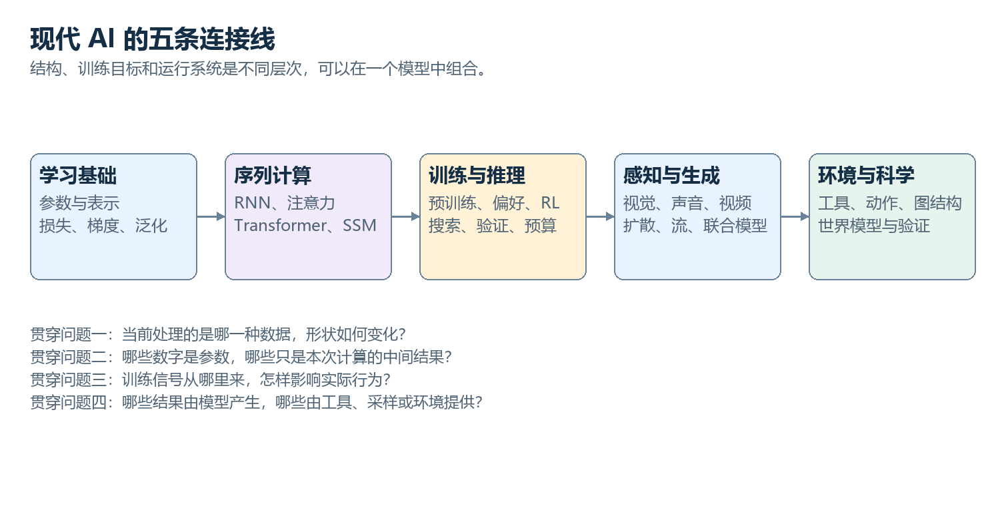

# AI 原理：从早期方法到现代智能系统

一部以连续理解为目标的中文长篇教材。早期方法交代思想与边界，Transformer 和现代技术沿着真实的数据、计算、训练与运行过程展开。

当前版本：**2026-10-03**。包含 **37 章正文、2 份附录、16 幅原创图解**。正文约 **73,111 个汉字**，计入公式、英文、标点等约 **97,266 个字符**；统计不重复计算合并版。

**[从开篇开始阅读](chapters/00-map.md)**　｜　**[合并全文 BOOK.md](BOOK.md)**　｜　**[概念关系索引](chapters/appendix-b-index.md)**

## 怎样读这本书

按下方顺序阅读即可。每章都有上一篇、下一篇和可展开的本章目录。数学知识随用随解释，保留核心公式和具体数字例子；不要求编程，不安排习题、实验或额外论文阅读任务。

正文里的“进一步深入”仍属于当前问题，沿着同一机制继续展开。比喻只作辅助，解释会回到参数、向量、分布和实际操作。图像、语音、视频、强化学习与机器人均有独立专题。

GitHub 在线阅读支持本书使用的公式与图片。合并版用于全文查找或下载保存；较慢设备可优先使用分章版。

## 全书目录

### 第一部　学习的共同基础

- [00　先把 AI 的整张地图放在桌上](chapters/00-map.md)
- [01　从规则、搜索到从数据中学习](chapters/01-history.md)
- [02　模型、数据和目标：学习究竟意味着什么](chapters/02-learning.md)
- [03　神经网络：一层层数字变换怎样形成表示](chapters/03-neural-networks.md)
- [04　一次训练：误差怎样改变参数](chapters/04-training.md)

### 第二部　序列与Transformer的完整机制

- [05　序列问题：从固定窗口、RNN 到注意力](chapters/05-sequences.md)
- [06　文字怎样进入模型：token、嵌入与位置](chapters/06-tokens.md)
- [07　把注意力完整算一遍：Q、K、V 到底在做什么](chapters/07-attention.md)
- [08　完整的 Transformer 层：信息汇集以后，还要做什么](chapters/08-transformer-block.md)
- [09　Encoder、Decoder 与信息访问方式](chapters/09-architectures.md)
- [10　预训练：为什么预测后续内容能形成广泛能力](chapters/10-pretraining.md)
- [11　生成一个回答：采样、KV Cache 与上下文](chapters/11-inference.md)

### 第三部　现代语言模型与智能系统

- [12　规模、数据与计算：大模型为什么变大](chapters/12-scaling.md)
- [13　从续写模型到助手：指令微调、偏好与对齐](chapters/13-posttraining.md)
- [14　强化学习：动作会改变接下来看到的世界](chapters/14-reinforcement-learning.md)
- [15　推理模型：训练与推理时计算怎样共同起作用](chapters/15-reasoning.md)
- [16　MoE：参数很多，为什么每次只用一部分](chapters/16-moe.md)
- [17　把大模型算得动：注意力、精度、微调和并行](chapters/17-efficiency.md)
- [18　长上下文、RAG 与记忆：信息怎样在需要时进入计算](chapters/18-context-rag.md)
- [19　Agent：从产生答案到与环境形成闭环](chapters/19-agents.md)
- [20　Transformer 之外：状态空间、线性注意力与混合结构](chapters/20-state-space.md)

### 第四部　视觉、生成与多模态

- [21　视觉模型：从像素、卷积到 ViT](chapters/21-vision.md)
- [22　表示学习：相似性、对比学习与自监督视觉](chapters/22-representation-learning.md)
- [23　多模态理解：语言模型怎样读取图像、声音和视频](chapters/23-multimodal.md)
- [24　生成模型的几条路线：自回归、VAE、GAN 与流](chapters/24-generative-models.md)
- [25　扩散模型：为什么学习去噪能够生成图像](chapters/25-diffusion.md)
- [26　Flow Matching 与 DiT：学习从噪声走向数据的速度](chapters/26-flow-matching.md)
- [27　条件生成与编辑：让图像满足具体要求](chapters/27-generation-control.md)
- [28　视频生成：空间、时间与一致性怎样一起建模](chapters/28-video.md)
- [29　语音技术：波形、识别、合成与音频 token](chapters/29-speech.md)
- [30　实时多模态：怎样一边听、一边看、一边回应](chapters/30-realtime-multimodal.md)

### 第五部　行动、科学与能力边界

- [31　世界模型与机器人：预测未来还不等于会行动](chapters/31-world-models-robotics.md)
- [32　图学习、科学 AI 与因果问题](chapters/32-graphs-science.md)
- [33　模型究竟学到了什么：知识、泛化与可解释性](chapters/33-knowledge-interpretability.md)
- [34　怎样判断模型真的进步了](chapters/34-evaluation.md)
- [35　较新的方向：改变生成顺序、计算分配与学习闭环](chapters/35-frontiers.md)
- [36　把全书接起来：三条完整计算链](chapters/36-whole-system.md)

### 附录

- [符号与形状速查](chapters/appendix-a-symbols.md)
- [概念关系索引](chapters/appendix-b-index.md)
- [方法与事实核查说明](SOURCES.md)

## 文件说明

章节正文位于 chapters/；图解同时提供清晰的 PNG 与可编辑 SVG，位于 assets/；BOOK.md 是按阅读顺序合并的同一份内容。

仓库中的 tools/ 仅用于维护目录、图解和检查，不属于学习内容，阅读不需要运行代码。
