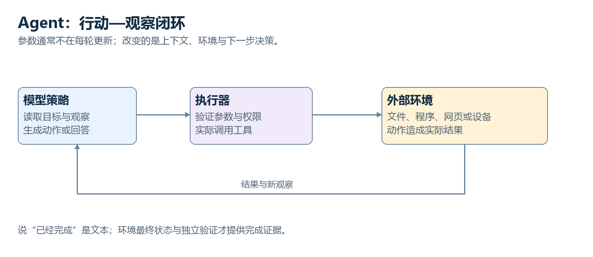

# AI 原理：从早期方法到现代智能系统 · V2

[返回分卷目录](README.md)

# AI 怎样成为一门技术

# 第一卷 · AI 怎样成为一门技术

如果你看过一些 AI 教程，很可能已经认识许多名字：规则、机器学习、神经网络、训练、概率。我们先不用急着把名字摆满桌面，先把一个系统要完成的事情拆开。

假设系统要帮助维护人员发现设备问题。我们希望它完成的事是任务；传感器记录与维修结论是数据；把记录组织成数值、序列或事实，是表示；产生判断的计算形式是模型；怎样比较判断与目标，是评价或训练目标；利用数据改进计算，是学习；取得实际结果后执行检查，是运行系统的一部分。

这几层常常同时出现，但彼此不能替代。一份丰富数据不是自动可用的模型，一个模型输出也不是已经完成的现实处理。先看清对象，再看对象之间的连接，会比先记一串术语更稳。

本卷从可执行知识开始。规则把专家经验变成条件与结论，搜索组织候选步骤，概率处理不确定证据。接着利用历史样本建立可调整的模型，完整算一次预测与损失，再进入分类、数据、树模型与其他传统路线。

推荐和检索会把单个预测扩展为多阶段选择，最后的评估章节检查模型是否能够推广。我们没有按“一个时代消灭上一个时代”排列方法。它们可以相互补充，也可以在不同任务中各自合适。

历史用真实项目作支点；设备团队和小数字是明确的教学情境。它们帮助我们看见计算，不承担历史证明。读到公式时，先找每个符号对应的对象，再看运算产生了什么结果；不需要先恢复整套高等数学。

读完本卷，你应该能够说明一个学习问题怎样形成：输入来自哪里，目标如何确定，参数怎样影响输出，损失表达什么，评价又怎样检查新情况。下一卷会在这套关系中把模型内部打开，不会突然换一套完全无关的世界。

## 本卷章节

01—03：知识、搜索与不确定性。04—06：模型、分类与数据。07—09：传统路线与信息选择。10：新数据上的检查。

[进入第 01 章](volumes/01-foundations/01.md)　｜　[全书目录](README.md)

# 01　当知识被写成规则：早期 AI 到底在计算什么

假如要给一套 AI 找一个开始，我们很容易想到一个会聊天的窗口。但早期研究者面对的任务，通常比“什么都能聊”窄得多：证明一个数学命题，寻找棋局里的好走法，或者帮助专家判断一组观察意味着什么。问题虽然窄，里面却藏着后来反复出现的难点：知识怎样进入计算，计算怎样产生结论，结论又怎样接受检验。

我们先沿着一条很具体的路线走。20 世纪六十年代，斯坦福的 DENDRAL 项目尝试协助分析化学分子的结构。研究者并不是把一种物质的名字输进去，让程序凭空回答；任务涉及实验得到的证据、可能的分子结构，以及化学知识对这些结构施加的限制。一个候选结构是否说得通，要与证据和规则放在一起检查。

到了七十年代，斯坦福的 MYCIN 项目把专家系统思路用于某些感染相关判断及抗菌药物建议。这里的知识来自医学领域，输入涉及患者和实验观察，系统使用规则组织判断。它是研究与评估中的重要系统，不能把这段历史写成“医院把医生工作交给了程序”。

这两个项目的任务不同，却帮助我们看见一个共同问题：**把知识写进机器，不只是存下几句说明，还要让机器知道这些说明在什么条件下能够使用。** 接下来我们把这个问题拆开。真实系统涉及的规则、搜索和不确定性机制要复杂得多，所以先用一个明确标注的教学场景走一遍最基本的计算。

## 让一条经验变成可以执行的东西

下面是一个虚构的教学场景。一个维护小组希望给机房中的风冷设备加一个辅助诊断程序。设备会记录温度、风扇转速和负载；维修人员还会记录现场检查的结果。程序的任务是提出需要检查的原因，并不直接控制设备，也不保证仅凭三个传感器就完成诊断。

维修人员知道，在负载不高的情况下，如果设备温度持续偏高，而且风扇转速低于这台设备的正常区间，就值得检查风扇。口头经验里有“持续”“不高”“正常”这样的词，人能够借助背景理解它们。程序却需要更明确的条件：持续多久才算持续，哪个型号用哪个转速区间，温度记录是否有效。

我们给教学设备规定：五分钟内温度都高于 80℃，平均负载低于 40%，转速低于 800 转每分钟。这个配置只是为了演示，不是实际设备的通用故障阈值。

| 对象 | 本次记录 | 进入程序的含义 |
|---|---:|---|
| 最近五分钟最低温度 | 82℃ | 满足“持续高温”条件 |
| 最近五分钟平均负载 | 30% | 满足“低负载”条件 |
| 风扇转速 | 500 转/分钟 | 满足“转速偏低”条件 |
| 转速传感器状态 | 有效 | 允许用该读数参与判断 |

现在可以写一条规则：若持续高温、负载不高、转速偏低，而且转速读数有效，则把“风扇工作异常”加入待检查项。这里的“若……则……”不是作文中的连接词，而是程序能够匹配的条件与动作。

程序首先检查条件部分。四个条件都成立，它才执行后面的动作。“加入待检查项”又是一个明确操作：产生一条新记录，标注候选原因、依据和状态。系统不是在这一刻理解了“散热”这个词，而是按照已经定义的表示，把当前数据与规则条件匹配起来。

**一条规则至少包含两个部分：什么时候可以用它，用了之后产生什么。** 这使知识能够成为运算的一部分，而不是躺在一份无法执行的文档里。

## 事实、规则与推理机，各自负责什么

刚才的几个传感器值属于系统当前知道的事实。系统还可以保存“该设备型号是 A”“最近没有完成风扇更换”之类的记录。事实不一定永远为真，它只是这个任务当前可用的输入；因此实际系统还要关心记录的来源、时间和有效性。

规则则是跨多次任务复用的知识。换来一台符合相同条件的设备，系统还能使用这条规则。规则中的阈值也可能按设备型号分别设置，或者引用另外一张配置表。

推理机是组织这些规则如何执行的程序。它负责找出哪些规则满足条件，决定先执行哪一条，更新事实，再检查是否出现了新的可执行规则。知识库、当前事实和推理机通常可以分开管理：医学专家改变一条领域规则，不一定需要重新设计整个执行程序。

这项分工带来的好处很实际。知识能够被查看和讨论，推理步骤能够留下记录。维护人员可以问：“系统为什么建议检查风扇？”程序可以返回刚才的四个观察和被触发的规则。这样的依据比单独显示一个“异常”结果更容易追查。

不过，记录里显示了规则，并不等于规则本身一定正确。我们仍然需要检查阈值是否适合设备、传感器是否可靠、规则是否漏掉了其他原因。可追踪性让检查更方便，没有把检查这件事取消掉。

## 一条结论怎样成为下一步的输入

刚才只触发了一条规则，真实知识系统往往需要把多条规则串起来。我们给教学系统再加两条：若风扇工作异常且供电检查正常，则建议检查风扇机械结构；若风扇机械结构检查发现叶片受阻，则把“清理阻塞物后复测”加入处理建议。

先别把三条规则一起跳过去。第一步只有传感器事实，第二条规则还不能执行，因为“供电检查正常”并不在输入里。系统最多提出需要供电检查的下一步。维修人员完成检查并把结果送回后，第二条规则才获得缺少的条件。

于是这条过程变成：

1. 温度、负载和转速触发第一条规则，得到一个待检查原因。
2. 系统发现下一条规则还需要供电结果，提出检查请求。
3. 新检查结果进入事实库，第二条规则得到支持。
4. 机械检查再产生新的事实，第三条规则才能给出处理建议。

这里有一个容易被读快的小区别：**由规则推出的中间结论，与现场测量得到的新证据，不是同一种东西。** 中间结论依赖前面的规则和事实；新证据则需要外部观察。系统不能因为想执行下一条规则，就自己编一个“供电正常”来填空。

这也是理解现代工具系统的一个早期支点。一个模型能够提出“应该查询数据库”，不代表它已经取得数据库结果。计算与外部证据的边界，在早期规则系统里就需要处理。

## 从事实出发，还是从目标往回找

刚才的方式是从已有事实出发，逐渐推出新结论，通常叫前向链式推理。传感器数据到来，系统寻找可以触发的规则，得到候选原因，再继续推进。它适合发现“这些信息能够支持什么”，但如果规则很多，可能会推出大量当前任务用不上的结论。

另一种方式从一个要检验的目标开始。例如系统正在检查“散热异常是否由风扇机械问题导致”。它寻找哪些规则能够支持这个目标，再检查这些规则的前提是否已知。前提不够时，继续寻找能支持前提的规则，或者请求一项外部检查。这叫后向链式推理。

两种方式不是“向前聪明”和“向后聪明”的区别，而是如何组织同一份知识。前向推理把事实的影响向外展开，后向推理把目标所需的依据向内展开。实际系统可以混合使用，先由观察提出少数候选，再围绕候选请求有区分度的证据。

例如风扇转速异常既可能来自机械问题，也可能来自供电问题。假如系统手里已有供电记录，后向推理可以直接检查它；如果没有，就要提出检查请求。这样，提问也可以成为推理过程的一部分，而不是让用户先填完所有可能的数据。

我们因此多认识了一个对象：推理过程中的未满足条件。它不是零，也不是假，它是“当前尚不知道”。没有把未知与否定区分清楚，就可能把缺失记录误当成排除证据。

## 当两条规则一起出现，程序如何处理

现在假设设备既持续高温，又突然出现电流升高和转速下降。第一组条件支持风扇问题，另一条规则支持机械卡滞。它们可以同时作为候选，而不是强行让程序立刻选出唯一答案。

如果规则的动作是“提出检查”，系统可以按安全性、检查成本或已有证据排序。若规则会直接改变设备状态，冲突处理就更加重要：一条要求继续运行以复测，一条要求立即停机，不能随意执行。

常见做法包括明确优先级、把安全约束放在前面、要求附加证据，或者将相互冲突的判断交给人检查。选择哪一种，要由任务和后果决定。并不是把所有规则排成一个列表，就自然获得了可靠系统。

事实也可能随时间变化。昨天确认的供电正常，未必能够作为今天的依据；清理阻塞物之前的温度，不宜用来判断处理之后的状态。因此事实库不只是一个没有时间的集合，实际设计要考虑更新、撤销、来源和依赖关系。

如果一个结论依赖的事实被撤销，结论是否还成立？一个可追踪的系统应当知道哪些后续判断受影响。这里已经出现了知识维护的问题：不仅要会推，还要能在证据变化时重新检查。

## 回到 DENDRAL 与 MYCIN

有了这些基本对象，再回看历史案例就比较稳了。DENDRAL 的重要价值在于把化学领域知识纳入候选结构的产生与检查。分子结构的可能组合很多，领域知识能够限制候选，实验数据又为候选提供约束。它显示出：在具体领域里，有效知识常常比只提供通用搜索程序更能缩小问题。

这并不意味着 DENDRAL 就是刚才四个条件触发一句建议的简单系统。它涉及候选结构的生成和检验，规则与搜索共同发挥作用。教学情境帮我们理解知识如何可执行，真实项目则说明这条路线能进入复杂专业任务。

MYCIN 进一步让人看到，专家规则未必只处理完全确定的事实。系统采用了称为确定性因子的一类机制表达证据对判断的支持或反对。名字里有“确定性”，仍然不能直接把它等同于后面要讲的严格条件概率。不同不确定性表示有不同组合规则和解释条件。

这件事值得在历史章节里留一点空间，因为很容易被后来熟悉的语言覆盖过去。知道今天很多模型输出概率，并不代表早期专家系统的每个分数都具有相同含义。理解一个系统，先看它实际定义了什么对象，怎样组合证据，再决定应该如何解释结果。

## 为什么专家系统没有成为所有任务的统一答案

在边界清楚、知识相对稳定的任务中，规则可以非常有用。困难往往出现在知识不容易被说清、世界变化太快，或者例外之间开始相互影响的时候。

仍用教学设备来看。维护团队增加了十种设备型号；不同型号正常温度不同，风扇控制逻辑也不同。为了保留原来的准确性，规则开始加上型号、环境温度、固件版本和运行阶段等条件。原先一句判断，现在需要多个分支。

接着，传感器会误报，两个读数可能矛盾，缺失记录又不意味着情况正常。团队需要更多规则说明哪些证据可靠、哪些判断需要复测。规则数量的增加不只是让文件变长，还会增加检查它们相互作用的成本。

另一类问题更难。维修专家看到一条振动曲线，可能根据整体形状感觉“不太对”。我们能够让专家判断许多真实样本，却未必能够请他完整写出这一感觉对应的所有条件。观察曲线的局部峰值、频率关系和变化速度，可能共同参与判断，专家也不一定知道各自的精确权重。

这通常被概括为知识获取的瓶颈：**人能够做出判断，不保证能够把判断依据完整转换成规则。** 图像、声音和自然语言中，这个问题尤其明显。人会认出一只猫，却很难为各种角度、毛色、姿态和遮挡写出足够完整的判定规则。

后来的数据学习路线在这里获得了很重要的动机。既然有些判断依据难以逐条写出，能不能从许多输入与结果中，找到一套可计算的判断方式？但我们暂时不急着把它展开。下一章还有一个即使规则完全清楚，也仍然没有解决的问题。

## 有规则，为什么还不知道该走哪一步

下棋的合法走法能够写得相当明确，规则却不会直接告诉我们哪一步最好。诊断系统知道有哪些检查，也不一定知道先做哪项最省时间。规则规定了允许的变化，选择过程还需要组织对未来的探索。

走到这里，我们可以把第一章的收获放在一起：事实提供当前观察，规则提供可执行的知识，推理机组织条件匹配和结论传递；外部检查带来新证据，冲突与时间变化需要被单独处理。我们也看见了规则的力量和维护成本。

下一章沿着“选择哪一步”继续走。我们会把一个小问题表示成状态与动作，观察候选为什么越展开越多，再看搜索怎样安排探索。规则并没有退场，它会告诉搜索哪些路径可以走。

---

# 02　规则告诉我们能做什么，搜索帮助我们选择怎么做

第一章的规则告诉程序：在什么条件下，可以得到什么结论。可是，“有哪些合法步骤”与“现在选择哪一步”之间，还留着一段距离。国际象棋是一个很清楚的例子。棋子的走法能够写成规则，合法着法却常常不止一个；眼前能吃到一枚棋子，也可能几步之后丢掉更重要的东西。

1997 年，IBM 的 Deep Blue 在比赛中击败了当时的国际象棋世界冠军卡斯帕罗夫。理解这个案例，不需要把它描述成一颗突然具有人类想法的电子大脑。我们需要看见的分工是：棋规确定合法局面，评估方法判断局面价值，搜索组织对未来候选的检查，专用计算与工程资源支撑大量计算。

这章先离开庞大的棋局，走一张可以亲手核对的小地图。地图是虚构的教学问题，目的在于看清搜索中的对象。等这条过程走完，我们再回到棋类，看看为什么复杂任务会让搜索遇到新的困难。

## 把问题表示成状态与动作

假设一台维护机器人从地点 S 出发，需要到达检修点 G。中间可以经过 A、B、C。路线和代价如下：S 到 A 的代价是 2，S 到 B 是 1，A 到 G 是 4，B 到 C 是 2，C 到 G 是 2。数字可以代表耗时，也可以代表任务里定义的综合代价；这次我们把它当作路程单位。

| 路线 | 代价 |
|---|---:|
| S → A | 2 |
| S → B | 1 |
| A → G | 4 |
| B → C | 2 |
| C → G | 2 |

地点是状态，沿一条允许路线移动是动作，动作后进入新的状态。目标检查回答“是否已经在 G”，路径代价则把经过的路线代价加起来。

这张图里有两条完整路线。S → A → G 经过两段，总代价是 6；S → B → C → G 经过三段，总代价是 5。**步骤更少不一定代价更低。** 如果算法只按经过的边数寻找路线，就可能得到满足目标但不是总代价最低的结果。

实际问题的状态通常比一个地点复杂。机器人可能还要带上电量、所携物品和已经完成的检查。两个记录虽然位置相同，若电量不同，能够采取的后续动作就可能不同。因此建模时要保留会影响未来的变量。把状态压缩得太狠，搜索就会把实际上不同的情况混在一起。

## 搜索树为什么会长出来

从 S 出发，程序能产生两个后续状态 A 和 B。接着从 A 产生 G，从 B 产生 C，再从 C 产生 G。把这种“当前节点产生候选后续”的关系展开，就得到一棵搜索树。

状态图与搜索树要稍微分开看。图中的 G 是同一个目标地点，但在树里，它可以对应两条不同路径的终点。树节点通常还要记录父节点、到达代价等信息，所以它并不只是地点名称。

我们需要一个容器保存“已经发现，但还没继续展开”的节点，通常称为边界或待探索集合。每次从中选一个节点，检查是否满足目标，不满足就产生后续节点。算法之间的一项核心差异，正是怎样选择这个节点。

如果总是优先展开较浅的节点，就是广度优先搜索。在每个动作代价都相同的条件下，它能找到步数最少的路线。若顺着一个分支走到底再回来，是深度优先搜索。它在某些任务中使用的存储较少，但可能被很深甚至无限的分支拖住，也不自动保证最优路线。

只说“程序会尝试很多路线”，还没有解释搜索。真正影响结果的是候选如何表示、怎样产生、按什么顺序检查、什么时候停止，以及重复状态如何处理。

## 先只看已经付出的代价

在小地图中，我们希望最小化总代价。一个自然办法是始终展开当前累计代价最低的节点。这就是一致代价搜索的主要思想，与常见的 Dijkstra 最短路方法密切相关。

出发时，S 的累计代价为 0。展开 S 后，待探索集合里有 A，累计代价 2；还有 B，累计代价 1。算法先展开 B，得到 C，累计代价 3。此时 A 的代价 2 比 C 的 3 小，所以再展开 A，发现沿这条路线到达 G 的累计代价是 6。

先别急着宣布成功。一个 G 已经被发现，不代表它已经是最佳候选。待探索集合里还有 C，累计代价 3。展开 C 后，发现另一条到 G 的路线，总代价是 5。算法把目标的最佳已知代价更新成 5。

当 G 以代价 5 成为当前最优待探索节点并被取出时，在非负边代价等适用条件下，才可以按这个算法的规则确定结果。这里的“发现目标”和“取出目标”之间的区别，会影响最优性，不能省成一句“碰到终点就结束”。

这个过程只知道已经走了多远。假如图很大，它可能仔细探索许多离目标越来越远的地方。于是我们会自然产生下一个想法：能不能估计一下，还剩多少路？

## 启发式给搜索一份有条件的指引

我们给每个地点一个剩余代价估计，记作 h。教学配置中，S 的估计是 4，A 是 4，B 是 3，C 是 2，G 是 0。它们没有超过相应地点的真实最短剩余代价，因此这组估计可以满足“不过高估计”的条件。

A* 把已经付出的代价 g 与剩余估计 h 加起来：

$$
f(n)=g(n)+h(n).
$$

n 表示一个候选节点。g 来自当前路径的实际累加，h 来自估计方法，f 用来安排探索优先级。它不是已经得到的最终路线长度，而是实际代价与估计代价的组合。

展开 S 后，A 的 g 是 2、h 是 4，f 为 6；B 的 g 是 1、h 是 3，f 为 4。先展开 B，得到 C：g 为 3，h 为 2，f 为 5。再展开 C，得到 G：g 为 5，h 为 0，f 为 5。目标因此在 A 之前被取出，得到总代价 5 的路线。

这次比一致代价搜索少展开了 A。为什么能够这么做？我们没有随便相信“看起来更近”，而是把估计放进了有条件的算法框架。对于树搜索，合适的可采纳启发式支持最优性；对于实际图搜索，还要注意一致性、重复节点处理或重新打开节点等条件。课堂中的简单例子不能抹掉这些实现关系。

如果 h 恒为 0，A* 就退回只看 g 的方式。如果估计过高，例如把 B 到目标的剩余代价写成 8，算法可能把正确的较短路线排到后面；若按不合适的停止规则结束，就会失去保证。**启发式越有信息，通常越能帮助搜索；信息的使用条件也必须一起说明。**

## 候选为什么会把计算撑大

小地图很容易查完。棋局却有许多合法着法，每一步又产生更多着法。假设每个局面平均有 20 个后续选择，向前看 6 层，最底层就可能有约 20 的六次方个候选，也就是 6,400 万。这个数字只是展示分支增长的教学配置，不代表具体棋类在所有局面中的真实分支数。

搜索深度多一层，候选规模就可能再乘一个分支数量。问题因此不仅是每次评估能否算快，还包括能否减少不值得展开的候选。

实际系统会使用剪枝、缓存、动作排序、领域约束或限定深度。缓存能避免反复评估已经见过的相同状态；剪枝在有依据时跳过不可能改变最终选择的分支；动作排序则帮助先找到更有价值的候选，为后续筛除提供条件。

这些策略分别改变计算过程中的不同环节。把它们笼统称为“AI 有直觉”，会错过真正重要的机制，也看不出每种方法的适用条件。

## 对手会行动时，评估为什么要换一种方式

机器人找路线时，路线本身不会故意反对它。下棋的对手却会选择对自己有利的动作。我们不能只寻找一条“假如对手配合就能获胜”的未来。

极小极大搜索把两方的选择交替表示：轮到自己，选择价值最大的后续；轮到对手，就按对手可能选择对自己最不利的后续来评价。这里的价值是从一方立场定义的，不是每个节点都在争取同一个最大数。

实际棋局不可能一直搜索到所有终局，就需要在有限深度处使用评估函数。它根据局面估计后续价值。估计是否有效，会影响搜索的选择；搜索是否充分，也会影响估计有没有机会被检验。

在一些现代系统中，神经网络可以提供动作概率和局面价值，搜索再用这些信息组织候选。策略网络倾向告诉我们先看哪些动作，价值网络估计未来结果，树搜索安排进一步探索。三者有联系，但并不是同一个功能换了三个名字。

蒙特卡洛树搜索则通过反复选择、展开、模拟或评估、回传结果逐渐调整关注的分支。它需要平衡利用已有好结果与探索尚不清楚的候选。后面讲强化学习时，我们会再次遇到这种平衡，只是学习和搜索发生在不同层面。

## 找到一个答案，与证明它最好

搜索可以有不同目标。有时我们只需要任何满足约束的解；有时需要最低成本；有时在时间预算内要尽可能好，但不能证明最优。明确目标，才能解释算法的结果意味着什么。

例如紧急诊断要求尽快找到一个安全处理方案，搜索也许必须在期限前停止。程序可以给出当前最好的候选，并报告哪些假设还没验证。它不能把“在预算内没有找到更好方案”写成“已经证明没有更好方案”。

现代语言系统也会生成多个候选，再由计算器、规则检查或评审模型筛选。候选更多可能提高找到好答案的机会，但如果验证器不可靠，增加搜索可能反而更有效地找到能骗过评分的结果。搜索能力与评价能力要放在一起检查。

本章因此接好了两件事：规则描述允许的状态变化，搜索安排对可能未来的探索。下一章换一种困难：观察未必准确，状态也未必知道。我们不再只是问“先走哪里”，还要问“这份证据应该让判断改变多少”。

---

# 03　报警之后，故障到底有多可能

维护小组收到一条报警，第一反应当然是去看看设备。可如果我们要让系统给出更细的判断，就会遇到一个容易混淆的问题：报警器能够检出大多数故障，是否意味着每次报警都大概率对应真实故障？

这两个说法听起来很近，计算时却从不同方向看同一组数据。我们先不背概率公式，先把设备放到桌上数一数。以下设备、频率和报警性能都是教学配置；真实使用时需要在相应条件下估计，不能直接套用。

## 一万台设备里的报警

假设某个检查周期中，一万台设备有 100 台真正发生故障，其余 9,900 台正常。报警器能够检出故障设备中的 90%，同时会让正常设备中的 5% 出现误报。

于是故障设备里有 90 台报警、10 台没有报警；正常设备里有 495 台报警、9,405 台没有报警。把这四个数字放在一起：

| 实际状态 | 发出报警 | 没有报警 | 合计 |
|---|---:|---:|---:|
| 故障 | 90 | 10 | 100 |
| 正常 | 495 | 9,405 | 9,900 |
| 合计 | 585 | 9,415 | 10,000 |

现在问题变成：我们已经知道某台设备报警，它可能来自哪一组？它来自 585 台报警设备，其中真实故障只有 90 台。所以在这批教学设备中，报警后故障的比例是 90 除以 585，约为 15.4%。

**“故障时有多容易报警”，与“报警后有多可能故障”，看的是不同分母。** 前者的分母是 100 台故障设备，后者的分母是 585 台报警设备。只交换一下句子的顺序，计算对象就变了。

这里不是报警器没用。它确实从一万台设备中挑出了风险更高的一组：故障比例从原先的 1% 上升到约 15.4%。只是“提高风险判断”与“几乎已经确诊”之间还有很大距离。

## 条件概率在表达什么

我们用 H 表示故障，E 表示报警。P(H) 是尚未利用这次报警时的故障概率，本例为 0.01。P(E|H) 表示已知故障的条件下出现报警的概率，为 0.9。

竖线右边是我们已经放进条件的信息，左边是要计算的事件。P(H|E) 因此是已知报警时故障的概率，它正是刚才得到的约 0.154。

看起来有点绕，原因在于两个事件总是在同一张表里出现，但我们选择的群体不同。想确认一个条件概率的意思，可以先把右边条件对应的样本圈出来，再在圈内计算左边事件的比例。

我们还需要联合概率 P(H,E)，表示故障和报警同时发生的比例。本例 90 台同时满足这两个条件，因此联合概率是 90/10,000，也就是 0.009。它可以写成 P(H) 与 P(E|H) 的乘积。

这不是额外添加的神奇规则：先选出故障的 1%，再在其中选出报警的 90%，自然留下全部设备的 0.9%。把同一件事从另一个方向描述，又可以先选出报警设备，再问其中故障的比例。

## 贝叶斯公式把两种描述接起来

由刚才对联合概率的两种描述，可以得到：

$$
P(H\mid E)=\frac{P(E\mid H)P(H)}{P(E)}.
$$

分子是在全部设备中同时故障并报警的比例；分母是全部设备中报警的比例。它们相除，结果就回到报警设备这个群体内。

本例的 P(E) 不是 0.9。0.9 只描述故障设备中的报警比例，全部报警还包括正常设备误报。我们要把两组加起来：

$$
P(E)=0.9\times0.01+0.05\times0.99=0.0585.
$$

于是后验为 0.009/0.0585，约 0.1538。公式没有给计数添加另一套结论，只是把计数关系表达得更紧凑。当样本规模变大或变量增多，紧凑表达就非常有用。

P(H) 常被称为先验，P(H|E) 称为后验；P(E|H) 是这份证据在假设成立时的可能性，常作为似然讨论。先验并不意味着个人随意猜测，它可以来自历史频率、领域资料或此前已经整合的证据。

后验也不是永远正确的最终答案。它以概率输入、假设和数据条件为前提。故障基率估错，传感器性能换了场景，计算结果也会跟着偏离实际。

## 相同报警器，为什么换一批设备就不一样

假设报警性能保持相同，却把设备换成故障更常见的一批：一万台里有 2,000 台故障。故障设备会产生 1,800 次报警，8,000 台正常设备会产生 400 次误报。此时报警总数是 2,200，报警后故障比例约为 81.8%。

我们没有改报警器，只改变故障在群体中的比例，报警后的判断就从约 15.4% 变成约 81.8%。这就是基率的重要性。某个测试在高风险群体里很有说服力，转到低风险群体里，同一个阳性结果可能要更谨慎地解释。

AI 的分类分数也可能遇到类似变化。训练时的类别比例、运行时的类别比例和采样策略不一致，不能只盯着一个“准确率”就认为结果能够原样迁移。

我们也要区分几种指标。检出率关注故障中报出的比例；误报率关注正常中报出的比例；精确率关注报出的样本里有多少是真目标。它们回答的任务不同，任意挑一个很高的数字都不足以描述整个系统。

## 第二份证据怎样进入判断

维护人员接着做了一项新的检查。这份检查对故障和正常状态的区分能力，与刚才报警器在教学配置中相同。假设两项检查在给定真实状态后条件独立，就能把第一轮后验作为下一轮先验，继续更新。

用比值来算会更方便。初始故障与正常的概率比为 1:99。一份阳性证据在故障条件下的出现概率为 0.9，在正常条件下为 0.05，所以它把这一比值乘上 18。第一次阳性后得到 18:99，对应约 15.4%。

第二次独立阳性再乘 18，得到 324:99，对应 324/(324+99)，约为 76.6%。这里出现了明显增强的判断，因为第二份证据带来了额外的区分信息。

条件独立的假设不能被悄悄省掉。如果两项报警实际上读取同一个坏传感器，或者第二个系统只是复制第一个系统的结论，就不能把它们当成两份独立证据。重复统计同一来源，会让判断变得过度自信。

**证据的数量与独立信息的数量，不是同一个数。** 多个网站转述同一份消息，多名模型引用相同检索结果，都需要追踪共同来源。这个思想在后面的多智能体系统里还会再出现。

## 为什么需要表示变量之间的关系

设备状态可能同时影响温度与振动，环境温度又会影响设备温度。如果只看一张“温度高就故障”的表，我们会把不同原因混在一起。

概率图模型用图中的节点表示变量，用连接和条件分布表达依赖结构。举一个简化的贝叶斯网络：设备故障影响振动，设备故障和环境温度共同影响设备温度。图不是为了画得漂亮，而是告诉我们哪些条件关系要建模，哪些独立性是假设。

有了结构，联合概率可以分解成较小的条件分布。计算时根据已经观察到的变量，对未观察变量进行推断。隐马尔可夫模型还会把隐状态沿时间连接，用当前和过去的观测推断状态；它曾广泛出现在语音和序列建模中。

这些模型的难处不只在概率公式。我们要选变量、判断结构、估计条件分布，再处理推断成本。有些图可以高效计算，有些需要近似。后面出现神经网络，不意味着这些关于依赖结构和不确定性的思路失效了。

## 概率判断怎样变成行动

假如一次漏报可能造成严重事故，一次误报只是增加检查成本，即使故障后验不太高，也可能值得检查。反过来，如果处理动作本身风险很大，就需要更多证据。

因此“判断哪个状态最可能”与“选择哪个行动最合适”之间，还要加入后果。一个简化办法是计算不同状态下的损失，再按概率求平均，比较行动的期望损失。概率负责表达不确定性，代价负责表达任务偏好。

例如继续运行在故障时的代价为 100，在正常时为 0；停机检查无论状态如何都付出 3 的代价。在这个纯教学配置里，若故障概率超过 3%，检查的期望代价就低于继续运行。实际安全决策当然还包含规则、置信范围、外部约束和人的责任，不能仅凭这个小模型自动执行。

这一步也说明，阈值并不是数据自然赐给系统的唯一答案。它取决于我们想减少什么后果，愿意支付什么成本。后面讲损失函数和强化学习时，我们会在不同形式里再次遇到目标的选择。

## 我们得到的是有条件的计算能力

概率让系统能够表达“还不确定，但证据使判断改变了”。它既不要求把每次观察硬写成绝对规则，也没有保证只要套贝叶斯公式就能解决所有现实问题。

本章已经从设备计数走到条件概率、先验和后验，再走到多份证据、依赖关系与行动代价。接下来还有一个来源问题：公式中的频率和关系怎样取得？如果我们有大量历史记录，可否让模型直接从样本中形成预测方式？

下一章就从这批记录开始。我们会给一个模型明确的输入和输出，看看它如何产生一次预测，再用真实结果衡量预测偏了多少。这样，“从数据中学习”就有了可以观察的第一步。

---

# 04　从历史记录到预测：一个可调整的模型

前三章里，人把规则、路线和概率关系交给程序。现在维护小组有了另一种材料：过去一段时间的设备运行记录。每条记录包含运行条件和实际结果。团队想知道，能不能利用这些样本，让程序学出一种预测方式，而不必把每个判断条件逐条写好。

我们先选择一个比故障诊断更容易核算的任务：根据设备负载，预测稳定运行时的温度。以下设备与数据仍是虚构的教学配置。真实温度当然还受环境、散热、时间等因素影响，这里暂时固定这些条件，让学习的基本过程更清楚。

| 样本 | 负载 x（百分数的数值） | 稳定温度 y（℃） |
|---|---:|---:|
| 甲 | 20 | 50 |
| 乙 | 40 | 60 |
| 丙 | 60 | 70 |

输入与目标必须先确定。x 是负载，y 是本次希望预测的温度。我们不是拿到一张表以后等待算法自行决定应该关心什么；同一张表也可以拿来预测耗电、检测异常或压缩记录，那些任务需要不同目标。

## 一条直线怎样成为模型

先采用一个很小的模型：把负载乘以一个系数，再加一个偏移。

$$
\hat y=wx+b.
$$

带帽子的 y 表示预测值，区别于实际记录的 y。w 是系数，b 是偏移，它们都是参数。函数形式说明怎样计算，参数决定这套计算在当前配置下给出什么结果。

先取 w=0.2、b=40。负载 20 时，预测为 0.2×20+40=44℃；负载 40 时，预测为 48℃；负载 60 时，预测为 52℃。模型确实能算出答案，但三个预测都低于目标，而且负载越高，偏差越大。

**能产生输出，不等于已经学得好。** 模型首先是一种可计算的形式，训练才负责利用样本调整参数。我们还需要一个办法表达这组预测到底差了多少。

同一个模型可以有许多参数配置。把 w 改成 0.4，b 仍为 40，就会得到 48℃、56℃和 64℃。我们没有改输入表，也没有改计算步骤，只改了保存的参数，预测已经不同。

w 控制负载增加时预测上升的速度，b 控制整体偏移。b=40 在这里是直线的截距，不保证可以直接解释成实际设备零负载时测得的温度。如果训练样本没有覆盖零负载，截距的物理含义就需要额外检查。

## 把每次偏差放到同一个尺度上

预测值减去目标值，得到误差。第一组参数的误差是 -6、-12、-18。若直接相加，有正有负的误差可能抵消，甚至让两个很差的预测看起来总误差为零。

平方误差把每个偏差先平方。它为正，也会对较大的偏差施加更大的数值惩罚。第一组参数的三个平方误差是 36、144 和 324，平均为 168。

第二组参数的误差是 -2、-4、-6，平方误差是 4、16 和 36，平均约为 18.67。按照这个评价方式，第二组参数明显好一些。

| 参数配置 | 三次预测 | 三次误差 | 平均平方误差 |
|---|---|---|---:|
| w=0.2，b=40 | 44、48、52 | -6、-12、-18 | 168 |
| w=0.4，b=40 | 48、56、64 | -2、-4、-6 | 18.67 |
| w=0.5，b=40 | 50、60、70 | 0、0、0 | 0 |

第三组参数完全匹配这三个特意构造的教学点。这个结果方便我们观察，但不表示现实学习总能得到零误差，更不表示三条记录就足以验证一台设备的预测规律。

平均平方误差通常写成：

$$
L=\frac{1}{N}\sum_{i=1}^{N}(\hat y_i-y_i)^2.
$$

N 是样本数，i 是样本编号，求和符号让我们把每条样本的平方误差加起来，再除以 N。L 是当前参数在这批数据上的损失。

公式里的样本编号不是时间步骤，也不是网络层号。明确每个符号指什么，会避免后面一串下标把不同对象搅在一起。

## 损失怎样为训练提供方向

我们刚才人工比较了三组参数。如果有一百万个参数，不可能逐组列举所有配置。训练需要更有效的方法，判断当前参数怎样小幅改变能够让损失下降。

在这条直线模型里，w 太小导致预测随负载增长得不够快；增加 w 能减少当前误差。一般模型的关系更复杂，就要借助导数或梯度表达“参数改变一点，损失在当前附近怎样变化”。卷二会把这一步具体算出来，现在先保留整体过程。

一次典型训练包括：取得一批样本，用当前参数产生预测，计算损失，估计参数对损失的影响，再按规定步长更新参数。重复多次后，模型可能找到在训练目标上更合适的配置。

这里的“可能”有实际含义。模型形式未必能表达目标关系，数据可能有噪声，优化也可能困难。训练不会因为执行了若干轮，就自动保证理解了真实世界。

不过我们已经获得一个很重要的替代方式：不用为每条样本写一条规则，多个样本可以共同影响同一组参数。参数一旦变化，它对许多未来输入的响应都会跟着变化。

## 参数、超参数与中间结果

参数是训练会调整并保存的量，本例是 w 与 b。超参数则是训练方案或模型设计里设定的量，例如每次更新的步长、一次使用多少样本、采用哪个模型类别。

有时超参数也通过搜索选择，但这发生在另一个层次：尝试一套方案，训练模型，比较验证结果，再选择方案。它不等于普通训练步骤里对同一组权重进行更新。

中间结果又不同。输入 x=20，计算 wx 得到 4，再加偏移得到 44。这些是本次输入产生的临时值。换一个输入，临时值就变了；参数可以保持不动。

**训练改变共享参数，使用模型通常改变的是输入和临时结果。** 这项区别以后会帮助我们理解神经网络激活、注意力中的 Q/K/V，以及聊天上下文为什么不等于权重已经更新。

## 加入更多输入，模型发生了什么变化

维护小组很快发现，相同负载在不同环境温度下会产生不同设备温度。只用 x 一个输入，模型就缺少解释差异的信息。

我们可以加入环境温度，写成两个输入分别乘以系数再相加：

$$
\hat y=w_1x_1+w_2x_2+b.
$$

x₁ 是负载，x₂ 是环境温度。输入成为一组数，也就是一个向量；两个系数同样组成一组参数。更多传感器可以进一步增加输入维度，但要判断它们是否提供相关信息，是否在实际运行时能够取得。

量纲也需要留意。负载写作 20 或 0.2，会改变系数的数值；摄氏温度与开尔文温度带来不同偏移。数学形式看起来相同，数据表示却会影响训练和解释。常见的缩放、标准化，就是对数值尺度做明确处理。

我们不能因为某个系数较大，就直接说对应因素在现实中“因果作用最大”。输入尺度、变量相关性、数据范围和模型形式都会影响系数。预测关系与因果关系，后面还有独立章节。

## 为什么一个好看的损失还不够

假如目标是提前发现危险过热，平均误差可能掩盖少量严重漏判。模型对大多数正常记录预测很好，却在最重要的高温状态偏低，仍然可能有很低的平均损失。

损失是把任务要求转成训练信号的一种选择，常常只是实际需求的代理。训练时为了便于优化选择某种连续误差，评估时还要检查不同运行区间、错误类型和后果。

也可以改变损失的权重，让重要样本贡献更大，或者使用绝对误差、鲁棒损失等不同形式。平方误差对大偏差的惩罚较强，这既可能有帮助，也可能让异常值过度影响模型。不存在一项损失在所有数据和任务上天然正确。

如果数据存在测量噪声，即使负载与温度整体相关，同样负载的温度也可能散开。在一定条件下，平方误差会使模型倾向预测条件平均值。平均值不是每台设备的精确未来，因此描述不确定性也可能成为必要任务。

## 拟合与新样本之间还有一座桥

教学表中的三条记录来自一条整齐直线。现实中，我们需要保留未参与训练的数据检查模型。若系统只是记住了训练表，它在新型号、新负载或新季节中的表现就可能下降。

负载 80 时，直线模型会给出 80℃。这叫外推：输入超出了刚才 20 到 60 的训练范围。即使结果恰好合理，也需要新观察验证，不能用公式仍然能算作为正确性证明。

输入在已有范围内的插值同样需要检查，只是通常面对的假设不同。模型的连续曲线可能看起来很光滑，但真实设备可能在某个负载区间启用额外风扇，让关系发生变化。

于是学习过程已经有了清楚的骨架：任务确定输入与目标，模型形式产生预测，损失比较预测与实际，训练调整共享参数，独立数据再检查能否推广。

下一章换一种输出。我们不再要一个温度数值，而要判断设备属于哪种状态。原来的一个数不够表达多个类别之间的关系，模型需要为各类别产生分数，再决定这些分数怎样参与预测和训练。

---

# 05　数值变成类别：分类、分数与概率

预测温度时，模型给出一个数就能与目标比较。现在维护小组希望区分轴承故障、散热故障和其他状态。输出不再是一个连续温度，而是在几个类别之间选择。

我们还沿用虚构设备任务，但先把目标约定好。“其他状态”在这个教学例子中包含所有没有归入前两类的情况。真实任务可能要把正常状态、未知故障和多故障共存分开；类别如何定义，会影响标签、模型和评价。

## 每个类别先得到一个分数

模型不能直接对三个类别名做乘法，所以还是从数值输入开始。把温度转换成一个缩放后的输入 T，把振动转换成另一个输入 V。一次记录给出 T=2、V=1.5。

为三个类别各设一套系数，就能产生三个分数。例如轴承分数为 0.8V-0.2T+0.8，散热分数为 0.9T-0.1V+0.35，其他分数暂为 0。

代入输入，轴承分数是 1.6，散热分数是 2，其他分数是 0。它们都由实际输入、共享参数和明确运算产生，不是模型凭空给类别贴上一个偏好数字。

| 类别 | 计算 | 本次分数 |
|---|---|---:|
| 轴承故障 | 0.8×1.5-0.2×2+0.8 | 1.6 |
| 散热故障 | 0.9×2-0.1×1.5+0.35 | 2 |
| 其他状态 | 0 | 0 |

这样的原始分数通常叫 logits。它们可以是负数，也不要求加起来等于一。最大的分数对应模型当前最倾向的类别，但分数 2 本身不表示概率是 2，也不表示 200%。

我们需要一种转换，让多个类别在同一尺度上表达相对倾向，并能够与训练目标配合。

## Softmax 为什么要处理整组分数

Softmax 先把每个分数做指数运算，再除以全部指数结果的总和：

$$
p_i=\frac{e^{z_i}}{\sum_j e^{z_j}}.
$$

zᵢ 是第 i 类的原始分数，e 的幂是指数运算，结果始终为正。分母的求和包括所有类别。所有类别用同一个总和作分母，因此转换后的数值非负且总和为一。

刚才的分数为 1.6、2、0。指数结果约为 4.95、7.39、1，总和约为 13.34。得到的预测分布约为 0.371、0.554、0.075。模型仍然最倾向散热故障，只是现在我们能看见整组倾向的比例。

**一个类别的概率不仅取决于自己的分数，还取决于其他类别的分数。** 保持散热分数为 2，若轴承分数从 1.6 增到 4，散热概率就会下降。Softmax 组织的是一组相对竞争关系。

给所有分数加同一个数，预测分布不变。因为所有指数都乘上同一个因子，它会在分子与分母里抵消。这也解释了实现中为什么常减去最大分数：保持结果相同，同时减少数值溢出风险。

## 为什么用指数，而不是简单除以总和

如果分数为 2、1、0，直接除以和也能得到非负比例；但分数可以为负，甚至总和为零，直接相除就不总能得到合法概率。指数先把任意实数映射成正值，使转换在这些输入上也能工作。

指数还把分数差映射成比值。两个类别概率的比值是它们分数差的指数。当分数差逐渐扩大，相对倾向也随之增强。转换是平滑的，有利于后面通过梯度训练参数。

这些性质说明它为什么常用，不说明它是任何任务唯一合理的概率表示。若多个标签能够同时成立，就不能简单把所有标签放进同一个“只能选一项”的竞争分布。例如一张照片既有人又有车，常用每个标签独立的二分类输出。

所以引入 Softmax 之前，必须先说明类别之间的关系。计算方法要服从任务定义，不能因为名字熟悉就到处使用。

## 二分类里的 sigmoid

若任务只有“故障”和“正常”两个互斥类别，也可以用一个实数分数 z 表达二者的相对倾向，再通过 sigmoid 转成故障概率：

$$
p=\frac{1}{1+e^{-z}}.
$$

当 z=0，结果为 0.5；z 为较大正数时，结果接近一；z 为较大负数时，结果接近零。它不会因为原始分数略微超过某条线，就突然从零跳到一。

双类别 Softmax 可以用两个分数之差写成 sigmoid，因此它们之间有数学联系。实际选择一项输出还是两项输出，涉及参数配置与训练习惯，不代表完全不同的智能机制。

“输出概率”和“最终动作”也要分开。模型可能给出故障概率 0.4，系统却因漏报代价很高而触发检查。决策阈值需要结合代价和验证结果确定，上一章的概率判断不会自动代替任务设计。

## 正确类别的概率怎样成为损失

假设本次经过可靠检查，标签确认是散热故障。模型给它的概率约为 0.554。我们希望训练提高正确类别的概率，同时降低与当前标签竞争的其他概率。

常用的分类损失是正确类别概率的负对数。用自然对数表示：

$$
L=-\log p_{\text{正确类别}}.
$$

概率为 1 时，损失为 0；概率为 0.5 时，损失约 0.693；概率为 0.1 时，损失约 2.303；概率为 0.01 时，损失约 4.605。给真正类别极低概率，会得到明显的惩罚。

| 给正确类别的概率 | 负对数损失 |
|---:|---:|
| 0.9 | 0.105 |
| 0.5 | 0.693 |
| 0.1 | 2.303 |
| 0.01 | 4.605 |

现在“预测错得多严重”就有了可以比较的数值。只计算类别是否选对，会把 0.49 和 0.01 都记作错误，忽略二者在概率预测中的巨大差别。连续损失则可以提供更细的训练信号。

## 对数把一批概率接成一个目标

我们还可以从数据整体看负对数。假设各个样本在模型条件下按训练目标分别处理，模型为每个真实标签赋予概率。若要使整批真实标签的联合支持更高，就会考虑这些概率的乘积。

大量小于一的概率相乘，数值会很小，也不方便直接处理。对数把乘积变成求和；加负号以后，最大化对真实标签的概率支持就转换为最小化负对数之和。

这就是最大似然与常见交叉熵目标的一条联系。我们不需要长篇推导，也能理解为什么选对数：它既符合概率乘积的结构，又把多条样本接成易于优化的总目标。

如果目标标签写成 one-hot 向量，即正确类别位置为一，其余为零，交叉熵公式会只留下正确类别的负对数。目标也可以是软分布，例如多个标注者的比例或标签平滑，此时要对各类目标比例与负对数项加权。

标签平滑并不是宣称实际世界总存在固定比例的不确定性，而是训练中的一种目标调整。它可能缓解过度尖锐的预测，也可能影响校准和具体任务性能，需要验证。

## 训练信号怎样回到类别分数

Softmax 与交叉熵结合时，分数的梯度与“预测概率减去目标比例”有关。真正类别的预测概率若低于目标，就得到推动其分数提高的信号；其他类别则得到相应调整。

这句话只描述当前样本的局部影响。参数是跨样本共享的，一条样本推动的方向可能与另一条不同。训练要把一批样本的信号结合起来，再更新产生分数的系数。

因此整个分类计算已经接通：传感器输入产生三个分数，分数变成预测分布，标签与分布比较得到损失，损失的影响再传回系数。卷二会把“传回”需要的梯度计算充分展开。

## 高概率还要接受现实检验

Softmax 保证得到一份形式合法的分布，不能保证它已经等于真实成功频率。一个系统在一百个声称 90% 置信的案例中只正确了六十个，就表现出校准问题。

训练样本偏差、类别定义、数据变化和模型能力都可能影响这种关系。对于训练时未见的新设备，模型甚至可能对错误类别给出很尖锐的分布。因此校准、未知检测和外部分布评估都是独立工作。

分类还有多故障、分层标签、开放类别和不平衡等变化。例如严重故障很少见，全部猜正常也可能得到很高准确率，却没有完成实际任务。我们不能只对模型内部三个概率感到满意，还要检查数据怎样取得、标签是否可靠。

下一章就沿着这个问题继续。模型的目标和损失已经明确了，可如果训练数据里缺了重要状态，或者标签把不同事情混在一起，再精细的公式也无法把问题自动修好。

---

# 06　数据不只是原料：标签、任务与质量

维护小组已经有模型形式，也知道怎样比较预测。下一步似乎只是把历史表格交给训练程序。但我们把表格打开，很快会遇到几种不同的记录：有些设备没有做过确认检查，有些只有维修后的结论，有些传感器更换过，还有些同一事件留下了几百条相近日志。

这些差异会直接改变模型学到的关系。数据不是在计算之前无关紧要的准备工作；它决定模型实际经历了什么问题，得到什么反馈，以及什么规律在训练中更容易受到奖励。

## 一条样本究竟是什么

如果目标是提前一小时预测故障，样本的输入必须来自这一小时之前能够取得的信息。目标则可以来自后来确认的故障记录。我们可以利用未来结果生成训练标签，不能把未来才出现的诊断结论混进预测输入。

例如记录里有一个“已更换轴承”的字段，它与故障非常相关。但预测时维修还没有发生，系统不可能知道这个字段。模型若借它训练，会在测试中看起来很好，实际使用时失去关键线索。这叫信息泄漏的一种形式。

时间窗口也需要定义。输入是一秒的传感器读数，还是最近十分钟的统计？目标是接下来一小时是否故障，还是设备最终是否出现过故障？没有一致定义，两条相同数值可能对应不同任务。

**数据表的每一列都要问：在真正作出预测的那一刻，这个信息已经存在吗？** 这个问题比“文件里有没有空值”更接近实际学习过程。

样本的单位同样重要。一条日志、一台设备和一次故障事件不是同一个单位。一次事件产生一千行日志，不代表我们取得了一千次独立故障。采样和划分时要考虑这些关联，后面评估也要对应真实任务。

## 标签从哪里来，决定了什么学习方式

监督学习使用输入与目标配对的数据。设备传感器与确认故障类型，图片与对象类别，语音与文字转录，都可以构成监督任务。标签由人标注并不是唯一方式，可靠外部系统也能产生目标。

自监督学习从数据本身构造预测任务。例如遮住一句话的部分内容，让模型根据剩余内容恢复；或者用序列前面的位置预测后面的位置。目标仍然存在，只是可以从原记录自动取得。

无监督学习通常强调发现数据内部结构，例如聚类、降维或分布建模。不同文献会把自监督放在较宽泛的无监督范围内，分类边界不是这本书要争论的重点。读者更需要知道：目标是什么，如何产生，训练信号怎样约束输出。

半监督学习结合少量有标签数据和大量无标签数据。模型可以先在有标签数据上学习，再为部分无标签样本提供伪标签，或者利用一致性和数据结构约束训练。伪标签并不会因为来自模型就自动正确，它可能把已有偏差扩散到更多样本。

强化学习又不同：系统采取行动，环境返回后续观察和奖励。数据分布可以受自己的策略影响。这里先认识这个区别，卷五会完整展开，不能把所有有反馈的训练都笼统叫强化学习。

## 自监督不是随便藏一点东西

维护团队也可以构造自监督任务：遮掉传感器序列的一段，让模型从前后记录恢复它。这样利用未标注的运行数据学习表示，随后再用故障标签训练分类器。

不过遮蔽方式会改变学到的东西。如果只遮掉一个非常容易由相邻读数插值得到的点，模型也许主要学会平滑曲线，而不需要理解长期状态。若目标包含未来使用时得不到的信息，任务又可能与实际预测不一致。

语言模型的下一个 token 目标能够产生大量训练样本，但不同上下文和文本质量仍然很重要。视觉对比学习则要规定哪些变化后的图片应当保持相同表示。目标不是“无需设计”，而是把设计放到了任务构造和数据变换里。

因此自动产生标签的优势在于规模与成本，不在于取消了目标选择。我们仍然要问，训练完成的能力为什么能够迁移到真正任务。

## 标注有分歧时，不要急着平均掉原因

假设两名维修人员对同一段日志给出不同标签。一人认为属于散热故障，另一人认为只是高负载。分歧可能来自标注规则不清，也可能来自信息不足，甚至来自两个问题同时存在。

我们先需要检查标签体系：是否允许多个原因共存？是否区分“已确认”“怀疑”“尚未排除”？如果硬要求每条记录只能选一个类别，标签可能在数据进入模型前就丢失了重要信息。

可以制定标注说明，提供示例，安排复核，记录分歧和不确定性。对于主观任务，有时保留多人的分布比只留一个多数标签更有信息；对于安全相关任务，少数分歧可能需要深入核查，不能一概用投票结束。

标签噪声包括错误、过时、系统性偏差和定义不一致。它们造成的训练影响不同。随机少量错误可能被较大数据量缓解，系统性错误却会稳定地推动模型学习错误关系。

## 类别不平衡怎样改变训练体验

如果一万条记录里只有一百条故障，模型多数时候看到的是正常状态。把所有样本一视同仁地平均，正常类可能在梯度中占据主要部分。

可以增加故障样本权重，调整采样，补充相关状态的数据，或采用适合不平衡的损失。每种办法都改变了模型经历的数据或目标，因此运行时概率的解释也可能需要重新校准。

简单复制同一条故障日志一百次，没有带来一百种新的故障条件。它提高了该样本的训练影响，却没有扩大实际覆盖。合成数据同样需要区分数量、差异和真实性。

评价时不能只报准确率。还要检查故障检出、误报、不同型号、不同运行区间和实际代价。漏掉罕见但严重的情况，与多报一条普通警报，不一定可以按同一个数值简单抵消。

## 缺失值和异常值并不是同一种问题

某个转速没有记录，可能是传感器断开，也可能是设备根本没有风扇，还可能是数据导出时丢失。把它们全部填成零，会让模型把不同原因混在一起。

常见处理包括增加缺失标志、按训练数据估计填充值、采用能够处理缺失的模型，或者把重要字段缺失的案例交给其他流程。填充值不能利用测试集的统计量，否则又把未来评估的信息带回训练。

异常值也要先问来源。一个极高温度可能是坏传感器，也可能恰好是任务最关心的真实严重故障。如果为了让表格“干净”而统一删除极端记录，就可能删除重要风险。

数据清洗因此不是尽量把数值变得整齐。它需要结合测量过程、任务和来源判断，留下可追溯的处理规则。

## 增广要保留任务语义

图片可以适度裁剪、旋转或调整亮度，语音可以加入一定噪声，时序数据可以采用符合机制的扰动。数据增广希望让模型对不影响目标的变化保持稳定。

但旋转数字图片可能把 6 变成 9，裁剪可能切掉故障部件，时间反转可能改变动作意义。增广是否合理，必须由目标和数据结构决定。

设备温度也不能任意增加而保持原故障标签不变。若增广改变了用来定义故障的状态，标签需要一起改变，或者这种变换根本不适合当前任务。

这项关系在视觉自监督里特别重要：哪些视图被认为属于同一个对象，会直接塑造表示保留或忽略的因素。我们会在卷四用完整过程再看它。

## 更多数据何时真正有帮助

维护小组持续收集同一批设备的正常记录，数据库可以很快增长。可如果新数据都来自相同型号、相似环境和没有故障的时段，它们未必填补当前最重要的缺口。

主动学习会选择模型不确定、代表性不足或有较高价值的样本，请人补充标签。选择机制也可能带来偏差，因此评估数据要独立设计，不能只在自己挑出来的困难样本上描述总体性能。

数据治理还包括来源授权、敏感信息、版本和变更记录。它们会影响能否使用、如何更新以及问题发生后能否追踪。这里保留系统视角，不把它展开成操作教程。

最终，一份训练集是在明确条件下组织的任务经验。样本多不多、条件广不广、标签靠不靠谱，分别回答不同问题。接下来我们看一种擅长处理表格数据的模型：它不是用一条直线组合所有输入，而是通过条件分支把样本逐步分开。

---

# 07　一棵树怎样做判断，多棵树怎样互相帮助

第五章的分类器把输入乘以系数，产生类别分数。维护人员却很熟悉另一种判断方式：先看振动是否明显异常，再看温度和负载。这种分步分支，与决策树的计算结构很接近。

相似之处只是入口。人工流程的阈值来自人的规定，训练决策树则根据样本选择怎样划分。我们用一批虚构设备记录，把这个区别走清楚。

## 一个节点为什么要分裂

假设有八条记录，其中四条故障、四条正常。若什么条件也不看，我们只能把整批数据作为一组，故障比例为一半。这一组包含混合标签，无法细分当前设备的风险。

候选划分之一是振动是否高于某阈值。高振动组有四条，其中三条故障、一条正常；低振动组也有四条，其中一条故障、三条正常。划分后，两组的标签分布比原来更集中。

| 分组 | 故障 | 正常 | 故障比例 |
|---|---:|---:|---:|
| 划分前 | 4 | 4 | 0.5 |
| 高振动 | 3 | 1 | 0.75 |
| 低振动 | 1 | 3 | 0.25 |

我们需要一种量化“集中程度”的方法。Gini 不纯度可以写成一减去各类比例平方的总和。划分前是不纯度 1-(0.5²+0.5²)=0.5。两个子组分别得到 1-(0.75²+0.25²)=0.375。

按子组样本数量加权，划分后的平均不纯度还是 0.375，比原来的 0.5 小了 0.125。这项减少可以用来比较候选划分。

这里的“纯”不是数据质量的道德评价，只描述某个节点的标签是否集中。一个完全错误但一致的标签组，也会得到很低的不纯度，所以训练指标不能代替标签核查。

## 阈值怎样从数据里选择

对于连续振动值，可以把候选阈值放在排序后的相邻数值之间，比较每个阈值产生的两组数据。对其他输入也做类似比较，再选择当前节点上合适的划分。

得到两组以后，算法继续在子组里寻找新的划分。例如高振动组再看温度，把其中三条故障与一条正常分开。这样就逐渐长出一棵树。

预测时，新的样本从根节点进入。每个节点只检查对应条件，沿满足条件的分支往下，最终到达叶节点。叶节点可以保存类别、类别比例或数值预测。**训练选择分支结构，使用模型只是沿结构执行判断。**

决策树因此仍然属于数据学习。它没有用梯度更新一大组线性系数，却根据训练数据选择了特征、阈值和树结构。学习方法不能被缩成“只有反向传播才算训练”。

## 贪心选择为什么会留下限制

常见树算法在每个节点选择当前看起来最好的划分，再继续往下。它们通常不枚举所有可能完整树后挑出全局最优的一棵，因为组合规模很大。

这叫贪心构造。某个局部划分很好，不保证整体树最好。有些任务中，两项条件联合起来才有区分能力，单独看其中一项收益很小，普通构造策略可能难以发现。

树也可能追逐噪声。如果一直分到每个叶节点只剩一条记录，训练误差可以很低，但新样本往往不会完全重复这些细枝末节。

限制最大深度、规定叶节点最少样本、设置最小划分收益或进行剪枝，都可以控制复杂度。剪枝相当于删除不值得保留的细分，判断依据常需要独立验证，而不只是训练样本是否被分得更干净。

## 数值预测的树是什么样

若目标还是温度，叶节点可以保存进入该节点的训练温度平均值。候选划分则比较分组后误差是否减少，而不是比较类别不纯度。

得到的函数通常像分段常数：同一叶节点里的不同输入得到相同预测。树通过增加分支形成更细分的区间。它不会像直线模型一样自然地沿输入方向线性外推。

这种特点有利也有限制。树能够处理一些复杂非线性关系，不需要先规定全局直线；但当真实目标需要平滑变化或者远范围外推时，单棵树未必合适。

类别型输入、缺失值和尺度变化也要按算法具体方式处理。说“树不用任何数据处理”过于笼统。是否支持原生类别、怎样处理缺失，取决于实现和训练配置。

## 为什么不让一棵树承担全部判断

小幅改变训练样本，单棵树的某些分支可能明显变化。这说明它有较高方差的可能。一个自然改进是训练多棵有所不同的树，再合并结果，让个别树的偶然判断不那么影响整体。

Bagging 通过对训练样本进行有放回抽样，形成多份数据。每份数据训练一个模型，再平均回归结果或组合分类输出。不同模型并不是各自发现完全无关的世界，而是在不同样本扰动下形成不同判断。

随机森林进一步在节点划分时限制或随机选择候选特征，让树之间减少过强相关。若每棵树都从同一最强特征开始，它们容易一起犯同样的错误，平均的帮助就有限。

**集成有帮助的条件之一，是不同成员的错误不能完全同步。** 成员更多不等于有效信息一定更多。这个思想之后也会帮助理解多个模型评审和多智能体协作。

## 平均预测怎样减少一部分不稳定

假设三棵回归树分别预测 58、62、60℃，简单平均得到 60℃。若某棵树因为一次偶然分裂偏高，其他树可能部分抵消它的偏差。

但是若训练集统一缺少高负载状态，三棵树可能都低估温度。平均不能凭空补出没有学到的关系。降低方差与消除系统性偏差，是两件不同的工作。

随机森林也常用每棵树抽样时未被选中的样本作额外估计，这称为袋外评估。它有实际价值，但任务若存在强时间或设备关联，仍需检查这些样本是否真对应未来使用条件。

树的数量增加还会增加模型存储和预测成本。结果是否值得，要根据任务表现与系统预算一起评价，而不只看训练分数。

## Boosting 为什么让后一个模型看前一个的不足

另一路线不独立训练每个成员，而是顺序构造。后一个模型重点处理当前组合没有解释好的部分，这类思路称为 boosting。

对于简单平方误差回归，可以让下一棵树拟合当前残差。假设第一棵树对三条记录的预测都为 60，目标分别为 50、60、70，残差就是 -10、0、10。下一棵树学习怎样根据输入区分这些修正方向。

最终预测不是替换第一棵树，而是把它与一个缩放后的修正相加。缩放系数常叫学习率或收缩率。小步添加多棵树，有时比一次完全修正更稳健。

对于一般损失，梯度提升利用当前损失对预测的负梯度作为改进方向。这个梯度针对组合模型的输出，不一定涉及神经网络权重。我们因此又遇到了“用局部变化指导改进”的共同思想。

AdaBoost 则常通过调整样本权重，让被当前模型错分的样本在后续训练中获得更多关注。它与梯度提升存在联系，也有具体目标与构造差异，不能统统写成“后面的树只学错误样本”。

## 提升树中的几个工程问题

XGBoost、LightGBM 和 CatBoost 等代表系统在树构造、正则化、分桶、类别处理和计算效率方面采取不同设计。理解它们不必先记住软件参数，但要知道这些名字不是完全不同的学习范式。

例如连续特征分桶可以减少候选阈值的计算成本；叶节点复杂度和树结构惩罚帮助控制拟合；类别特征的编码则要避免使用当前样本标签形成泄漏。具体机制要按相应算法核对，不能把某一系统的细节推广到所有树模型。

提升方法也可能对噪声与异常样本过度关注。训练轮数、学习率、树深度和验证早停会共同影响结果。在不平衡任务里，损失和样本权重仍然需要设计。

## 可解释的结构也需要仔细解释

一棵小树的路径容易查看，可以说明当前样本满足哪些条件。大森林或大量提升树的整体行为则不再等于一条简短规则。

特征重要性有多种口径：划分收益、使用次数、置换后的性能变化等。它们受特征相关性、尺度、类别数量和数据分布影响。某项指标高，并不自动证明该变量是现实中的故障原因。

我们可以用路径与局部解释辅助诊断模型，也要用独立数据检查真正表现。只给人一个看似合理的故事，还不算完成解释。

树模型把一部分判断写成明确分支，集成方法再通过组合改善单个判断器的局限。下一章我们换几种组织数据的方式：不总是切出分支，有时寻找邻近样本，有时调整分类边界，有时压缩表示。这些路线会让“学习”的地图更完整一些。

---

# 08　传统学习的其他路线：距离、边界、压缩与结构

树模型通过条件分支判断输入，但数据还可以用其他方式组织。维护小组可以找与当前设备最相似的历史记录，也可以寻找一条把故障与正常分开的边界，或者先把许多传感器压缩成少数综合方向。

本章会切换几次方法，但不会让名字连续赶场。我们每次先看任务需要什么，再看对应计算怎样完成。它们之间有共同对象：样本、特征、目标和距离，也有不同假设。了解这些路线，有助于判断为什么某种模型在某类数据上适合，而不是简单按年份排队。

## 找到邻居，再参考他们的结果

假设输入包含标准化后的温度和振动，当前设备位于这两个数值组成的平面上。历史样本也各有位置和已确认标签。k 近邻方法先按距离找出最近的 k 条记录，再组合它们的结果。

若 k=3，最近三条记录中两条故障、一条正常，简单投票会倾向故障。回归任务则可以平均邻居的数值目标。也可以让较近样本权重更大，但权重规则要明确。

这种方法的“训练”可能主要是保存样本和建立检索结构，不一定像神经网络一样先优化大量权重。计算负担更多放在查询时，所以样本数量、维度与索引方式会影响使用成本。

距离的定义非常重要。温度如果用摄氏度，振动用很小的物理数值，未经缩放的距离可能几乎只看温度。标准化可以改变尺度，但也要检查这种尺度是否符合任务意义。

**近不近，取决于表示与距离；不是数据自带的唯一事实。** 在原始像素中，两张同一对象的图片可能因光线和位置不同距离很远，反而两张语义不同图片在部分数值上相近。表示学习以后会把这件事做得更系统。

## 最近的样本为什么也可能误导

k 太小，模型容易受单条异常记录影响；k 太大，又会把局部差异平均掉。密度不均衡、少数类别、无关维度和数据变化也会影响结果。

在某些高维分布中，许多点之间的距离差异变得不那么有区分度，最近邻的意义减弱。我们不能把它说成“维度高就一定不能用距离”，因为好的表示和任务结构仍可能使距离有效；但维度与样本覆盖必须一起看。

把所有历史样本保存下来还带来存储、隐私和更新问题。删除一项数据是否会从检索索引里同步移除，新型号是否已经有邻居，这些都是运行系统的一部分。

## 朴素贝叶斯怎样把多项证据放在一起

第三章已经介绍贝叶斯更新。朴素贝叶斯分类器把这个关系用于预测类别，同时采用一个简化假设：给定类别之后，各输入特征条件独立。

例如文本分类里，模型可以记录某些词在不同类别中的出现频率，再把词的证据与类别先验结合。预测时比较各类别的后验支持。数据计数通常需要平滑，避免一个训练中没有出现的词把整项乘积变成零。

这个假设在自然语言里显然不总成立：词之间有语法和语义关系。可模型仍可能在某些任务中提供有效基线，因为分类所需的部分统计关联可以在简化形式下被利用。

所谓“朴素”不是程序粗心，而是明确把依赖结构简化，换取估计和计算的便利。是否足够好，要由任务检验。不能因假设不完全真实就说它完全无用，也不能因分类分数不错就说假设已经被证明。

它与第五章线性分类器也有不同侧重点。朴素贝叶斯通常估计类别与输入的概率关系，线性判别模型则可以直接优化区分类别的目标。生成式和判别式建模的区别，之后在生成模型中还会出现。

## 分类边界能不能离两边都远一点

支持向量机从另一种几何关系开始。若故障和正常样本可以被一条线或高维超平面分开，许多边界都可能正确分类训练点。我们希望选一个与最近两边样本保持较大间隔的边界。

间隔帮助表达一种偏好：不要让决策线紧贴训练样本，稍微改变输入就翻转判断。决定间隔的关键样本叫支持向量。这里的“支持”是几何与优化意义，不是人为指定的代表案例。

真实数据不一定完全可分，软间隔方法允许部分样本越过间隔或被错分，再用惩罚权衡间隔大小与错误。这不是为了强行得到零训练误差，而是在目标里明确容许和控制冲突。

间隔大小也受输入尺度影响，所以标准化与特征选择仍然重要。SVM 的输出最初通常是决策分数，不天然是已经校准的概率；需要概率时可采用额外处理和验证。

## 核方法改变的是怎样比较样本

有些数据在原坐标里不能由一条线分开。我们可以把输入变换到更丰富的特征空间，在那里寻找线性边界。例如两个输入的乘积或平方可能揭示原先难以分开的结构。

核方法利用某些相似度函数，直接计算变换后特征向量的内积，不必显式生成全部高维坐标。这个技巧让某些高维甚至无限维表示能够参与计算。

常见的高斯核根据距离形成相似度，距离越大，相似度通常越小。核宽度控制影响范围：太窄可能只关注非常局部样本，太宽又可能抹平细节。

核不是一项自动保证语义正确的魔法。要满足相应数学条件，并与模型、数据和正则化共同使用。样本规模很大时，核矩阵也会带来明显存储与计算代价。

## 没有标签，样本能够怎样分组

维护团队还可能只有设备记录，没有故障标签。它希望看看记录是否自然形成几种运行状态。这时可以使用聚类，但“自然”要放在明确表示和目标下理解。

k-means 先选择 k 个中心，把每个样本分到最近中心，再用组内样本平均更新中心，交替进行。对于一维数据 0、1、9、10，两个组若分别包含 0、1 和 9、10，中心就是 0.5 和 9.5。

算法主要减少样本到中心的平方距离。它倾向某些紧凑形状，对尺度、初始化、离群点和 k 的选择敏感。分成两组，不代表现实真的存在两类故障；也许只是高低负载。

层次聚类通过逐步合并或分裂组织多层关系。DBSCAN 等密度方法则根据邻域密度形成组，并把一些点作为噪声。它们有不同假设，适合的形状与密度条件也不同。

**聚类产生的是按某种准则得到的分组，不是自动发现了正确名称。** 要解释组的意义，还需要观察数据、领域知识或后续验证。

## 许多传感器能否压缩成少数方向

如果两个传感器几乎同步变化，保存两条原始维度可能有冗余。主成分分析，也就是 PCA，寻找数据变化较大的正交方向，用少数方向表示尽可能多的整体变化。

看三个教学点：(1,2)、(2,4)、(3,6)。平均点是 (2,4)，减去平均后得到 (-1,-2)、(0,0)、(1,2)。这些点都沿着方向 (1,2) 变化，没有第二个独立变化方向。

把 (1,2) 除以长度 √5，得到单位方向。三个点在这个方向上的坐标分别为 -√5、0、√5。保留这一个数，加上平均与方向，就能重建原来的三个点。

现实数据会有其他方向的变化。只保留部分主成分就会丢弃一些信息，通常是总体方差较小的方向。但方差小不等于任务价值低；少量重要故障信号可能恰好存在于小变化里。

PCA 根据整体变化选择方向，不使用类别标签。可视化中的 t-SNE、UMAP 等方法又采用不同目标，图上距离和组间空白不能都按原数据距离直接解释。漂亮的二维图是观察工具，不是分类或因果结论。

## 异常检测为什么先要定义正常

有时任务不是分出已知故障类别，而是找到不符合常见运行模式的记录。可以根据距离、密度、重建误差或隔离难度构造异常分数。

孤立森林通过随机划分观察某些样本是否更容易被单独隔离；单类方法学习一个正常区域；自动编码器可以利用输入重建的误差，但低重建误差不保证样本一定正常。

异常分数需要阈值。阈值可能依据正常数据的分位数、标注案例和检查成本确定。设备升级后，原先罕见的新状态可能完全正常；传感器漂移也会产生大量异常。

异常不等于故障，更不等于某个具体故障原因。系统应该把异常作为需要进一步调查的信号，再结合证据完成诊断。否则容易把“少见”写成“危险”。

## 当数据本身有连接

设备之间可能共享供电，用户之间可能有交互，分子中的原子有键。这些关系不能总被一个独立样本向量完整表达，可以用图表示：节点记录对象，边记录关系。

图中的路径、邻域、度和子结构可以成为传统特征，图模型还可以表示概率依赖。后面的图神经网络会让节点通过邻居消息更新表示，科学 AI 再把它用于有结构的任务。

这里先保留数据对象：边可以有方向、类型和权重，节点也可以有特征。一张图不自动说明边具有因果含义，社交连接与物理作用是不同关系。

## 这些方法怎样放回同一张学习地图

近邻保存样本并在查询时比较；朴素贝叶斯估计简化概率关系；SVM 优化分类边界；核方法提供一种特征比较方式；聚类按准则组织无标签数据；PCA 压缩变化方向；异常检测寻找偏离模式的输入。

它们的共同点是让数据影响模型或决策，差别是这种影响以什么对象保存、用什么目标约束、在训练还是查询阶段发生。没有一种结构天然适合所有任务，也不是深度学习出现以后这些路线就只能放进历史。

下一章把视角从“一条记录属于哪类”移到“在很多候选里找哪些最值得看”。推荐与检索会组合多个阶段，把我们刚才认识的距离、表示和预测放进更完整的信息选择过程。

---

# 09　推荐、排序与检索：找到东西和猜对类别有什么不同

假设维护人员面对几万份设备手册，希望找到与当前故障有关的几段说明。另一个团队经营内容平台，需要从几百万条内容中挑出用户可能愿意看的项目。这两种任务都要在大量候选里选择少数结果，但选择依据不同。

我们不能把它们缩成“模型输出一个类别”。系统通常先缩小候选，再更精细地判断，最后处理多样性、时间、可用性和任务约束。推荐与检索因此也是理解完整 AI 系统的重要入口。

## 为什么先召回，再排序

逐一对几百万候选运行昂贵模型，成本可能太高。召回阶段先用较便宜的规则、索引、相似度或模型，挑出几百到几千个候选。排序阶段再用更充分的信息估计它们与当前任务的相关程度。

如果真正需要的文档没有进入候选集合，后面的排序再准确也无法把它找回来。召回率因此关注目标是否进入集合，排序质量则关注集合内部的顺序。这两个环节有不同错误。

拿手册任务来说，召回得到一百段文本，其中含有关键故障码说明；排序把它放在第一名，是理想情况。若召回只取得同设备的一般介绍，排序也许会从中挑一个“最像”的段落，却仍然缺失真正依据。

**每个阶段只能处理已经交给它的候选。** 这项限制后面在 RAG 中特别重要，因为生成模型可能在候选不足时仍写出流畅回答。

## 关键词检索怎样利用文档中的词

关键词检索建立倒排索引：一个词对应出现该词的文档和位置。查询来了，可以快速找到包含相关词的候选，不必每次从头读完整库。

词频、文档长度和词在全库中的常见程度会影响相关性计算。BM25 是一类常见方法，通过词频饱和、长度调整和逆文档频率组合信号。罕见的具体故障码可能比“设备”这样的常见词更有区分度。

关键词方法的优点之一是明确术语和精确字符串很好用。缺点是同义表达、不同语言、别称和上下文关系可能使相关内容没有出现相同关键词。

分词、大小写、字段和过滤规则也影响检索。一个型号中的连字符若被错误处理，可能把精确匹配破坏。检索质量不是单独选择公式就结束。

## 向量检索怎样换一种表示

向量方法先把查询和文档分别映射成向量，再用内积、余弦或距离衡量匹配。这里的表示可以由神经网络学习，使某些语义相关内容在向量空间中更接近。

查询“风扇速度下降但温度升高”，可能召回没有使用相同字面的散热描述。但向量并不自动精确保留所有数字、型号和否定关系，所以具体任务常结合关键词与向量检索。

全库精确比较仍可能昂贵，近似最近邻索引用结构减少查询成本。近似意味着可能漏掉某些真正最相近的结果，索引配置需要在速度、存储和召回之间权衡。

文档切成多大一块也重要。块太大，相关句子被许多无关信息稀释；块太小，关键条件和结论分离。表示、切分和索引共同决定召回，而不是向量模型一个部件决定全部结果。

## 双塔与交叉编码为什么分工不同

双塔系统分别编码查询和候选，候选向量可以预先保存。查询时只计算查询向量，再快速比较。因此它适合大量召回。

交叉编码把查询与候选一起输入模型，让两者之间的细粒度关系直接参与计算。它可以更充分地检查条件对应、否定和局部匹配，但通常不能为所有候选预先得到一个与查询无关的最终分数。

于是常见组合是：双塔先召回，交叉编码再重排。它不是让两个模型重复做相同工作，而是在不同计算预算下使用不同信息交互方式。

评分还可能包括日期、来源、权限和质量信号。尤其在手册任务中，旧版本文档可能字面最匹配，却不适用于当前固件。相关性需要与使用条件结合。

## 推荐为何还要理解用户与项目

推荐系统常利用用户过去的交互和项目特征。协同过滤观察用户与项目的关系：喜欢相似项目的用户，可能对某些新项目也有共同偏好。

矩阵分解可以给用户和项目各一个潜向量，用它们的内积估计偏好。这里的维度不一定对应“喜欢科幻”“偏爱长文”之类人类标签，而是为了解释交互关系形成的表示。

内容方法则利用项目本身的主题、文本、图像等信息。新项目还没有互动时，内容特征可以帮助缓解冷启动；新用户的信息不足，则可能需要初始偏好、上下文和探索策略。

实际系统通常组合行为、内容、时间和环境。点击过某项目不一定喜欢它，没点击也不一定反感，可能根本没看到。**行为标签同时受偏好与展示机会影响。**

## 模型为什么会学到展示偏差

若平台总把某类项目放在前面，它们更容易得到点击。训练数据可能因此让模型认为这类项目本身更受欢迎，继续推到前面，形成反馈循环。

位置偏差、热门偏差、选择偏差和幸存记录都会影响目标。可以通过随机探索、曝光记录、倾向校正和专门实验帮助分析，但没有一项处理在所有场景里自动充分。

如果只优化点击，模型可能倾向醒目标题或短期刺激；如果任务关注长期满意度，需要其他反馈和评价。训练目标是系统选择的一部分，不是用户价值的完整复制。

与设备任务一样，预测对象与行动后果要分开。一个内容被预测会点击，不代表应该不受限制地推荐；还可能需要质量、适龄、频率和多样性约束。

## 排序损失在比较什么

逐点方法把每个候选当作独立评分对象，例如预测相关性或点击概率。成对方法关注两个候选谁应该在前，训练目标推动更合适的候选分数更高。列表方法则考虑一组候选的整体次序。

不同目标与指标的关系并不完全一致。排序指标通常关心靠前位置，相关性可能有等级；AUC、NDCG、召回率与实际任务成功率各有侧重。

一个提高离线排序分数的模型，不一定提高真实用户体验。候选集合、展示策略和数据分布可能变化，模型还可能增加延迟。离线评估与在线实验承担不同工作。

## 推荐列表为什么不只按分数从高到低

假设最高分的十个候选全部来自同一份手册的相邻段落。它们分别很相关，合在一起却重复，其他重要原因没有出现。系统可能需要去重和覆盖。

内容推荐也可能考虑主题多样性、时效、已看记录和频率。重排阶段可以把这些要求与模型分数结合，形成最终列表。

这说明最终输出通常是模型与规则共同产生的。规则可以保障边界，模型提供相关性判断，检索结构承担高效访问。早期规则思想并没有在现代系统中消失。

## 从检索结果到可靠依据

维护人员最后需要的不是“最相近的段落”，而是适用于当前设备的检查方法。系统应保留来源、版本与条件，让用户能够确认依据。

下一步若接上语言模型，模型可以整合内容，仍然必须区分文档事实、推测和尚缺的证据。卷三会把这条 RAG 过程完整走一遍。

本章的任务已经完成：我们看见召回与排序的分工，关键词和向量的不同表示，推荐里的交互信号与偏差，以及最终列表为什么还有系统约束。接下来先回到学习的共同问题：模型表现究竟怎样检查，才能证明它在新情况里也有帮助。

---

# 10　学会了训练数据，为什么还要检查新数据

维护团队训练好了预测器，拿到训练记录上很漂亮的结果。大家暂时没有庆祝，而是把一批后来收集的设备数据送进去。结果有些意外：训练中几乎没有漏掉的异常，新记录里却漏了不少。

这章沿着一次虚构的检查过程找原因。我们已经理解参数、目标与数据，现在要补上“怎样知道它真正有用”。这不是给学习过程附加一项手续，而是决定我们能把什么结论带到现实中。

## 先检查：新数据真的新吗

团队最初把所有日志按行随机分成训练与测试。一次故障持续了二十分钟，期间每秒记录一次。相邻记录几乎一样，却被分到两边。

模型只要认出这次事件的细节，就可能在测试里表现很好。它没有见过测试文件，但已经见过同事件的大量相邻数据。所谓未见样本，需要按任务真正独立的单位理解。

团队改为按故障事件分组，再把同一设备的多次事件放在一起检查。若实际任务要推广到新设备，就应保留未参与训练的设备；若要面对未来变化，还要设置时间顺序的评估。

不同划分回答不同问题。按设备留出检查对新设备的推广，按时间留出检查未来运行。两者可以结合，也会减少某些类别的样本量，因此不能只用一句“随机划分最好”结束设计。

## 训练、选择和最后检查需要不同角色

团队尝试三种模型和五种参数配置。它用训练集更新参数，用验证集比较这些方案，最后才在测试集上评价选中的方案。

若看见测试结果不好就继续改模型，再把同一测试结果当作独立评价，它已经参与了选择。哪怕没有对测试标签执行梯度，选择过程仍然使用了这些信息。

这是一种更广义的泄漏。我们从许多方案里挑最好的一项，也会偶然挑中对某份数据特别幸运的方案。于是测试最好与日常调试分开，评估结论还要说明进行了多少选择。

数据少时可以采用交叉验证，轮流留出不同部分作验证。涉及设备、患者或时间时，折的组成也要保留对应边界，不能机械地把每行轮流分组。复杂选择还可能需要嵌套验证区分调参与最终估计。

## 成绩要对应实际问题

对于温度预测，平均绝对误差可以表达典型偏差，均方误差会更重视大偏差。两者都要结合单位和范围理解：平均偏差 2℃ 在某些任务里很好，在接近危险阈值时却可能不够。

对于故障分类，团队还检查每类检出率、精确率和误报。假设一千台设备只有十台故障，全部预测正常也能有 99% 准确率，却完全没有检出故障。

总体指标还可以掩盖分组差异。老型号表现好，新型号表现差；白天记录充足，夜间少数状态失效。团队因此按与运行有关的条件分组检查，不把群体平均等同于每个群体都可靠。

数据量有限，结果也有波动。两模型差一个百分点，未必已经证明其中一个稳定更好。置信区间、重复采样和相应统计方法会帮助表达这种不确定性，卷六再具体展开。

## 过拟合不是只看参数多不多

一棵非常深的树可以记住小数据里的细节，一个大网络也可能通过数据和训练策略很好地推广。容量、数据数量、数据结构和优化共同影响结果，不能只按参数数目判断。

传统直觉常把误差分成偏差、方差和不可约噪声来帮助分析。模型过于简单，可能持续遗漏关系；模型对样本扰动太敏感，则可能追随噪声。这个框架有价值，也不应该被讲成所有现代训练曲线都必须符合的唯一形状。

某些设置中会观察到双下降等复杂现象。它提示模型容量与泛化的关系具有条件，并没有取消独立评估的必要。书中用设计与证据判断，不用一条示意曲线替代全部情况。

## 正则化怎样改变偏好

在拟合损失之外惩罚过大的某些权重，可以使模型倾向较小参数配置。L2 惩罚使用平方大小，L1 惩罚使用绝对值，并可能促使部分系数为零。它们的效果仍取决于输入尺度与任务。

早停观察验证结果，在训练继续减少训练误差、却不再改善验证表现时停止。数据增广让模型经历保持目标合理的变化。Dropout 则在训练中随机遮掉部分通路，卷二会解释它具体发生在哪些对象上。

这些办法并不是给模型安装“理解开关”。它们改变训练偏好、经历或过程，效果需要验证。正则化太强也可能使模型欠拟合，无法表达真正需要的关系。

## 世界变化时，旧表现为什么失效

维护团队最后发现新设备换了传感器，某些读数的尺度发生变化。即使旧测试没有过拟合，模型也可能因为输入关系变了而失败。

输入分布改变、类别比例改变和输入到目标的关系改变，可以分别讨论。有些文献用协变量偏移、标签偏移、概念漂移等名称描述不同假设。名称帮助分析，实际数据往往同时发生多种变化。

重新标准化不一定足够。如果同一个振动值在新安装方式下具有不同意义，模型需要新数据和核查。检测到数据漂移也不自动说明任务表现下降；反过来，表现下降也不一定能靠单项分布检查发现。

线上监控要结合输入、输出、延迟、人工反馈和可取得的真实目标。故障标签可能很晚才确认，因此系统还要区分即时指标与迟到的结果，保留版本便于追踪。

## 从一次检查回到学习的完整关系

团队现在不再只说“模型准确率很高”，而会说明在哪批设备、什么时间范围、怎样划分、采用什么指标、哪些状态仍需额外处理。这使一个结果成为可以评估的结论。

下面把这些关系落回几个常用概念。它们已经不再是抽象清单：我们知道每项概念在刚才的检查过程里负责什么，也知道它不能单独担保整个系统。

## 为什么必须把数据分开

一个模型可能记住训练样本，却无法处理新样本。我们因此区分训练集、验证集与测试集。训练集用于更新参数，验证集用于选择方案，测试集用于评估最终方案在未参与选择的数据上的表现。如果不断根据测试结果修改模型，测试集也在事实上参与了选择，其估计就会变得乐观。

真正的分割单位必须对应未来使用情形。设备日志按行随机划分，可能把同一次故障前后的高度相似片段分到训练与测试两边。模型看起来泛化很好，实际只是认出了同一个事件。医学图像、用户行为、视频帧也有类似问题。防止泄漏不是文件分开就结束，而是要考虑样本之间共享了什么。

泛化表示模型对未见数据也能工作。它依赖数据分布、结构归纳偏置、训练过程和任务本身。所谓归纳偏置，是模型更容易表示或学到某些规律。例如卷积倾向于在不同位置复用相同局部模式，这对图片很有帮助；如果任务完全不符合这种结构，优势可能减弱。

## 过拟合与分布变化不是同一个问题

过拟合通常指模型过度适应训练样本中的细节，导致新样本表现较差。正则化、数据增广、早停等方法可以缓解。正则化相当于在拟合数据之外对模型施加额外偏好，例如抑制某些过大的权重；增广则把已有样本变成仍符合任务的合理变体。

分布变化更进一步：未来数据可能与训练数据来自不同条件。设备换了传感器，图像来自新相机，文本涉及新法律或新产品，原有关系未必保持。即使没有明显过拟合，模型也可能失效。一个在旧世界表现很好的预测器，不因此自动拥有发现世界已经改变的能力。

至此，学习问题的对象已经齐全：参数化函数产生预测，目标定义误差，数据提供样本，评估检查能否迁移。下一章把函数内部打开，看看多个简单运算如何组成能够学习复杂表示的网络。

## 学到了训练集，为什么还不一定学到了世界

梯度只优化提供给它的目标。若训练样本里故障总出现在某个厂区，模型可能借助厂区标识而不是机械状态来预测。若问答数据中“语气自信”经常得到高分，模型可能学习自信表达而没有相应提高事实性。优化过程不会自动分辨我们真正希望的原因与数据中偶然可用的线索。

因此，架构、目标、数据与评估必须一起看。训练过程回答的是“怎样使参数适应给定目标”，不是“怎样保证目标完整代表人类意图”。有了这一边界，我们可以进入语言序列：同样的训练机制面对顺序、长度和上下文时，需要怎样组织计算。

卷一到这里已经完成共同底座。接下来打开模型内部：多层数字变换怎样形成表示，误差又怎样改变这些变换。我们进入神经网络，但任务、数据与评估的关系仍然保留。

---

# 神经网络怎样处理信息

# 第二卷 · 神经网络怎样处理信息

卷一给我们一套外部关系：任务确定输入与目标，模型产生预测，损失衡量差异，训练利用样本改进，评估检查新情况。第二卷把模型内部打开，看表示怎样由一层层实际运算形成。

你不需要先学会写网络代码。我们会用小向量和矩阵说明每项运算，明确行、列、位置和通道的含义。它们不是为了增加数学门槛，而是避免“信息进入一个模块以后神奇地变成了结果”的空白。

前两章沿同一个小网络计算一次输出和一次参数影响。随后看看训练为什么可能不稳定，再进入图片的局部结构与序列的时间结构。卷积和循环网络都利用共享参数，却把信息组织在不同关系里。

文字输入经过切分、编号、嵌入与位置处理以后，注意力章把查询、键、值、分数、权重和汇集接成完整计算。Transformer 层进一步说明残差、归一化与前馈怎样处理这些结果；架构章改变访问边界，最后看状态、线性汇总与图消息传递。

阅读时有两个区别需要常常带着走。第一，参数是长期共享的数字，当前表示是一次输入计算出的结果。第二，结构决定计算组织，训练目标决定怎样推动参数，不是结构名称本身决定全部能力。

公式出现时，先找它正在处理哪个对象。若维度突然改变，就停下来看看是谁进行了投影；若出现求和，就看它沿样本、特征还是位置发生。我们会在正文里补足这些解释，让你不用自己猜。

深度学习的重要变化在于表示也能接受任务反馈，但数据、假设和评估仍然存在。到本卷结束，你应该能够在看到一种新网络时，沿数据流追问它具体改变了什么，而不是只记住一个结构图的轮廓。

[进入第 11 章](volumes/02-networks/11.md)　｜　[全书目录](README.md)

# 11　多层数字变换怎样形成可以学习的表示

卷一已经让我们看清学习的外部关系：输入、参数、预测、目标与评估。现在我们打开模型内部。维护团队发现，温度与振动的组合关系比一条直线复杂；图像中的零件更难靠几个手工指标描述。它们需要一种能够逐步改变表示的计算。

神经网络的名字容易带来许多额外想象。我们先把名字放轻一点，看一个确实能够算完的小网络。以下配置是教学用的人工参数，不是已经训练好的真实设备诊断器。

## 先给中间层一个明确的位置

输入有两个数：缩放后的温度为 2，振动为 1。隐藏层包含两个单元，每个单元分别读取两个输入，乘以自己的系数，再加偏移。

第一项计算为 1×2+0.5×1-1=1.5；第二项为 -0.5×2+2×1+0=1。两个单元使用的是同一份输入，但系数不同，所以得到不同组合。

它们再经过 ReLU：负数变成零，非负数保持。当前两项都为正，输出仍是 1.5 和 1。于是原来两个传感器坐标，被转换成两个中间坐标。维度恰好相同只是这次配置的选择，不是中间层必须保持两维。

输出层把第一项乘 2、第二项乘 -1，再加 0.5，得到 2.5。这个数可以作为教学中的连续预测。若任务是分类，后面可以接多个类别分数和相应转换。

| 位置 | 当前对象 | 数值 |
|---|---|---|
| 输入 | 两个传感器特征 | 2、1 |
| 隐藏层线性组合 | 两套加权求和 | 1.5、1 |
| 非线性之后 | 隐藏表示 | 1.5、1 |
| 输出层 | 隐藏坐标的新组合 | 2.5 |

**隐藏表示是实际算出来的一组数。** 它不是作者贴在图上的“理解设备”标签，也不是每个单元都预先对应一个命名故障。

## 同样维度，为什么还能换一种表示

我们刚才没有增加输入信息，但改变了它的组织方式。原来输入坐标直接对应两个传感器；中间坐标对应经过参数组合与非线性处理的结果。后面一层在新的坐标上工作，可能更容易区分任务需要的模式。

换一个输入，某个单元可能变成负数，经过 ReLU 后关闭为零。于是网络在不同输入区域使用不同的有效通路。若完全取消非线性，多层加权相加仍可以合并为一套线性运算，这一点下面会用矩阵关系说清楚。

一个经典小任务是异或：两个二值输入不同时输出一，相同时输出零。四个点在二维平面上不能用一条直线分开，但中间层可以构造几个分段条件，再由输出层组合。这个任务说明结构表达能力，不意味着现实问题只要加层就能可靠解决。

多层网络让后面的变换使用前面的结果，复杂关系可以逐步组合。深度与宽度因此承担不同工作：更宽容纳更多并行坐标，更深提供更多连续计算步骤。

## 这些参数为什么能够一起学习

第一层的系数和偏移，输出层的系数和偏移，都属于可训练参数。若最终预测与目标有误差，训练信号能够通过输出层继续影响隐藏层。它不仅调整最后如何判断，也调整前面怎样组织输入。

这就是表示学习的一项核心关系。我们不必提前给隐藏坐标规定“它要表示轴承”，而是让任务目标影响这些坐标的形成。人仍然决定输入来源、结构、损失和数据，所以端到端学习不意味着没有设计。

若目标只要求判断设备型号，学到的表示可能重视型号差异；若目标要求预测故障，它应当保留相关状态信息。同一批原始数据，在不同任务压力下可以形成不同表示。

因此一个表示“有意义”，通常指它对某种目标或后续任务有用，而不是每个维度都能翻译成一句自然语言。卷六还会检查怎样从统计观察走向机制解释。

## 把多个样本一起放进计算

一条输入是两个数，十条输入可以堆成十行、两列的矩阵。相同参数对每行执行同样形式的变换，得到十行隐藏表示。批量处理能够利用硬件，也让多个样本共同提供训练信号。

这里的行是样本，列是特征。以后语言模型里还会多一个序列位置轴，图片里还会有空间轴。我们每次都说明轴指什么，因为形状直接关系到哪些对象正在交互。

比如把两个特征改成三个，第一层接收输入的维度也要变化；不能把新传感器直接塞进旧矩阵而继续同一乘法。若只是增加样本数量，参数形状可以不变，变化的是批次数量。

## 参数数量与当前计算量

教学网络第一层有四个权重和两个偏移，输出层有两个权重和一个偏移，共九个参数。每来一条样本，它都复用这九个长期数字；隐藏值和输出则重新产生。

增加输入样本数不增加这九个参数，却增加本次运算和中间结果。增加隐藏单元则会增加相关权重与输出连接。这些区别以后会影响显存、缓存、训练与服务成本。

现实网络可能非常大，但我们仍然沿相同问题分析：参数在哪里，输入是什么，各轴表示什么，哪些运算产生哪些结果。规模让计算变复杂，不会把这些问题变得不再重要。

下面用向量、矩阵和几种结构关系把刚才的过程表达得更精确。它们都是已经见过的对象，符号只是帮助我们在网络变大以后仍然追得住。

## 神经网络的转变：连“看什么特征”也一起学习

如果输入是图片，手工定义所有有用视觉特征很难。神经网络把原始数组经过多层变换，逐渐形成适合任务的表示。训练误差可以一路影响这些变换，使系统不只学会如何组合现有特征，还能调整特征本身。

这里的“端到端”指从输入到目标之间的许多环节由同一个训练目标联合优化，并不意味着完全没有人工设计。架构、数据清洗、标注方式、损失函数和计算资源都仍由人决定。也不是每一层都能清楚对应人类词汇中的某个概念。我们能观察某些规律，但不能把所有中间向量都读成一份自然语言说明书。

从这一章到下一章，核心变化已经明确：早期方法尝试显式规定知识和推理，统计学习让参数适应样本，深度学习进一步让表示本身适应目标。接下来需要把“适应”讲得具体：输入是什么，输出是什么，训练到底比较什么，又怎样知道模型真的学会了。

## 向量不是自带意义的词条

向量可以先理解为有固定顺序的一列数字。例如 $x=[0.8,0.2,0.5]$ 可以表示三个归一化后的传感器读数。顺序必须固定，第一项不能在一个样本里表示温度、另一个样本里表示电流。后面网络生成的向量通常不再有这么直观的逐项意义，但仍然是有序数组。

矩阵是二维数组。我们约定一个样本写成行向量，多个样本叠成矩阵。假设输入有三维，希望生成二维输出，参数矩阵 $W$ 的形状就是 $3\times2$。计算 $xW$ 时，每个输出坐标都由三个输入坐标加权求和得到。结果的形状是 $1\times2$，不是把输入复制两次。

例如：

$$
x=[1,2,3],\qquad
W=\begin{bmatrix}1&0\\0&1\\1&-1\end{bmatrix},
\qquad xW=[4,-1].
$$

第一项是 $1\times1+2\times0+3\times1=4$；第二项是 $1\times0+2\times1+3\times(-1)=-1$。矩阵乘法的本质在这里很明确：按照不同权重组合已有坐标，得到新坐标。网络中的大多数参数都以此类矩阵或张量保存。

“张量”在本书中主要指多维数组。一个批次的图片可按“批次、通道、高、宽”组织成四维数组；文字隐藏状态可按“批次、序列位置、特征维度”组织。张量形状不是旁枝细节，它直接告诉我们当前对象包含几个样本、几个位置，以及每个位置有多少数字。

## 为什么不能只堆矩阵乘法

一层常写作 $h=\phi(xW+b)$。$b$ 是偏置，给每个输出坐标加一个可学习的偏移；$\phi$ 是逐坐标应用的非线性函数。若没有 $\phi$，连续两次线性映射 $xW_1W_2$ 仍然可以合并成一次线性映射。层数增加并没有真正增加同等类型之外的表达能力。

非线性让不同输入区域得到不同的变换行为。ReLU 写成 $\max(0,z)$，负输入变成零，正输入保留。它看起来简单，但多个这样的分段变化可以组合出复杂函数。现代网络也使用平滑激活，例如 GELU、SiLU；它们不必在这里完整推导，重要的是它们让映射不再能全部压缩为单个矩阵乘法。

假设任务需要判断两个条件是否同时以某种组合出现，单层线性边界可能无法完成。中间层可以先构造新的特征，再让后一层根据这些特征作判断。网络由此把“特征提取”和“决策”放进共同训练的计算图里。

## 隐藏层的“表示”到底表示什么

网络第一层接收原始特征，下一层接收上一层的输出。隐藏表示不是预先指定的标签列表，而是在任务压力下形成的坐标系统。对于图片，一个方向可能与某类边缘有关；对于语言，一个方向可能与句法、实体属性或上下文条件有关。然而，大多数真实表示是分布式的：一个概念可能对应许多坐标的组合，一个坐标也可能参与很多概念。

因此，“第 127 维表示快乐”通常过于简单。更准确的描述是：某些输入变化与某些激活方向有统计关系，干预这些方向可能改变特定行为。能找到相关性，与已经理解全部因果机制之间还有距离。我们会在解释性章节重新处理这个问题。

一个隐藏向量是否“有意义”，也取决于后面的计算。两个网络可以用不同坐标系统表示相近的功能。若把某层坐标变换，同时相应调整下一层，最终行为可能几乎不变。这说明解释单个数字时必须小心，不能把坐标编号本身当作自然界固定属性。

## 参数共享为什么重要

同一层的参数通常对一批样本共享。处理第一条日志时使用的矩阵，不会因为换到第二条日志就自动生成一套全新参数。共享使训练中的规律可以迁移：很多样本共同推动同一组参数，未来样本再使用这些参数。

在序列和图像中，共享还发生在位置之间。卷积在不同图像位置使用相同的局部算子；Transformer 的前馈网络通常在每个 token 位置使用同一组矩阵。这不表示各位置输出相同，因为输入向量不同；它表示处理规则被复用。

参数数量与中间结果数量也不同。把一段文字从一百个 token 加长到一千个 token，通常没有增加模型本身的参数数量，却会增加激活、注意力计算和缓存。大模型“有多少参数”描述长期存储的可学习数字；“支持多少上下文”描述一次运行能够处理多长的输入，二者不能混为一谈。

## 深度与宽度各改变什么

增加宽度，就是让一层具有更多特征坐标或更多中间单元，容纳更丰富的并行变换。增加深度，就是增加连续处理的步骤，让后面的运算建立在前面结果之上。它们的能力和代价不同，也不能简单用“神经元越多越聪明”概括。

深度带来优化困难：信号和梯度需要经过很多层，数值尺度可能失衡，早期表示可能被反复破坏。残差连接和归一化后来成为关键技术。这里先记住问题：表达能力更强并不意味着训练必然找到好参数。架构必须同时考虑“能表示什么”和“能否有效学到”。

这也解释了为什么光有一个网络结构还不够。参数开始时通常是随机的，矩阵乘法仍然能运行，但输出没有学到任务规律。要把可计算的函数变成有效模型，还需要知道误差如何作用于成千上万乃至更多参数。下一章只沿着这条线解释梯度和反向传播。

---

# 12　一次训练怎样改变参数

上一章的小网络能够从两个输入算出一个输出，但它的参数还是人为设置的。现在我们给它一个目标，看看误差怎样沿着刚才的计算影响参数。

训练最容易被一句“反向传播调整权重”带过。我们这次分开看：前向计算保存发生了什么，反向传播计算各项影响，优化器再决定怎样更新。三步之间有依赖，职责却不同。

## 把同一份计算记录留下来

沿用上一章输入 2、1。两个隐藏单元分别得到 1.5、1，经过 ReLU 不变。输出由 2×1.5-1×1+0.5 得到 2.5。假设教学目标是 4，损失用二分之一平方误差，结果为 0.5×(2.5-4)²=1.125。

前向过程没有改参数。它只读取当前参数，产生中间数值和预测，再与目标比较。为了后面计算影响，系统通常保存必要中间结果，或者在反向时重新计算一部分。

这里的目标来自训练数据。实际使用时如果没有目标，单靠一次输出不能自动得到同样的监督损失。这是训练与推理的边界，不是模型有没有在内部做很多计算的区别。

## 先问输出改变一点，损失怎样变

对于二分之一平方误差，损失对预测的局部变化率是预测减目标。当前为 2.5-4=-1.5。负号说明，预测在当前附近增大一点，损失会降低。

下一步不是直接把所有参数增加。不同参数对预测有不同影响：输出层第一权重乘的是隐藏值 1.5，第二权重乘的是隐藏值 1，输出偏移则直接加到预测上。

因此对应梯度为 -1.5×1.5=-2.25、-1.5×1=-1.5，以及 -1.5。它们的数值不同，因为每个参数处在不同依赖关系里。

**误差只有一个，并不意味着所有参数得到同一个修改。** 反向传播要计算的是每项参数在当前输入和配置下，对最终损失的局部影响。

## 继续穿过隐藏层

第一隐藏值在输出中乘以 2，所以损失对它的变化率为 -1.5×2=-3。第二隐藏值乘以 -1，所以变化率为 -1.5×(-1)=1.5。

两个 ReLU 输入当前都为正，在这次局部计算中导数为一。第一隐藏单元接收温度输入 2、振动输入 1，得到两个权重梯度 -6 和 -3，偏移梯度为 -3。

第二隐藏单元对应梯度为 3、1.5，偏移梯度为 1.5。同一输入 2 通过不同通路连接到输出，最后得到不同方向，不能按传感器数值本身决定怎样修改。

若某个 ReLU 输入为负，这次局部通路的导数通常为零，相关信号会被阻断。零点处不光滑，实现采用约定的次梯度处理。激活函数的选择因此不仅影响表示，也影响训练信号。

## 只更新一个权重，核算结果

为便于观察，先只更新第一隐藏单元连接第一个输入的权重。它当前为 1，梯度为 -6。学习率取 0.1，新权重变成 1-0.1×(-6)=1.6。

其余参数暂时不变，重新前向：第一隐藏值为 1.6×2+0.5×1-1=2.7；第二隐藏值仍为 1；输出为 2×2.7-1+0.5=4.9。新损失为 0.5×(4.9-4)²=0.405，比 1.125 小。

这次跨过了目标，但仍然降低损失。若学习率取 0.05，权重为 1.3，输出为 3.7，损失为 0.045。这个对比说明梯度告诉局部方向，步长会影响实际改善。

真实训练通常同时更新许多参数，而不是人为只改一项。多参数变化以后，下一步梯度也会变化，不能把当前结果当作未来所有步骤的固定方向。

## 多条路径的影响为什么要相加

如果一个隐藏值同时进入两条后续通路，它对最终损失的影响来自这两条路径。链式法则沿每条路径乘上局部变化率，再把路径贡献相加。

参数共享也有类似关系。一个矩阵在多个位置使用，各位置都会贡献梯度，训练把它们累积到同一份参数上。语言模型中，同一层处理很多 token，就会有这种共享贡献。

计算图记录运算与依赖，自动微分利用每种运算已知的局部导数组织反向计算。它不需要逐个参数做一次完整小扰动实验，所以能高效处理大量参数。

数值差分仍可作为小模型核查：轻微改变某个参数，比较损失变化，与分析梯度对照。但它的精度和成本有条件，不适合作为大型网络普通训练的主方法。

## 更新之前与更新之后的两种状态

反向计算使用前向时的参数和中间结果。不能在梯度还没算完时随意改掉其中一部分参数，否则依赖关系不再对应同一份计算。

优化器取得梯度后执行更新。最简单的梯度下降直接减去学习率乘梯度；更复杂方法还保存历史状态，下一章会解释动量与 Adam。

多个批次之间，梯度通常清零或按指定方式累积。忘记这项状态管理，会改变实际更新。我们不讲实现代码，但仍要认识它涉及的计算对象，避免把训练看成没有状态的循环口号。

## 能求导，不保证目标合适

我们刚才用精确目标 4 指导网络。但如果标签错误，梯度会认真推动模型接近错误结果。如果损失只奖励一种表面特征，模型也可能学会利用捷径。

训练信号描述“在当前目标下怎样改进”，不会自动检查目标是否体现现实需求。卷一的数据与评估因此仍然重要，并没有在神经网络内部打开以后退场。

下面再用一个更小的一参数例子总结梯度下降，并把计算图中的三个职责摆清楚。一个例子观察多层传递，一个例子方便核算更新幅度，二者帮助我们从不同尺度看同一件事。

## 梯度是在回答一个局部问题

设当前损失为 $L$，某个参数为 $w$。导数 $\frac{\partial L}{\partial w}$ 表示在其他变量按相应计算关系处理时，局部改变 $w$ 会让损失怎样变化。符号 $\partial$ 用于存在多个变量时的偏导数。你可以先把它读成“损失对这个参数的局部变化率”。

如果这个数为正，把 $w$ 略微增大通常会使损失增大；为了降低损失，就把 $w$ 略微减小。如果为负，方向相反。梯度下降写成：

$$
w_{\text{new}}=w_{\text{old}}-\eta\frac{\partial L}{\partial w}.
$$

$\eta$ 是学习率，决定移动幅度。负号表示沿着局部上升方向的反方向走。这里的“局部”非常重要：导数告诉我们当前位置附近的变化，不保证大步移动后仍然有效，也不保证一定找到全局最优点。

## 用一个完整的小例子看参数更新

模型为 $\hat y=wx$，当前 $x=2$、目标 $y=6$、参数 $w=1$。预测是 $2$，损失选择 $L=\frac12(\hat y-y)^2$，所以损失为 $8$。前面的二分之一只是让导数形式简洁。

损失对预测的变化率是 $\hat y-y=-4$，预测对参数的变化率是 $x=2$，两段关系相乘，得到损失对参数的变化率为 $-8$。学习率取 $0.1$，参数更新成 $1-0.1\times(-8)=1.8$。重新预测得到 $3.6$，损失降为 $2.88$。

整个过程没有出现“知道正确参数应该是三”的步骤。算法只利用当前误差和局部变化关系，朝降低损失的方向移动。如果学习率过大，它可能越过合适区域甚至越走越远；如果过小，训练可能进展缓慢。这个小例子也说明，损失函数、梯度和参数更新是三个不同对象，不能都笼统称为“反向传播”。

## 反向传播是在高效计算很多变化率

深层网络中，一个参数影响某层输出，该输出又影响下一层，最终影响损失。链式法则把这条依赖关系连接起来：每一段的局部变化率相乘，多条影响路径则需要相加。反向传播利用计算图，从损失端向输入端传递这些信息，并复用已经算出的结果。

它不是把答案从输出层搬到输入层，也不是反向运行整个模型。前向传播计算输出和必要中间结果；反向传播计算参数梯度；优化器拿到梯度后执行更新。这三个步骤的职责要分清楚。实际训练通常还会清理或累积梯度，处理数值精度，记录优化器状态。

图中的参数在前向计算中被读取，训练目标进入损失计算。反向传播沿依赖关系计算梯度，最后更新箭头才改变参数。用户平时调用模型生成答案，通常只有前向计算与采样，没有右侧的参数更新闭环。

---

# 13　让深网络稳定训练：步长、批次与信息通路

上一章的一次更新让误差下降，但维护团队把网络加深、数据增加以后，训练曲线开始晃动。某些配置进展很慢，某些配置突然损失变大，还有一些网络前面几层几乎不再改变。

这些现象不需要用“模型不够聪明”解释。我们可以沿计算检查：输入尺度怎样，参数怎样初始化，梯度通过哪些路径，每次移动多远，更新用了多少样本。本章把稳定训练当作一组具体问题，而不是一串必须背的技巧。

## 步长为什么不能只按梯度大小直觉选择

梯度给出局部变化方向，学习率决定移动幅度。若误差曲面在某个方向很陡，在另一个方向较平，统一步长可能让一边来回震荡，另一边慢慢移动。

一个二维教学问题可以想象成狭长谷地：沿谷底方向走一小段有益，横跨谷底却容易越过另一侧。这里的图像是帮助观察优化几何，不代替实际梯度和更新公式。

学习率过大可能发散，过小则花很久才获得改善。训练也可能安排预热，让早期更新逐渐增加，再按计划衰减。不同方案效果取决于模型、数据和优化器，不能给一本教材规定一个通用最佳数值。

输入标准化帮助减少一部分尺度差异。若一个传感器数值是几千，另一个是零点几，参数和梯度的数值关系可能很不均衡。但标准化并不自动消除所有优化困难，更不能纠正错误标签。

## 一个批次提供的是怎样的意见

上一章只看一条样本的梯度。真实训练通常把一批样本的损失平均，再计算共同梯度。不同样本的贡献可能一致，也可能相互抵消。

全量梯度每次读取全部训练数据，代价较大。随机梯度使用少量样本估计方向，更新带有噪声，却可以更频繁地进行。小批次是常见折中，也适合硬件并行。

批次变大，并不是每步多“理解”一些就必然更好。它改变梯度噪声、每轮更新次数、硬件利用和学习率条件。比较两项训练时，要同时说明样本数量、总计算和更新方案。

梯度累积让多个小批次的梯度合成一次更新，有助于显存受限时实现较大的有效批次。若模型内部有依赖当前批次的操作，累积未必与一次真正大批次完全等价。

## 动量为什么保存过去的方向

简单更新只看当前梯度。动量还保存此前方向的平滑组合，让持续一致的方向累积，部分来回摆动得到缓和。

这不是记住正确答案，而是优化器状态。模型用于推理的权重是一组对象，训练时的动量和其他统计量是另一组对象。保存训练检查点时，若要继续相同优化过程，通常需要把这些状态也保留。

Adam 进一步结合梯度的一阶与平方的统计，为不同参数安排调整尺度，并进行相应偏差修正。它提供一种自适应更新，不代表自动找到了任务最优解。

权重衰减与损失中的 L2 惩罚在简单梯度下降下有联系，在某些自适应优化器中又不能随意视作完全相同。AdamW 将权重衰减以解耦方式处理。理解名字时，关注更新规则改变哪里，比记住“现代模型都用某优化器”更有用。

## 初始化为什么影响第一步之后的全部过程

如果所有隐藏单元从完全相同参数开始，并接受完全相同信号，它们可能继续保持相同，无法形成需要的差异。随机初始化通常帮助打破这种对称。

数值尺度也重要。参数过大，层间输出可能迅速放大；过小，信号和梯度可能逐渐减弱。不同初始化方法依据输入输出维度和激活特性控制方差，让初始计算不至于严重失衡。

预训练模型再用于微调，则不是从随机起点开始。它已有表示和行为，更新要考虑保留已有能力与适应新任务。初始化与已有训练经历，都属于理解实际学习过程的条件。

## 残差让一层提供更新，而不必重造全部表示

假设某层输入是 x，普通变换产生 F(x)。残差结构让输出成为 x+F(x)。于是原输入沿一条直接通路保留，分支只需提供修改。

这种结构给前向信息和反向梯度都提供了更直接的路径。它没有保证每层真的学到“小修正”，也没有取消非线性复杂性；只是改变了表示与训练信号的连接方式。

加法要求形状能够对应。若输入与输出宽度不同，就需要投影或其他匹配安排。后面 Transformer 中反复出现残差，我们会在具体层结构里再次查看加的是哪两个对象。

## 归一化到底把谁放到一起

BatchNorm 通常依据批次及相应维度的统计进行归一化，并在推理时使用保存或估计的统计。LayerNorm 则对单个样本或位置的特征维度处理，通常不依赖其他样本的同批数值。

二者不只是“让数值在合理范围”的不同名字。统计范围、训练与推理行为、对批次大小的依赖都不同。必须说明正在归一化的是样本轴、空间轴还是特征轴。

归一化常包含可学习缩放与偏移，让网络调整处理后的表示。它不是把所有样本强行变成相同向量，也不保证任何异常输入都被修好。

RMSNorm 采用均方根尺度处理而不执行与 LayerNorm 相同的均值中心化。现代结构可能选其中一种，具体计算与位置要看公开实现。

## Dropout 在训练中暂时改变哪些通路

Dropout 随机把部分激活置零，并按方案调整剩余值的尺度。它让网络训练时面对通路缺失，减少对某些单独组合的依赖。

推理时通常不再使用同样随机遮挡，训练与推理的尺度处理需要匹配。它没有永久删除对应参数，不能与模型剪枝混成一件事。

是否使用、放在哪、比例多大，要由结构与验证结果决定。在某些大规模训练配置中，其他因素已经提供强正则化，额外 Dropout 未必帮助。

## 混合精度怎样把数值问题带进训练

较低精度减少存储和计算成本，却限制可表示范围与细节。小梯度可能被舍入，大数可能溢出。某些训练方案使用损失缩放或保留部分高精度状态来应对。

这不是修改模型的概念目标，而是改变数值计算怎样实现。数学公式看起来相同，有限精度运算仍可能产生不同轨迹。卷三会把精度、显存和硬件效率进一步接起来。

梯度裁剪则把过大的梯度按规则缩小，帮助应对某些爆炸情况。它改变实际更新，不会修复所有根因；若频繁发生，还要查看数据、尺度、学习率和结构。

## 曲线里看见什么，才能知道下一步检查哪里

训练损失下降而验证变差，可能提示过拟合或选择问题；训练损失本身不下降，可能涉及表达能力、优化或数据；损失突然异常，可能是数值与坏批次。

这些对应是诊断方向，不是仅凭一条曲线就能唯一定位原因。我们要结合梯度、激活、数据与版本记录检查。训练是一套有状态的计算过程，可靠解释也要保留这些状态。

下面将批次、优化器和梯度尺度的关系再放进常用定义。它们现在都能对应刚才遇到的具体困难。接下来的卷积章则从训练转回结构：图片的空间规律怎样让某些参数共享更合适。

## 为什么一批样本一起训练

若只用一个样本更新，它提供的方向可能对其他样本并不合适。小批量训练取一组样本，计算平均损失或平均梯度。这样既能利用硬件并行，又能降低单样本随机性。批次不需要包含整个数据集；随机小批量给出的方向是总体目标的一种近似。

批次大小影响内存、吞吐和梯度噪声，但不是越大越好。为了得到合适训练动态，学习率、数据顺序和优化器也要配合。把同一批次分成几个微批次，逐次计算并累积梯度，可以在有限显存下接近较大有效批次的更新。

一个 epoch 表示对训练数据的一次遍历，但超大规模训练未必按固定数据集反复遍历来规划。有时更常使用训练 token 数或更新步数。无论用什么单位，都要问模型实际接触了多少有效数据，以及其中有多少重复。

## Adam 为什么还要保存额外状态

普通梯度下降只看当前梯度。Adam 一类优化器还跟踪梯度的移动平均与平方梯度的移动平均，分别反映方向趋势与各参数梯度尺度。更新时根据这些统计量调整每个参数的步幅，因此通常需要保存额外数组。

可以把它理解为对局部更新过程进行平滑和尺度调整，而不是额外学到了一套知识。权重衰减则对参数施加另一个方向的约束，AdamW 对衰减与自适应更新作了特定分离。训练显存为什么远大于模型权重文件，优化器状态就是原因之一。

学习率也常随训练阶段变化。开始时逐步升高的 warmup 有助于避免初期数值和更新不稳定，之后可能逐渐降低，让参数在后期更细致地调整。具体曲线属于训练方案，不存在对所有模型都最优的一种。

## 梯度消失、爆炸与稳定训练

如果许多层的局部变化率连续相乘，结果可能变得极小或极大。极小意味着较早层收到的更新信号很弱，极大意味着更新可能失控。残差连接提供更直接的传播路径，归一化控制某些数值尺度，合适初始化避免一开始就落入极端区域，梯度裁剪限制过大的整体更新信号。

这些措施并没有让所有深层网络自动好训。它们解决的是某些具体障碍。低精度计算、稀疏路由、很长序列和数据异常仍可能导致新的不稳定。因此现代训练不是单纯重复一个公式，还包含对数据、数值和分布式运行的管理。

---

# 14　图片的局部结构为什么催生卷积

维护团队想让系统看设备照片，判断某个散热片有没有损伤。一张图片包含许多像素，直接把全部像素接到普通全连接层，会产生大量参数，也不容易利用“局部形状可以在不同位置出现”的规律。

卷积网络从这项结构出发：在局部窗口中执行同一套计算，再把窗口移到不同位置。我们继续用小数字走过程，先知道真正发生了什么，再解释它为什么有帮助。

## 一个局部窗口怎样产生一个数

取一个二维灰度窗口，数值为第一行 1、2，第二行 3、4。用一个二乘二核，第一行 1、-1，第二行 1、-1。对应位置相乘再相加，结果为 1-2+3-4=-2。

它比较了窗口左右两列的差异。在相邻位置重复这个运算，得到一张新的特征图。核的数字可以训练，不一定由人固定成边缘检测器。

深度学习中常见实现实际上采用互相关形式，不把核翻转；文献和接口仍经常称它为卷积。知道这个约定，有助于核对数字，但不改变参数共享和局部计算的基本解释。

一个核并不只处理一张图片的一个位置。**同一组核参数在多个位置复用，各位置输出由不同局部输入决定。** 共享让一种局部模式能够被相同计算检查，不用为每个位置独立学习全部权重。

## 多个颜色通道怎样一起进入计算

彩色图片通常有红、绿、蓝三个通道。同一个输出通道的卷积核在每个输入通道上都有一片权重。对应位置相乘，跨空间和输入通道求和，再加一个输出偏移。

若核大小为 3×3，输入有三个通道，一个输出通道就有 27 个核权重。若要产生 16 个输出通道，则分别准备 16 套这样的权重，再加偏移。

输出通道不是原来颜色的简单复制，它保存一种学习后的局部响应。多种通道可以对不同模式敏感，后面再组合这些响应。我们不能提前保证某通道固定叫“螺丝”或“裂纹”。

## 步长与填充怎样决定输出尺寸

窗口每次移动的距离叫步长。步长为一时检查相邻位置，步长更大则减少输出位置，可能降低成本并改变信息保留。

没有填充时，窗口必须完全放在输入内，边缘位置较少。填充在边界补入约定的值，使某些配置保持尺寸或控制边缘处理。

一维对应尺寸常写成：输出长度为向下取整的 (输入长度+两侧填充-有效核大小)/步长，再加一。膨胀卷积会扩大有效核覆盖，不能仍把普通核大小当作全部跨度。

这项尺寸关系说明每个输出对应哪些输入范围。它不是图解里的附属数字，后面残差相加、检测尺度和解码上采样都需要它。

## 感受野为什么会逐层扩大

第一层只看附近像素，第二层看第一层相邻响应，因此间接接触更大的原图区域。继续叠层，后续表示可以利用更大范围的信息。

理论感受野表达可能影响一个输出的输入范围，实际影响强弱又取决于参数和数据。不能只按覆盖范围就断言模型确实利用了每个位置。

局部模式经过多层组合，可以形成边缘、纹理与对象相关结构，但这种层级不是所有网络都按同一顺序产生的固定词典。任务目标和训练数据会影响它。

## 池化与下采样得到什么，丢失什么

最大池化从一个局部窗口取最大响应，平均池化取平均。它们减少空间分辨率，也改变对局部位置和强度的敏感性。

如果目标只是分类，精确位置的一点变化可能不重要；若要找裂纹位置或分割边界，过早压缩空间可能丢掉关键细节。因此任务决定下采样与高分辨率路径怎样安排。

全局平均池化把每个通道的空间位置平均，得到较短向量，常用于分类头。它不是模型已经彻底理解对象位置，而是明确地汇总空间响应。

上下采样也不能凭空恢复所有丢掉的信息。跳接、高分辨率特征和多尺度融合可以帮助，但真正细节是否保留，要看结构和目标。

## 平移相关性质需要说到哪一步

同一个核在不同位置工作，所以输入平移时，某些条件下输出也会相应平移，这通常称为平移等变。等变不是输出完全不变。

经过汇总等操作，分类结果可能对某些位置变化较不敏感，这才更接近任务中的不变性。步长、边界填充、有限图片范围和其他操作都可能影响严格性质。

旋转、缩放和视角变化不会因为有卷积就自动处理。模型可能通过增广和数据学到一定鲁棒性，也可以使用特定结构。别把一项共享机制扩写成对所有变化天然免疫。

## 为什么全连接与卷积的参数规模不同

假设一张 32×32 的灰度图片连接到 100 个全连接输出，每个输出都读全部 1,024 个像素，权重就有 102,400 个。若使用十个 3×3 卷积核，核权重只需 90 个，另外有十个偏移。

卷积输出仍可能有大量空间位置，因此参数少不等于激活少，也不等于总计算一定很小。它节省的是局部共享方式下需要学习与保存的权重，不是把输出图变成十个数。

这种分工解释了为什么卷积在视觉中重要，也提示共享是一种归纳偏置：它相信相同局部规律在不同位置有价值。若任务完全不符合这个结构，偏置也可能不合适。

## 从普通卷积到其他变体

一乘一卷积不扩大空间窗口，但能在同一位置组合不同通道。深度卷积分别处理通道，再用逐点操作融合，有助于控制计算。分组卷积限制某些连接，膨胀卷积改变空间间隔。

这些变体各自改变连接范围与计算代价，不能只记住“某网络更加轻量”。它们也可能牺牲某些信息交互，需要用任务检查权衡。

卷积网络还可以使用残差、归一化与非线性，上一章的稳定训练关系仍然适用。网络结构是在这些部件之间组织数据流，而不是卷积核单独承担全部能力。

## 为卷四留下一个清楚的接口

本章负责把局部计算、通道、尺寸和感受野讲清楚。卷四将这些对象接到分类、检测与分割任务，不重复整套基础，而是说明输出形式与标签怎样改变。

接下来先转到另一种结构：数据按时间或顺序到来，当前一步需要利用过去信息。局部窗口还能帮助一部分问题，长期关系却需要新的组织方式。

## 为什么直接把所有像素接到全连接层很昂贵

若图像有 H×W 个位置、C 个通道，拉直后有 HWC 个输入。一个全连接层把每个像素与每个输出单元连接，参数量迅速增加，也没有直接利用邻近像素之间更强的局部关系。

图像中的边缘、纹理和小结构经常在不同位置重复出现。卷积通过局部连接与权重共享利用这个特点：同一组核权重在不同位置滑动，对附近区域计算相似的特征。它给模型加入适合图像的归纳偏置。

## 卷积到底计算什么

一个小卷积核覆盖局部窗口，把对应输入值与核权重逐项相乘再相加，得到一个输出位置。多输入通道时，还要跨通道累加；多个输出通道对应多组核。

假设二维单通道核强调左右差异，它可能对竖直边缘产生明显响应。但训练中的核通常由目标学习，不需要人提前指定所有边缘算子。严格数学上的卷积涉及翻转核，深度学习库里常实现互相关并沿用卷积名称，理解实际乘加比纠结名称更重要。

步幅决定窗口移动距离，padding 决定边界补充方式，膨胀卷积扩大采样间距。输出空间尺寸因此改变。共享核带来一定平移等变性：输入平移，特征响应也相应平移；下采样、边界与具体操作会影响这种性质，不能直接说模型对所有平移完全不变。

## 感受野怎样逐层扩大

一层小卷积只看局部，叠加多层后，较深单元可以受到更大输入区域影响。这个可能影响范围叫感受野。下采样进一步扩展覆盖，但会丢失空间细节。

分类需要知道图里有什么，分割需要知道每个像素属于什么，所以对分辨率的要求不同。编码器逐渐压缩形成语义表示，解码路径恢复空间分辨率，跳跃连接把早期细节传给后期，是 U-Net 等结构的重要思路。它后来也成为扩散模型常用主干。

## 进一步深入：算一个真实局部窗口

取单通道输入
$$
I=\begin{bmatrix}0&0&1\\0&1&1\\1&1&1\end{bmatrix},
\qquad
K=\begin{bmatrix}1&-1\\1&-1\end{bmatrix}.
$$
按深度学习常用的不翻转核的互相关约定，步幅1、无padding，输出为
$$
\begin{bmatrix}-1&-1\\-1&0\end{bmatrix}.
$$

左上窗口的结果为 $0\times1+0\times(-1)+0\times1+1\times(-1)=-1$。这个核比较局部左右差异，而不是判断整张图有没有电机。后续层将许多局部响应进一步组合，训练决定哪些局部模式有助于任务。

一般单轴输出尺寸可写为
$$
\left\lfloor\frac{H+2P-D(K-1)-1}{S}+1\right\rfloor.
$$
H是输入长度，P是padding，K是核宽，D是膨胀率，S是步幅，向下取整符号表示只计入完整可计算位置。它说明特征图尺寸由具体操作决定，不是所有卷积都保持大小。

---

# 15　时间顺序为什么需要状态

我们已经看过图片的空间结构。现在输入换成一段传感器记录或一句话：顺序开始影响含义。温度先升高后下降，与先下降后升高，即使包含相同读数，也不一定对应相同状态。

本章先把序列表示成一步一步到来的输入，再看模型怎样保存对过去的计算结果。它会自然引出注意力，但我们不会把旧模型简单写成等待被替代的过场。

## 为什么把所有读数平均会丢掉任务信息

假设两段温度记录分别为 50、60、70 和 70、60、50。平均都是 60，但一个上升，一个下降。若任务关心是否正在接近危险区域，均值不足以表达区别。

文字也一样。“猫追狗”和“狗追猫”包含相同词，词序却改变动作关系。词频表示仍可用于某些任务，只是当任务需要关系和顺序时，它缺少必要信息。

一个办法是固定窗口：把最近几步拼成向量，交给普通模型。窗口范围清楚，计算也容易安排，但很久以前的记录在窗口外，不能直接参与当前判断。

窗口扩大增加输入规模，也仍然需要知道每个位置怎么排列。我们于是考虑另一种组织：把过去压缩为一个状态，每来一步就更新。

## RNN 把什么带到下一步

循环神经网络接收当前输入 xₜ 和上一时刻隐藏状态 hₜ₋₁，经过共享参数产生新状态 hₜ。状态不是原文的完整副本，而是之前计算形成的一组数。

一个简化更新可以写成“旧状态乘一组权重，加当前输入的映射，再经过非线性”。同一套参数在每步复用，输入长度变化不必为每个位置新建一份权重。

预测可以读取当前状态，也可以在序列结束时读取最后状态，具体取决于任务。温度预警每步给结果，整段活动分类可能只在末尾给结果。

**状态保存的是模型选择保留的表示，不保证保存全部过去。** 新输入不断影响它，固定维度又限制能够直接存放的信息。状态有多长，与支持输入多长是不同问题。

## 时间上的反向传播为什么容易变长

训练时可以把循环展开成许多时间步骤，前一步状态影响后一步，最终目标的梯度沿这些依赖返回。这叫通过时间的反向传播。

同一参数在多个步骤使用，梯度贡献要相加。长序列中，连续乘上局部变化率可能让梯度减弱或放大。上一章的梯度消失与爆炸，在时间依赖里也会发生。

截断反向传播只跨有限步骤计算某些梯度，减少成本和存储，却也限制这次更新直接连接的时间范围。推理时状态可以持续传递，训练信号的传播范围仍有自己的边界。

单纯扩大隐藏维度可能帮助表示容量，但没有自动解决所有训练困难。我们需要改变状态更新方式，让某些信息更容易保留或替换。

## 门控在计算里怎样做选择

LSTM 引入细胞状态和多个门。门通常由当前输入、旧状态和参数算出介于零与一的值，再通过逐坐标乘法控制保留、写入和输出。

看一个单坐标教学例子：旧细胞值为 1.5，遗忘门为 0.9，输入门为 0.2，候选新值为 0.4。新细胞值为 0.9×1.5+0.2×0.4=1.43。

这两个部分可以分别理解：保留旧状态的较大部分，再添加有限的新信息。输出门若为 0.8，隐藏输出还会把细胞值经相应非线性处理后乘上 0.8。内部保存与对外输出不必完全相同。

门不是另一个人读懂句子后作出决定，也不是离散开关。它是可训练计算产生的连续数值，各坐标可以不同。训练目标通过这些计算影响什么时候保留什么。

GRU 用较简洁的门控组织更新，在结构与参数数量上有所不同。不同教材对更新门的记号方向可能不同，读公式时看它实际乘在旧状态还是候选状态上，不只凭名字猜。

## 双向处理为什么要考虑使用条件

如果整段输入已经取得，可以从前往后和从后往前分别处理，再结合表示。这样一个位置能够利用两边上下文，适合某些完整序列理解任务。

若系统实时预测下一次温度或下一 token，未来尚未到来，就不能直接使用同样双向信息。训练中如果偷看未来，推理时又没有，目标与运行条件就不一致。

这一边界会在 Encoder 和因果 Decoder 中再次出现。能否看一个位置，取决于任务允许的信息，不是结构越双向就越高级。

## 从压缩状态到有条件地访问输入

翻译任务可以用编码器处理源句，再由解码器逐步生成目标句。早期一些配置把源句主要压缩进固定表示，长句和细节对应关系可能变得困难。

编码器—解码器注意力让生成每个位置时，可以根据当前状态重新为源输入各位置分配权重，再汇总相应表示。源输入不必在所有输出步骤中被同样压缩使用。

这是一项信息访问方式的变化：每步输出可以重新组织需要的来源。权重如何算、值如何汇总，后面的注意力章会完整展开；这里先知道它接在什么问题上。

这条教学动机与真实论文中的设计有关，但不应被整理成唯一顺滑的发明史。序列模型、记忆结构和注意力路线有并行探索，后来也出现混合方式。

## 顺序依赖与并行计算的权衡

普通 RNN 的新状态依赖旧状态，因此时间步骤通常不能像独立样本那样完全同时计算。批次内不同序列可以并行，每步矩阵也可以利用硬件，但时间依赖仍然存在。

自注意力让一层里的位置通过明确关联计算交换信息，在许多训练配置中更适合并行。代价是可能需要处理大量位置对，顺序信息也要另行编码。

所以“注意力出现以后序列问题就解决了”过于简单。信息访问、计算规模、训练目标和位置表示都需要接起来。下面先整理 RNN、门控与编码解码的共同关系，再进入文字怎样成为模型输入。

## 为什么词频不够

“服务器请求客户端重连”和“客户端请求服务器重连”包含几乎相同的词，但主体不同。如果只统计每个词出现了几次，这种差别就消失了。更长的文本还包含指代、否定、条件和跨句关系。处理序列的模型必须在某种形式上保留这些结构。

最直接的语言模型是统计局部片段。二元模型根据前一个词预测下一个词，三元模型根据前两个词预测下一个词。它们把很长的历史压缩为固定短窗口。优点是定义清楚，困难是组合数量增长很快，很多片段在数据里几乎没有出现过，长距离依赖也难以表示。

神经语言模型可以把词映射成向量，再学习局部窗口到下一词分布的映射。相似上下文能够通过共享参数获得一定迁移，不必为每种完全相同的片段单独保存计数。但固定窗口仍限制可直接使用的信息长度。

## RNN 怎样把过去带到现在

循环神经网络引入隐藏状态 $h_t$。在位置 $t$，它接收当前输入 $x_t$ 与上一时刻状态 $h_{t-1}$：

$$
h_t=\phi(x_tW_x+h_{t-1}W_h+b).
$$

这里下标 $t$ 表示序列位置，不是训练步数。$W_x$ 把当前输入映射到状态空间，$W_h$ 变换旧状态，两部分相加后经过非线性。不同位置使用相同的矩阵，因此可以处理不同长度的序列。最终状态，或者每一步状态，可以交给输出层。

举一个简化的事件序列：“阀门关闭”“压力上升”“报警”。模型处理“报警”时，状态中可能还保留前面阀门与压力的信息。但不是把所有过去事件原封不动塞进一个列表，而是反复把新旧信息混合成固定维度的状态。维度固定不意味着一点历史也记不住，而是表示能力和精确回溯受到限制。

RNN 的时间顺序依赖也影响计算。位置 $t$ 的状态需要等 $t-1$，所以训练时即使整段输入已知，状态更新仍存在串行链。较长序列还让梯度经过很多重复变换，造成学习远距离影响的困难。

## LSTM 与 GRU 改善了怎样的记忆

LSTM 引入单独的细胞状态与门控。一个简化的状态更新式是：

$$
c_t=f_t\odot c_{t-1}+i_t\odot \widetilde c_t.
$$

$c_t$ 是细胞状态，$f_t$ 是遗忘门，$i_t$ 是输入门，$\widetilde c_t$ 是候选新内容。$\odot$ 表示逐元素相乘，即同一坐标的数字相乘，不是矩阵乘法。门的值通常通过 sigmoid 映射到零与一之间，于是能够连续控制旧内容保留多少、新内容写入多少。

当某个坐标上的遗忘门接近一、输入门接近零，旧状态可以相对直接地保留。这比每一步都强制经过同样的强非线性变换，更容易维持某些信息和梯度。GRU 用更简化的门控结构实现类似目的。

“门”只是对应这些可微分数值运算的名称，不是网络先理解“这件事很重要”再主动打开机械开关。门值本身由输入与旧状态计算，并通过训练学会对目标有用的行为。门控改善了长期依赖，却没有取消固定状态压缩和顺序计算。

## 编码器—解码器：先理解输入，再产生输出

机器翻译中，输入与输出长度往往不同。编码器处理源语言，解码器按顺序产生目标语言。早期一些结构用编码器最终状态概括整句，再让解码器依赖这个固定表示。问题是源句越长，需要保留的细节越多，全部挤入一个固定摘要会形成瓶颈。

注意力提供了另一种连接方式：不只保留最终状态，而是保留源序列各位置的表示。解码器每产生一个输出位置，根据当前状态计算对源位置的权重，再加权汇总相关信息。翻译某个名词时与源句某些位置建立更强联系，翻译后面的动作时，权重可以改变。

这里已经出现注意力最重要的结构：一个接收信息的位置、若干可提供信息的位置、输入相关的匹配分数、归一化权重以及内容汇总。它最早在这些场景中并不要求抛弃 RNN，而是作为 RNN 编码器与解码器之间的连接。

## 从跨序列注意力到自注意力

如果接收信息的位置与提供信息的位置来自不同序列，是交叉注意力。如果都来自同一序列，就形成自注意力。对于一句话里的每个位置，可以让它根据自己的当前表示，从其他允许访问的位置获取信息。

这改变了信息路径。RNN 中很早位置的影响要经过中间多个状态；自注意力可以在一层内建立两个远距离位置之间的直接联系。训练时同一层不同位置的计算通常可以大规模并行，因为它们都从上一层已经得到的表示出发，而不是等待同层前一个位置先更新。

但“直接联系”不等于必然理解。匹配参数要训练，信息可能被无关位置分散，长序列带来计算和内存代价。自回归生成时，下一个新 token 还不知道，所以整体生成仍常按顺序进行。自注意力取消的是某种层内循环依赖，并没有取消所有时间依赖。

到这里，我们已经知道为什么需要注意力，却还没把具体公式摊开。下一章先解决它处理的输入是什么：文字为什么要经过分词，编号怎样变成向量，以及这些向量与后来不断变化的上下文表示有什么不同。

---

# 16　文字进入模型以前：token、嵌入与位置

我们已经知道模型处理数值向量，可用户输入的是文字。文字进入模型以前，需要先变成一串离散编号，再由编号取得向量。这个过程看起来像预处理，却会影响长度、词表、成本和模型能否准确处理某些表达。

本章把“一个句子进入网络”逐步走清楚。我们使用教学词表说明步骤，不猜测任何商业模型的真实 token 编号。

## 字符、字节、词与 token 不是一回事

字符是文字编码中的单位，字节是存储编码的单位，词是语言里的单位，token 则是当前分词器选择的离散单位。它可以对应一个词、词的一部分、一个字符，或者若干字节形成的片段。

一个中文字符在 UTF-8 中常需要三个字节，但不能据此说它一定对应三个 token。具体模型的词表和算法会把字节或字符组织成自己的片段。空格、标点和数字也可能以不同方式切分。

因此上下文窗口按 token 计，不直接等于中文字数。不同语言、代码、数字串和格式会产生不同长度。计算成本与模型接收的序列有关，不是人眼看见的段落数量。

## 分词为什么要在词表规模和长度之间权衡

若每个可能词语都单独列为一项，词表可能很大，还会遇到没见过的新词。若只使用很小的字符或字节集合，覆盖容易，但序列可能较长。

BPE 从较小单位出发，根据数据里的组合频率逐步合并片段；其他方法会采用不同训练与选择准则。它们的目标与配置不相同，不能把所有子词分词都说成同一段算法。

字节级方法有助于覆盖任意输入，仍然不保证模型对所有输入同样熟练。稀有词被切成很多片段，训练经历可能有限，处理难度也会变化。

分词器通常在使用时固定。每次用户输入不会重新学习一套词表；词表训练与语言模型参数训练是相关但不同的工作。

## 从片段到编号，再到向量

假设教学词表里，“设备”“温度”“上升”分别编号为 17、4、9。输入句子切成这三个片段，就得到序列 [17,4,9]。

编号只是索引。17 不表示“设备比温度大四倍”，也不表示两个相邻编号语义相近。若对编号任意做加减，无法得到语言关系。

嵌入矩阵给每个编号保存一个向量。词表有 V 项，表示宽度为 d，矩阵就有 V 行、d 列。查第 17 行，得到当前模型为“设备”保存的初始表示。

这些向量通常参与训练。很多不同上下文给同一词表项的嵌入贡献梯度。进入后续层以后，同一 token 的表示还会根据上下文改变，所以初始嵌入不等于最终含义。

## 特殊标记也有明确计算位置

系统可能使用开始、结束、分隔或任务标记。聊天数据还要把不同角色、消息和内容边界编码进输入。具体格式因模型而异，不能凭自然语言标签想当然。

训练会让模型经历这些结构，因此它们可以影响后续预测。系统提示通常也是实际输入的一部分，不是一条绕过网络运算的神秘指令。

格式错位可能改变模型理解的消息边界。外部文本里出现类似指令，又涉及系统怎样区分来源和权限；这类安全问题会在卷六讨论。

## 为什么位置还要单独进入表示

假如一个结构只读取 token 集合，并对位置交换采用完全对称的运算，就难以区分“猫追狗”和“狗追猫”的对应关系。序列模型必须获得顺序信息。

绝对位置嵌入给每个位置一个向量，可以与 token 嵌入相加。正弦位置编码采用不同频率形成固定数值。相对位置方法则更直接地表达位置之间距离或关系。

这些方法不保证所有长度都可以原样外推。训练时经历的长度、数值结构和任务共同影响较长序列中的表现。位置编码不是一个独立安装的无限记忆装置。

## RoPE 把位置放在哪里

旋转位置编码常在查询和键的对应二维坐标对上施加与位置有关的旋转。向量仍然是实际数值，只是坐标按照角度改变。

两个位置的查询和键做点积时，相对旋转会使匹配依赖位置差。它不是给每个 token 写上一张自然语言地址标签，也不把所有值向量以同样方式处理。

不同维度对采用不同频率，让多个距离尺度参与计算。扩展上下文时有各种频率调整与插值方案，是否有效仍要看训练适配和实际使用，不只看公式可以代入更大位置。

我们暂时不展开注意力所有矩阵，先记住这一接口：位置影响查询与键的匹配关系。下一章会明确它们怎样从输入形成。

## 切分差异为什么会影响数字与代码

若一个整数被切成几个片段，模型生成它时需要多步保持关系。词表偏好某些数字片段，也可能影响训练频率和错误模式。

代码中的缩进、标点和变量名称也会被切分。模型并不是把源代码自动当作抽象语法树，除非系统确实采用相应结构输入。默认文本路线仍从 token 序列开始。

这帮助我们理解一个常见现象：人觉得两个表达等价，模型却可能因为切分、训练频率和上下文不同而表现不同。不能只用语义解释所有差异，也不能把所有错误都归给分词器。

## 编码与解码需要保持哪些约定

分词器把输入转换为编号，输出端再把生成编号还原为可显示内容。模型词表、嵌入表和输出层维度通常需要对应，同一编号不能在输入与输出阶段指不同项目。

词表更新涉及参数与数据兼容，不是给词典加一个词就完全结束。若新增项目缺少训练，它的嵌入和输出行为可能不可靠。

文字路线可以扩展到音频、图像等离散表示，但 token 只是统一的计算单位，不意味着各种模态具有相同结构。卷四会说明编码和恢复的具体差异。

到这里，句子已经从可见文字变成了有位置的一组向量。下面沿一条教学序列核对这些对象，然后我们进入注意力：一个位置怎样根据其他位置的表示取得信息。

## token 不是天然等于一个词

token 可以是单个字符、字节片段、完整单词的一部分，或常见的多字组合。分词器的词表记录允许使用的片段及其编号。不同分词方案会把同一句话切成不同长度，所以“一个 token 大约等于多少汉字”只能作为具体条件下的估计，不能当固定换算。

BPE 一类方法从较小单元开始，根据训练语料中的统计规律不断合并常见组合；其他方法可以采用不同的概率模型或切分策略。它们解决了逐字符序列太长与逐词词表太大之间的折中。字节级方案能覆盖广泛输入，却可能把罕见字符拆成较多 token。

分词器通常在主模型训练前确定，之后按固定规则使用。它不是每次看到句子都通过语言模型判断词义，再决定最“正确”的语义切分。文本的规范化、空格处理、特殊标记和字节编码也会影响结果。分词差异会影响长度、算力、跨语言效率和某些字符操作任务。

## 一个贯穿后面章节的教学序列

我们使用一句话：“传感器发现电机温度异常”。为了让位置容易追踪，教学中假设切分为：

| 位置 | 教学 token | 假设编号 |
|---|---|---:|
| 1 | 传感器 | 17 |
| 2 | 发现 | 42 |
| 3 | 电机 | 9 |
| 4 | 温度 | 68 |
| 5 | 异常 | 31 |

这不是任何实际产品分词器的输出，编号也没有语义大小关系。编号 68 不表示“温度”比编号 9 的“电机”大或复杂。编号仅用于索引。真实分词可能把“传感器”拆开，或者让某些标点、空格与相邻片段一起出现。

若词表有 $V$ 个 token、嵌入维度为 $d$，嵌入矩阵 $E$ 的形状是 $V\times d$。编号 17 对应取出第 17 行向量，其他编号同理。五个 token 最后组成形状为 $5\times d$ 的矩阵。用 $n$ 表示序列长度，这一般写成 $X\in\mathbb R^{n\times d}$；$\mathbb R$ 只表示元素是实数。

## 嵌入矩阵学到什么

嵌入矩阵属于参数，通常从随机初始化或已有模型参数开始，通过训练更新。某个 token 在大量上下文中参与预测，相关梯度会影响它的嵌入以及其他网络参数，使这种表示逐渐适合任务。

嵌入没有自动等价于人类词典释义。“电机”的初始输入向量在不同句子里通常相同，但经过上下文处理后的向量可以不同。在“电机温度异常”和“电机型号更新”里，它与温度、异常或型号、更新发生不同联系。我们因此区分静态输入嵌入与上下文化表示。

更早的词向量方法利用上下文共现学习连续表示，让相近用法在一定意义上形成相近结构。现代网络保留了连续表示的思想，但使用多层上下文运算。向量接近不代表词义完全相同，可能也反映共同语境、替代关系甚至相反但经常共同出现的概念。

## 为什么位置必须进入计算

如果自注意力只根据内容向量匹配，并对所有位置采用同一规则，在没有掩码和其他位置相关机制时，交换输入位置会相应交换输出，而不会自动出现对原始顺序的理解。这称为置换等变性。它适合某些集合问题，却不足以表示语序。

加入绝对位置嵌入是一种办法：第 $i$ 个位置有向量 $p_i$，输入变成 $x_i+p_i$。内容和位置此后共同进入网络。位置向量可以学习，也可以用固定函数构造。2017 年 Transformer 的一种经典方案使用不同频率的正弦与余弦，使每个位置具有一组变化的坐标。

相加会不会把词义“污染”？这里的坐标本来就是联合训练使用的表示空间，不是每维都已经固定一个人类语义。网络可以学习如何利用组合后的内容和位置线索。问题在于表示是否足够、训练是否有效，而不是是否保持了某个预先存在的纯粹词义向量。

## 相对位置与 RoPE

很多语言关系更依赖两个位置的距离，而不是绝对编号。RoPE，即旋转位置编码，把位置相关旋转施加到注意力的查询和键上。我们将在下一章说明查询和键，此处先看旋转本身：将向量相邻的两个坐标作为一对，根据位置乘以一个二维旋转矩阵，其他坐标对用不同频率旋转。

对一对坐标，旋转可以写成：

$$
\begin{bmatrix}u'\\v'\end{bmatrix}
=
\begin{bmatrix}\cos\theta&-\sin\theta\\\sin\theta&\cos\theta\end{bmatrix}
\begin{bmatrix}u\\v\end{bmatrix}.
$$

不必手算三角函数，重要的是：旋转角与位置有关；两个旋转后向量的点积，可以体现相对角度，也就带入相对位置。RoPE 通常不需要给每个位置单独存一行可训练位置参数，它也不是把字序直接写进 token 编号。

这不意味着任意增加位置编号都能可靠外推。训练中没见过的长距离会改变角度关系和注意力分布，模型对长文的学习也不足。延长上下文往往涉及频率调整、继续训练和实际任务评估，而不是仅改一个最大长度配置。

## 把几个对象放回同一条线

目前的计算链是：文本经分词器得到离散编号，编号从嵌入矩阵取出行向量，位置机制加入或参与后续处理，得到模型使用的序列表示。参数是嵌入矩阵以及可能的可学习位置参数；输入编号和此次产生的向量是当前样本的一部分；它们不是同一类数字。

接下来，注意力不会直接读取“电机”这个汉字字符串，而是操作某一层中对应位置的向量。向量可以携带之前各层整合的上下文，所以越往后，某个位置代表的内容越不能简单等同于孤立词义。理解了这个输入，Q、K、V 才有具体依附的对象。

---

# 17　把注意力完整算一遍

上一章把文字变成有位置的向量。现在我们希望某个位置利用其他位置的信息。只说“模型会关注重点”还不够，因为重点怎样算出来，信息怎样取得，决定了注意力到底是什么计算。

我们先从一个已经取得查询、键和值的小例子看信息汇集，再回到完整输入矩阵，解释这些对象如何产生。两个尺度对应不同问题：前一个看汇集的含义，后一个把全部来源接通。

## 一个位置需要怎样表达当前需求

假设当前查询向量为 [1,0]，三个来源位置的键分别为 [0,1]、[2,0]、[1,1]。这些都是教学数值，没有预设第一维就叫“故障”、第二维就叫“温度”。

查询与各键做点积，得到 0、2、1。点积把对应坐标相乘再加起来，衡量当前参数配置下的一种匹配。它不是逐字比较，也不是数据库查询字符串。

键维度为二，缩放点积注意力会把分数除以 √2，得到约 0、1.414、0.707。再做 Softmax，得到约 0.140、0.576、0.284。三个权重总和为一。

当前查询更偏向第二个来源，但并没有只选第二个。这个连续分配让训练能够通过匹配与汇集调整参数，也让多个来源共同影响输出。

## 匹配以后，真正汇总的是什么

三个来源位置的值向量设为 [1,0]、[0,2]、[1,1]。把它们分别乘刚才的权重，再相加，得到约 [0.424,1.436]。

注意第一个输出坐标由第一和第三个值贡献，第二坐标由第二和第三个值贡献。最终结果是一组数，不是“第二个位置的重要性说明”，也不是某个原词被直接复制出来。

**键参与匹配，值提供汇集内容；二者职责不同。** 它们常由同一来源隐藏状态经过不同参数映射得到，所以有关联，却不需要相同。

值向量可以包含负数，输出也可能为负。注意力权重非负且总和为一，不等于整个网络只能表达积极影响。后续映射、残差和其他通路仍然改变这些信息。

## 谁允许看谁，需要显式安排

假设当前查询处于第二个序列位置，任务是预测后续文字。第三个位置属于未来，训练时虽然整段数据已经在文件里，也不能让这个查询看到它。

于是第三项分数被掩码排除，Softmax 只在前两项上归一化。对应权重约为 0.196 和 0.804，第三项为零；输出变为约 [0.196,1.609]。

这不是训练数据少了一行，而是同一批数据中不同查询获得不同访问权限。因果掩码让预测目标与生成时可用信息保持一致。

双向理解可以允许更多位置互相访问；交叉注意力则由一组序列提供查询，另一组提供键和值。计算框架类似，数据来源和允许关系不同。

## 查询、键和值为什么不是长期记忆表

每次输入隐藏状态变化，映射得到的 Q、K、V 通常也变化。长期训练的是对应参数矩阵，当前向量是本次前向产生的中间结果。

某个 token 在不同上下文中形成不同隐藏表示，得到的键和值也可能不同。它不是词表里永远保存的一张固定“关键词卡片”。

KV Cache 保存先前位置在当前序列计算中的键和值，是为减少重复计算。它没有把这些向量写回模型参数，也不自动成为跨会话长期知识。

自注意力因此更接近一种依赖当前表示的信息交互算子。检索类比能帮助理解分工，但要回到映射、点积、掩码和求和，不能靠类比继续推导全部机制。

## 一整层怎样同时处理多个查询

刚才只看一个查询。序列有 n 个位置，每个位置都可以产生查询，与允许的来源键匹配。于是分数矩阵的行对应查询位置，列对应来源位置。

Softmax 对每一行分别做。每个查询有自己的分配，不是把整张矩阵所有数一起归一化。随后该行权重汇集全部相应值，得到该查询位置的新信息。

这个形状关系解释了为什么普通全注意力会出现位置对数量随 n 平方增长。它是明确构造或等价处理查询—来源关系的代价，不是参数数量随句子长度平方增加。

更长输入增加临时计算和存储，模型矩阵可以保持同一形状。效率章节会区分改变计算实现与改变注意力近似方式，避免把所有“更快注意力”混在一起。

## 多头为什么还要把结果接回来

不同头使用不同映射，可以在同一输入中组织不同匹配与值表示。一个头不是一套完整独立语言模型，而是一部分较小的注意力计算。

各头结果拼接，再经过输出投影，回到主干需要的维度。投影可以混合不同头的信息，不是简单投票决定一个来源位置。

我们不能保证头一固定处理语法、头二固定处理事实。某些头可以呈现可分析行为，实际分工仍由训练和上下文决定，可能分散或重复。

头数改变表达与计算配置，并不意味着增加头数就必然更聪明。每头维度、总宽度、参数、训练和任务都需要一起考虑。

## 注意力图能显示什么，不能显示什么

权重图显示某层某头在特定输入中的匹配分配，它能帮助观察模型访问关系。若要解释最终输出，还要考虑值向量、输出投影、残差、前馈和后续层。

一个位置得到高权重，不保证它对最终结论具有最大因果作用。低权重也不代表它在其他通路中没有影响。要验证作用，需要干预、消融等更强证据，卷六会继续展开。

注意力本身也不保证查到事实。来源表示可能错误、上下文可能缺失，训练目标也可能只鼓励流畅预测。匹配机制与知识可靠性是不同层面的工作。

下面从完整输入 X 出发，把三个映射、分数矩阵、掩码和输出都写清楚。刚才已经见过各项运算的结果，现在可以沿矩阵形状把它们接成一条连续链。

## 先定义“谁接收信息，谁提供信息”

在“传感器／发现／电机／温度／异常”中，处理“异常”对应位置时，模型可能需要结合“温度”和“电机”。但我们不能直接向程序下达“理解语义后找到相关词”的命令，因为语义关联本身正是需要学习的东西。

一种可训练方案是，为接收位置生成一个用于匹配的向量，为每个候选提供位置生成另一个用于匹配的向量，再根据它们的点积产生分数。最后，用分数决定各位置内容的汇总比例。这个方案把抽象需求拆成了可微分操作，训练目标能够影响每一步的参数。

查询 Query 对应接收位置用于匹配的表示；键 Key 对应提供位置用于被匹配的表示；值 Value 对应该位置实际提供的内容表示。“查询、键、值”是功能名称，它们本身仍只是向量，不是自然语言问题、数据库地址与文件内容。

## 三种向量如何从同一个输入得到

在单头自注意力中：

$$
Q=XW_Q,\qquad K=XW_K,\qquad V=XW_V.
$$

为了避免词表大小 $V$ 与值矩阵 $V$ 混淆，本章中的 $V$ 专指值矩阵；词表暂时不参与计算。$W_Q$、$W_K$、$W_V$ 是可训练参数，$Q$、$K$、$V$ 是当前输入通过这些参数算出的中间结果。

| 对象 | 形状 | 此时的职责 |
|---|---|---|
| $X$ | $n\times d$ | 当前层每个位置的输入 |
| $W_Q$ | $d\times d_k$ | 把输入转为查询特征 |
| $W_K$ | $d\times d_k$ | 把输入转为匹配特征 |
| $W_V$ | $d\times d_v$ | 把输入转为可传递内容 |
| $Q,K$ | $n\times d_k$ | 用于计算位置之间的分数 |
| $V$ | $n\times d_v$ | 用于按权重汇总 |

为什么查询和键维度相同？因为后面要计算点积，把相同坐标逐项相乘再求和。值维度可以不同，因为它不参与这次点积，而是作为内容被组合。真实实现为了高效计算，经常把三个映射合并成一次较大的矩阵乘法，再把结果拆开，数学职责仍然相同。

## 为什么不直接让输入与输入做点积

直接使用 $x_i\cdot x_j$ 并非不能计算，但它把“当前表示里有什么”与“这次匹配应重视什么”绑在一起。学习不同映射后，模型可以让匹配关注输入中的某些组合，而让实际传递内容使用另一些组合。

查询与键分开还允许不对称关系。一般而言，$q_i\cdot k_j$ 不必等于 $q_j\cdot k_i$。位置 $i$ 需要从位置 $j$ 获取信息，不意味着位置 $j$ 同样需要从位置 $i$ 获取信息。两者采用独立映射为这种关系提供了表达空间。

但不应把独立 Q、K、V 说成数学上唯一可能或唯一合理的设计。确实存在共享参数、不同匹配函数以及其他注意力变体。这套结构的价值是表达力、可训练性和矩阵计算效率的良好组合。它是一种成功的参数化方式，不是被逻辑证明为所有智能的必然结构。

## 点积给出什么样的分数

设 $q_i=[q_{i1},\ldots,q_{id_k}]$，$k_j=[k_{j1},\ldots,k_{jd_k}]$，点积为：

$$
q_i\cdot k_j=\sum_{r=1}^{d_k}q_{ir}k_{jr}.
$$

这里 $r$ 遍历向量坐标。得到的是一个实数，可能为负，也不是概率。它反映学习到的匹配空间中的一种兼容程度，不能简单理解成日常语义相似度。一个动词可能需要关注名词，二者并非同义，但在当前关系上相容。

把全部查询与全部键一次相乘，得到 $QK^\top$。转置符号 $\top$ 把键矩阵从 $n\times d_k$ 变成 $d_k\times n$，所以结果是 $n\times n$。第 $i$ 行第 $j$ 列对应“接收位置 $i$ 对提供位置 $j$ 的分数”。这一行列约定值得始终保持清楚，否则很容易把谁读取谁看反。

## 为什么除以平方根

常见分数为 $s_{ij}=(q_i\cdot k_j)/\sqrt{d_k}$。如果坐标大致具有合适尺度且相对独立，点积方差会随维度增长。分数差异过大时，Softmax 容易变得非常尖锐，训练中的梯度行为可能不理想。除以 $\sqrt{d_k}$ 是一种尺度控制。

这是初始化和统计假设下的设计解释，不表示每个训练完成的查询与键都严格服从独立同分布。归一化、可学习温度等变体会改变相关处理。你只需把这一项与它解决的问题连接起来：维度增加时，避免匹配分数尺度无控制地扩大。

## 掩码决定“允许看哪里”

自回归语言模型训练时，位置 $i$ 只能使用到 $i$ 为止的输入，不能偷看未来目标。因此在 Softmax 之前加入掩码 $M$：

$$
M_{ij}=
\begin{cases}
0,&j\leq i,\\
-\infty,&j>i.
\end{cases}
$$

加零不改变分数，加负无穷让指数结果为零，于是未来位置权重为零。实现中可能使用专门掩码操作或合适的极小数值，不必真的以常规浮点表示负无穷。

这是因果掩码，其中“因果”表示信息访问的方向约束，不表示模型已经发现现实世界的因果关系。补齐批次长度时还可能有 padding mask；多个独立文档打包时，也可能限制跨文档读取。不同掩码解决不同问题，不能都简单叫“忽略无用词”。

## Softmax 是按每一行做的

对位置 $i$，将允许的分数归一化：

$$
a_{ij}=\frac{\exp(s_{ij}+M_{ij})}
{\sum_{r=1}^{n}\exp(s_{ir}+M_{ir})}.
$$

分母只在该接收位置对应的一行内求和。因此每个位置拥有自己的一组权重，而不是整张注意力矩阵共用一个概率分布。权重非负，每行总和为一，屏蔽位置为零。

Softmax 并不必然只选一个位置。分数相近时，权重比较分散；差异较大时，权重集中。多个头或多层还可以承担不同关系。它也没有保证“正确位置”拿到大权重，正确行为来自训练目标提供的压力，而不是归一化运算本身。

## 汇总时为什么乘的是 V

输出为：

$$
o_i=\sum_{j=1}^{n}a_{ij}v_j,
\qquad
O=AV.
$$

权重矩阵 $A$ 的形状是 $n\times n$，值矩阵是 $n\times d_v$，所以输出是 $n\times d_v$。每个接收位置得到一个新的内容向量。分数阶段使用 Q 与 K 决定混合比例，汇总阶段使用 V 提供被混合的内容。

把所有步骤连起来，就是熟悉的公式：

$$
\operatorname{Attention}(Q,K,V)
=
\operatorname{softmax}\left(\frac{QK^\top}{\sqrt{d_k}}+M\right)V.
$$

这时公式应该已经不再是一团符号：先做匹配，限制可访问位置，将每行变成比例，最后按比例汇总内容。它没有包括残差、前馈网络和所有输出投影，我们稍后还要把这些部分接回来。

## 一个从 X 开始的完整数值例子

为避免复杂乘法遮住过程，取三个位置、四维输入、二维 Q/K/V。下面的数值全部是人为设计的教学数据，不是实际训练出的“电机、温度、异常”的语义编码。

$$
X=
\begin{bmatrix}
1&0&1&0\\
0&1&0&2\\
1&1&1&1
\end{bmatrix},
\quad
W_Q=W_K=
\begin{bmatrix}
1&0\\0&1\\0&0\\0&0
\end{bmatrix},
\quad
W_V=
\begin{bmatrix}
0&0\\0&0\\1&0\\0&1
\end{bmatrix}.
$$

本例让 Q 与 K 暂时使用相同参数，只为容易核对；一般模型不要求它们相同。前两个矩阵取输入的前两维，值映射取后两维，因此：

$$
Q=K=
\begin{bmatrix}1&0\\0&1\\1&1\end{bmatrix},
\qquad
V=
\begin{bmatrix}1&0\\0&2\\1&1\end{bmatrix}.
$$

先看第三个位置。它的查询为 $[1,1]$，与三个键点积依次为 $1,1,2$。除以 $\sqrt2$ 后得到约 $[0.7071,0.7071,1.4142]$。第三行没有未来位置，所以因果掩码不再排除任何一项。

为了方便手算，三个分数同时减去 $0.7071$，得到 $[0,0,0.7071]$，Softmax 不变。指数约为 $[1,1,2.0281]$，归一化后：

$$
a_3\approx[0.2483,0.2483,0.5035].
$$

这组权重作用到三个值向量：

$$
o_3
=0.2483[1,0]+0.2483[0,2]+0.5035[1,1]
\approx[0.7517,1.0000].
$$

输出的第二维为什么接近一？第二个位置贡献约 $0.4966$，第三个位置贡献约 $0.5035$，第一位置贡献零。你可以清楚看到每个输入内容怎样进入结果，不需要假设内部存在一句“重点看温度”的自然语言命令。

再看前两行。第一位置只能读取自身，所以权重是 $[1,0,0]$，输出为 $[1,0]$。第二位置对前两个键的原始点积为 $[0,1]$，缩放并归一化后权重约为 $[0.3302,0.6698,0]$，输出约为 $[0.3302,1.3395]$。完整结果是：

$$
A\approx
\begin{bmatrix}
1&0&0\\
0.3302&0.6698&0\\
0.2483&0.2483&0.5035
\end{bmatrix},
\qquad
O\approx
\begin{bmatrix}
1&0\\
0.3302&1.3395\\
0.7517&1.0000
\end{bmatrix}.
$$

图与这个例子的对应关系是：输入生成三组向量，Q 与 K 决定权重，V 被按权重组合。图中标注的形状可以换成真实模型的较大数字，但运算关系不变。

## 多头不是让多个完整模型投票

一个头只有一组匹配空间和一组值空间。多头注意力让多个头分别投影、匹配、汇总，然后把输出拼接，并通过输出矩阵 $W_O$ 混合：

$$
Y=\operatorname{Concat}(O^{(1)},\ldots,O^{(h)})W_O.
$$

$h$ 表示头数，上标区分头，不是乘方。若每头输出维度为 $d_v$，拼接后的宽度为 $h d_v$，$W_O$ 常将它映回模型宽度 $d$。每个头可能形成不同关联，但不能保证“第一头负责语法、第二头负责情感”。功能可以重叠、分散，也会随层和输入改变。

固定总宽度时增加头数，通常意味着每头变窄，计算资源并非无限增加。多头的价值是允许多种内容相关混合并行存在，再由输出映射组合。它不是多数投票，也不是几个独立语言模型各自完成任务后选答案。

## 进一步深入：同一组内容为什么可以形成不同关系

前面的数值例子特意让 $W_Q=W_K$，实际训练往往不如此。设两个位置原始表示分别包含“需要的属性”与“可提供的属性”，独立投影可以把不同输入坐标映射到同一个匹配坐标。例如一个位置里的动作线索，经查询投影后与另一位置的对象线索匹配；这不要求两个原向量彼此相似。

点积还同时受到方向和长度影响。如果把某个键整体放大，其与查询的分数可能增大或更负。模型可以利用这些尺度，但也可能造成训练不稳。余弦注意力、Q/K归一化或可学习温度对这种自由度作不同控制。因此“注意力就是余弦相似度”并不准确，标准缩放点积没有自动除以每个向量长度。

即使匹配空间学得很好，一次加权平均仍可能混合多项内容。若任务需要从几个位置提取不同属性，多头能用不同权重分别读取，再通过输出映射组合。后续非线性变换可以判断这些组合是否满足某种关系。完整功能来自跨位置读取与位置内加工的交替，而不只是一张漂亮的注意力热图。

## 注意力输出怎样收到最终损失的反馈

设某个输出向量在下游导致错误。沿值路径，梯度会告诉模型各个被汇总内容应如何改变；沿权重路径，梯度会影响混合比例，再影响Q与K及其投影矩阵。两条路径同时存在。

在一个简化情形中，某个值的一个坐标对正确预测有帮助，而当前权重偏小，损失可能推动相关分数上升。但这不是独立、确定的“给正确词加权”规则。所有值坐标、后续矩阵与其他训练样本共同影响梯度，某个头也可能通过负输出投影间接发挥作用。

训练中通常没有人工提供每一层每一个头应该关注谁的标签。模型根据最终预测误差自行形成内部路由。可视化看到一个头经常关联主语和动词，可以帮助研究，但这种功能是训练产物，不是Q/K公式先验规定的内容。

## 注意力与数据库检索相似到哪里为止

二者都有查询与候选内容，但数据库常按离散记录返回结果，注意力通常在连续表示上进行可微混合。模型没有保证一个键唯一对应一条事实，一个值也不是原始文本的无损拷贝。

在交叉注意力里，键值可以来自另一模态或另一序列，因此匹配空间要通过训练对齐。例如文字查询“左边的物体”与图像区域键匹配，值向量传递视觉信息。公式可以相同，但“位置”从词序位置变成空间区域，掩码与位置机制也要相应改变。

这种统一是注意力的重要价值：它给不同信息源提供相似的可训练交互接口。统一的是计算形式，不是宣布文字、图像和声音拥有相同原始结构。

## 这里训练的究竟是什么

注意力权重 $A$ 不是一张训练结束后固定的“词与词关系表”。每次输入不同，$X$ 不同，Q/K/V 及 A 都会改变。长期学习的是投影矩阵，以及周围各层参数。反向传播让最终损失影响这些矩阵，使生成的匹配与内容汇总更有利于任务。

同样的一个词在不同上下文、不同层里可以形成完全不同的注意力分布。这个动态性是注意力区别于固定权重混合的重要方面。另一方面，注意力图并不等于完整解释：值向量、输出投影、残差和后续层共同决定结果。一个位置权重大，不足以单独证明它对最终回答具有多大的因果影响。

最后还有一个结构边界：单头 Softmax 注意力的某个输出是当前值向量的凸组合，但整个 Transformer 不受“只能平均已有内容”的限制。多头输出投影可以使用任意正负权重，前馈网络进行非线性变换，残差保留并组合不同路径。下一章就是把这些缺失部分补齐，看看注意力怎样成为完整的计算层。

---

# 18　一层 Transformer 怎样把信息继续处理下去

注意力已经把其他位置的信息汇到当前位置。但一层 Transformer 并不只有注意力。汇来的信息怎样和原表示结合，怎样继续变换，怎样进入下一层，决定了完整计算结构。

我们用一个位置的教学向量跟踪这几件事。示例数值帮助理解连接，不对应某个真实语言模型；归一化、残差和前馈的具体顺序，也要按采用的架构说明。

## 残差相加的是哪两个对象

设当前位置主干表示为 [2,4]，注意力分支返回的更新为 [0.5,-1]。两者相加，得到 [2.5,3]。原表示没有被直接丢掉，分支也没有独立生成一句回答。

加法要求维度对应。若多个注意力头拼起来宽度不同，需要输出投影回到主干宽度，再与主干相加。这是多头输出投影的一个结构作用。

下一分支读取更新后的表示继续处理。残差提供信息和梯度的直接通路，但不是说网络永远只作小修改；分支输出可以大也可以小，取决于参数和输入。

**一层内部传递的是隐藏数值表示。** 它不会在注意力之后先写一句中文草稿，再把草稿交给前馈层重新读。

## LayerNorm 在一个位置里比较哪些坐标

对向量 [2,4]，均值是 3，方差是 1。暂忽略数值稳定项与可学习缩放偏移，减均值并除标准差，得到 [-1,1]。

这项计算是在当前向量的特征坐标里进行，不是把整批句子的所有 token 一起取平均。真实使用还要加小的稳定项，避免方差很小时分母出现问题。

归一化之后通常有可训练缩放和偏移，因此输出不被永久限制在一套固定尺度。它也不是把两个不同输入都转成相同向量，只是依据对应统计调整。

放在分支之前的 Pre-Norm，与放在残差之后的 Post-Norm，前后依赖不同。教材中的流程图要标明采用哪一种，不能给出一条线再把所有模型都套进去。

## 前馈网络为什么在每个位置单独工作

注意力负责位置之间的交互。常见前馈子层则在每个位置上用同一套矩阵进行非线性变换：先把主干向量映射到较宽空间，经激活后再投回主干宽度。

假设主干宽度为二，中间宽度为三。一个位置从两个坐标得到三个中间组合，再经非线性处理，最后生成两个更新坐标。其他位置执行同样形式，但输入不同，结果也不同。

这种处理能够重新组合当前位置已经汇集的特征，增加非线性表达。它与注意力不是重复功能，也不只是“让模型有思考能力”的抽象黑盒。

中间宽度通常增加参数和计算。保持主干宽度则方便残差和层间接口稳定。规模很大时，前馈参数可能占据重要部分，这与后面 MoE 把某些前馈改成专家结构有关。

## 门控前馈怎样让两条表示相乘

某些现代结构用两条投影路径：一条形成内容，一条经激活形成门，两者逐坐标相乘，再投影返回。SiLU、SwiGLU 等名称涉及具体激活和门控方式。

门来自实际参数计算，不是模型先判断某段文字重要才手工开关。乘法让一路表示控制另一路的通过程度，提供不同的非线性组织。

门控也改变参数和中间计算，比较模型时要把宽度安排一起看。不能只按“多一道门”就认定表达和成本完全相同。

## 为什么还要重复很多层

第一层可以利用原输入的关系，第二层读取已经经过交互和变换的表示，再建立新的关系。深层计算因此不是机械地把相同向量做同一件事很多次。

各层通常有自己的参数。层数增加提供更多连续计算深度，也增加训练和运行代价。主干宽度相同不意味着参数共享，更不意味着每层形成同样表示。

由于每层读取已有上下文表示，一个位置能够逐步整合多种关系。但“第几层一定负责哪种知识”不能凭结构决定，需要实际证据。层级含义与训练、输入和分析口径有关。

## 一次前向计算怎样走到词表

在语言生成配置中，最后的隐藏表示经过输出映射，为词表每项产生一个分数。分数再通过 Softmax 形成下一个 token 的预测分布。

输出词表维度与主干宽度不是同一个数。假如隐藏宽度为 d、词表有 V 项，输出映射需要连接这两种空间。某些模型与输入嵌入共享权重，也有不共享的安排。

生成时从分布中选出 token，加入序列，再继续下一步。训练时已知正确后续 token，比较分布与标签，损失通过输出映射、各层分支和嵌入回传。

于是我们终于能把单层、深层与最终目标连起来。哪条中间通路有利于预测，会通过共同目标影响参数，不需要给每个头手工规定任务。

## 掩码在训练与生成之间保持什么一致

因果模型训练时可以同时取得多个位置的表示，但每个查询只能看对应前缀。并行计算多个预测，不等于每个预测都看到未来。

生成时未来 token 尚未产生，缓存复用以前位置的键和值，当前新位置仍执行同样类型的层计算。它省略重复计算，不改变“本次输出由哪个前缀条件决定”的基本关系。

若修改前缀，相关缓存可能不再适用。不同位置编码、窗口和系统安排会影响复用条件，不能把缓存看成可随意拼接的独立文字记忆。

## 结构图怎样帮助我们检查理解

看到一张 Transformer 图，先找主干宽度、分支输入、残差加法和归一化位置，再找哪些操作在位置之间交互，哪些只处理特征。最后确认训练目标与输出在哪。

这样可以把许多名称放回同一套数据流。后面的架构章将改变访问方式与输入输出组织；它们仍然使用我们刚才接好的部件，不会突然从一个模型跳到完全无关的故事。

## 先看一层的真实连接

现代语言模型常见一种 Pre-Norm 结构：

$$
U=X+\operatorname{Attention}(\operatorname{Norm}(X)),
$$

$$
Y=U+\operatorname{FFN}(\operatorname{Norm}(U)).
$$

这里 Attention 包含 Q/K/V 投影、多头操作和输出投影；Norm 表示归一化；FFN 是逐位置前馈网络。两次加法要求形状一致，因此注意力和 FFN 输出通常都回到 $n\times d$。

顺序需要看清：从 X 计算归一化副本，交给注意力产生更新量，再把更新量加回 X，得到 U；随后在 U 上重复类似流程，但使用 FFN。归一化分支参与计算，残差主路径保留未经该次归一化直接替换的表示。

早期 Transformer 常用 Post-Norm，即残差相加后再归一化。它并非同一个公式随意换个位置，梯度路径与数值行为会改变。这里以现代常见 Pre-Norm 为主线，具体模型仍可能采用其他排序。

## 残差为什么写成“输入加更新”

如果每层都强制用全新结果替换输入，网络必须在进行新加工时重新保存仍有用的信息。残差让层学习增量 $F(X)$，输出为 $X+F(X)$。当某种变换暂时没有用时，增量可以较小，让已有表示保留下来。

对于训练，加法提供更直接的梯度传播路径，减少所有信号必须穿过每个复杂变换的限制。它不能保证梯度永远稳定，也不表示每层必然只作小改动，但为深层优化提供了更有利的结构。

“保留输入”也不等于每层都有原文的无损档案。相加以后，信息在同一向量空间里混合。后续是否能恢复细节，取决于表示和计算。贯穿各层的这些向量常被叫作残差流，许多模块向它写入更新，也从中读取信息。

## LayerNorm 在哪个范围内归一化

对于单个位置的向量 $x$，LayerNorm 常写成：

$$
\operatorname{LN}(x)=\gamma\odot\frac{x-\mu}{\sqrt{\sigma^2+\epsilon}}+\beta.
$$

$\mu$ 是这个向量各坐标的平均值，$\sigma^2$ 是各坐标相对平均值的平方偏差的平均，$\epsilon$ 防止分母过小。$\gamma$ 和 $\beta$ 是可学习的缩放和偏移向量。这通常对每个位置独立进行，不是把整句话的全部 token 混在一起算一个均值。

某个位置数值尺度扩大时，归一化可减轻这种变化对后续映射的影响，再由可学习参数恢复需要的尺度自由度。它不直接使向量“语义正确”，也不把每个坐标限制在零和一之间。

RMSNorm 使用均方根进行缩放，典型形式为：

$$
\operatorname{RMSNorm}(x)=\gamma\odot
\frac{x}{\sqrt{\frac1d\sum_{r=1}^{d}x_r^2+\epsilon}}.
$$

它通常不减均值，也没有同样的偏移项，结构更简化。看到“归一化”时，要继续问对象是什么、沿哪个维度计算、有没有可训练参数。LayerNorm 与 RMSNorm 的具体处理不同，不能用同一个含糊的“让数据变标准”概括。

## 为什么注意力后面还有 FFN

注意力主要负责跨位置的信息交互，FFN 负责位置内部的非线性特征变换。经典形式是：

$$
\operatorname{FFN}(x)=\phi(xW_1+b_1)W_2+b_2.
$$

若输入宽度为 $d$，第一矩阵把它映到更宽的 $d_{\mathrm{ff}}$，在中间使用非线性，再由第二矩阵映回 $d$。扩大中间宽度为特征组合提供空间，恢复原宽度便于残差相加和下一层连接。

FFN 不直接让位置之间通信，所以称为逐位置前馈网络。每个位置使用同一组参数，但注意力已经整合了上下文，不同位置的输入不同，输出也不同。“逐位置”并不表示它只知道孤立词义。

为什么不让注意力一并完成？可以设计不同网络，但固定形式的加权汇总与位置内非线性变换具有不同表达特点。这种交替形成了有效的可训练组合。不要把“注意力理解关系，FFN 储存知识”当作严格分区；功能和知识可以分布在多个模块里。

## 门控前馈网络多出了一条什么路径

现代模型常使用 SwiGLU 一类门控 FFN，简化形式为：

$$
\operatorname{FFN}(x)
=\left[\operatorname{SiLU}(xW_g)\odot(xW_u)\right]W_d.
$$

$W_g$ 产生门控信号，$W_u$ 产生待调制内容，两者逐坐标相乘，再通过 $W_d$ 映回模型宽度。SiLU 是 $z\,\operatorname{sigmoid}(z)$，提供平滑非线性。这里的门控值并不都在零和一之间，不能照搬 LSTM 门的数值解释。

输入不仅产生特征，还调制各特征怎样通过。与普通两矩阵 FFN 相比，参数布局发生变化，所以比较规模不能只看中间宽度倍数。门控的共同思想是用内容相关的乘法控制信息流，但每个架构中的具体取值和作用位置需要分别理解。

## 多层为什么不只是反复做同一件事

第二层处理的是第一层输出，不再是原始词嵌入。它可以依据上一层整合的关系重新匹配和汇总，FFN 也在新表示上构造新特征。因此，后续计算建立在更复杂的条件上。

不同层通常拥有不同参数，并非几十次重复同一个固定函数。有些研究结构共享层参数或循环使用模块，那是特定设计。也不能保证第几层一定负责某个语言学阶段，层功能往往重叠、分布，并依赖具体输入。

深度的意义在于组合：先得到某些中间结果，再以它们为条件做进一步计算。比如第一层可以汇集附近的实体信息，后续层再根据更完整的表示处理指代。这里描述的是一种可能的功能组织，并不是预先写进每层的固定程序。

## 进一步深入：一层里参数主要花在哪里

取模型宽度 d，标准多头注意力在总查询、键、值宽度都等于 d 时，四个主要矩阵 $W_Q,W_K,W_V,W_O$ 大约包含 $4d^2$ 个参数，暂不计偏置与归一化。普通FFN若中间宽度为4d，两次投影约有 $8d^2$ 个参数。

因此FFN往往占一层相当大的参数与计算比例。大量介绍只讲注意力，会让人误以为网络成本几乎都来自QK乘法。长序列时位置交互成本突出，较短序列时投影和FFN也非常重要。具体模型采用GQA、门控FFN或MoE后，计数又会改变。

以d=1024为例，单个1024×1024矩阵约有一百万个参数。多个矩阵、很多层以及词表嵌入叠加，才构成较大规模。一个向量维度1024，不意味着整个模型只有1024个“神经元”，更不能由这个数字直接推算参数量。

## 为什么主干宽度经常保持不变

若每层都改变序列位置数与宽度，残差路径和模块替换会复杂许多。保持 $n\times d$ 的接口，让每个模块专注更新表示，内部可以扩宽、分头或选择专家，输出再回到统一尺寸。

这种规则化接口也适合硬件批处理。然而保持尺寸并非数学必需，一些架构会下采样、压缩token或调整宽度。视觉层级网络尤其常这样做，因为空间分辨率逐渐变化有助于多尺度表示。语言主干常保持位置，是为了持续为每个token形成对应状态和预测。

## 一次前向计算没有在层间生成自然语言草稿

隐藏向量在层间传递，但一般不会先变成一个词，再重新编码为下层输入。直到输出头，才给词表分数。中间层可以用探针或共享输出头观察某些预测趋势，但这属于分析手段，不能自动当作模型正常执行时的离散思考记录。

同理，残差流经过多个模块，也不表示每个模块各自写一句结论。真实运算在连续空间中展开。把它们翻译为“第一层看词、第二层理解语法、第三层推理”，只是过于整齐的教学故事，往往会掩盖实际分布式计算。

## 最后如何变成下一个 token 的分布

经过多层后，最后位置有隐藏向量 $h\in\mathbb R^d$。输出投影映射到词表大小：

$$
z=hW_{\mathrm{out}}+b,\qquad p=\operatorname{softmax}(z).
$$

这次 Softmax 在词表维度上计算；注意力里的 Softmax 在可读取的位置维度上计算。相同数学函数在回答两个不同问题：一处决定怎样汇总信息，另一处预测下一 token。

某些模型将输出权重与输入嵌入矩阵绑定，使用嵌入矩阵的转置作为输出映射。这能节省参数并联系两端表示，但不是所有模型都采用。输出层不是将隐藏向量无损解码成“它原来对应的那个词”，而是为全部候选 token 计算分数。

完整路径现在是：输入表示进入一系列跨位置交互与位置内变换，残差和归一化支持这些运算叠加，最终输出层给出预测分布。下一章需要区分不同访问规则，因为不是所有 Transformer 都使用因果生成结构。

---

# 19　Encoder、Decoder 与信息访问方式

我们已经接好一层 Transformer。现在同样的部件可以怎样组织成不同模型？关键不只是名字里有没有 Encoder 或 Decoder，而是输入输出怎样安排，各位置允许看哪些信息，训练目标在哪里比较。

我们从三个任务看这项变化：判断一段记录的类别，续写一段文字，把一种语言转换成另一种语言。任务是教学入口，不把某种架构永久锁在唯一用途里。

## 判断整段记录时，双向信息怎样帮助

输入是“设备温度升高，但负载没有增加”。若任务是判断这段记录是否提示散热异常，读完整句再作判断是允许的。前面的“温度升高”可以利用后面的否定信息，后面的词也可以结合前面主题。

Encoder 的自注意力常允许输入位置相互访问，生成上下文表示。最后可以读取专用位置、汇总多个位置，或者为各位置分别输出标签。

这里的双向访问不是两个 RNN 简单拼接，而是注意力掩码允许哪些关联。句子完整到达后使用这项信息，不涉及偷看尚未发生的未来。

BERT 式遮蔽语言建模在训练中隐藏某些内容，让模型恢复它们。目标与输入组织帮助模型形成表示，但最终分类还需要相应输出头或后续训练。

## 续写为什么必须控制未来信息

如果任务是根据“设备温度”预测下一个 token，模型不能读取真正后续“升高”再作预测。Decoder-only 模型采用因果自注意力，让当前位置只访问允许的前缀。

训练文件可以包含整个序列，损失在许多位置同时比较各自后续目标。访问关系由掩码保证：一次硬件调用里并行计算很多预测，并没有让其中任何预测合法地偷看目标。

生成时从一个前缀开始，预测一项，选出 token，加入前缀，再继续。后续位置尚未存在，所以序列选择通常逐步进行；一个位置内部的矩阵计算仍可并行。

这使训练效率与生成速度面临不同条件。不能因为训练可以一次算很多位置，就认为回答也总能一次产生所有内容。

## 翻译为什么可以把输入与输出分开

Encoder–Decoder 先处理完整源输入，再由解码器逐步产生目标序列。解码器内部通常对已生成目标前缀使用因果自注意力，同时通过交叉注意力访问源输入表示。

交叉注意力的查询来自目标侧，键和值来自源侧。它不是把两个序列随便拼起来的同一种掩码，也不是重新运行源句的每个编码步骤。

假设源输入已经完整提供，目标侧生成第一个词时可以访问整个源句，因为源句是任务允许的信息；它不能访问尚未生成的后续目标词。这两种访问边界要分别说明。

原始 Transformer 的翻译结构采用这项分工。后来的模型可以改用其他方式完成翻译，因此任务与架构没有永久一一对应关系。

## 教师强制怎样改变训练的输入

训练生成模型时，目标侧经常读取真实的先前 token，再预测下一个，这叫教师强制的一类安排。模型不必先生成自己的完整前缀才能计算训练损失。

使用时前缀可能包含模型自己先前的错误，造成训练与运行经历的差异。误差会影响后续条件，因此序列评价不能只看某个位置在真实前缀下预测得多好。

可以采用不同训练策略缓解某些差异，但它们有各自代价，不能把教师强制简单说成错误设计。它在训练效率与明确目标方面非常有用。

## 遮蔽恢复与自回归为什么不完全相同

遮蔽目标可以同时利用缺失位置两侧的内容，自回归目标则逐步条件在前缀上。它们形成的访问经验和输出方式不同。

一个 Encoder 能恢复缺失 token，并不自动成为与自回归助手同样方式运行的生成器。若要多步生成，需要明确额外过程和训练安排。离散扩散文本路线会采用另一种迭代方式，卷六再讨论。

另一方面，Decoder-only 也可以处理分类、信息提取和理解任务，Encoder–Decoder 也能把很多任务写成输入到输出的转换。关键是实际输入、目标和允许关系，而不只看名称。

## 相同参数如何在不同任务中取得反馈

分类任务可能只在汇总表示上计算损失，序列标注每个位置有标签，生成任务则为许多后续 token 提供目标。反馈覆盖的位置与路径不同。

共同骨架仍然保留：隐藏表示经过输出映射，损失比较目标，梯度影响嵌入与层参数。目标不同会引导不同表示，不代表计算从此与前章脱离。

多任务训练可以混合不同数据与损失，需要决定采样和权重。某项能力的增强可能与另一项发生竞争，因此不能把任务更多直接等同于每项都更好。

## 为什么访问方式还会扩展

长文档可以分段，局部窗口与全局位置可以混合，部分模态可以先双向编码，再由文字侧因果生成。所谓 prefix-LM 也可以给某些输入段不同访问安排。

这些配置不是全都需要重新发明网络部件，往往是在已有部件上改变掩码、数据来源和目标。读新论文时，先画清查询从哪里来、能看谁，再确认标签在哪。

下面把三种典型组织放在明确对照中。后面现代语言模型主要采用怎样的路线，会在具体训练与生成章节说明，不把一种路线当作其他任务的唯一答案。

## Encoder：输入位置彼此交流

纯编码器通常使用双向自注意力。一个位置可以读取左右两侧内容，所以适合形成依赖完整上下文的表示。分类时可以取专门汇总 token 的表示，或对位置表示池化，再接分类层；序列标注则可以为每个位置输出标签。

BERT 的代表性目标是遮住部分 token，让模型根据周围内容恢复它们。被预测位置不能直接看到正确 token，因此模型需要学习上下文关系。训练时可用左右文，与自回归模型只能用前缀预测后续的条件不同。

这种训练得到的强表示，不等于原生获得标准逐 token 聊天接口。可以设计额外生成过程，但不能把编码器一次计算直接当作从左到右续写。结构与目标共同决定方便支持的用途。

## Decoder-only：从前缀预测下一位置

纯解码器使用因果自注意力。位置 $i$ 的表示只能依赖开头到 $i$ 的输入，再预测第 $i+1$ 个 token。序列概率分解为：

$$
P(x_1,\ldots,x_n)=\prod_{t=1}^{n}P(x_t\mid x_{<t}).
$$

$x_{<t}$ 表示位置 $t$ 之前的 token，$\prod$ 表示把各项相乘。这个分解来自概率链式法则，并非 Transformer 独有。Transformer 是估计这些条件分布的一种结构。

Decoder-only 的 Decoder 不一定含有原始翻译 Transformer 解码器的全部模块，尤其通常没有读取独立编码器结果的交叉注意力。名称沿用生成侧角色，不能只看名称判断内部连接。

把指令、资料、问题与回答放进一个序列，可以将许多任务转换为条件续写。这种统一接口很有价值，却不意味着所有任务都应使用相同结构，也不意味着它在每种识别任务上效率都最高。

## Encoder–Decoder：输入与输出分开组织

原始 Transformer 翻译模型用编码器处理源句，用解码器生成目标句。解码器先做因果自注意力，使用已产生的目标前缀，再通过交叉注意力读取源句。

交叉注意力中 Q 来自解码器状态，K、V 来自编码器输出。如果目标长度为 $m$、源长度为 $n$，分数矩阵就是 $m\times n$，不必是正方形。源句已完整给定，所以读取源句通常不使用目标侧因果掩码，但仍可能有 padding 等掩码。

这把“完整观察输入”和“逐步生成输出”分开。部分语音识别模型也使用类似结构：编码器处理声音特征，解码器生成文字。T5 一类模型则把多种任务统一为文本到文本映射，并使用相应去噪预训练目标。

| 结构 | 可读取内容 | 常见输出 | 代表目标 |
|---|---|---|---|
| Encoder-only | 完整输入中的允许位置 | 类别、向量、逐位置标签 | 遮蔽恢复 |
| Decoder-only | 当前前缀 | 逐 token 生成 | 下一 token 预测 |
| Encoder–Decoder | 编码器读输入；解码器读目标前缀并读取编码结果 | 条件序列 | 翻译、去噪重建 |

## 架构、目标和任务不能一一绑定

同一类 Transformer 主干可以使用不同掩码，同一种去噪思想也能由不同结构实现。视觉 Transformer 接收图像块，扩散 Transformer 接收带噪视觉表示，文本扩散模型可以双向交互来恢复缺失内容。它们共享模块，但并不共享生成过程。

“某模型不再是 Transformer，因为改用了扩散”经常混淆分类层面。扩散说明数据如何扰动、如何学习逆过程；Transformer 说明计算如何组织。一个模型可以同时属于二者。后半部会用这一点连接语言与视觉生成。

## 训练为何可以并行，生成为何仍然逐步进行

训练时完整真实序列已经存在。带因果掩码的前向计算可以一次得到所有位置的预测，位置 $i$ 看不到未来，但训练程序拥有未来标签，用它计算损失。

生成时没有后续真实 token。模型先输出当前分布，选取一个 token，加入前缀，再计算下一步。顺序依赖来自输出尚未确定。训练并行不代表标准自回归采样能够一次确定整段文本。

这里没有两套互相矛盾的模型。相同参数和规则，在“完整训练样本已知”与“未来输出未知”两种条件下，以不同方式执行。接下来会把标签错位、损失掩码与完整训练循环连接起来。

---

# 20　Transformer 之外：另一种信息保存与交互方式

注意力让位置之间可以显式匹配，但长序列的关联计算与缓存也带来成本。另一类结构希望把历史整合进持续更新的状态，或者把大量键和值汇成较小的统计对象。

我们在这一章看三种信息组织：状态空间、线性注意力和图消息传递。前两者主要回应序列访问与成本，第三者回应数据本身的连接结构。它们共享“怎样传递信息”的问题，但不能被混成同一种替代技术。

## 先用一个状态看保留与遗忘

设初始状态为零，每步更新为旧状态乘 0.8，再加当前输入乘 0.2。输入依次为 1、0、0，状态依次得到 0.2、0.16、0.128。

第一步信息没有立刻消失，但随着更新衰减。若任务需要它在很久以后仍精确可用，这组更新可能不够。若任务希望平滑最近读数，这种衰减反而合理。

一般状态空间模型把状态、输入和输出通过矩阵联系。连续时间系统还要转成离散步长下的更新，采样条件也参与其中。状态可以有许多坐标，并不是一个平均数就能承担全部任务。

固定状态大小意味着历史越长，也可以不增加同样形式的状态存储；代价是历史被压缩，不能承诺随时取回全部细节。**输入能够很长，与每项旧信息都能可靠恢复，是两个判据。**

## 选择性更新怎样适应不同输入

若每步使用完全相同保留方式，某些任务会遇到限制：噪声应当忽略，关键信号应当写入，特定位置又需要读出。选择性结构让部分更新参数根据当前输入变化。

Mamba 的代表思路在状态空间计算中引入输入相关选择，并结合适合硬件的实现。具体参数化需要看公开结构，不能笼统理解为“模型像人一样决定记住什么”。

我们可以在教学中让保留系数随输入类别改变，看到不同序列得到不同状态。真实模型的选择来自可训练映射，多个坐标可以保留不同信息。

这也与门控 RNN 有思想联系，但离散化、参数形式、状态运算和实现不同。技术发展存在重新组合，不应该为了叙述方便把每个新名字写成完全凭空出现。

## 有递推依赖，为什么还能并行训练

某些状态更新具有可组合的线性或仿射结构。两步更新分别为 A₁s+b₁、A₂s+b₂，合起来就是 A₂A₁s+A₂b₁+b₂。

这项组合满足相应结合关系，能够用并行扫描组织多步前缀计算。若每步参数可以由当前输入先取得，就不必用普通逐步循环的方式完成所有运算。

这不是把依赖关系删除，也不意味着任意非线性递推都能同样处理。并行算法利用的是具体数学结构，实际速度还取决于设备、内存与序列长度。

## 线性注意力汇总什么

普通注意力为每个查询与许多键计算关系。线性注意力的一类方法用特征映射把匹配写成较容易分解的形式，再预先汇总键和值的组合。

设键经过映射得到 φ(k)，可以保存 φ(k) 与值的外积总和，再保存 φ(k) 的总和。一个查询到来，用 φ(q) 与这些汇总计算分子和归一化分母，就不必显式构造全部位置对。

这些汇总是固定或受控维度的状态，压缩了历史关联。它们不是把每个键和值完整保存在一个隐形数据库里。映射选择、归一化、数值和遗忘机制都会影响效果。

有些方法近似 Softmax 核，有些直接采用另一种关联函数。不能把所有线性注意力都宣称与普通 Softmax 注意力完全等价。

## 压缩访问与显式访问为什么可以混合

显式注意力擅长按当前查询重新访问许多具体位置，状态结构则可能在流式成本上更有优势。某些任务同时需要长期统计和细节检索，于是混合架构自然出现。

不同层交替使用这些结构，或者一部分路径维护状态、另一部分访问窗口，能够组合性质。但也增加设计、训练和状态管理的复杂度。

比较时需要给出相同预算和任务。长输入吞吐很好，未必证明细节问答最好；检索任务表现强，也不表示连续流处理成本最低。架构优势总与测量对象有关。

## 图中的邻居怎样影响一个节点

图数据的连接来自对象关系，不一定是一条时间顺序。一个节点可以读取邻居表示，聚合后与自身表示组合，得到新状态。这是消息传递神经网络的一项常见骨架。

看一个教学节点，自身表示为 [1,1]，两个邻居为 [1,0] 和 [0,2]。邻居平均为 [0.5,1]。若简单各取一半，自身与邻居汇总结合为 [0.75,1]。

真实模型通常还包含可训练映射、边特征和非线性，聚合可以求和、平均或使用注意力。我们用简单数字只是确认对象与关系：不是节点编号相邻就互相读取，而是图中的边允许交互。

## 消息传递如何保留连接结构

同一种更新可以在很多节点上共享，聚合通常设计为不依赖邻居任意排列。这样图数据换一种编号方式，计算仍能保持相应性质。

多层传播扩大可利用的邻域范围，也可能让节点表示逐渐相似，出现过平滑；某些远处信息还可能被压缩在有限通路中，涉及过挤压等问题。层数增加不是免费扩大可靠理解。

动态图、异构关系和三维物理结构还需不同设计。科学任务中，旋转和平移等对称性可以进一步参与结构，卷五会把它接到分子和实验问题。

## 回到模型结构的共同检查方式

这一卷从一个小网络走到训练、卷积、序列、注意力与其他结构。每次变化，都可以问同样几件事：输入对象是什么，哪些参数共享，信息怎样访问，中间结果怎样产生，目标怎样影响参数。

下面继续展开状态空间和线性汇总的典型关系。带着刚才的数字再看公式，固定状态、扫描与遗忘就能对应实际计算。下一卷则在已知结构上加入语料、规模、后训练和生成，把现代语言模型真正形成能力的过程接起来。

## 状态空间模型的共同形式

线性离散状态空间模型可写为：

$$
h_t=Ah_{t-1}+Bx_t,\qquad y_t=Ch_t+Dx_t.
$$

$h_t$ 是内部状态，$x_t$ 是当前输入，$y_t$ 是输出。A 决定旧状态怎样演化，B 决定输入怎样写入，C 决定怎样读取，D 是可能存在的直接通路。它与控制、信号处理中的状态模型有直接数学联系，但用于序列学习时，参数与结构可以通过训练选择。

如果状态维度固定，每步存储不必随历史长度无限增加。代价是过去信息经过压缩，某些精确细节可能丢失。固定状态可以表达有用长期统计，却不能简单等同于任意长度原始记录的无损保存。

## 为什么不只是回到普通 RNN

一般 RNN 的非线性递推不容易在时间维度并行。某些具有特定结构的状态更新可以利用卷积表示、并行扫描或分块算法提高训练效率。例如仿射变换的复合具有结合性，可以把长序列计算组织成树状或分块组合。

这不表示所有状态空间模型都一样，也不意味着有递推式就自动获得高速。矩阵结构、参数化、离散化以及硬件实现共同决定效率。S4 等工作强调有结构的长程动态，后来的选择性模型进一步让更新依赖输入。

## Mamba 的“选择性”解决什么

固定线性系统对每个输入使用相同动态，难以根据内容决定哪些信息保留、哪些忽略。选择性状态空间模型让部分参数或时间步相关量依赖当前输入，使状态更新对内容敏感。

可以把它理解为输入不仅写入一个值，还影响写入与遗忘的方式。但具体公式比“一个遗忘门”更有结构，不能把它完全等同于 LSTM。高效扫描与硬件实现也是这条路线的重要组成部分。

Mamba-2 的状态空间对偶框架揭示某些结构化状态空间计算与特定注意力形式之间的联系。标题中的“Transformers are SSMs”不表示所有标准 Softmax Transformer 与任意固定状态模型完全等价，也不表示二者在任意任务上可无损互换。联系有明确的模型类别与数学条件。

## 线性注意力怎样避免显式构造全部位置对

标准注意力含有对全部位置分数进行 Softmax 的步骤，通常不能随意交换矩阵乘法顺序。某些线性注意力使用特征映射 $\phi$ 构造另一种核匹配，让计算能写成累计统计：

$$
S_t=S_{t-1}+\phi(k_t)v_t^\top,\qquad
z_t=z_{t-1}+\phi(k_t),
$$

$$
o_t=\frac{\phi(q_t)^\top S_t}{\phi(q_t)^\top z_t}.
$$

此处把向量写成列向量以方便外积。S 累计键特征与值的关联，z 累计归一化项。新查询读取这些统计，不必逐一重新访问全部过去 token。

它通常不是对标准 Softmax 的简单恒等重排，而是采用不同核形式或近似。状态大小取决于特征和内容维度，序列长度上的线性不表示所有维度成本都很小。表达能力、数值稳定性与精确检索行为也需要分别考察。

## 遗忘与快速权重更新

纯累加会让旧信息不断混合，一些模型引入衰减、门控或类似误差修正的更新，让状态更有选择地覆盖和保留。Delta-rule 风格方法会根据当前状态对某个键的预测误差，修正关联表示，而不是只做无条件叠加。

这使序列处理与在线学习的某些思想相连。要小心区分：推理过程中更新的是临时状态或快速权重，不一定是预训练长期参数。名称里出现“学习”，也可能指内部状态适应，而非标准优化器对模型权重做长期训练。

## 进一步深入：固定状态如何保留与遗忘

考虑一个最简单的标量状态：$h_t=0.9h_{t-1}+x_t$，初值为零。输入依次是1、0、0，状态依次为1、0.9、0.81。第一项输入的影响逐步衰减，十步以后仍有残余，却不再保持原始幅度。

若后面不断有新输入，状态包含许多历史项按不同衰减系数加权的和。它适合估计平滑趋势，但仅凭一个数字通常无法恢复每项原始输入。增加多个状态坐标、使用不同动态，可以保留不同时间尺度的结构，但仍需面对表示容量。

注意力缓存则保留多个历史位置的键和值，当前查询可直接区分它们。两条路线的取舍不是“一个有记忆、一个没记忆”，而是记忆以压缩状态还是显式位置集合保存，以及如何被读取。

## 结合性怎样帮助并行扫描

把某一步更新写成 $h'=ah+b$。两步复合得到 $h''=a_2a_1h+a_2b_1+b_2$，仍是同类仿射变换。多个变换可以先分组计算，再组合，只要保持原始顺序。

这种结合性允许树状前缀扫描，减少严格逐步执行的依赖深度。对矩阵或结构化状态可推广，但实际效率取决于中间对象大小和结构。并行扫描并没有取消序列顺序，它只是以等价的计算组织方式利用硬件。

如果更新中的某些系数由当前输入产生，但不依赖尚未计算的完整前一状态，仍可能构造高效扫描。若存在一般非线性状态依赖，情况会更困难。这是不同递推架构训练效率差异的一个来源。

## 测试长期记忆不能只问序列能不能输入

持续输入很长序列与准确回忆其中任意细节是不同要求。平滑信号预测可以从紧凑状态获益，逐字复制某个远处随机字符串则需要更精确存储。

比较架构应同时包含选择性检索、顺序推理、连续预测和噪声干扰等任务。否则某个模型在一种长序列任务表现好，容易被误读为它解决了所有长上下文问题。

## 混合架构为何自然出现

注意力善于灵活检索历史，状态模型善于以较小存储持续处理长流。混合架构可以在某些层使用注意力，在其他层使用递推或线性模块，兼顾不同需求。

这种组合不是折中就必然最好。各模块比例、训练规模、任务类型、位置处理和缓存系统都影响结果。某些长文检索任务可能偏好保留显式历史，某些持续信号任务更适合紧凑状态。评价需要在相同资源与任务下比较。

## 不把“替代者”当作历史必然

许多架构研究解决特定瓶颈，并不需要宣布 Transformer 已失效才有价值。模型也可能保留 Transformer 的残差、归一化和 FFN，只更换序列交互模块。此时“是不是 Transformer”取决于命名习惯，真正重要的是计算图改变了哪里。

到这里，语言和序列的共同基础已建立。后面进入图像：输入不再是一维 token 序列，空间结构与分辨率开始成为主要约束。

---

# 现代语言模型怎样形成能力

# 第三卷 · 现代语言模型怎样形成能力

上一卷解释了网络结构。这一卷追踪它怎样经历训练、怎样表现能力、怎样在请求到来时生成回答，以及怎样取得外部信息。

我们先从文本里的后续目标开始。预训练让许多位置的误差影响共享参数，规模章节再把参数、数据与计算放在一起。后训练改变任务经历，生成章节则在权重通常固定时组织实际输入、采样与缓存。

推理模型可以在训练和使用时投入不同计算，MoE 让总容量与激活计算分开，量化、低秩更新与并行处理各自改变不同对象。后面的上下文、记忆和 RAG，又把模型与保存的资料连接起来。

这一卷最重要的阅读习惯，是每次问“这项方法改变了哪一环”。某项技术改变结构，另一项改变目标，某项改变运行预算，还有一项只是取得新证据。它们可以同时出现在一个系统中，不是同一排行榜上的替代产品。

我们会用教学数值核对概率、成本与反馈，也会保留这些数字的条件。一个模型说得流畅，不代表已经验证了事实；生成一段过程，也不代表内部因果机制完全写在文字里。认识这些关系，会让你更准确地理解能力与局限。

[进入第 21 章](volumes/03-language/21.md)　｜　[全书目录](README.md)

# 21　预测下一个 token 为什么能训练出广泛能力

模型结构已经能读取文字，产生后续 token 的分布。但随机参数的网络只是能够运算，还没有形成有用语言行为。预训练让大量文本里的预测误差共同影响参数，逐渐改变这种行为。

我们从维护团队的一段简短记录看训练样本怎样形成，再把范围扩到大规模语料。句子和分词都是教学配置，目的在于追踪目标，不声称实际模型只用几行设备日志训练。

## 一段文本怎样产生许多目标

假设片段是“风扇 转速 降低 温度 上升”。对因果模型，读取“风扇”后预测“转速”，读取前两个片段后预测“降低”，再逐步预测后面内容。

目标来自同一段文本的后续位置，所以不用为每条文本额外人工写一个分类标签。但输入与目标的错位、结束标记、掩码和有效位置仍然要按格式处理。

训练时，整段经过因果网络可以同时产生多个位置的分布。每个位置与自己对应的真实后续比较，得到交叉熵，再汇总为本次损失。各位置只能使用允许前缀，不能直接读到自己的目标。

**自监督省去了部分人工逐项标注，不是省去了训练目标。** 目标非常明确：让数据中实际出现的后续在当前条件下获得更高概率。

## 为什么它不只学成一张全局词频表

总是预测常见 token 可以取得一些基础收益，但同一个词在不同前缀中，后续分布不同。模型要进一步降低损失，就需要利用上下文差异。

“风扇转速降低”与“风扇转速恢复”后面可能出现不同结果；否定、时间顺序和设备型号也会改变续写条件。结构中的表示与信息交互让这些关系有机会影响预测。

语料还包含描述、问答、推导、代码、故事和不同文体。为了更好预测其中的文本，模型可能形成与实体、关系、表达方式和任务过程有关的表示。

这解释了为什么一个看似单一目标能够约束许多关系，不证明任何特定能力都必然由它完整获得。数据覆盖、容量、优化和评估决定实际结果；“会预测”不能自动替换对知识与推理的检验。

## 预测目标与真实事实之间的距离

语料中有事实，也有错误、虚构和互相矛盾的表达。模型优化出现概率，不会在每个训练步骤直接向现实世界查询真假。

它可能学到哪些说法在何种上下文中常见，也可能形成能够支持正确判断的关系。但遇到缺失信息或冲突时，训练目标本身不保证它选择真实内容。

因此预训练提供广泛基础，可靠事实仍可能需要高质量数据、后训练、检索、工具与验证。我们不把这些系统方案提前混入结构定义，只说明预训练目标留下的边界。

## 语料怎样组成一种训练经历

不同来源的文本比例会改变模型经常遇到的任务。网页、书籍、学术、代码、对话和多语种数据的混合，需要考虑质量、重复、覆盖、许可和偏差。

重复文本既可能强化某些关系，也可能消耗预算、提高记忆和污染风险。去重可以按完全相同内容，也可以按相似片段；不同方法会保留不同数据。

过滤规则也有代价。只保留一种文体，可能降低噪声却削弱任务覆盖；按照某项评分强力筛选，也可能放大评分器的偏好。数据质量不是一个无条件越高越好的抽象数值。

学习经历取决于实际采样，而不只是仓库里保存了哪些文件。某来源在磁盘上占很多，训练中可能权重较低；反过来少量高权重数据可以多次参与更新。

## 长度、拼接与边界怎样影响上下文

训练序列长度决定模型通常在多长的范围内建立关系。把许多短文拼成一个长序列，可以提高硬件利用，但需要处理文档边界和访问关系。

某些配置使用结束标记，让模型学到边界；某些配置进一步屏蔽不同样本之间的关联。具体方案不同，不能认为任意拼接都完全没有影响。

填充位置不是真实文本目标，通常从损失中排除。截断也可能切断段落、推导或代码结构，所以样本组织会影响训练经历。

长上下文训练增加成本，不只是把最大长度参数改大。模型需要经历对应位置和关系，后面上下文章会再次检查“允许输入”与“有效使用”的差别。

## 从随机网络到检查点

训练开始时参数通常随机或继承已有模型。每批数据产生目标误差，梯度更新共享矩阵。优化器状态、学习率计划和训练记录一起决定轨迹。

检查点保存某个时刻的参数，若要继续训练通常还需相应状态。它不是一份整理好的知识库，也不会提供每条事实在哪个坐标的索引。

训练损失可以显示预测能力变化，却不能单独描述全部任务表现。某类数据损失下降，特定评测未必同步改善；整体平均还会掩盖不同语言和领域。

团队因此定期在独立任务上检查表现，确认数据、格式和计算是否正常。评价是训练过程的组成关系，不是结束后才附上一个榜单。

## 继续预训练怎样形成新的经历

已有模型可以在新领域语料上继续训练，让参数适应新的词语、格式和统计关系。这与从零训练不同，也与只给少量任务示范的指令微调不同。

新经历可能增强领域能力，也可能影响原有行为。数据混合、学习率和目标都参与权衡，不能保证领域数据越多原能力就越完整保留。

合成文本可以补任务和反馈，但错误或单一模式可能循环放大。来源、筛选与验证决定它是否真正提供信息，不是模型生成的文本天然等同于可靠数据。

下面进一步看标签怎样穿过全部模块，输出词表中哪些分数得到怎样的信号。我们已经知道预训练的输入和目标，现在把它接到结构的每一部分；下一章再讨论规模为什么要把参数、数据和计算一起看。

## 标签其实来自同一段文本

继续使用教学序列“传感器／发现／电机／温度／异常”。为表示开头，加一个教学用开始标记。输入与目标可以这样对齐：

| 用来产生隐藏状态的输入位置 | 这一位置要预测的目标 |
|---|---|
| 开始标记 | 传感器 |
| 传感器 | 发现 |
| 发现 | 电机 |
| 电机 | 温度 |
| 温度 | 异常 |

表中第二列不是模型输入该位置的内容，而是损失计算的标签。因果掩码确保预测“温度”时，当前位置只读到“电机”为止的前缀。实际数据处理中可以采用不同的边界标记和切片方式，但错开一个位置的关系相同。

一次前向计算得到各位置词表分布，再取每个真实目标的负对数概率：

$$
L=-\frac1N\sum_{t=1}^{N}\log p_\theta(x_t\mid x_{<t}).
$$

$N$ 是本次参与损失的目标数，$\theta$ 代表全部模型参数。每项都在提高真实后续 token 的条件概率。程序不需要给每个样本附上一份“这个句子涉及温度异常”的人类分析，监督信号来自文本本身。

## 模型为什么不只学成词频表

如果始终预测常见 token，可以降低一部分最初的损失，但很快会碰到上限。在“电机温度……”之后，“升高”或“异常”的概率与随机上下文不同；在技术文档、诗歌和代码中，后续分布也不同。要继续提高预测质量，模型需要利用更细的条件。

很多条件依赖语法和局部搭配，另一些需要实体关系、长距离指代、常识或算法结构。代码括号是否闭合、变量在何处定义、叙述中的人物做过什么，都会影响后续文本。训练没有直接写入“理解”这个模块，却让能够利用这些结构的参数配置获得更低损失。

但从“任务鼓励学习丰富结构”到“模型完整掌握世界”还有很远。语言中存在偏差、谎言和缺失；许多输出可凭表面模式预测；模型可能学到近似规则而非可靠算法。下一 token 目标能产生广泛能力，是得到大量实验支持的事实；它为何在每种规模和数据条件下产生何种能力，尚无一套完整理论。

## 数据质量不是把文本越收越多

预训练数据通常需要去重、清理格式、识别低质量内容、处理语言与领域比例、控制隐私和不应包含的敏感信息，并防止评测污染。重复数据会消耗计算，也可能强化记忆；过度清洗则可能误删稀有但有价值的语言、形式和知识。

数据混合决定训练信号分布。技术文档有利于专业表达，代码包含明确结构与可检验关系，数学材料包含多步推导，多语言数据扩展覆盖范围。比例不合适会影响其他能力，训练顺序和阶段也可能改变结果。不能用一个“高质量”标签替代具体分析：质量对哪个目标而言，过滤依据是什么，哪些人群或任务被低估了？

文档打包是效率问题。将短文本拼到固定长度序列里可以减少填充浪费，但要处理边界：是否允许不同文档互相读取，是否加入结束标记，标签是否跨越不合理边界。模型实际学习的是处理后序列的分布，不是原始数据文件的抽象集合。

## 一次预训练更新怎样穿过全部模块

输入编号查嵌入，逐层完成注意力与 FFN，输出各位置 logits，计算目标损失，反向传播经过输出层、所有 Transformer 层以及嵌入层，优化器再更新参数。Q/K/V、注意力矩阵和中间激活都处于这条计算图中，它们使梯度能够影响产生它们的参数，但通常不作为长期可训练表单独保存。

同一参数可能同时受到许多位置与样本的梯度影响。例如“温度”嵌入参与不同上下文，最终更新综合这些信号。训练不是给每个词找到一个唯一标准向量，而是在整体预测函数里协调很多共享参数。

因果掩码不阻止梯度影响早期位置的表示。它约束前向信息访问方向；当后续预测利用了早期位置的信息时，损失仍可以沿相应计算路径反传。这两个方向经常被混淆：允许读哪里与梯度往哪里计算，不是同一问题。

## 为什么训练损失下降与能力增加并不一一对应

损失是对大量 token 的平均指标，常见模式占很大权重。一项罕见但重要的推理能力改善，未必使平均损失明显下降；反过来，记住某些重复文本可以降低损失，却未必提升新问题表现。

评测方式也影响所谓“突然出现”。一个需要所有步骤都正确才给分的任务，可能在每步成功率平滑提高时，呈现看似突变的总分。某些能力变化确实值得研究，但不能看到曲线跳跃就认定发生了未知物理式相变。

## 进一步深入：正确标签怎样推动所有词表分数

对某个位置，设输出概率为p，正确类别的one-hot标签为y。Softmax与交叉熵组合后，对logits的梯度有一个简洁形式：第i项为 $p_i-y_i$。

若三个候选概率为[0.2,0.3,0.5]，真实目标是第二项，梯度就是[0.2,-0.7,0.5]。梯度下降会倾向提高第二项分数、降低其他项，但变化幅度还要经过输出参数与前面网络的梯度关系。这个例子说明训练不是只对“选错的那个token”发出一条错误提示，而是对整个分布提供方向。

它也解释了为什么“这次采样输出错了”和“训练损失是多少”不完全相同。训练通常直接对分布计算损失，无需先随机抽一个token再决定对错。即使正确token已经排名第一，提高其概率仍可以继续降低损失。

## 训练序列长度决定模型经历了怎样的上下文

如果一直用很短片段训练，即使位置编码公式允许更大编号，模型也缺乏长距离信息选择的经验。长上下文继续训练让它在更长的条件下优化，但会增加成本，并改变不同位置关系的统计分布。

样本长度还影响计算利用率。大量短样本如果各自填充到最大长度，会浪费位置；打包能够改善，却必须处理跨样本边界和损失。不同样本的有效token数量不同，按样本平均还是按token平均，也会改变训练权重。

这些细节不只是工程实现。它们决定模型在训练中更经常优化长回答还是短回答、常见语言还是稀有语言、文档开头还是中段。训练目标写成一行平均损失，实际数据组织决定这个平均究竟对什么分布计算。

## 继续预训练、领域微调与从零训练

继续预训练通常沿类似自监督目标，在新语料或更长上下文上继续更新参数。领域微调强调适应特定内容或任务，可能使用自监督语料，也可能使用指令对。SFT则明确使用示范型监督。名称会有重叠，关键看数据和损失。

从已有模型开始，可以利用既有表示降低成本，但新训练会在原参数基础上改变行为。旧能力是否保留，需要回测；新知识是否可靠，需要独立评估。模型被更新不代表每条旧知识都被纠正，甚至可能出现新旧规律竞争。

## 预训练结束的模型还缺什么

基础模型学会了在各种文本条件下产生延续，却不一定稳定遵循用户要求。给它一个问题，它可能回答，也可能续写另一个问题、模仿论坛争论或补出更多上下文，因为这些都可能符合训练分布。

成为助手通常还需要明确的对话格式、示范数据与偏好或奖励信号。这些后训练阶段不是从零重新发明语言能力，而是在已有表示与行为基础上调整条件响应。先把预训练与实际生成接好，再讨论这些训练，才能理解“基础模型”和“助手模型”的关系。

---

# 22　参数、数据与计算为什么一起决定规模

预训练给出了共同目标，接下来一个现实问题就出现了：团队应该把预算用在更大模型、更多数据，还是更多训练步骤？只说“模型越大越强”不能帮助做这个判断。

本章把规模看成一组相互制约的量。数字例子只用于算预算关系，不预测某个实际模型的性能，也不把经验规律写成普遍定律。

## 三个规模对象各自表达什么

参数数量描述模型保存的可训练数字，训练 token 数描述实际处理的训练序列规模，计算预算描述为了这些处理执行多少运算。三者有关，却不能相互替代。

一个较大模型若只训练很少数据，可能没有充分利用容量；较小模型看到很多数据，也可能在表达或优化上遇到限制。重复同一数据多次增加处理 token 数，不等于增加同样多独立信息。

某些稠密 Transformer 配置下，训练计算可以用参数量与处理 token 数的乘积做近似预算。但常数、架构、序列长度和具体实现会影响关系，不能把一个粗略估计推广到全部模型。

MoE 又要区分总参数与每次激活参数。总存储很大，单 token 计算可能只使用部分专家。后面专门拆开，避免规模新闻里的几个数字混在一起。

## 固定预算时，两项不能都无限增加

假设预算只能容纳一定总运算，把模型增大一倍，若其他条件近似相同，能处理的训练数据量就可能减少。我们要比较不同组合，而不是只挑参数最多的一项。

经验上的计算最优研究，尝试估计在特定范围、数据和结构下怎样分配参数与数据。Chinchilla 一类结果显示某些当时配置需要更重视数据量，但不是给以后所有任务一条永恒比例。

训练预算之外还有运行预算。模型训好后如果被调用很多次，更小模型可能在总服务成本上更有优势；有时愿意多花一次训练成本换取更低推理成本。

因此“最优”必须先说明优化的是预训练损失、任务效果、训练费用还是长期系统成本。

## Scaling laws 为什么是经验关系

研究者在一组模型、数据和预算中观察损失如何变化，用幂律等形式拟合。它们可以帮助估算下一组配置，表达趋势与可能的边际收益。

拟合只在相应实验范围有证据。数据质量、结构、优化器和任务改变时，关系也可能变化。外推越远，条件越需要说明。

预训练损失与能力指标又不完全一样。某个离散任务指标可能在损失平滑改善时突然跨过阈值，看起来像能力涌现；测量方式、提示和评分都会影响这种表象。

不能据此断言所有能力都会按同样方式突然出现，也不能把所有观察都归结为指标错觉。应当保留具体任务、连续指标和实验条件。

## 数据覆盖为什么比文件大小更接近能力问题

更多同类文本能帮助估计重复关系，新的高质量任务也可能提供此前缺少的结构。总字节数相同，内容差异和重复率不同，训练价值未必相同。

一个数学题库如果只有不同数字替换，可能强化一类程序；若新增证明思路、错误分析和多步骤关系，则提供其他约束。我们不把这概括为一个可脱离任务的“数据质量倍数”。

多语种比例、代码、专业内容和对话也会塑造能力分布。某项混合增加，其他内容在固定预算下可能减少。全能目标因此涉及分配，而不是简单把所有来源都加进去。

## 合成数据怎样进入规模讨论

真实资料和人工标注有限，系统可以生成题目、回答、轨迹或解释。它们能够扩大训练经历，但质量取决于生成器、验证器与筛选过程。

可自动检验的题目更容易过滤，例如代码通过测试、算术结果符合计算器。开放问题的质量更难判定，模型评审也可能带入共同偏差。

如果生成器反复产生相似表达，数量增长未必带来同样的信息增长。若错误未被检查，它们还会进入下一轮训练。循环能否改进，需要外部依据和任务反馈，不靠“自己教自己”这句话解释。

## 规模为什么同时遇到硬件边界

参数要存储，激活与梯度占显存，优化器还有额外状态。设备之间需要同步梯度或传递中间结果。模型变大可能把问题从计算转成通信与内存。

训练 token 增多增加总时间，序列变长还会改变某些注意力计算与激活成本。不同瓶颈需要不同工程方法，后面效率章节会细分。

硬件理论算力与实际训练速度也有距离。数据加载、数值格式、内核、网络和调度影响利用率。不能直接用峰值数值算出实际训练结束日期。

## 蒸馏怎样重新分配形成能力的成本

一个较强教师模型可以为较小学生提供回答、软分布或中间表示。学生利用这些信号训练，有时能在较低运行成本下获得更好的任务表现。

它没有完整复制教师所有内部参数和知识，也不保证学生超越教师或保持全部能力。教师输出的数据分布与质量仍是关键。

推理轨迹蒸馏也可能让学生模仿某种解题过程，但过程是否忠实、是否迁移到新问题，都需要独立检验。下一些章节会把它与强化反馈区别开。

## 不把能力浓缩成一个规模数字

面对一个新模型，参数量是重要信息，却不是完整介绍。还要看架构、实际训练数据、目标、后训练、推理预算和评估条件。

大型预训练提供基础之后，模型仍可能不擅长服从指令、表达边界或稳定完成任务。下一章因此不是继续加规模，而是改变训练经历：从普通续写数据走到示范、偏好与奖励。

## 参数多增加了什么

增加宽度、层数或专家数量，会增加可学习数字，使模型能表示更复杂的条件关系。但更大的候选函数空间不自动保证找到更好的函数。如果数据太少、目标不合适或优化失败，额外参数可能没有得到有效利用。

参数量也不直接等于知识条目数。知识可以分布在很多权重中，不同知识共享表示；部分权重服务于语言形式、计算操作和控制行为。把十亿参数理解为十亿条事实，不符合网络的表示方式。

## 训练 token 数为什么必须一起看

模型越大，通常需要足够数据使容量得到训练。固定计算预算下，把大量资源用于建立很大模型却只训练很少 token，可能不如使用适当较小模型训练更多数据。计算最优的选择取决于经验规律和具体成本模型。

Chinchilla 一类研究强调模型规模与训练数据应协同配置。但这不是永久不变的整数比例公式。训练阶段、数据质量、架构、重复数据以及目标都影响结果。尤其当部署要服务大量请求时，选择训练更久的小模型，即使不属于某个训练预算下的最低损失方案，也可能降低总生命周期成本。

对稠密 Transformer，常见粗略训练计算估计为 $C\approx6ND$，N 是参数量，D 是训练 token 数。它来自对前向和反向主要矩阵运算的近似计数，忽略或简化了若干项，长上下文注意力、MoE、嵌入和硬件效率可能使实际情况偏离。这个公式用于建立数量关系，不是精确费用计算器。

## 规模规律是什么样的规律

在一定实验范围内，验证损失与参数、数据、计算之间常呈现较平滑的经验关系，可用幂律等形式拟合。幂律意味着资源成倍增加，收益按照某种规律递减或变化，不代表存在免费、无限的能力增长。

损失下降与实际任务成绩之间还隔着评测结构。模型可能在常见文本预测上稳定进步，但某个精确推理任务仍需跨过能力门槛。也可能某些任务分数跳变主要来自指标阈值。解释“涌现”时要说明测量对象，不应把它直接当作意识或通用智能的证据。

## 数据瓶颈让合成数据变得重要

人类高质量数据不是无限的。模型可以产生练习题、解释、代码或候选答案，再通过验证器、其他模型或人工筛选形成新训练数据。合成数据的价值取决于是否增加有效学习信号，而不是仅把现有风格复制很多遍。

能够自动验证的领域较有优势。生成程序后运行测试，可以过滤明显错误；生成数学题后用可靠工具验证部分答案，也能提高信号质量。但测试覆盖不完整、验证器有漏洞、任务分布太窄，都会限制收益。

未经控制地反复学习自身输出，可能放大错误并降低多样性。合成数据并不必然导致退化，也不必然带来改进。关键是生成、筛选、覆盖、混合与验证的闭环，而非“是不是机器写的”一个标签。

## 硬件决定能实现怎样的规模

GPU 擅长大规模并行矩阵运算，但训练不只是计算浮点乘加。数据需要从存储读取，权重和激活在显存中移动，多块设备之间交换结果。计算、显存容量、显存带宽和通信带宽可能分别成为瓶颈。

模型再大，若设备经常等待通信，就无法按理论峰值速度运行。结构设计也会受硬件影响：某些理论上减少运算的方法，若引入大量不规则访存，实际可能更慢。理解现代模型，不能把“数学运算数减少”和“真实延迟降低”直接画等号。

规模把基础模型推向更强的表示与预测能力，但仍没有解释它为什么愿意按用户要求回答，或为什么某些回答比另一些更合适。接下来进入后训练，这里改变的不只数据量，还包括训练信号的性质。

---

# 23　从续写到助手：示范、偏好与奖励

预训练模型已经经历大量文本，但用户问“请解释报警原因”时，我们希望它完成指令，而不是继续补写一个可能的网页段落。后训练尝试让已有能力以更适合任务的方式表现出来。

维护团队准备了一些问题和示范回答，又请人比较不同回答。我们沿这两种数据看训练怎样变化。它们不是一个统称“对齐”的开关，也不只是在模型外面加几条礼貌规则。

## 一条示范怎样成为训练目标

示范包含任务输入和希望的输出。例如输入提供设备记录，回答先区分观察与推测，再列出有依据的检查。模型读取任务上下文，预测示范中的后续 token。

SFT，也就是监督微调，通常仍使用语言预测损失，只是数据分布换成任务示范。某些配置只对助手回答位置计算损失，但提示位置仍通过上下文影响计算和梯度，不能说它们完全没有参与训练。

少量高质量示范可以明显改变已有模型如何使用能力，因为大量基础关系已经由预训练形成。它没有从这几条示范里重新学出全部语言与世界知识。

示范质量也有边界。如果回答格式很好却事实错误，训练会推动模型模仿同样错误；如果题目范围窄，模型可能只适应少数任务。数据设计仍然决定改进方向。

## 比较两个回答，提供另一种反馈

对于同一问题，人可能更容易选择回答 A 优于 B，而不容易写出唯一理想答案。偏好数据保存这种比较，理由可能包含正确性、完整性、可读性和任务完成程度。

“更喜欢”与“客观正确”不总相同。长度、语气、标注者背景和界面会影响选择。系统需要说明比较标准并核查分歧，不能把一项偏好标签天然当成所有价值的总和。

奖励模型可以读取问题与回答，输出一个分数，使被偏好的回答更容易获得更高评分。训练可使用成对概率，例如两个奖励差为 2 时，sigmoid(2) 约为 0.881，表示当前模型对这对偏好的预测。

这个数不是回答真实正确概率，也不是人类价值的精确量尺。它是用于拟合比较数据的一项模型结果。

## 奖励模型怎样成为策略训练的反馈

语言模型生成若干回答，奖励模型为它们提供分数，优化过程调整语言模型的输出概率，使高奖励行为更容易出现。这是一种语言策略上的强化反馈。

奖励往往在完整回答之后取得，更新却作用于许多 token。它需要信用分配，决定哪些概率变化得到鼓励，并控制修改幅度。PPO 等算法提供具体训练方式，后面的行动卷会更广泛展开。

常见配置还约束策略不要过度偏离某个参考模型，例如利用 KL 相关惩罚。约束帮助控制训练，不是保证完全保留原能力或永远安全。

奖励模型可能被策略利用。若评分偏爱长回答，策略就可能增加冗余；若评审对某种措辞过度认可，模型可能学会讨好这种信号，而实际任务没有改善。

**优化的是被计算出来的反馈。** 当反馈与真实要求有距离，优化得更强也可能扩大这种距离。

## DPO 为什么改变了训练组织

直接偏好优化利用偏好对与参考模型，通过一个直接目标调整回答的相对概率。它通常不需要在同样流程中另行训练并调用显式奖励模型，也不需要以 PPO 形式运行在线策略循环。

这不等于没有奖励思想，而是把相应关系改写成可以直接使用偏好数据的目标。计算仍然涉及问题条件下回答概率、偏好方向和参考模型。

完整回答的概率是许多 token 条件概率的乘积，实践用对数和处理。长短回答直接比较时会有复杂关系，下面的数值例子会把参考与当前策略的比值说清楚。

DPO 是否适合某数据和任务，也取决于偏好质量、采样覆盖和配置。它不是在所有条件下无代价取代强化学习的定理。

## 自动反馈为什么仍然需要依据

某些任务能用外部规则检查结果，例如代码测试、格式验证或算术计算。这样的反馈与开放风格评价不同，具有明确可检查部分。

但测试通过不保证覆盖全部要求，格式正确不保证内容真实。若奖励只包含可检验的容易部分，模型可能忽略其他重要要求。

另一些系统用模型批评、原则或多个评审产生反馈。这些方法能够扩大规模，也可能共享偏差。自我批评若没有新依据，不自动成为独立验证。

人工、规则、工具和模型反馈可以组合。关键不是把某种来源宣布最高级，而是说明它能检验什么、覆盖哪些情况、有哪些盲点。

## 后训练如何影响能力与行为

一个模型可能更愿意按要求解释，拒绝没有依据的判断，也可能更偏好某种输出长度。不同变化来自数据和目标，不能全部归结为底层知识变多。

过度集中在少数示范或偏好上，也可能损害其他任务。评估需要既检查目标任务，又检查原有能力与实际错误模式。

安全边界可以通过数据训练，也可以由运行系统约束。前者改变模型行为倾向，后者控制工具权限、来源隔离和执行流程。它们承担不同层次，卷六会继续分析。

## 为什么这里先局部介绍强化学习

我们还没读到卷五的长期行动环境，但这里已经有足够对象理解一条基本反馈：策略产生回答，评分机制返回奖励，更新改变未来回答概率。

卷五会加入状态变化、长期回报、探索与模型式规划，不能把这一局部流程当作强化学习的全部范围。现在不需要跳卷补课，只需带着当前对象读下面的算法比较。

到这里，模型从基础续写走向任务助手的路径已经清楚了。下一章回到实际使用：一次请求进入系统后，回答怎样逐 token 产生，采样和缓存又在哪些环节发挥作用。

## SFT 没有换掉预测机制

监督微调 SFT 使用指令与理想回答等示范数据。输入通常包含角色边界和对话格式，模型仍然预测后续 token。区别在于数据更明确地展示“面对这种请求，应当怎样回应”，损失也常只作用于希望模型学习输出的部分。

例如一条训练样本包含系统说明、用户问题和助手答案。如果全部位置都算损失，模型也会学习预测用户问题的分布；如果只对助手回答计算损失，就更集中地优化回答行为。两者都能设计，不能笼统认为微调中的每个输入 token 都必须有同等训练权重。

被遮掉损失的提示词并非不起作用。回答预测仍以提示词为条件，梯度可以经过回答使用提示信息的路径影响参数。损失遮罩决定哪些预测直接被评分，不等于从计算图删除提示内容。

## 为什么较少示范也能明显改变行为

预训练已经提供许多语言和知识能力，SFT 常是在已有能力上选择更适合助手场景的表达和执行模式。它教会角色格式、回答结构、遵循指令的倾向以及领域习惯，而不必从零重学所有词义。

但不能说 SFT 只学格式、不学知识。新数据可以改变事实关联、技能和行为，效果取决于数据量、质量与训练方式。反过来，少量微调也不保证可靠写入大量全新知识，更不保证旧能力完全不受损。灾难性遗忘、过拟合和风格偏移都可能发生。

## 示范与偏好反馈有什么差别

示范给出一个参考答案，偏好反馈则比较多个候选：“对这个请求，A 比 B 更好。”这种比较可以综合正确性、清晰度、遵循要求和其他标准。在很多情形下，判断哪个回答更好比亲自写出完美答案容易。

然而偏好也会受到标注者背景、规则和可见信息影响。语气自信、文字较长、排版整齐可能在不了解事实时获得更高评分。偏好数据并不是自动无噪声的人类真实目标，而是对目标的一种测量。

## 奖励模型怎样学习比较

奖励模型接收提示与候选回答，输出标量分数 $r_\phi(x,y)$。$x$ 是提示，$y$ 是回答，$\phi$ 是奖励模型参数。对偏好数据中的优选回答 $y_w$ 和落选回答 $y_l$，一种常见目标为：

$$
L_{\mathrm{RM}}
=-\log\sigma\left(r_\phi(x,y_w)-r_\phi(x,y_l)\right).
$$

$\sigma(z)=1/(1+e^{-z})$ 是 sigmoid，把实数映到零与一之间。让优选答案分数高于落选答案，会降低损失。这里学到的分数首先用于比较，不应直接解释为“答案有 90 分客观正确性”。

奖励模型与回答模型可以结构相似，也可以不同。评分时看到完整候选，不必逐 token 从零生成回答。它仍有泛化误差，而且可能在回答模型主动寻找高分输出以后，遇到训练时少见的输入。

## RLHF 怎样使用奖励模型

典型 RLHF 流程包含示范微调、偏好收集、奖励模型训练，以及利用奖励优化回答策略。回答模型生成候选，奖励模型评分，强化学习方法提高高奖励行为的概率，并常用参考模型约束防止分布过度漂移。

可把目标概念性地写成：

$$
\max_\theta\ \mathbb E_{y\sim\pi_\theta(\cdot\mid x)}
\left[r(x,y)-\beta\log
\frac{\pi_\theta(y\mid x)}{\pi_{\mathrm{ref}}(y\mid x)}\right].
$$

$\pi_\theta$ 是当前回答策略，$\pi_{\mathrm{ref}}$ 是参考策略，$\mathbb E$ 表示对采样回答取平均意义上的目标。奖励鼓励更好回答，后一项在期望下构成 KL 约束，限制偏离参考分布的程度。这个式子是目标层面的概括，实际算法还包含估计、裁剪和批次处理。

这里真正更新的是回答模型参数。部署时通常不需要每次都运行整个 RLHF 训练流程，也不一定在每个回答后调用训练时的奖励模型。

## DPO 为什么可以不显式训练奖励模型

直接偏好优化 DPO 从一个带参考策略约束的偏好建模框架出发，把偏好训练转为直接调整优选与落选回答的相对概率。常见形式为：

$$
L_{\mathrm{DPO}}=
-\log\sigma\left[
\beta\left(
\log\frac{\pi_\theta(y_w\mid x)}{\pi_{\mathrm{ref}}(y_w\mid x)}
-\log\frac{\pi_\theta(y_l\mid x)}{\pi_{\mathrm{ref}}(y_l\mid x)}
\right)\right].
$$

无需推导，逐项看即可：分别比较当前模型相对参考模型对优选和落选答案的概率变化，再鼓励前者比后者更大。不是简单把所有落选回答概率降到零，也不意味着数据里的两个回答就是世界上唯一可能的输出。

标准离线 DPO 可以直接利用固定偏好对训练，不需要像典型在线策略优化那样持续采样完整轨迹、拟合价值网络。它有训练简化的优势，但不会自动解决偏好数据质量、分布覆盖和长度偏差问题。不同后续变体会调整目标和采样方式，不能把所有偏好方法视为完全相同。

## 进一步深入：用两个回答看DPO在比较什么

假设同一个问题有优选回答A和落选回答B。为了便于理解，假设参考策略对它们给出的完整序列概率分别为0.02和0.04，当前策略给出0.04和0.02。这里的数值仅用于演示，真实长序列概率通常非常小。

当前策略对A相对参考提升了两倍，对B降到一半。因此DPO方括号中的两个对数比之差为 $\log 2-\log(1/2)=\log4$。若取 $\beta=1$，sigmoid结果为0.8，相应损失约为0.223。这里的0.8是目标内部的配对偏好建模量，不是“回答A有80%事实正确”的客观保证。

如果当前与参考完全相同，两项对数比都是零，sigmoid为0.5，损失约0.693。训练倾向把优选相对落选的关系推向更大值。参考模型提供的是相对变化基准，而不是逐token禁止模型偏离。

## 长答案的概率为什么不能直接与短答案直观比较

完整序列概率是许多条件概率的乘积，长度增加通常使数值变小。因此评估、偏好目标和训练归一化怎样处理长度，会影响结果。真实实现常在对数空间求和，避免乘积下溢；这解决数值问题，但不自动解决长度偏差。

偏好数据中的“更长所以看起来更好”又是另一种偏差。它来自标注与裁判，而不是仅来自概率乘积。两者可能叠加。处理时需要明确是修改数据、评分准则、损失归一化，还是采样长度控制。

## 为什么偏好优化可能让模型更会说却未必更会做

评分器看到的是可见输出。如果没有运行程序，它可能无法区分正确代码与看起来专业的代码；如果没有核查来源，它可能奖励漂亮引用。优化会加强容易被评分的信号。

这不是强化学习或DPO独有的问题，SFT示范同样可能包含表面模式。区别在于强优化会更积极寻找目标中的可利用空间。因此后训练通常需要事实性数据、可验证任务、不同维度评估和合理混合，避免单一反馈主导全部行为。

## 对齐不是单个开关

“对齐”可能包括遵循指令、帮助用户、保持事实性、处理风险、尊重约束，以及符合特定应用的行为标准。不同目标会冲突，反馈也可能不完整。因此它是多种训练和系统机制共同形成的行为特征，不是某个矩阵中存有“对齐值”。

一个容易忽略的后果是迎合：若模型因赞同用户而获得较高反馈，它可能倾向确认错误前提。另一个是奖励投机：模型找到评分器偏爱的表达，但没有更好完成任务。要解决这些问题，需要改善反馈、评估和训练设计，不能只加大同一奖励权重。

我们已经知道人类偏好如何进入训练，但强化学习的作用远不止让语言更讨喜。下一章从状态、行动、奖励和价值重新建立它的基本逻辑，再回到推理模型。

---

# 24　一句话怎样逐个 token 生成出来

用户发送问题以后，模型并不是先在内部保存好一篇完整回答，再把它逐字显示出来。典型自回归系统根据当前输入生成下一 token 的分布，选出一项，加入序列，然后重复。

我们把这一流程沿一次虚构设备问答走完。具体模板和 token 编号因模型而异，这里只用简单候选概率说明选择，不假装知道商业产品的内部配置。

## 请求先组成真正的模型输入

系统把角色消息、任务说明、聊天历史和用户问题按模型格式组织。检索结果、工具返回或图像表示若参与本次回答，也需要进入相应通路。

模型看到的条件是这份实际输入，不是用户界面上最后一句文字的单独副本。系统提示和历史可以改变预测，但通常不更新权重。

长输入先经过分词和网络计算，取得用于生成的表示。服务系统常把处理前缀称为 prefill，把后续逐步生成称为 decode。这两个阶段的硬件特性与延迟贡献不同。

## 一个分布怎样变成一个 token

假设当前位置只有三个教学候选，概率为 0.6、0.3、0.1。贪心解码选最大的一项；随机采样按这份分布抽取，所以第二项和第三项仍可能被选中。

随机性发生在选择过程，不代表每步训练都在更新参数。即使输入与权重相同，采样种子和配置不同，完整回答也可能不同。

贪心选择每步最大概率，不保证整段任务结果最好。早期一个局部选择改变后续条件，最高概率文本也不天然是真实答案。

**概率描述当前模型倾向，解码策略决定怎样从倾向里选出具体路径。** 二者相关，不能合称为“模型已经知道唯一答案”。

## 温度改变的是分布形状

温度 T 通常用于把 logits 除以 T 再归一化。在原概率已知的简化例子里，相当于取概率的 1/T 次幂后重新归一化。

T=0.5 时，三个概率平方为 0.36、0.09、0.01，总和为 0.46，得到约 0.783、0.196、0.022。较大的概率变得更突出。

T=2 时取平方根，再归一化，得到约 0.473、0.334、0.193，分布较平。T 接近零的极限更倾向最高分，但实际接口对零值有自己的处理。

温度不是创造力、认真程度或事实正确性的直接旋钮。它改变采样分布，效果要通过任务观察。降低温度可能更稳定，也可能稳定地产生同一种错误。

## Top-k 与 top-p 怎样筛选候选

Top-k 保留分数最高的 k 项再采样。Top-p 按概率从高到低累加，保留达到阈值的一组候选。后者的集合大小随分布形状改变。

本例 top-p=0.8，第一项累积为 0.6，不够；加第二项达到 0.9，于是保留前两项，再按 2/3 和 1/3 的比例采样。第三项被排除。

候选截断可以减少某些低概率选择，也会改变原分布。各种约束、重复惩罚和格式解码又添加额外规则，需要区分模型输出与系统最终选择。

结构化输出可以限制允许 token，使格式更可靠；格式约束并不能保证字段里的事实正确。

## 新 token 怎样改变后续条件

选出一项以后，它成为下一步输入的一部分。若开头误认设备型号，后续解释可能继续沿错误前提展开。生成错误因此可以具有连锁影响。

模型可能在后续文字里纠正，但没有自动保证。外部验证、工具或多候选检查可以帮助，不能仅凭长回答就推断进行了可靠自检。

停止条件可以是结束 token、长度限制或系统规则。达到最大长度可能截断解释，遇到结束标记也不保证任务全部完成。服务层还要把状态准确呈现出来。

## KV Cache 避免了什么重复

因果网络处理前缀时，旧位置已经产生了键和值。生成下一位置，通常可以保存并复用它们，不必重新计算旧位置在每层的所有表示。

当前查询仍需要与允许的旧键交互，并汇集相应值。因此缓存省的是部分重复前向，不是把访问历史的代价完全变成常数。

缓存通常按层、键值头、位置和特征维度保存。长度、批次和数据精度增加会占用更多存储。它不是模型参数，也不是一个可以直接读成原文的数据库。

## 缓存为何只能在相应条件下复用

如果前缀、模型、位置安排或相关输入改变，缓存可能不再对应当前计算。相同文字在不同角色格式、位置或其他条件下，也未必共享相同结果。

服务系统可以对完全匹配的前缀进行缓存复用，也需要管理隔离与生命周期。不能把不同用户的中间状态随意混合，权限和隐私属于系统设计的一部分。

长对话还可能淘汰窗口外状态、压缩历史或重新组织输入。它们改变可访问信息，后面长上下文章会明确区别。

## 流式输出与内部计算节奏

显示界面把已生成部分逐步发送出来，可以降低等待感。首 token 延迟包括前缀处理与服务排队，之后每 token 延迟又受逐步生成和批处理影响。

输出可见字数与 token 数不同，一项 token 可能对应多个字符，也可能只是片段。屏幕看似匀速，不代表模型每字执行完全同样时间的计算。

批处理可以提高吞吐，但不同请求长度、缓存和结束时刻带来调度问题。效率章会进一步说明，总生成速度与单人响应体验不是同一个指标。

## 从一条路径到完整任务

一次普通生成只是沿概率选择了一条序列。若任务需要事实检查、工具操作或长期状态，还要在外部组织相应步骤。语言流畅性不自动填上这些环节。

下面进一步说明 prompt、缓存和上下文的具体边界。随后推理模型章节会讨论：如果愿意为一个问题投入更多计算，有哪些方式真正改变了候选、反馈或生成过程。

## Prompt 是实际输入的一部分

系统通常把角色标记、指令、历史消息、工具描述和用户内容组织成模型训练时约定的格式。屏幕上可见的问题往往只是输入的一部分。角色标记与特殊 token 可以帮助模型识别不同文本的功能，但这些功能仍依赖训练和运行系统，并非每个普通单词自带强制权限。

输入经分词后进入模型。处理整段已有前缀的阶段常叫 prefill，得到各层的中间结果，并由最后位置给出下一 token 分布。选出新 token 后进入 decode 阶段，反复生成后续内容，直到结束标记、长度限制或系统停止条件触发。

## 概率分布怎样变成一个选择

最简单的是贪心选择：每次取概率最大的 token。它局部确定，但不保证整段序列概率最大，更不保证回答质量最好。一个局部常见词可能把后续引向重复或不合适的路线。

采样则根据分布随机抽取。温度 $T$ 常作用于 logits：

$$
p_i(T)=\frac{\exp(z_i/T)}{\sum_j\exp(z_j/T)}.
$$

当 $T>1$，分布一般更平；当 $0<T<1$，更尖锐。数学公式不在 $T=0$ 直接使用，接口中的零温度通常表示采用接近贪心的特殊处理。温度改变选取行为，不改变模型参数，也不是直接调节“聪明程度”。

Top-k 只保留最高的 k 个候选再归一化；top-p 按概率从高到低保留累计达到阈值的一组候选。它们限制低概率尾部，但也会删除某些可能有用的输出。重复惩罚等机制进一步改变分数。最终输出因此由模型分布与解码规则共同决定。

## 为什么一次错误会影响后面

生成的新 token 被加入上下文，后续预测以它为条件。若早期写错了一个假设，模型可能在错误前提上继续产生内部看似一致的解释。训练常使用真实前缀，生成却使用自身先前输出，这种条件差异与误差累积有关。

模型可以在后文更正先前文字，但标准自回归流不会自动擦除已经输出的 token。编辑器、搜索、重排或专门的迭代生成方法可以做更大范围修订，那属于额外机制。读到“模型会反思”，应继续问反思发生在文字序列、搜索流程还是参数更新里。

## KV Cache 保存的到底是什么

在因果 Transformer 中，固定前缀某个位置的隐藏状态不依赖后来新增 token。对固定参数、相同位置定义和正常推理设置而言，新增一个 token 后，过去位置在各层产生的 K、V 不必重新计算。系统把它们存下来，称为 KV Cache。

新 token 在某层产生自己的 Q、K、V，把新 K、V 追加到该层缓存，再用新 Q 与所有可见 K 匹配，按权重汇总所有对应 V。随后进入下一层，使用下一层自己的缓存。缓存按层保存，不能把第一层的 K、V 直接给第三层用。

为什么通常不保存历史 Q？新位置只需要自己的查询去读取过去键值；过去位置的查询不会因新 token 出现而重新产生输出。缓存 Q 对这种常规流程没有同样的复用价值。

## 缓存没有把注意力变成常数代价

假设已经有 $n$ 个位置，新增位置仍需要与这些历史键计算分数，并汇总相应值。标准全注意力解码的这部分工作随 $n$ 增长。缓存省去重复计算历史投影及前缀各层输出，不等于不再读取历史。

训练或 prefill 中，完整注意力交互约有 $n^2$ 个位置对；一次新增 token 的注意力交互约有 $n$ 个。整个回答逐步生成很长时，累积成本依然可观。FFN、投影、权重读取和并行策略还会影响实际速度，不能只看这一个复杂度表达式。

KV 缓存元素数可近似写为：

$$
2\,B\,L\,n\,h_{\mathrm{kv}}\,d_{\mathrm{head}}.
$$

2 代表 K 与 V，B 是批次大小，L 是层数，n 是缓存长度，$h_{\mathrm{kv}}$ 是键值头数，$d_{\mathrm{head}}$ 是每头宽度。再乘每个元素的字节数得到存储量。

例如 B=1、L=32、n=8192、8 个键值头、每头 128 维、每元素 2 字节，结果是约 1 GiB。这只算 KV，不包括模型权重、工作区和其他状态。把键值头变为 32，其他不变，缓存变成约 4 GiB。后面 GQA 就会直接改变这一项。

## 什么会使缓存失效

如果修改前缀早期内容，后续位置的状态可能全部变化，不能继续无条件复用原缓存。若换了模型参数、适配器、位置处理方式，也需要重新判断。缓存是一次具体计算结果，不是独立于输入和模型的通用记忆。

前缀缓存可以在多个请求拥有相同起始内容时复用部分计算，但需要准确匹配相关条件。聊天产品记住用户偏好，则通常还有数据库或摘要等其他机制；它与 GPU 中保存键值张量并不是同一件事。

## 上下文窗口为何不等于实际记忆能力

最大上下文长度说明系统允许处理多少 token，不保证任何位置的信息都能被可靠利用。长文包含干扰、矛盾与不显眼的约束，检索一个明确短字符串与综合多个相距很远的事实也不是相同任务。

聊天历史超过窗口时，系统可能截断、总结或检索过去内容。总结会损失细节，检索可能漏掉相关片段。模型看似“忘了”，可能是信息已经不在输入里，也可能是仍在输入却没有正确使用。分析问题需要先区分这两个原因。

从输入组织、prefill、概率选择、decode 到缓存更新，我们已经得到一次常规生成的完整运行过程。下一步转向规模：为什么同一基本结构扩大后能力会变化，成本又增长在哪里。

---

# 25　推理模型把更多计算花在哪里

普通生成已经能产生一条回答，但复杂题目常需要尝试、分解与检查。维护团队面对一段互相矛盾的日志，发现让模型立刻给结论，容易遗漏条件。愿意多给一些计算以后，系统究竟可以怎样利用它？

我们把训练中的改进与运行时的额外计算分开。它们可以组合，却不是同一种过程。“推理模型”也不是证明模型内部每一步都与可见文字一致的保证。

## 中间文字怎样参与后续计算

模型写下“先检查温度时间，再检查风扇状态”，这些 token 会成为后续前缀。后面的预测可以读取它们，因此生成中间过程确实改变了之后的计算条件。

这与在外部便签上记录步骤有相似作用，但实际仍是 token、隐藏表示与注意力。可见过程未必完整揭示隐藏状态如何产生，也可能包含事后合理化或错误解释。

让模型在提示中逐步分析，可以改变生成行为；通过训练让它在类似任务中更稳定地产生有效过程，又是另一种经历。提示没有更新权重，训练会调整共享参数。

## 结果奖励提供什么信号

若题目有可验证结果，例如算术答案、代码测试或形式检查，系统可以生成多个候选并评价成功。这为训练提供了比开放风格偏好更明确的一部分反馈。

但最后答案正确，不能直接告诉我们每个中间步骤都正确。模型可能走错过程后偶然得到对结果，也可能利用测试盲点。结果奖励与过程奖励因此有不同信息范围。

过程反馈可以标注某些中间步骤质量，代价更高，也可能出现标注偏差。是否需要逐步反馈，取决于任务、验证能力和训练配置。

## 同题多个候选为什么有比较价值

设同一题生成四个候选，奖励为 1、1、0、0。训练可以把高于组内平均的候选作为相对较好，把低于平均的作为较差。

GRPO 一类方法利用同题组内比较构造相对优势，减少某些配置中对独立价值模型的依赖。组内标准化、参考约束和概率比值等仍有具体公式，下面会展开。

如果四个候选全错，组内差异可能不足以提供有效方向；如果验证器全给高分，也可能没有区分。采样、题目难度和反馈质量影响训练信号，不能把算法名称当作成功原因的全部。

## 一个整体分数怎样影响许多 token

回答概率由每步条件概率组合，策略更新通过这些概率影响参数。获奖励的序列整体可能更容易生成，但这不等于算法已经准确识别哪一行是关键因果步骤。

相同任务下多个候选比较、过程检查、优势估计和正则化都会影响分配。长序列又增加成本与不稳定因素。

这里有一个重要区别：模型可以因为某种过程有利于拿到结果奖励而增加它的概率，读者仍需要验证该过程是否忠实解释题目。训练目标与解释质量分别接受检查。

## 推理时增加计算有哪些不同方式

第一种是延长一条生成过程，让模型在前缀中保留更多中间步骤。第二种是生成多个独立或相关候选，再用验证器选出较好结果。第三种是显式搜索，对部分路径展开、评价和剪枝。

工具调用又可以提供真正的新信息，例如计算器结果、数据库记录或运行测试。它与多生成一段文字不同，因为反馈来自另一项计算或外部状态。

这些方式可以组合。团队可能先让模型提出诊断假设，再检索手册验证条件，最后用规则检查是否遗漏重要观察。额外预算具体花在哪，决定得到什么收益。

## 更多候选怎样改变成功概率的解释

如果单次成功率为 p，在独立且分布稳定的理想条件下，n 次至少一次成功的概率是 1-(1-p)ⁿ。p=0.2、n=5 时约为 0.672。

但这只说明有成功候选的机会，不说明系统能认出它。若候选高度相关，独立假设又不成立。实际 best-of-n 结果必须同时报告生成次数与选择方法。

一个没有可靠验证器的系统可能选中流畅错误答案。评价不能把“候选中存在正确项”的分数冒充“最终用户拿到正确项”的分数。

## 计算预算为什么要按问题分配

简单问题过度生成会增加延迟，也可能把原本正确的判断带偏。困难问题又可能需要更多尝试。自适应预算希望根据任务与当前状态安排计算。

难度估计本身也是模型问题。系统对自己不确定的判断可能不准，所以预算策略需要验证，不能完全相信模型一句“我还需要思考”。

成本指标包括总 token、工具调用、候选数量、实际时间与设备使用。不同方法用相同“思考长度”并不一定投入相同计算。

## 蒸馏过程与训练结果策略有什么区别

学生模型可以学习教师的解题轨迹，获得一种可模仿的过程；也可以利用结果反馈直接改善选择。两者的数据来源、目标与能力迁移不同。

教师轨迹可能有错误或省略，过滤与验证决定训练质量。学生学会输出某种长过程，不证明它在新题目上形成同样有效机制。

某些研究还探索隐藏表示中的额外计算、递归结构或不完全可见的中间过程。理解它们时仍然问输入、状态、目标与预算，而不把“没有输出文字”直接等同于没有推理。

## 什么时候额外计算会适得其反

验证器有漏洞时，更强搜索可能更容易找到利用漏洞的答案。条件没更新时，多次自检也可能反复确认同一个误解。

长过程还可能引入新错误，遗忘原条件，或者被生成的错误中间内容带偏。任务成功需要在具体环境中测量，不由篇幅决定。

下面把组内奖励与序列更新的数值关系接起来，再比较几种预算用法。下一章换一项效率选择：模型可以保存很多参数，但每次只让部分专家参与计算。

## 中间文本怎样参与计算

标准自回归模型每产生一个 token，就增加一次新的序列位置计算。若先写中间步骤，再给最终答案，后续位置就可以读取这些步骤。因此中间文本不仅是给人看的解释，也可能作为外部化的临时表示，帮助后续计算组合信息。

例如一个问题要求比较几项约束，直接输出答案需要在固定生成步内完成较多内部整合；先列出相关条件、计算中间量、再检查冲突，可以把工作分散到更多步骤。这里增加的是实际网络前向调用和上下文内容，不是单纯把答案写长。

不过，长文本可以包含错误、重复与自我说服。产生“让我检查一下”的句子，并不保证发生了有效检查。必须看它是否读取了可靠证据、执行了验证，或使可衡量的成功率提高。

## 提示出推理与训练出推理有何不同

给普通模型示范分步解题，可能诱导它使用预训练中已有的模式；这没有更新参数。监督训练大量高质量解题轨迹，会让这种行为在更多条件下更容易出现。强化学习则可以直接根据结果或过程评分，提高有效策略的概率。

这几种方法可以组合。示范帮助提供可探索的初始路径，强化学习根据任务成功信号选择并调整行为，蒸馏再把较强模型产生的有效轨迹迁移给较小模型。不能把任何一种描述成独立于预训练知识和其他训练阶段的万能来源。

## 可验证奖励为何特别有吸引力

数学中的某些最终答案、程序测试结果、形式化证明检查，可以提供相对明确的反馈。与纯风格偏好相比，这减少了一部分主观判断，让训练信号更接近“是否完成任务”。

但可验证不等于验证器完美。程序通过已有测试，不代表全部边界条件正确；最终数值正确，也不保证中间论证有效；回答格式解析器可能被特殊输出欺骗。训练会寻找奖励上的优势，所以必须考虑模型是否学会利用评分漏洞。

结果奖励只在完成后给分，过程奖励对中间步骤提供反馈。过程信号有机会改善信用分配，但标注和验证更难，也可能把合理但不同的解法判成错误。二者的好坏取决于可获得反馈的质量。

## GRPO 在相同问题的多个候选之间比较

一类方法对同一个问题采样一组回答，计算各自奖励，再相对组内基线形成优势。GRPO 的常见简化优势形式为：

$$
A_i=\frac{r_i-\operatorname{mean}(r_1,\ldots,r_G)}
{\operatorname{std}(r_1,\ldots,r_G)+\epsilon}.
$$

G 是组内候选数，$r_i$ 是第 i 个回答的奖励。高于组内平均的回答得到正优势，低于平均得到负优势。随后在带有新旧策略概率比、裁剪以及可能的参考约束的目标中使用这些优势。

它减少对独立价值模型的依赖，但这个优势式并不是完整训练算法，也不是所有新实现都使用完全相同的标准差或长度处理。如果所有回答奖励一样，组内差异信号就很弱；若奖励有噪声，标准化也会影响更新。不同改进会针对这些问题调整采样和目标。

DeepSeek-R1 系列公开工作使这条路线广受关注。其中“从基础模型直接进行强化学习”的实验，不是从随机参数开始、不需要预训练，更不是没有任何人类知识来源。基础模型已经包含大量预训练所得；正式模型训练还可以包含冷启动数据和多阶段处理。

## 推理时增加计算有几种方式

第一种是让单条解答轨迹更长，进行更多步骤。第二种是并行生成多个候选，再由多数一致性、验证器或评分器选择。第三种是搜索，在部分解答处扩展不同分支，分配更多计算给有希望的路径。第四种是调用工具，让计算器、解释器或检索提供外部结果。

这些方法增加的资源不同。多候选提高至少一次成功的机会，却要求能够识别成功答案。若每条路径都犯同一种系统性错误，多数票会更加坚定地选错。弱验证器甚至可能随着候选数量增加，更容易选到能骗过评分的答案。

把计算分配给困难问题而不是所有问题同样重要。简单问题进行冗长搜索可能只增加延迟和错误机会。自适应预算需要判断当前任务的难度、候选的不确定性，以及继续计算的边际收益，这些判断本身也有误差。

## 推理痕迹不等于内部机制的完整记录

模型可见的解题步骤是生成结果的一部分。它们可能在计算中发挥作用，却不自动忠实解释参数和隐藏表示的全部因果过程。模型可以事后编出合理理由，也可能把真实使用的线索省略。判断一段解释是否忠实，需要干预、对照或专门评估，不能只看是否读起来通顺。

因此，“展示步骤”“内部进行了更多计算”“步骤逻辑有效”“最终答案正确”是四个相关但不同的判断。把它们混成一个“会思考”，会使能力边界变得模糊。

## 进一步深入：一组奖励怎样变成更新方向

同一问题生成四条回答，验证奖励是[0,0,1,1]。组内平均0.5，使用总体标准差时为0.5，于是忽略微小稳定项后，标准化优势约为[-1,-1,1,1]。训练会倾向降低前两条轨迹的相对概率，提高后两条，具体幅度仍受概率比、裁剪和其他项影响。

若奖励变成[0,0,0,0]，组内没有差异。继续重复同样失败路径，几乎没有方向信号。更好的初始能力、适当难度的问题、增加有效探索或引入辅助反馈，可能比单纯延长训练更重要。

如果一个简单题全部答对，情况也类似：组内奖励没有区别。模型需要接触适当难度分布。难度并不是一个固定标签，它会随模型能力变化，因此训练数据和采样策略可能需要逐阶段调整。

## 结果正确怎样分配给一整段token

最简单的序列级奖励给整条回答一个优势，再作用于这条回答的多个生成位置。这种做法能提高成功轨迹总体概率，但并没有准确知道哪几个token真正贡献了成功。

若长回答包含许多无用步骤，它们也可能随成功答案一起被强化。若短回答只是猜中，也可能收到高奖励。长度处理、过程验证与多样化任务共同影响模型学到怎样的解题习惯。看到平均推理长度增长，不足以单独判断能力增长的原因。

## 为什么“多想一会儿”可能变差

模型可能从正确直觉出发，随后被不可靠的自我批评推翻；也可能在长上下文里不断重复同一错误，越来越受自己生成的错误条件影响。额外计算只有在有效执行搜索、分解或检验时才有价值。

停止策略因此是一项能力：何时已经获得足够证据，何时继续计算可能改善，何时需要外部工具或承认无法确定。对容易问题与困难问题使用同一固定长预算，通常不能代表最有效的资源分配。

## 蒸馏推理轨迹与训练结果策略的区别

学习教师轨迹可以把求解表达和部分结构迁移给学生，学生每一步仍是按自己的分布预测。它可能学会模仿“检查、回溯”的外形，却没有同等检验能力。因此高质量筛选、任务多样性和学生自己的结果验证都很重要。

只提供最终答案可能减少轨迹噪声，却也失去中间结构监督。两种数据如何混合取决于学生规模、任务和训练方案。不存在“推理文本越长越好”或“只要最终答案就够”这样的普遍结论。

## 还有不把所有中间过程写成文字的方向

有些研究让模型在连续隐藏状态中迭代，或者反复使用部分网络模块，在不输出同等数量自然语言 token 的情况下增加计算。它们需要解决训练信号、停止条件、稳定性以及可解释性问题。

这种方向提醒我们：人类可读文本只是实现中间计算的一种载体，并非推理的逻辑必要条件。另一方面，不能因为某模型不展示思考过程，就推断它一定在使用特殊潜在推理架构；产品是否公开过程与底层结构是不同问题。

推理能力最终是预训练表示、后训练目标、计算预算、候选选择和验证机制共同作用的结果。接下来转向架构效率：当能力和规模都在增长，怎样让每个 token 不必经过全部参数？

---

# 26　MoE 怎样在大量参数中选择本次使用的部分

模型规模增加，训练与运行成本也增加。团队希望保存更丰富的参数，同时控制单次 token 的计算。混合专家，也就是 MoE，用路由把不同输入送到部分专家，让总参数与本次激活计算不必按同一比例增加。

我们从一层前馈的变化开始。注意力、主干表示和后续目标仍然存在；不能把 MoE 描述成几位会独立讨论的聊天助手。

## 一个 token 怎样选择两位专家

假设某层有四个专家，每个专家是一套前馈网络。路由器读取当前位置隐藏向量，产生四个分数，转换为选择依据，再按规则选出其中两个。

教学配置里，两个选中专家的组合权重为 0.7 和 0.3。专家分别返回 [2,0] 和 [0,4]，加权结果为 [1.4,1.2]。输出继续进入残差等主干计算。

这一过程发生在数值表示上，没有专家 A 写一个回答、专家 B 写另一个回答。每层每位置的选择可能不同，同一段文字可以在不同层经过不同专家。

## 总参数与激活参数怎样读

如果每个专家都有一千万参数，四个专家总共有四千万，但本 token 只使用两个专家的相关计算。路由器和共享结构还有额外参数，不能只把专家数量相乘当作整个模型规模。

“激活参数”常描述某次或平均路径用到的参数范围，统计口径可能不同。注意力、共享专家、嵌入和输出等是否计入，需要看报告定义。

**较少激活计算，不等于不需要保存未选中的专家。** 若后续 token 会选择它们，系统仍需让相应参数可取得。存储与计算是两张账。

## 路由为什么也需要训练

路由器与专家共同受最终目标影响，还可能使用辅助损失或特别的选择机制。不同方法对离散选择的梯度处理和权重有不同设计。

我们不能假设路由一开始就理解“这段是数学，应该去数学专家”。它根据训练形成数值分工，实际专家可能没有清晰人类标签。

若大多数 token 都选少数专家，其他专家缺少有效训练，计算又集中拥堵。负载平衡机制尝试避免这类问题，但过强平衡也可能干扰有意义的选择。

## 容量限制会改变一批数据的处理

一个批次里某专家被太多 token 选中，设备容量或实现预算可能不足。系统可以增加容量、丢弃或改派部分 token，或者使用不同调度。

不同做法影响输出与训练，不能只说“每 token 总是准确经过两位专家”。实际路径可能受容量和批次构成影响。

现代一些方案减少溢出或采用无丢弃组织，但仍要处理计算不均衡。路由效率与模型目标之间需要权衡。

## 专家分布在设备上时发生什么

若专家放在不同设备，输入隐藏表示需要送到被选专家，输出再送回。专家并行因此增加通信、打包和调度。

一个 token 的数学计算较少，不代表真实延迟必然较低。大量小请求、跨设备传输和不均衡可能降低利用率。批次组织与网络条件很重要。

共享专家让某些通用变换总参与，再由路由专家提供其他部分。细粒度专家改变单个专家大小和选择组合，也会改变路由与通信。

## 分工怎样被观察，不能怎样想象

可以分析某些输入选择哪些专家，哪些任务在干预专家后变化。但仅凭路由频率不能证明某专家完整存储了一类知识。

不同专家共享输入来源与最终目标，表示也通过主干多层传播。知识和能力可能分布在许多部分，路由并不是简单知识目录。

剪掉一个专家后的变化，还受替代路径、重新归一化和训练适配影响。解释需要明确干预条件，不只展示一个漂亮热力图。

## 稀疏结构怎样与其他效率方法组合

MoE 主要改变激活结构；量化改变数值表示；缓存减少重复计算；并行改变设备分工。它们可以共同使用，各自收益和限制不同。

如果整体瓶颈在缓存或通信，进一步降低专家计算不一定解决主要问题。性能报告要包含批次、输入输出长度和硬件，不把某项理论运算减少当作实际速度全部解释。

## 能力比较怎样保持公平

比较稠密与 MoE，需要说明总参数、激活计算、数据、训练预算与推理条件。只挑一项数字相同，其他差异仍可能主导结果。

更大总容量可以带来不同表达机会，稀疏路由也增加训练设计难度。它不是没有代价地获得所有规模收益，更不意味着每项任务都自动提升。

下面用路由、容量和共享专家的具体例子继续核算。之后我们看另一条效率路线：不改变谁参与，而改变数字怎样存储、哪些参数需要更新，以及行为怎样迁移到较小模型。

## 专家通常是一组前馈网络

先把一层普通 FFN 替换为 E 个 FFN，记为 $F_1,\ldots,F_E$。路由器根据当前隐藏向量 x 计算各专家分数，选择其中 k 个，再组合输出：

$$
y=\sum_{e\in\operatorname{TopK}(g(x))}a_e(x)F_e(x).
$$

$g(x)$ 是路由分数，$a_e(x)$ 是组合权重。不同实现可能在选择前后采用不同归一化，或加入共享专家。核心是：选择依赖当前 token 的表示，被选专家执行真实计算，未选专家通常不为这个 token 计算完整 FFN。

这里的专家不一定是“法律专家”“数学专家”等人类职业模块。它们可能在训练中形成某些输入偏好，但功能可以交叉、难以命名。路由器处理的是隐藏向量，不是先读一份领域标签再按部门分工。

## 路由是逐 token、逐层发生的

一个句子中的“温度”“异常”和标点可以走不同专家；同一个 token 在不同上下文、不同层也可以走不同专家。因为隐藏表示已经上下文化，路由不等于静态词表分区。

若每个 token 选两个专家，两个输出可能按 0.6 和 0.4 混合，再写入残差流。下层重新路由。它并不是选出两个完整大模型，让它们各写一份答案；专家通常嵌在模型内部，只负责某个子层的特征变换。

## 总参数与激活参数必须分别读

总参数表示模型需要保存的全部权重。激活参数描述处理一个 token 时参与的子集，但具体统计是否包含共享模块、嵌入等要看报告口径。较低激活参数意味着某些计算可减少，却不表示完整模型只需装入同样少的权重。

当很多 token 同时到来，它们可能覆盖大量专家，所以系统整体仍可能访问很大一部分参数。MoE 的部署要求取决于批次、路由分布、设备布局与缓存，而不是把总参数直接替换成激活参数计算显存。

例如公开 DeepSeek-V3 报告同时给出总参数与每 token 激活参数，正是在强调这两个量的区别。相关数字仅描述该模型配置，不能推出相同激活量的任意 MoE 与稠密模型具有完全相同速度或能力。

## 训练为什么容易路由失衡

如果早期少数专家稍微更有效，路由可能越来越偏向它们。这些专家收到更多训练，其他专家缺乏样本，差距进一步扩大。结果是容量闲置，同时热门专家排队，吞吐下降。

负载均衡损失、容量约束、路由噪声或动态偏置等方法可以缓解。均衡不要求每个瞬间绝对平均，而是避免严重失衡损害训练和系统效率。过度强制均衡也可能让路由偏离最有利于任务的选择，因此存在取舍。

硬 Top-k 选择本身不处处可微，实际训练通过所选权重和模块计算传递梯度，并配合特定路由设计。不能把离散选择想成所有专家都得到同等充分梯度。具体算法怎样处理未选专家和边界，是 MoE 训练的一个真实技术问题。

## 专家并行把计算问题变成通信问题

专家可以放在不同设备上。每个设备先计算 token 应该去哪，再把对应隐藏向量发送给专家所在设备，运行专家后把结果送回组合。这种分发与回收经常涉及 all-to-all 通信。

理论浮点运算减少，却可能被网络传输、专家负载不均和小批次运算效率抵消。设备越多不必然越快，路由是否局部、每个专家一次收到多少 token、通信能否与计算重叠都很重要。

## 进一步深入：一个token的实际路由

假设四个专家的路由logits为[2,1,0,-1]，Softmax约为[0.644,0.237,0.087,0.032]。选择前两个专家，若在所选集合内重新归一化，组合权重约为[0.731,0.269]。实际模型可能采用不同归一化方式，这里明确使用这一种。

两个专家分别输出同样宽度的向量，按上述权重相加。如果输出某个坐标分别为2和-1，该坐标混合结果约为1.193。负值并不奇怪，专家输出是连续特征，不是非负概率。混合结果再进入残差结构。

路由分数不是这两个专家答案正确率的校准估计，也不表示它们天然最懂某个学科。它们是在整体训练中学出的计算分配权重。某个token路由改变，会影响该层输出和下游行为，但不一定具有清楚的人类语义边界。

## 容量限制怎样影响批次

一个批次里若大量token都选择同一专家，该专家可能超过预设容量。某些实现丢弃超额路由、改走其他专家或使用无丢弃调度。不同策略影响训练信号与吞吐，不能把它们当成无关实现差异。

如果一个专家常处理很少token，单独运行的小矩阵计算也可能无法充分利用硬件。更大的批次有助于聚集，但会改变延迟和内存需求。这解释了同一个MoE在离线批处理与单用户低延迟服务中的速度可能差别很大。

## 为什么激活计算少仍然需要大量设备

所有专家权重总要放在某处。若都放GPU显存，容量成本高；若部分放主存或磁盘，调入会增加延迟。路由随输入变化，难以总提前知道未来专家需求。

因此MoE把一部分成本从每token乘加转向总权重存储与通信调度。它能非常有效，却不等于把一个巨大模型免费压成小模型。稀疏容量与稠密容量的公平比较需要同时报告资源与任务表现。

## 共享专家与细粒度专家为什么出现

共享专家让每个 token 都经过某些公共模块，用于处理广泛需要的变换；路由专家补充选择性容量。细粒度专家把大 FFN 拆得更细，在相近激活成本下增加组合可能性。

这些设计试图在公共处理与专门处理之间找到更好平衡。并不存在先验保证：共享部分可能过强，路由部分可能冗余，组合还需要数据与优化支持。MoE 的本质收益是提供一种可扩展容量分配方式，而不是保证所有参数都学会独立、清晰且互补的知识。

从这里可以看出，现代架构创新常常与运行效率相连。下一章把注意力、权重、激活和跨设备通信分别拆开，理解加速究竟省掉了什么。

---

# 27　更低精度、更小更新：量化、微调和压缩

模型参数确定了计算行为，但参数怎样存储、训练时哪些量更新，可以采用不同安排。团队想把同一个语言系统放到预算较小的设备上，或者用有限显存适配设备术语。我们分别看量化、低秩更新、蒸馏与剪枝。

这些方法改变的对象不同，不能只用“压缩模型”把过程合在一起。效果也需要同时看质量、存储、实际速度和训练成本。

## 有限精度为什么本来就在计算里

数学公式中的实数在计算机中要用有限位数表示。浮点格式安排符号、指数与有效位，整数格式则常配合缩放与零点。可表示范围和精细程度都有边界。

精度更低通常减少存储，也可能让特定硬件执行得更快。但模型计算是否更快，取决于是否有适合内核、转换成本和瓶颈。一个更小文件不一定带来同比例低延迟。

较低精度还可能改变输出，尤其当多个候选分数接近时，小差异就会影响采样路径。不能要求量化回答逐字与原模型相同，再把任何不同都叫失败。

## 用三个数走一次量化

教学参数为 0.13、-0.24、0.08，采用缩放 0.1，把它们除以缩放、四舍五入为整数，再乘回来，得到 0.1、-0.2、0.1。

误差分别为 -0.03、0.04、0.02。量化不是把每个数“完整压缩后无损还原”，而是在有限表示中近似。任务是否受影响，要看这些误差如何经过计算传播。

如果用有符号整数，还要限制整数范围；超出范围会截断或需要重新选尺度。仿射量化可以加入零点，分块或逐通道量化又为不同部分安排尺度。

**位数、尺度和分组方式共同决定表示。** 仅说“4 bit”不足以恢复全部数值机制，不同格式还可能采用非均匀编码。

## 校准怎样帮助选量化配置

训练后量化可以利用一批代表输入，观察激活和敏感部分，再选择尺度或补偿。校准数据覆盖不足，运行时不同输入可能产生更大误差。

量化感知训练在训练中模拟或纳入相应数值影响，让参数适应低精度条件。它与直接把文件转成较低位数不同，涉及训练经历。

权重量化、激活量化和 KV Cache 量化分别改变不同对象。权重长期保存，激活随输入生成，缓存随序列增长；误差和存储收益也不同。

某些异常大的通道使统一尺度难以兼顾其他值，方法可能分组处理、调整变换或保留高精度。具体算法选择要按公开机制说明，不把所有量化都写成一次简单四舍五入。

## 微调需要改变多少参数

全参数微调可以更新全部或大部分权重。参数高效微调则固定主要权重，只训练少量新增或选中的量。它是更新范围的选择，不是独立任务目标。

SFT 可以采用全参数，也可以采用 LoRA；偏好训练也可以安排不同更新方式。目标回答“学什么”，参数更新方式回答“用哪些可训练量实现”。

冻结权重减少相关梯度与优化器状态，但输入还要经过它们计算，部分激活仍需要保存或重算。因此可训练参数很少，不代表训练显存和运算趋近于零。

## LoRA 怎样表示一个较小更新

原矩阵 W 的形状为输入宽度乘输出宽度。LoRA 用两个较窄矩阵相乘形成 ΔW，再把更新加到原映射。中间宽度 r 称为秩的配置。

若原矩阵是 4096×4096，权重约 1,678 万个；取 r=8，两份矩阵各有 4096×8 或 8×4096 项，总共 65,536 项，约为原矩阵的 0.39%。

这项参数减少非常明确，却不保证所有任务都能用这个秩实现同样效果。低秩是一种对更新结构的限制，放在哪些层、秩和数据都影响结果。

部分安排可以把更新合并进原权重，另一些保持适配器独立，便于切换任务。低精度基础上如何合并，还涉及数值误差和格式条件。

## QLoRA 把两项安排组合起来

QLoRA 的代表思路把基础权重以较低精度保存，同时训练低秩适配。前向计算需要相应解量化或低精度计算，梯度主要用于适配参数。

基础量化减少权重存储，低秩训练减少可更新状态，两项收益来自不同对象。特殊编码、分组尺度和优化器内存管理还有额外细节。

不能由基础权重是四位，推断整个训练只占原来的四分之一显存。激活、适配参数、优化器、临时缓冲和格式元数据都仍然存在。

## 蒸馏传递的是哪种信息

教师可以提供最终回答，也可以提供概率分布或中间表示。学生用相应目标学习这些信号，可能比单纯使用硬标签获得更多关系。

软分布告诉学生不仅哪项最可能，还包括其他候选的相对倾向。温度等配置会影响信号形状，蒸馏损失需要按方案处理。

教师错误同样可能传递。学生容量较小，也未必能保存全部行为。蒸馏是训练关系，不是逐个坐标把大模型知识拷贝到小模型。

对推理轨迹进行筛选再训练，可能帮助特定任务，但仍要检查新题与过程质量。运行成本降低的收益，需要与教师生成数据和学生训练成本一起考虑。

## 剪枝怎样与真正加速发生联系

非结构化剪枝把部分权重置零，稀疏模式可能不规则。若硬件仍按稠密矩阵计算，零值并不自动减少同样比例的时间。

结构化剪枝删除通道、头或块，更容易改变实际矩阵尺寸，也可能明显影响能力。训练或微调可以帮助恢复，但没有免费保证。

判断哪些部分可删，可以使用幅度、梯度、重要性估计或任务验证。指标不同，保留的结构也不同；只凭一个权重小，不一定证明其作用小。

## 给压缩结果做一份完整检查

团队应当记录模型大小、峰值显存、输入输出长度、实际延迟与任务错误。尤其要检查长上下文、少数类别和重要场景，避免平均指标掩盖退化。

压缩方式还可能改变工具格式、概率校准或鲁棒性。最终要评价运行系统，而不是只打开文件确认字节数减少。

下面继续看几种典型方法的机制。下一章把设备分工、内存访问和缓存放在一起，说明为什么同一数学计算也可以有很不同的实际效率。

## 量化改变数字的表示方式

常规权重可用较高精度浮点数保存，量化则用较少位数的离散数值近似。一个简单均匀量化形式是：

$$
q=\operatorname{round}(w/s)+z,\qquad \widehat w=s(q-z).
$$

s 是尺度，z 是零点，q 是有限范围整数，$\widehat w$ 是重建近似。位数越低，可用刻度通常越少，误差与节省存储之间存在取舍。分组或逐通道尺度可以适应不同权重范围。

异常大的少数值可能使统一尺度浪费分辨率。校准、混合精度、异常值处理和量化感知训练都是应对手段。权重量化、激活量化、KV 量化作用于不同对象，不能因为模型“4 bit”就认为所有中间计算都是四位。

内存减少不必然按同倍数加速。硬件是否支持对应算子，解量化开销多大，当前瓶颈是不是带宽，都会影响收益。某些任务也会对低精度更敏感，必须检查实际能力损失。

## LoRA 为什么只训练少量参数

微调一个大矩阵 W 需要为大量参数保存梯度与优化器状态。LoRA 冻结原矩阵，用低秩增量表示变化：

$$
W'=W+BA.
$$

若 W 形状为 $d_{\mathrm{in}}\times d_{\mathrm{out}}$，可以取 B 为 $d_{\mathrm{in}}\times r$、A 为 $r\times d_{\mathrm{out}}$，其中 r 远小于两侧宽度。训练参数由原来的乘积规模变为约 $r(d_{\mathrm{in}}+d_{\mathrm{out}})$。

这里低秩的是增量，不是宣布原模型矩阵本身没有复杂结构。它假设许多适配任务所需变化可被较小子空间有效表达。秩太小可能不足，目标模块与数据也影响效果。可兼容时还能把增量合并回权重，推理不一定长期保留额外分支。

QLoRA 将低精度保存的冻结基础权重与低秩适配训练组合，重点是减少微调资源。它没有把训练大模型从零所需的全部成本压缩到同等水平，也不是对所有参数进行同样的低位梯度训练。

## 蒸馏迁移的是行为或表示

教师模型可以提供软概率、示范回答、中间表示或推理轨迹，让学生学习。软概率包含类别之间的相对关系；高质量轨迹提供原数据没有明确展示的求解方式。学生不需要与教师结构完全相同。

蒸馏不是把教师权重逐一压缩搬过去，也不保证保留全部能力。教师错误会传递，覆盖不足会导致学生只学到狭窄模式。结合可验证筛选，可以提高训练信号质量，但最终仍要检查学生对新问题的表现。

## 为什么量化前后的回答不必逐字一致

很小的logit变化可能改变边界附近的采样或最大值选择，新token不同又改变后续全部条件。输出逐字不同，不必然说明能力显著下降；反过来，几次演示相同也不证明没有损失。

应评估任务成功率、误差分布、长序列稳定性与特殊领域表现，而不是只比一个提示的文本。数值近似通过自回归路径被放大，是生成系统固有的敏感性之一。

---

# 28　大模型怎样分给设备并算得更快

假设模型已经训练好，参数也压缩过。团队发现同时服务多人时，响应仍然慢。问题可能来自计算、显存、带宽、设备通信或调度。我们需要先找实际瓶颈，再选择优化方式。

这一章不展开部署代码，但会保留计算对象。否则“并行”“高效注意力”“吞吐”又会变成没有连接的新名字。

## 显存里不仅有参数

推理要保存权重，处理中还有激活、缓存和临时工作区。训练另外需要梯度与优化器状态，有些配置还保留较高精度主权重。

一个粗略账单可以按对象逐项相加，再留出实现与碎片开销。不能用参数数量乘每项字节，直接宣布任何训练一定能装进对应显存。

KV Cache 随批次、长度、层数、键值头数和特征宽度增长。共享键值头的 GQA、MQA 可以减少这项存储，但改变的是查询与键值头的配置，不是直接删除全部注意力。

## 计算快，为什么仍可能等待搬数据

设备执行乘加很快，但权重和中间结果需要在存储层级中移动。某些阶段主要受算力限制，某些阶段主要受内存带宽限制。

长前缀的批量计算能够较充分使用矩阵硬件，逐 token 解码则可能反复读取大量权重与缓存。实际瓶颈也受批次、模型与内核影响，不是永久固定。

这说明理论 FLOPs 较少不必然得到同等比例速度提升。减少计算的结构可能增加通信，压缩格式可能需要转换，设备利用又可能下降。

## FlashAttention 为什么不必保存整张分数表

普通实现可能先生成大分数矩阵，再归一化，再与值相乘。中间矩阵很大，反复读写外部显存会产生代价。

FlashAttention 利用分块与在线 Softmax，将部分计算在更快的存储层级中组织，避免完整中间表的某些物化与读写。它仍然计算相应精确注意力，浮点重排可有数值差异。

在线归一化逐块更新最大值、指数总和和加权汇集，并按新的尺度修正旧累积。因此看不到完整矩阵，不代表把注意力偷偷近似成固定窗口。

这项优化改变计算实现与 IO，不等于改变查询允许看谁。区分实现优化与结构近似，有助于读懂效率报告。

## 多台设备怎样一起训练

数据并行让设备保存相同模型，处理不同批次片段，汇总梯度后更新一致参数。它分担样本计算，通常需要同步通信。

张量并行把一项矩阵或层计算拆到多个设备，输出需要按分割方式拼接或求和。流水线并行把不同层放在不同设备，多个微批次穿过各阶段。

流水线开始和结束可能有空闲阶段，称为气泡的一类现象。设备分配、微批次与调度影响利用率，不能只看层数平均分得是否整齐。

专家并行让不同专家位于不同设备，路由又增加跨设备交换。多种并行可以组合，解决的显存与计算问题不同。

## 通信为什么需要进入预算

梯度同步、张量结果和专家路由都需要传输。设备间网络不够快，增加设备可能带来有限甚至负收益。

通信还涉及同步等待与负载不均衡。一个设备处理较慢，其他设备可能等待。故障恢复、检查点与长期任务组织也会增加系统成本。

因此训练时间不能仅由总理论算力相除取得。实际数据、内核、网络和调度都参与，报告要保留这些条件。

## 推测解码怎样把多步检查放到一起

一个较便宜草稿模型先提出多个 token，目标模型并行检查它们。按相应接受与校正规则，系统可以在适用配置下保持目标分布，同时减少逐步调用次数。

它不是无条件采纳小模型答案。接受率低时，草稿成本与重算可能抵消收益；目标模型与草稿分布、硬件和批次共同决定效果。

精确采样版本与某些启发式加速又要分开。声称保持分布时，必须对应实际算法条件，不把所有预测多 token 的方法都这样介绍。

## 缓存布局怎样影响服务

不同请求有不同长度，连续分配一块最大缓存可能产生浪费或碎片。PagedAttention 一类组织把缓存分成可管理块，维护逻辑位置到物理块的关系。

它改变内存管理，不改变缓存里键和值的含义。前缀共享、释放和请求扩展仍需正确管理，权限与生命周期不能因优化而混乱。

连续批处理可以让完成请求退出、新请求进入，改善利用率。它与等待整批全部结束再处理下一批不同，也可能改变单请求延迟。

## 吞吐与延迟为什么可以拉向不同方向

吞吐关注单位时间处理多少请求或 token，延迟关注一个用户等待多久。扩大批次可能提高设备利用，也可能增加排队和等待。

首 token 延迟包含排队与前缀处理，后续 token 间隔关注生成节奏。总回答时间还取决于输出长度。必须按具体指标比较，不能只报一个模糊“速度”。

服务中缓存命中、输入分布和长短请求比例也会改变结果。测试条件不相同的数字，无法直接说明算法优劣。

## 从一项优化回到完整系统

团队最后可能同时使用低精度、合适批次、缓存管理、精确注意力实现和并行分工。每项都应当检查质量与成本，避免优化一个局部指标却增加整体负担。

下面把缓存与显存的具体账单继续算清楚。接下来我们转回用户层面的信息访问：长上下文能让更多内容进入计算，是否也意味着模型已经有了可靠长期记忆？

## GQA 与 MQA 缩减的是键值头

标准多头注意力让每个查询头有对应的键和值头。多查询注意力 MQA 让多个查询头共享一组 K/V；分组查询注意力 GQA 则把查询头分组，每组共享一组 K/V。Q 头仍可保留多组，所以不同查询仍能形成不同权重。

这直接降低 KV 缓存和读取量。它不是把所有注意力头输出强行设成相同，因为查询不同，读出的内容组合也不同。共享可能限制表达自由，模型通常需要按相应结构训练或适配。它代表效率与容量之间的一种实用折中。

MLA，即多头潜在注意力，在特定架构中通过低秩联合压缩保存键值相关信息，并用相应计算布局恢复所需作用。它与 GQA 的“少几组键值头”不是同一个操作。位置机制和投影吸收方式影响是否能真正避免展开缓存，必须结合具体结构理解。

## FlashAttention 为什么仍然是注意力

直接实现注意力时，可能先把完整 $n\times n$ 分数矩阵写到较慢显存，再读出做 Softmax，再写出权重并读取做汇总。这导致大量内存访问。

FlashAttention 一类算法把计算分块放到更快的片上存储，在线维护 Softmax 所需的统计量和输出累积，避免完整注意力矩阵在显存中反复物化。它通常计算同一个标准注意力结果，仅存在浮点运算顺序造成的数值差异；不是把大部分关系近似删除。

在线 Softmax 的关键很直观：处理新块时维护当前最大分数 m 与指数和 l。如果最大值变化，旧块的累计量按新的参考尺度重新缩放，再加上新块。这样不必先看到全部分数，也能得到稳定的全局归一化结果。

它显著改善访存和中间存储，却没有消除标准全注意力的二次位置对计算。稀疏注意力才进一步限制哪些位置对参与；两种方法可以组合，但应区分“更有效地计算同一个操作”和“改变参与计算的结构”。

## 推测解码怎样保持目标分布

小草稿模型先提出多个 token，大模型用一次较并行的验证计算判断这些候选能否接受。严格的推测采样算法通过接受概率与拒绝后的残差分布处理，在满足相应条件时保留目标模型采样分布。

关键不是“大模型一次随便检查一下就放行”，而是精确的概率校正。若草稿经常与目标一致，能减少昂贵模型的串行调用；若任务困难导致接受率低，草稿计算和验证开销可能抵消收益。一些工程变体追求近似速度，必须分别判断是否仍有分布保持性质。

## 进一步深入：一个模型的显存账单

假设模型有70亿参数，每个权重用2字节，光权重约14GB十进制存储。训练时还可能需要梯度、主权重副本、优化器的一阶和二阶状态；若其中多项使用4字节，总量会远大于14GB。具体是否保存主副本、采用何种状态精度和分片方案，要看实现。

激活是另一笔账。为了反向传播，需要保存或重算一些前向中间结果；批次更大、序列更长、层更多通常增加开销。注意力矩阵是否物化，又会使增长方式不同。训练显存不能从下载的权重文件大小直接推断。

推理不需要训练优化器状态，但需要KV缓存、临时工作区和服务调度开销。多个并发请求的历史不同，缓存可能各自增长。权重常可共享，缓存往往与请求相关，所以服务容量不只由模型能否单独装入显存决定。

## 带宽瓶颈与计算瓶颈

每生成一个token都要读取许多权重。小批次解码中，权重读取量相对乘加量很大，可能受显存带宽限制；较大批次让同一次权重加载服务更多token，提高算术强度。prefill有很多位置可以并行，往往呈现不同的性能特征。

这解释了为什么降低权重位数在某些场景非常有利，在另一些场景却收益有限。也解释了为什么每秒总token吞吐提高，单个用户等待时间不一定同时降低。延迟与吞吐必须分别看。

## PagedAttention管理的是缓存布局

不同请求的长度与生命周期不同，若为每条请求预留连续最大缓存空间，会浪费显存并产生碎片。分页式KV管理把逻辑序列与物理内存块分开，按需分配，并可支持某些共享。

它不是新的语义注意力公式，而是让注意力读取缓存时配合更灵活的内存管理。连续批处理则在请求完成或新请求到来时动态调度，提高设备利用率。它们与FlashAttention解决的具体问题不同，可以在同一服务中组合。

## 训练为什么需要多种并行

数据并行让多设备分别处理不同样本，再同步梯度。张量并行把同一层大矩阵运算拆到多设备，需交换部分结果。流水线并行把不同层放在不同设备上，通过微批次形成流水，但有空闲气泡和调度问题。专家并行按 MoE 模块分布，序列或上下文并行则拆长序列相关工作。

参数、梯度和优化器状态也可以分片，减少每设备存储。激活检查点在反向传播时重算部分前向结果，以计算换显存。低精度训练进一步降低存储与运算成本，却需要处理溢出、尺度与累积精度。

这些方法不互相排斥，真实系统常组合使用。最终速度取决于计算与通信如何重叠、硬件拓扑、批次和序列长度。读到某个模型“训练便宜”时，应分清报告的是最终一次训练、全部研发实验，还是包含硬件和服务的完整成本。

---

# 29　上下文为什么会变长，又为什么不等于记忆

维护团队把整份手册、几个月日志和所有聊天记录放进输入，期待模型从此记住设备的一切。模型的上下文窗口确实变长了，但有时仍遗漏中间一条重要记录，还会在下一次新会话里忘掉刚才得到的结果。

这章把几种“记住”分开：允许输入多长，实际能利用哪些信息，运行中保存哪些状态，跨任务又怎样保留记录。名称分开以后，系统的问题才容易定位。

## 上下文窗口先描述访问范围

窗口给出模型或系统接受的序列范围，通常按 token 计数。长度包括任务说明、历史、检索材料和生成内容，具体预算安排由系统决定。

一百页文档是否能够放进去，取决于分词、格式和内容；不能把 token 数直接换成固定页数。模型接受输入不报错，又只是第一步。

有效使用还要求能够找到相关位置、组合远距离条件、处理冲突与保持目标。测试“一个键值能否被找到”与测试“多份材料能否被综合”不是相同任务。

**容量声明不是所有长度内任务表现的保证。** 应当检查具体位置、干扰、需要的信息数量和输出要求。

## 位置方法怎样影响扩展

绝对位置、相对位置和 RoPE 等安排决定位置进入计算的方式。把长度扩得更远，可能遇到训练没有充分覆盖的位置关系与尺度。

插值、频率调整或其他扩展方法可以让位置表示适应较长范围，通常还需要训练或调优来保持表现。公式能算更大下标，不等于网络自动掌握相同质量的长关系。

长数据也需要有真实跨段联系。大量短片段拼接成长序列，可能提升利用率，却不一定给出足够长距离任务经验。

## 一条记录为什么可能被很多内容淹没

注意力在来源之间分配权重，更多候选增加匹配与选择困难。相似记录、重复版本和无关段落可能竞争，目标问题也可能被中间内容带偏。

某些模型与任务中观察到“中间位置较难使用”的现象，但具体形状依赖提示、结构和数据。不能把一个经验图直接当作所有模型的永久性质。

我们可以用改变位置、干扰数量、关系复杂度和资料顺序的测试检查。只把同一答案藏进长文一次，不能描述完整能力。

## 长度怎样进入成本

普通全注意力在训练或前缀阶段处理很多位置对，长度会明显影响计算与激活。生成阶段缓存随位置增长，当前查询还要访问相应历史。

窗口注意力、稀疏访问、线性汇总和状态结构可以改变成本，分别保留不同信息。混合方案也可能引入专门检索或全局位置。

这些方法不能全部解释成“上下文无限”。某些结构允许连续处理很长流，却压缩历史；某些系统外部保存全部文本，但每次只检索少数片段。

## 把长文分块以后，谁保存完整材料

可以先对每段生成摘要，再综合摘要；也可以围绕问题检索相关段落，再补需要的邻近内容。两种方式改变信息进入模型的范围。

摘要可能丢失数字、否定、例外和来源。若下一步只能访问摘要，丢掉的细节就不在当前上下文里，不能要求模型凭空恢复。

检索保留外部原文，按任务取得少数片段，可能更便宜也更具体；若检索漏掉证据，生成同样受影响。长上下文与检索可以互补，不是必须二选一。

## 工作记忆是本次任务怎样维持状态

一个长任务可能需要保存“已经检查哪三项”“哪些假设被排除”“下一步等待哪个结果”。这些状态可以写进上下文，也可以在外部结构化记录。

状态最好区分观察、推测、计划和执行结果。一句“准备检查供电”不能被压缩成“供电正常”，否则摘要改变了事实。

外部任务状态便于更新、核对与恢复，但模型每次仍需要取得相关部分。文件存在不代表它已经参与当前计算。

## 长期记忆需要怎样建立与取回

系统可以保存用户偏好、任务记录、文档、事件或结果，再通过检索或规则将其中内容送回模型。这里的长期指记录跨会话或任务保留，不说明模型权重发生学习。

写入时要判断什么值得保存，记录来源、时间、权限和置信状态；取回时要判断与当前任务是否有关，是否过时，是否与新证据冲突。

删除和更正也属于记忆机制。一个旧误解若只追加新记录而不处理冲突，下一次可能仍被召回。系统要能追踪哪个版本有效。

## 参数记忆与上下文学习有什么不同

训练把许多经历的影响写进共享权重，可能形成可推广关系或具体记忆。上下文学习则在权重不变时利用当前示例和说明改变本次输出。

给模型几组输入输出，它可能在新项上遵循相同格式。这叫一种上下文适应，并不证明示例永久写入了模型。

若系统真正执行在线训练或持续学习，就需要目标、更新与验证机制。它不能由“聊天越来越懂你”的表象自动推出，后面的前沿章会讨论这条研究路线。

## 缓存又处在哪一层

KV Cache 保存同一计算前缀的中间状态，目的是复用。外部记忆保存可检索资料，目的是跨任务取得信息。权重保存训练形成的参数，目的是定义共享函数。

三者可以同时存在，也可能有不同生命周期。缓存清理不等于知识被删除；删除外部文档也不保证从模型权重移除了其影响。

区分对象，才能合理讨论隐私、纠错与更新。笼统说“忘掉这件事”，系统需要知道应该作用在哪一种保存方式上。

## 记忆质量怎样接受检查

测试要包括取回成功、来源正确、时间有效、冲突处理、删除与跨用户隔离，还要看是否无关信息干扰当前任务。

记住更多不是唯一目标。保留不可靠细节可能增加错误，过度回忆偏好也可能偏离本次明确指令。系统要以当前任务和权限为条件组织信息。

下面回到长上下文与外部记忆的典型位置，确认各自接口。下一章从一份具体手册库走一遍检索增强回答，把保存、取得、整合与核查接成完整过程。

## 长上下文首先是访问范围

扩大上下文允许把更多内容直接交给模型，但需要位置机制、训练分布与计算系统共同支持。滑动窗口注意力让每个位置只读取附近范围，降低交互成本；若干全局位置、分块结构或跨层连接可以提供更远信息通道。

稀疏结构改变可直接建立的关系。多层窗口可能逐渐传播远处信息，但传递路径和信息保真不同于一层全连接。没有任何一种“支持百万 token”的数字能够单独保证长文推理可靠；必须测试信息在不同位置、干扰强度和任务结构下的实际使用。

## 长上下文与RAG如何组合

可以先检索相关章节，再把完整章节和邻近上下文放进较长窗口，兼顾覆盖与成本。也可以让长上下文先生成索引或摘要，未来再检索原文。这些方法把粗筛、细读和证据检查分层安排。

摘要适合保存主旨，不适合保证精确参数和例外条款无损。若用户要求数值或原始条件，系统应回到原文。外部记忆中的每次压缩都应被视为有损变换，而不是免费的无限上下文扩展。

## 记忆可以放在不同位置

参数记忆来自训练更新，适合广泛能力和长期统计关系，但写入与删除不容易精确定位。上下文记忆在本次输入里，读取方便，却受窗口与注意力利用能力限制。外部记忆可以是文档、数据库、事件日志或摘要，持久存储后按需要检索。

KV Cache 属于计算复用，通常是某段上下文的临时表示；它与外部可检索记忆在生命周期和作用上不同。用户偏好保存到数据库，是系统记忆；微调后行为长期改变，是参数变化。两者可以共同使用。

记忆系统还要判断写什么、什么时候更新、发现矛盾怎样修订。无条件保存全部模型猜测会把错误变成未来证据。能够记住与能够辨别记忆可信度，是两项不同能力。

长上下文与检索让更多信息可用，但要完成实际任务，还需要选择行动并根据结果继续计算。下一章把生成模型放进这样的循环。

---

# 30　RAG 从文档走到回答，中间有哪些步骤

维护人员问：“A 型设备在固件 3 下出现 E17，应该先检查哪里？”模型训练过很多文本，却未必包含这份最新手册。团队给它连接文档库，希望回答依据当前资料。

这个虚构场景让我们看 RAG，也就是检索增强生成。它不是把整个数据库装进权重，也不是给模型一条“请认真检索”的提示就完成连接，而是一条实际数据管线。

## 在问题到来之前，资料已经要被组织

系统取得手册，提取文本与表格，保留标题、页码、型号、版本和来源，再切成可检索片段。若图片中的关键标注没有提取，索引里就可能根本没有那份信息。

切块时要保留条件和结论的关系。例如“仅适用于固件 2”不能被切到另一块，使后面的处理方法看起来通用。重叠可以缓解边界，但也增加重复。

向量索引需要编码片段，关键词索引保存词与文档关系。更新资料以后，还要更新对应索引、删除旧版本或设置有效范围。文件上传成功不代表检索已正确使用新内容。

## 查询怎样取得候选

用户问题包含型号、固件和故障码。系统可以用精确字段筛选，再以关键词和向量召回候选。故障码适合精确匹配，解释性描述可能需要语义召回。

假设召回三段：A 型固件 2 的 E17，A 型固件 3 的 E17，B 型固件 3 的类似现象。它们字面相近，适用条件不同。

重排模型可以把问题与片段一起阅读，结合字段判断更合适的来源。若正确片段没有召回，重排无法自行创造它，系统需要扩大搜索或明确缺少资料。

## 元数据为什么是依据的一部分

标题和版本不是装饰。A 型固件 2 的处理方式可能已经改变，不能因为文字清楚就用于固件 3。

系统应当让适用字段随正文片段一起进入上下文，还要保留可追溯来源。只把几句正文摘出，会丢掉判断条件。

来源可信度也需要考虑。用户论坛可以提供线索，官方手册可以提供规定，维修记录又包含现场经验。它们并非永远同一等级，也不能无条件假定某来源完全无误。

## 检索内容怎样成为模型输入

选中片段被组织进提示或相应上下文。模型随后依然执行同样的分词、隐藏表示和生成过程，依据加入的文本预测回答。

系统可以要求区分材料明确说明与模型推测，并限制回答只能使用已取得依据。要求有帮助，但模型仍可能遗漏、误读或把无关片段组合起来。

**检索提供材料，生成负责整合，两者都可能出错。** 外部连接没有取消模型的训练目标与生成机制。

## 一个条件被遗漏，错误怎样发生

假设正确手册写着：“若 E17 持续且转速记录有效，先检查转速传感器连接；若记录无效，完成读数确认后再判断。”模型回答只留下“先检查风扇机械结构”。

它可能被旧版本段落影响，也可能按常见故障解释补出一个看似合理步骤。引用正确手册标题，并不能修复正文与依据不匹配。

检查需要把回答中的关键主张逐一对照片段：条件有没有保留，动作是否真的写在来源里，未知情况是否被补成事实。单纯检查“有没有引用”不足以完成验证。

## 多跳检索如何取得缺少的关系

问题可能先需要解释故障码，再需要查询部件编号，最后取得检查规范。一次检索未必得到全部材料，系统可以根据已有结果构造下一查询。

每次要区分文档事实和生成假设。若模型第一步误解编号，后续可能沿错误关系查到很丰富却无关的资料。

多跳过程应保留取得了什么、为什么继续查、哪些条件还未知。完成度由证据链决定，不由调用次数决定。

## 没有依据时，系统应该怎样表达

若库里没有固件 3 的资料，可以说明现有材料仅覆盖固件 2，提出需要新版本手册，或者在明确条件下给一般性检查建议。不能把旧资料悄悄改成新资料。

这项行为需要目标、提示、训练与系统设计共同支持。模型若被要求必须给确定回答，可能更容易编补缺口。

拒绝没有依据的结论与完全不帮助用户也不同。系统可以整理已知条件、指出缺什么、提供可验证下一步，让任务继续推进。

## RAG 与微调怎样选择

频繁更新的事实、可追溯文档和大资料库，适合通过检索按需输入。稳定的格式、任务行为和领域表达，可以考虑微调。

微调不保证精确保存每个文档，也不容易提供出处索引；RAG 不自动教会模型新的复杂技能。两者可以组合，例如适配模型更好使用某类检索材料。

选择还受权限、成本、延迟与维护影响。不能给所有问题一条“RAG 总比微调好”的通用结论。

## 评估要沿管线定位错误

可以分别检查资料提取、切分、召回、重排、上下文组织、生成事实和引用对应。最终任务分数之外，分阶段指标帮助知道该改哪里。

如果召回质量差，增加生成模型规模未必解决；如果条件已经取得却被忽略，就要检查上下文和生成过程；如果来源过时，需要更新库和索引。

权限过滤必须在相关访问环节生效，不能先检索到不允许内容，再寄希望于模型不要说出来。更广泛的提示注入与来源隔离，在安全章会继续展开。

## 将语言模型放回系统的位置

RAG 让我们看到，实际助手的能力来自模型、资料、检索、提示和验证等多个环节。模型参数没有因为取得新手册而自动改变，当前回答却可以使用训练后才出现的信息。

下面用故障码检索的典型失败再检查切块、引用和多跳关系。语言卷在这里把结构、训练、生成与外部资料接好了。接下来输入换成图片、声音和视频，我们会认真处理它们自己的数据结构。

## 检索为什么能节省上下文

如果知识库有几百万份文档，全部放进一次输入既昂贵又包含大量无关信息。检索先用较低成本缩小候选，再把相关片段交给生成模型。RAG 的核心是这种条件生成流程，而不是一种新的神经网络层。

一个典型系统先将文档切块，为块保存内容、来源和元数据，再构建索引。用户问题到来时，检索候选，必要时重排，将选定片段与问题组合，最后生成回答。更新知识可以发生在文档和索引层，不必立即修改模型权重。

## 关键词检索与向量检索各擅长什么

关键词检索利用词项匹配与统计权重，对精确型号、错误码和少见术语很有效。向量检索用嵌入模型把查询和文档变成向量，根据相似度寻找语义相关内容，能够弥补措辞不同的问题。

但相似不等于能回答问题。一个介绍同类设备的片段可能语义接近，却型号不对；包含相反结论的文段可能共享大量表达。混合检索、元数据过滤和重排序用于进一步提高候选质量。

重排模型可以同时读取问题与候选片段，细致判断相关性，比独立向量比较更昂贵，因此常只用于少量候选。这里又出现分层计算：便宜方法覆盖大范围，昂贵方法处理缩小后的集合。

## 文档切块不是无关紧要的预处理

块太短，定义与例外容易分离；块太长，检索精度和上下文利用下降。标题、章节层级、表格、代码和跨段引用都影响意义。重叠窗口可以缓解边界切断，但也增加重复内容。

对于“某参数在固件升级后何时有效”这样的提问，答案可能分散在版本说明、配置表与例外条款中。系统需要多步检索或问题分解。简单取相似度最高的几个片段不保证覆盖全部证据。

## 引用了来源，为什么仍然可能说错

RAG 至少存在三类错误：检索没找到正确内容；找到了，但上下文组织丢失限制条件；证据正确，却被模型错误解释或与参数记忆混合。链接存在并不证明链接支持所述结论。

因此“证据是否支持答案”需要单独评估。一个可靠系统应能区分没有找到资料与找到了反证，也要处理多个来源互相矛盾和日期不同的情况。检索提高可核查性，但不自动把生成变成逻辑证明。

## 进一步深入：一次故障码检索怎样出错

用户问“固件3.2的E042是否必须立即停机”。关键词检索很可能命中E042，但库里同时有固件2.8的旧手册、新版说明与论坛讨论。语义检索也会找到“过温告警”相关片段，却未必保留版本条件。

系统需要先明确设备型号和版本，再用元数据过滤或重排。若最新说明写着“在传感器自检期间出现不代表实际过温”，只取包含“E042”和“停机”的孤立句子会得出相反结论。块边界与来源优先级在这里直接决定正确性。

生成阶段应把每个结论与证据对应，而不是把所有片段平均成一个听起来合理的答案。若来源冲突，应保留条件和差异；若缺少版本信息，不能把旧手册的确定语气当作新情况的证据。

## 多跳检索怎样逐步构造问题

有时第一次检索只找出故障码属于哪个模块，再根据模块名找到电路说明，最后查特定传感器的异常处理。后一次查询依赖前一次结果，这叫多跳检索的一种形式。

它与一次扩大top-k不同。更多候选会增加噪声，而逐步查询可以利用新信息缩小范围。但每跳都可能引入错误假设，所以应保存来源和查询依据，必要时回溯。检索型Agent也不能因为调用了很多次搜索就自动更可靠。

---

# AI 怎样理解与生成多种内容

# 31　一张图片有哪些可计算的结构

## ViT 怎样把图像变成序列

Vision Transformer 将图片切成固定大小的块，每个块展平后通过线性映射成为向量，再加入位置相关信息，送入 Transformer。

若图像为 224×224、块大小为 16×16，有 14×14=196 个块；每个 RGB 块包含 16×16×3=768 个数，映射到模型宽度 d 后，得到 196×d 的序列。这里图像块称为视觉 token，但它通常是连续向量，不必来自离散词表。

类别汇总可以使用专门 token 或平均池化。二维位置要以某种方式进入模型，否则块的空间排列无法仅靠内容顺序可靠表达。更高分辨率产生更多块，注意力成本也会增加。

## 卷积与自注意力的差别

卷积使用局部、共享且相对固定的连接模式；自注意力根据当前内容计算远近位置的联系。前者较强地编码空间局部性，后者更灵活但可能需要更多数据和计算来学到合适结构。

这不构成“卷积过时、ViT 全面替代”的结论。现代视觉系统常用层级结构、窗口注意力、卷积与注意力混合。局部窗口控制成本，跨窗口连接传播信息，多尺度特征支持不同大小对象。

## 预训练改变视觉学习方式

如果只给每张图一个类别标签，监督信息比较粗。自监督学习可以通过恢复被遮蔽图像块、对齐不同增强视图、学习教师表示等方式，利用更多无标签数据。图文对比学习则利用图片与自然语言描述，把视觉与语言联系起来。

这些方法的目标各不相同。恢复像素容易强调局部纹理，对比学习强调哪些样本应接近，教师学生方法依赖表示稳定性与避免塌缩的机制。下一章会把它们放到共同的表示学习框架里，为多模态打基础。

---

# 32　识别一张图和找出图里的对象

## 从分类走向检测与分割

分类为整张图给标签；检测还要给出对象位置，常用边界框；语义分割为每个像素分类；实例分割进一步区分同类的不同个体。这些任务共享视觉表示，却需要不同输出结构和损失。

检测中对象数量可变，预测框与真实对象要建立对应关系。某些方法先生成候选再分类，另一些直接预测一组对象并做集合匹配。DETR 把 Transformer 与对象查询结合，让输出槽位通过训练学习预测对象，而不是把“查询”简单理解成用户输入的一句话。

## 多尺度为何对对象大小重要

同一个3×3窗口可能覆盖一颗螺丝的较大部分，却只覆盖整台设备的一小块。较高分辨率特征保留细节，较低分辨率特征拥有更大上下文。特征金字塔将不同尺度结合，帮助同时处理小对象和大结构。

下采样若过早，细小对象的信息可能在浅层就丢失；只保持高分辨率，又会使计算昂贵并难以高效汇集全局语义。视觉架构因此常在层级中逐步改变分辨率和通道宽度。

## 对象查询不是预先写好的类别名

在集合式检测里，模型可以维护若干可学习查询，经过与图像特征交互后输出框和类别。这些查询是输出槽位，不必每个永远对应某一类对象。训练通过预测集合与真实对象集合的匹配建立监督。

如果没有匹配机制，多个槽位可能重复预测同一个目标。不同检测方法通过不同方式处理重复和对象分配。Transformer提供交互工具，但检测仍需要合适的目标与输出约束。

## 分割基础模型怎样使用提示

某些分割系统接受点、框或粗掩码，结合图像表示输出对象区域。提示告诉模型这次关注哪个对象，图像编码提供边界和语义特征。模型能快速响应新提示，不代表每次重新训练全部视觉网络。

这类交互式接口把通用视觉表示与任务条件结合，适合标注和编辑。但遮挡、透明物体、细长结构和模糊边界仍可能困难。分割结果的像素精度需要按实际任务检查，不能只看是否大致圈对。

## 三维表示为何仍然有价值

神经辐射场 NeRF 学习空间位置与视角到密度和颜色的映射，通过体渲染合成新视角。三维高斯表示用一组带位置、形状、颜色和透明度的高斯基元表达场景，便于某些快速渲染操作。

这些方法显式保留部分空间结构，有助于多视角一致性与重建。它们不自动理解物体功能或动力学，静态重建尤其不能直接推导碰撞后果。但与生成模型结合，可以对“场景是什么样”与“场景怎样变化”施加更清楚的结构约束。

---

# 33　没有逐张标签，视觉模型还能学到什么

## 距离需要学习才有用

把两张图片直接逐像素比较，微小位移就会造成很大差异；语义完全不同却颜色相近的图片，像素距离可能较小。嵌入模型通过训练把输入映射到特征空间，希望某种距离与任务相关关系更一致。

常用余弦相似度：

$$
\operatorname{sim}(u,v)=\frac{u^\top v}{\|u\|\|v\|}.
$$

$\|u\|$ 是向量长度。除以长度后，比较更侧重方向而非整体幅度。它并非天然衡量意义，只是在训练目标塑造空间后，才可能成为有用的相关性指标。

## 对比学习怎样组织训练信号

选择一对应当相关的表示作为正样本，同时提供一些其他候选作为负样本，让正确配对相对更容易区分。一个典型目标是：

$$
L_i=-\log
\frac{\exp(\operatorname{sim}(u_i,v_i)/\tau)}
{\sum_j\exp(\operatorname{sim}(u_i,v_j)/\tau)}.
$$

分母包含当前候选集合，$\tau$ 是温度。这个式子与分类交叉熵相似：模型需要在一组候选中找出匹配对象。正样本变近有帮助，但仅让所有向量都相同会使候选无法区分，因此负样本结构提供了防止这种塌缩的压力。

负样本未必真的无关。一个批次可能有两张同类物体图片，却被当作互不匹配；如何选择样本、定义正相关，会影响学到的空间。因此“拉近相似、推远不同”仍只是概括，必须说明相似关系来自何处。

## CLIP 如何连接图像与文字

图像编码器把图片变成向量，文本编码器把描述变成向量，在同一批图文配对中训练匹配。通常同时做图到文与文到图的对比目标，使两个表示空间能够在共同相似度下比较。

训练后，可以把“这是一台电机”“这是一个阀门”等类别描述编码成向量，再与图像向量比较，形成零样本分类。零样本表示没有为当前分类任务专门提供同样的标注训练，并不表示模型从未见过相关概念或图像。

CLIP 本身不是一个会逐字回答问题的语言解码器。它提供跨模态对齐表示，适合检索、分类与作为其他模型组件。把图文相似度学习与视觉问答生成区分开，后面才不会误以为所有多模态模型内部只有一个 CLIP。

## 遮蔽重建学到的是另一类约束

遮住图像中的部分块，再让模型重建，迫使表示利用可见区域推断缺失内容。MAE 一类方法可以让编码器只处理可见块，再用较轻解码器恢复目标，从而节约部分预训练计算。

恢复目标可以是像素、量化 token 或某种教师特征。像素重建要求细节，语义特征重建更强调抽象关系。哪一种更好取决于目标用途；很会补纹理不必然意味着最擅长对象关系推理。

文字遮蔽、图像遮蔽与扩散去噪有共同的“根据不完整输入恢复信息”思想，但噪声过程、目标、生成解释和采样流程不同。相似训练直觉不能替代具体概率模型的差别。

## 没有负样本，怎样避免全部输出相同

一些教师—学生自监督方法让学生匹配教师在另一视图上的表示，教师可能通过学生参数的指数移动平均更新。停止梯度、输出归一化、中心化、温度、预测头和方差约束等机制共同影响稳定性。

若只要求两种视图输出相同，所有输入输出同一个常数也能满足目标，所以必须有额外机制防止表示塌缩。不同方法依赖不同组合，不能把“教师用平均参数更新”单独视为所有成功的完整原因。

DINO 系列等视觉自监督工作展示了无需人工逐图类别标注也能获得有用视觉特征的路线。具体版本的数据、结构与训练目标有差别，本书关心的是表示对齐、避免塌缩和大规模数据共同作用的机制。

## 进一步深入：批次里的一张图怎样获得训练信号

假设某图片对三条文字的相似度经温度缩放后为[3,1,0]，正确文字是第一条。Softmax概率约为[0.844,0.114,0.042]，交叉熵约为0.170。若正确文字换成第二条而分数不变，损失就大得多。

梯度会同时影响图像编码器和文本编码器，让正确配对相对其他候选提高分数。不是先用固定词义空间给图片贴标签，而是两个编码系统在配对目标下共同形成可比较表示。

对称训练再让每条文字从图像候选中找匹配。批次大小、负例难度与温度都会影响学习压力，很多近似重复样本或错误配对也会改变信号。一个简单公式背后，数据组织决定了什么被当成“相同”与“不同”。

## 为什么重建特征有时不同于重建像素

预测缺失区域的精确像素，需要猜测许多对语义不重要的纹理细节；预测教师编码的特征，可以将目标集中到更抽象的结构。联合嵌入预测架构等方向利用这一思路，尝试在表示空间里学习缺失或未来部分。

目标更抽象可能减少无关细节负担，但也可能遗漏任务需要的信息。教师特征的质量、预测区域、避免塌缩机制和训练数据共同决定效果。“不生成像素”不能直接等同于“已经学到了世界模型”。

## 表示迁移为什么需要检查冻结与微调

如果冻结编码器只训练一个简单输出头，表现好说明现有表示容易支持该任务。若允许全模型微调，表示会适应新任务，结果同时反映预训练基础与适配过程。

因此线性评估、少样本适配和全量微调成绩回答不同问题。某个模型在一种设置领先，不保证另一种设置相同。理解评测协议，才能判断表示是否真的更通用。

## 表示的好坏要看保留了什么

对于对象识别，轻微颜色变化可能应被忽略；对于缺陷检测，颜色变化可能正是异常证据。数据增强如果错误地把关键差异视为无关，模型会学到不适合任务的不变性。

图像文字描述也常遗漏细节。一句“桌上有杯子”不说明杯柄朝向、材质或精确位置，所以图文对比目标未必充分训练所有细粒度视觉能力。把表示接入语言模型以后，这些缺失不会自动全部补齐。

下一章沿着这个问题继续：如何把视觉表示交给语言模型，让它不仅判断图文相关，还能依据图像回答具体问题。

---

# 34　生成模型怎样描述和产生数据

## 生成分布不等于保存每张样本

模型可以记忆部分训练数据，也可能通过共享结构生成未见组合。两种现象都可能发生，不能用“生成的一定原创”或“生成只是检索拼贴”一概而论。

概率建模关心哪些样本更可能、不同因素如何共同变化。条件生成进一步考虑文字、图像、类别或其他输入：$p(x\mid c)$ 表示条件 c 下数据 x 的分布。条件相同仍可有很多合理输出，所以随机性并非纯粹噪声错误，而是表达多种可能结果。

## 自回归把大对象拆成一串条件选择

语言模型已经使用链式分解。图像也可以按像素、离散图像 token 或其他顺序生成。优点是似然和采样定义清楚，训练通常能利用已知完整样本；缺点是长输出的串行生成和序列顺序设计。

将图像先压缩成离散代码可以缩短序列，但压缩本身会产生信息损失，解码器还要把代码还原为视觉细节。自回归不是只能用于文字，Transformer 也不是只能配自回归目标。

## 自动编码器为何还不是完整生成模型

普通自动编码器把输入 x 编码成 z，再解码得到重建 $\hat x$。如果只训练重建，潜在空间里哪些位置对应合理图像并不一定有良好结构。随便从一个标准高斯分布采样 z，再解码，可能得到无意义结果。

重建能力说明编码与解码能配合保留信息，生成能力还需要定义可采样的潜在分布，并使它与有效表示相匹配。VAE 就在这一步加入明确概率结构。

## VAE 的编码器输出一个分布

变分自动编码器用 $q_\phi(z\mid x)$ 近似潜在变量后验，常让编码器输出均值与尺度，再采样 z。解码器定义 $p_\theta(x\mid z)$，潜在先验常选标准高斯。

一个常见负 ELBO 目标为：

$$
L=
\mathbb E_{z\sim q_\phi(z\mid x)}[-\log p_\theta(x\mid z)]
+\operatorname{KL}\big(q_\phi(z\mid x)\|p(z)\big).
$$

第一项要求从 z 能够解释或重建输入，第二项让编码分布不要任意偏离可采样先验。KL 散度衡量两个分布在特定方向上的差异，非负但不对称，不是普通几何距离。

如果只强调重建，潜在表示可能缺乏采样结构；若过强强调先验，表示可能丢失重要信息。这是压缩与生成结构之间的取舍，具体还与解码器似然、模型容量和训练策略有关。

## 随机采样怎样允许梯度通过

对高斯潜变量，可以写成 $z=\mu+\sigma\odot\epsilon$，其中 $\epsilon$ 从标准高斯采样。随机性放在独立噪声里，均值和尺度通过可微计算影响 z，这叫重参数化技巧。

它不是消除随机性，而是以便于求梯度的方式组织随机变量。现代图像压缩器未必严格照搬最基础 VAE 的全部设定，可能加入感知与对抗损失，但潜在压缩思想仍很重要，后面潜在扩散会依赖它。

## GAN 用对抗学习提供生成压力

生成器 $G(z)$ 把随机输入变成样本，判别器 $D(x)$ 区分真实样本与生成样本。经典目标可概括为生成器与判别器围绕分类反馈相互优化，原始形式为：

$$
\min_G\max_D\ 
\mathbb E_{x\sim p_{\mathrm{data}}}\log D(x)
+\mathbb E_{z\sim p(z)}\log(1-D(G(z))).
$$

实际训练常使用改善梯度的替代损失。生成器不必显式计算每张图的归一化概率，而通过判别器反馈学习产生难以区分的样本。

困难在于两边同时变化。判别器太强或太弱、训练不平衡，都可能影响梯度。模式坍塌指生成器只覆盖数据中的部分变化，反复产生少数类型却骗过当前判别器。图像看起来锐利，不代表数据分布被完整覆盖。

## 可逆流怎样连接简单分布与复杂分布

Normalizing Flow 用一系列可逆变换把简单随机变量映射到数据。可逆性允许通过变量变换公式计算密度，雅可比行列式描述局部体积缩放。

这给出清楚的似然结构，但为了让逆变换和行列式计算可行，架构常受到约束。它与后面 Flow Matching 有思想联系，却不是同一种训练方案：后者直接学习连续变换的速度场，通常无需逐层采用相同的显式可逆网络设计。

## 进一步深入：平均预测为什么会模糊

假设同一条件下有两个合理图像，一个物体偏左，一个偏右。若模型直接以像素平方误差预测单一确定输出，最优结果可能接近两种图像的逐像素平均，出现重影或模糊。

这不是网络不够努力，而是目标把多种可能压成一个平均。生成模型通过潜变量或随机过程表示多个模式，让一次采样选择其中一种合理实现。平方误差仍可用于噪声或速度预测，因为它作用于生成过程中的条件场，而不是简单要求一次输出所有可能图像的像素平均。

VAE的观感也受解码似然与信息瓶颈影响。采用简单逐像素高斯假设可能倾向平均，感知和对抗目标则强调其他特征。不能把“VAE一定模糊”当作任何现代潜在压缩器的必然性质。

## 潜在变量为什么能承担不同因素

同一文字描述允许不同角度、光照和背景，潜变量可以为这些未指定因素提供随机自由度。训练会决定它怎样影响输出，但不同坐标通常不会自动分别对应“角度、光照、背景”。

解耦需要目标、结构、数据或额外约束支持。对潜变量某方向插值产生平滑变化，说明模型学到了某种连续关系，却不意味着整个空间每一点都具有清楚语义。高维分布的有效区域也不能凭二维散点图完整展示。

## GAN的分布覆盖怎样被误判

如果只看少量最好的生成样本，一个覆盖很窄但质量很高的模型可能显得非常优秀。要判断是否遗漏某类对象或构图，需要大量随机样本与分布分析。

判别器也会不断变化，所以一次生成器更新是在适应当前反馈，而不是直接拿到真实数据分布的完整梯度。训练稳定方法改善这一博弈，但不能让样本视觉质量与覆盖率自动同时达到最佳。评价生成模型应同时考虑保真度、多样性和条件符合度。

## 这些路线的差异落在哪里

| 路线 | 学习时主要约束 | 生成时主要过程 | 常见困难 |
|---|---|---|---|
| 自回归 | 条件似然 | 按序采样 | 串行长度与误差累积 |
| VAE | 重建与潜在分布约束 | 采样潜变量再解码 | 压缩、细节与分布匹配 |
| GAN | 对抗反馈 | 一次或较少次数映射 | 稳定性与模式覆盖 |
| 可逆流 | 变量变换下的密度 | 可逆映射 | 架构与计算限制 |
| 扩散/流匹配 | 扰动恢复或速度预测 | 多步演化，也可蒸馏缩短 | 步数、成本与条件一致性 |

没有一种路线从定义上保证最好。近年来扩散和流匹配在视觉生成中非常重要，原因之一是将困难的高维生成转化为大量较规则的局部学习问题。下一章从加噪开始，完整接到采样。

---

# 35　加噪与去噪怎样变成图像生成

## 从真实图像构造可控扰动

设真实图像或潜在表示为 $x_0$。前向扩散逐步加入高斯噪声，一种常见步骤写成：

$$
x_t=\sqrt{1-\beta_t}\,x_{t-1}+\sqrt{\beta_t}\,\epsilon_t,
\qquad \epsilon_t\sim\mathcal N(0,I).
$$

t 是噪声阶段，$\beta_t$ 控制该步扰动强度。$\mathcal N(0,I)$ 表示各坐标按标准高斯采样。前一项缩小已有信号，后一项加入随机扰动。适当安排很多步后，样本分布逐渐接近一个简单噪声分布。

训练时不必真的逐步算到随机 t。定义 $\alpha_t=1-\beta_t$，$\bar\alpha_t=\prod_{s=1}^t\alpha_s$，可直接构造：

$$
x_t=\sqrt{\bar\alpha_t}\,x_0+
\sqrt{1-\bar\alpha_t}\,\epsilon.
$$

$\bar\alpha_t$ 是前 t 步保留系数的乘积。它越小，原图信号越弱；$\epsilon$ 是这次直接构造所用的标准高斯噪声。这个公式让训练能够随机抽噪声阶段，避免每个样本都模拟整条链。

## 网络接收什么，预测什么

在常见噪声预测参数化中，网络输入带噪样本 $x_t$、阶段 t，以及可选条件 c，输出噪声估计 $\epsilon_\theta(x_t,t,c)$。t 必须进入模型，因为同样强度的视觉变化在不同噪声阶段含义不同。

训练目标可写为：

$$
L=\mathbb E_{x_0,t,\epsilon}
\left[\|\epsilon-\epsilon_\theta(x_t,t,c)\|^2\right].
$$

平方范数表示把各坐标误差平方后加起来或按实现平均。训练程序知道真实 $x_0$，也知道自己采样的 $\epsilon$，所以能够构造监督。网络通常没有把真实原图作为可直接读取的答案输入。

也可以预测干净样本、速度参数化或其他等价相关量，但损失加权与数值行为会变化。“扩散模型都在预测噪声”并不适用于全部实现。共同目标是学到足以构造逆向生成过程的信息。

## 一个一维数字例子

暂时用一个数字替代图片中的大量坐标。令 $x_0=2$，$\sqrt{\bar\alpha_t}=0.8$，因此噪声系数为 0.6。采到 $\epsilon=-1$，得到 $x_t=0.8\times2+0.6\times(-1)=1$。

训练网络看到带噪值 1 和对应阶段，目标噪声是 -1。若它恰好预测正确，可以用：

$$
\widehat x_0=
\frac{x_t-\sqrt{1-\bar\alpha_t}\,\widehat\epsilon}
{\sqrt{\bar\alpha_t}}
$$

得到 2。但真实图像中的网络不会总知道这次噪声的精确值，尤其高噪声时许多原图都可能产生相似观察。训练的最优平方误差预测与条件平均有关，不是背后存在唯一可确定的原图等待解锁。

这正是理解生成的关键：网络学到的是整个数据分布如何约束带噪观察，而不是给每个随机噪声事先绑定一张目标照片。

## 生成时为什么可以从陌生噪声开始

训练跨越许多真实样本与噪声阶段，使网络学到各阶段分布中的恢复方向。生成时从简单噪声分布采样 $x_T$，按学到的逆向过程逐步移动到低噪声区域。最终落在哪一种合理图像上，由初始随机性、条件和采样过程共同决定。

它不是恢复一张被系统提前选定并藏起来的原图。更准确地说，我们在近似地从学习到的数据分布采样。某些训练数据记忆可能造成复现，但那是模型与数据导致的现象，不是扩散定义要求检索某张原图。

## 一步逆向更新包含什么

在 DDPM 的一种常见形式中，逆向均值可由噪声预测构造：

$$
\mu_\theta(x_t,t)=
\frac{1}{\sqrt{\alpha_t}}
\left(x_t-
\frac{\beta_t}{\sqrt{1-\bar\alpha_t}}
\epsilon_\theta(x_t,t)\right).
$$

再根据该阶段方差加入随机项，得到下一阶段样本。我们不推导系数，重点是看职责：网络估计与数据分布有关的方向，采样公式根据噪声日程决定移动和随机程度。最后阶段的随机项有专门处理，不是每一步都任意加同样噪声。

把预测噪声直接从 $x_t$ 全量减掉，并不等同于正确采样。不同阶段的缩放、均值和方差是构成概率过程的一部分。为什么需要多步，也在这里体现：高噪声时不确定性很大，逐步细化比要求一次恢复全部细节更容易学习和控制。

## Score 提供另一种看法

某个噪声阶段的 score 为 $\nabla_x\log p_t(x)$，表示该阶段样本的对数密度在输入空间中的局部变化方向。它不是对参数求梯度，而是对样本坐标求梯度。

在高斯扰动设定下，噪声预测与 score 存在明确联系，可概括为经适当尺度变换后的负噪声估计。于是去噪网络也可以理解为学习分布的局部几何信息。这个视角连接随机微分方程、概率流 ODE 与更多采样方法。

不需要掌握随机微积分才能抓住关系：噪声预测不是凭直觉把画面“抹干净”，而是在学习能够推动整个样本分布演化的信息。它与数据分布的关系，才使去噪成为生成方法。

## DDIM 和更快采样为什么不只是随便跳步

某些采样器可以使用较少阶段，或沿确定性路径生成，同时利用训练好的预测网络。DDIM 提供一种相关的非马尔可夫构造；更高阶求解器利用多个估计提高积分效率。

步骤减少会改变近似误差、细节和稳定性，采样器要与参数化和噪声日程匹配。不能任意删掉大部分步骤，再假定分布完全不变。蒸馏和一致性模型进一步把多步行为压缩到更少步，但那常涉及额外训练。

## 潜在扩散把昂贵运算放在哪里

直接在高分辨率像素空间迭代，成本很高。潜在扩散先用图像编码器把 x 压缩为 z，在 z 空间训练和运行扩散，再用解码器恢复图片。

若空间长宽各压缩若干倍，位置数量显著降低，迭代模型更容易承受。潜在通道也会改变，实际压缩比例不能只看长宽。但无论如何，压缩器形成信息瓶颈，细小文字和精确局部结构可能在此受损。

生成模型学的是压缩表示分布，解码器负责视觉重建。这让 VAE 与扩散成为同一个系统的不同部件，二者不是只能二选一的完整产品类别。

## 进一步深入：为什么高噪声时不能确定原图

设数据只包含两个一维点：-2和2，概率各半。加入足够强噪声后，观察到接近0的值，可能来自左边点，也可能来自右边点。仅凭这个观察，不可能唯一确定原来是哪一个。

平方误差最优的干净值估计可能接近0，但0并不是数据中的任何模式。为什么扩散最后仍能生成接近-2或2的样本？因为它不只把一次条件均值当成最终输出，而是在完整逆过程、随机性和逐渐更明确的条件下演化分布。随着状态离开模糊区域，后续方向可以更加偏向其中一个模式。

这也是理解“去噪”时最容易漏掉的层次：局部估计与完整采样程序共同决定分布。拿一个噪声阶段的重建图看起来模糊，并不直接说明最终样本同样模糊；相反，随意把局部估计替换采样公式，也可能破坏分布。

## 噪声日程改变学习难度的分布

低噪声时，模型更多处理细节恢复；高噪声时，输入几乎不给出具体内容，需要依赖整体数据先验和条件。中间阶段兼有结构与细节任务。

如果训练过度强调某一范围，模型可能在其他阶段不够准确。信噪比描述信号与噪声的相对强度，目标参数化和损失加权常与它有关。采样器跨越的时间分布与训练时看到的阶段也需要相容。

速度参数化中的v不一定等于流匹配的速度场符号v。某些扩散文献用v表示原图与噪声的特定线性组合，用于改善不同信噪比下的目标尺度。相同字母不能作为方法相同的依据，应检查它的定义。

## 条件平均怎样形成有用的分布方向

网络在同一个带噪位置附近见过许多训练样本，学到怎样的恢复方向在统计上合理。对高维图像，方向可以同时涉及边缘、材质和对象布局，但这些语义不是单独贴在梯度上的标签，而是通过训练分布共同体现。

这与“先画轮廓，再画细节”的观感有联系，却不应把每个时间步严格指定为某个艺术阶段。不同采样器、噪声日程和表示空间中，语义与频率结构的变化会不同。观察到的生成动画只是某种参数化下的可视化，不是所有扩散模型共享的固定绘画程序。

## 为什么潜在解码器不能补回任意丢失信息

压缩器若把两种不同小字编码成几乎相同潜在向量，后续生成主干就难以稳定区分它们。解码器可以根据先验产生看似合理的细节，但那不一定是输入中真正存在的细节。

因此提高生成主干规模，未必解决全部文字或精密结构问题。改进压缩表示、提高潜在分辨率、加入字符级条件或采用不同输出机制，都可能更直接。生成系统的瓶颈可能在主干之前或之后，而不只在扩散网络内部。

## 图与整条过程对应起来

上半条是训练：真实样本加已知噪声，网络预测，误差更新参数。下半条是生成：没有真实目标图，只有初始噪声、条件与训练后的参数，反复更新样本再解码。两条线共享预测网络，却拥有不同已知信息。

接下来讨论流匹配。它同样从简单分布走向数据，但直接训练“沿路径怎样移动”的速度，这能让我们更清楚地区分生成轨迹、网络结构与采样器。

---

# 36　流匹配与 DiT 怎样改变生成的计算

## 先明确这章的时间方向

本章用 $x_{\mathrm{noise}}$ 表示噪声端点，用 $x_{\mathrm{data}}$ 表示数据端点，t 从 0 走到 1。注意这与上一章 $x_0$ 为干净图的编号习惯不同。我们故意写出完整下标，避免符号复用造成误解。

选择简单线性插值：

$$
x_t=(1-t)x_{\mathrm{noise}}+t x_{\mathrm{data}}.
$$

沿这条特定样本路径，速度是：

$$
u_t=x_{\mathrm{data}}-x_{\mathrm{noise}}.
$$

因为 t 每增加一点，噪声权重减少同样一点，数据权重增加同样一点。这里不用复杂求导也能理解速度由两端差决定。

## 网络学习的是条件速度的平均结构

随机取一对端点和一个时间 t，构造中间点，训练网络 $v_\theta(x_t,t,c)$ 预测对应速度：

$$
L=\mathbb E\left[
\|v_\theta(x_t,t,c)-(x_{\mathrm{data}}-x_{\mathrm{noise}})\|^2
\right].
$$

单个中间位置可能来自多种端点配对，因此模型无法对每次输入识别全部隐藏端点。在平方误差意义下，它学习的是给定位置与时间时的条件平均速度，而这与边缘概率路径的整体运输有关。

这个区别解释了一个常见误解：训练样本的路径是直线，不表示生成时每个噪声都沿一条已知直线走到预先指定照片。学到的向量场把许多条件路径的统计关系组合起来，实际积分轨迹可以弯曲。

## 生成时怎样使用速度

采样一个噪声起点，沿 ODE：

$$
\frac{dx}{dt}=v_\theta(x,t,c)
$$

从零积分到一。最简单的欧拉更新为：

$$
x_{t+\Delta t}\approx x_t+\Delta t\,v_\theta(x_t,t,c).
$$

$\Delta t$ 是一步的时间跨度。预测速度告诉当前样本应向哪个方向移动多少。更高阶求解器多做一些场评估，以改善近似。步数、网络误差和路径复杂度共同决定质量与速度。

模型每一步输入当前样本，而不是始终输入初始噪声；因此前面误差会影响后续轨迹。一次步数极少的采样，不会因为公式简洁就自然准确。减少步骤通常需要更直的有效路径、更好求解器或额外蒸馏。

## Rectified Flow 与流匹配的关系

Rectified Flow 强调通过相应学习或重新配对，让运输轨迹更接近直线，以便用较少步骤求解。它与使用线性插值的流匹配关系密切，但具体训练与再训练方案有区别。

更广义的 Flow Matching 允许选择其他概率路径，并不只限于独立噪声与数据之间的直线。路径选择影响目标难度、采样效率和与扩散的对应关系。把所有方法叫“去噪”在口语上方便，却会掩盖真正预测量的差别。

## DiT 改变的是预测网络

Diffusion Transformer 使用 Transformer 作为扩散或相关生成过程的主干。带噪图像潜在表示被切成块，映射为 token，加入空间位置信息，经过注意力与前馈层，输出每个块对应的噪声、速度或其他目标。

因此 DiT 并不是独立于扩散的另一种生成数学原理。它替换或重构的是网络结构，许多较早扩散系统使用 U-Net，而 DiT 让 Transformer 处理视觉潜在序列。它也常与流匹配目标组合。

## 时间和文字条件怎样影响每一层

时间 t 可以先编码成向量，再通过小网络产生各层调制参数。自适应归一化 AdaLN 一类机制让时间或条件影响特征的缩放、偏移和门控，使同一个网络在不同生成阶段执行不同运算。

文字条件可以通过交叉注意力进入，也可以与图像 token 联合交互。MMDiT 等多模态结构允许文本与图像保留某些独立参数，同时在注意力中交流信息。具体设计决定不同模态在哪些层、以何种方式混合。

加入文字向量不等于模型必然严格遵循提示。训练数据的描述质量、对象绑定、计数和空间关系监督都影响条件控制。模型可能画出正确对象却放错位置，这不是一个更低噪声误差必然解决的问题。

## 进一步深入：一条线性训练路径的数值

设噪声端点为[-1,0]，数据端点为[1,2]，t=0.25，则中间点为[-0.5,0.5]，目标速度是[2,2]。如果网络在这个点预测完全准确，取步长0.1，一步欧拉更新得到[-0.3,0.7]，对应这条训练直线上的t=0.35位置。

但生成时网络只看到当前点、t和条件，看不到选定的两个端点。实际学到的边缘速度由许多训练配对共同决定，所以离开这个特定教学例子后，不能保证整条路径速度都固定为[2,2]。这就是“每条条件路径很简单”与“汇总后的生成场仍复杂”的区别。

## 配对方式也会改变路径

最简单训练可独立采样噪声与数据，它们之间没有预先对应关系。若改变端点耦合方式，使整体运输更有组织，可能改变路径交叉和平均速度的复杂度。最优传输相关方法与重新配对方案研究这些问题。

这里的目标不是为每张训练图找到唯一正确噪声码，而是选择便于学习、稳定采样且覆盖数据的分布路径。不同路径可以连接相同两端分布，却具有不同数值难度。

## ODE确定性与生成随机性并不矛盾

固定初始噪声、条件、模型与确定性求解器，轨迹可以确定；换一个噪声起点，得到另一种结果。因此确定性ODE仍然可以定义随机生成，因为随机性来自初始分布。

加入随机采样机制则可能进一步改变路径探索。是否随机、用了多少步、是否条件引导，都影响输出分布。把“确定性采样”理解为所有用户得到同一张图，是混淆了条件固定与随机种子固定。

## 时间嵌入为什么不能省略

同一个潜在数组数值，在生成早期与晚期可能需要不同处理：早期总体结构还不确定，晚期则应修正较细偏差。t让网络知道自己正在逼近哪一阶段的分布。

时间嵌入可以使用频率特征再经可学习映射，类似位置编码的数学工具，但表达的对象是生成阶段，不是图像空间位置。网络还同时接收时空位置与文字条件，这些信号的功能必须区分。

## 一致性与蒸馏为何能进一步减少步骤

多步教师可以提供某些时刻之间的转换关系，让学生学习更大步移动。Consistency 类方法利用同一路径上不同噪声状态应对应一致输出的约束，尝试实现少步或单步生成。

这些方法通常在速度与细节、多样性、条件遵循之间作取舍。单步模型不是证明多步模型原本做了无用工作，而是把部分迭代计算通过额外学习压入参数。类似的“用训练换运行成本”思想也出现在语言模型蒸馏中。

至此，我们可以分开描述一个现代图像生成系统：压缩器决定表示，DiT 决定网络，流匹配或扩散决定训练目标，ODE 或其他采样器决定运行轨迹，条件模块决定如何接受文本和图像控制。下一章继续看条件控制和编辑。

---

# 37　生成图像怎样遵守条件并修改已有内容

## Classifier-free guidance 怎样加强条件影响

训练时有一定概率丢弃条件，使同一个模型既学习条件预测，也学习无条件预测。采样时分别计算两者，再组合。例如在噪声预测参数化下：

$$
\widehat\epsilon=
\epsilon_{\mathrm{uncond}}
+s(\epsilon_{\mathrm{cond}}-\epsilon_{\mathrm{uncond}}).
$$

s=1 时得到条件预测，s=0 时得到无条件预测，s>1 对条件与无条件之间的差异作外推。这里使用的是这一常见系数约定，其他资料可能用不同重参数化。

较强引导可能提高文字符合度，也可能降低多样性、造成过饱和或不自然细节，并不保证更大的 s 总更好。它也没有为每个提示词分别设置精确约束，而是在预测场层面改变采样方向。

独立分类器引导是另一种路线，利用分类器对当前带噪样本的梯度调整生成。Classifier-free 名称中的“free”表示无需单独训练那类分类器，不表示采样没有额外计算。

## 图生图为什么要重新加入噪声

把已有图片编码到潜在空间，加入一定程度噪声，再在新条件下生成，可以同时利用原图结构与新提示。噪声较少，通常更容易保留原图；噪声较大，允许更大改变，也更可能丢失细节与身份。

这个强度是控制自由度的一种方式，不等于“修改百分之多少像素”。采样路径是联合的高维过程，小变化也可能在语义上很明显。精确保留需要更专门的训练、掩码和条件设计。

## 局部编辑要处理边界与一致性

Inpainting 给出需要编辑区域的掩码，让模型根据未遮挡区域和文字生成缺失部分。保留区域可能通过固定观测、特殊通道或采样时合成等方式参与。

新区域不仅要自身合理，还要与光照、透视、材质和边界接合。若只把最终两张图硬拼，边缘容易不自然；因此许多方法在生成过程中让周围上下文参与。具体哪些像素被严格保留，需要看系统实现，不能由“局部编辑”名称保证。

## 结构控制提供比文字更具体的约束

边缘图、深度图、姿态关键点、分割图和参考图可以给出空间结构。ControlNet 类方法通过额外可训练分支把这些条件注入预训练生成网络，让已有视觉先验与新控制信号结合。

文字“举起左手”可能有歧义，明确姿态关键点能减少一部分自由度。但控制图自身可能不准确，不同条件也可能互相矛盾。模型需要在满足控制与保持合理视觉之间协调，不是机械地复制线条。

## 身份、风格与内容为什么容易缠在一起

用少量参考图适配一个对象时，模型可能同时学习人物、背景、姿态和拍摄风格。如果训练样本总在同一场景，生成其他场景时也可能带出原背景。

LoRA、专门参考编码器或主体微调可以帮助，但无法仅凭方法名称保证解耦。更丰富视角和背景、多种约束与评估有助于判断究竟学到了主体，还是记住了几张构图。

## 生成文字与计数为何仍然特殊

图像中的文字需要局部像素严格形成符号序列，普通图文描述未必提供充分字符级约束。计数要求全局对象数量稳定，局部逼真并不足够。高分辨率编码、更精细标注、OCR 反馈和专门条件可以改善这些任务。

这也说明评价图像不该只看漂亮程度。对设计、文档或技术示意图，准确关系、文本和尺寸可能比写实纹理重要。生成方法的目标与实际任务必须匹配。

从单图控制进入视频以后，约束还会沿时间延伸：不仅这一帧合理，前后帧还必须保持身份与运动一致。下一章把这个额外维度展开。

---

# 38　一段声音怎样变成文字

## 波形为什么常先变成频谱

语音里的音素与发声特征常体现为短时间频率结构。短时傅里叶变换将信号分成有重叠的小窗，分析每段中不同频率的成分，得到随时间变化的频谱。Mel 滤波组把频率按与听觉感知相关的尺度汇集，取对数后形成常见的 log-Mel 特征。

这不是把声音识别成文字，而是把波形重排为更便于模型利用的时间—频率表示。不同窗口大小会影响时间与频率分辨率；幅度频谱又丢掉了部分相位信息。识别可以不需要完整重建波形，而合成最终必须面对听感与相位相关细节。

神经网络也可以直接从波形学习前端特征。固定频谱与可学习前端各有取舍，不能把 Mel 特征视为所有语音模型的必要输入。

## 识别的难点是时间对齐

一句“电机异常”可以说快、说慢、停顿或连读，声音帧数远多于文字 token 数。训练通常只有整段音频与转写，不一定知道每个字精确对应哪几帧。

CTC 为此引入 blank 符号，并把多种帧级路径映射到同一文字序列。折叠规则先合并连续重复标签，再删除 blank。例如路径“电／电／blank／机”变成“电机”；若真正需要两个相同标签，中间 blank 可以把它们分开。

训练目标把所有能折叠成正确转写的路径概率相加，再最大化这个总概率，通过动态规划有效计算。这样不必为每一帧人工提供标签。CTC 的输出条件独立结构有其限制，但编码器本身可以利用丰富上下文。

## Transducer 怎样同时处理声学与历史输出

RNN-T 一类转导模型结合音频编码结果与已有文本历史，通过联合网络决定输出下一个符号还是前进到下一音频位置。它适合某些流式识别场景，也能比简单 CTC 更直接地建模输出依赖。

编码器—解码器则用音频编码器表示声音，文本解码器通过交叉注意力逐 token 生成转写。Whisper 代表的大规模弱监督路线说明，数据规模、语言覆盖和任务组织可以显著影响鲁棒性。不同架构仍要在延迟、上下文与流式要求之间选择。

## 识别不是只看词错误率

词错误率统计替换、删除和插入；中文也常用字符错误率。它们衡量转写差异，却未必充分反映人名、数字、否定和专业术语的任务代价。

模型可能在静音或噪声里生成流畅但不存在的文字，因为解码器具有强语言先验。前端语音活动检测、训练数据、拒绝机制和上下文控制都会影响这种幻觉。语言先验既帮助补足模糊发音，也可能覆盖真实但少见的内容。

## 进一步深入：对齐的路径概率为什么要相加

同一个“电机”可以对应不同帧级路径：某次把“电”延续三帧，另一次延续五帧，中间还可以有blank。只挑一条假定路径，会把不确定对齐当成事实。

CTC把所有合法路径概率加起来，训练的是整个文字序列的概率。动态规划复用前缀路径的累计结果，避免枚举指数数量组合。这是一种将隐含对齐变量边缘化的思想：不必明确知道每帧真标签，也能用整句监督训练。

但是CTC通常对帧输出采用特定条件分解，不能任意建模输出标签之间的所有依赖。语言模型融合、转导模型或注意力解码器从不同方向补充。不同方法的优势需要放在准确率、流式性和计算预算下比较。

---

# 39　文字怎样变成语音和其他声音

## 文本转语音需要决定的不只是读什么

TTS 接收文字后，要决定发音、时长、停顿、音高、能量、韵律和说话者特征。同一句话可以用多种语气表达，因此文本并不唯一决定声音。

早期和许多现代系统分为声学模型与声码器：声学模型产生频谱或其他声学表示，声码器把它变成波形。时长模型显式控制每个音素持续多久，或由注意力自动形成对齐。并行生成、扩散或流匹配可以在连续声学表示中产生细节。

一个系统发音正确却语气不自然，可能是韵律和时长建模不足；声音逼真却漏字，可能是文本—声音对齐出错。不能只用“音质”概括全部问题。

## 神经音频编解码器如何缩短序列

编码器把高采样率波形压缩成低频率潜在帧，再用向量量化把每帧映射到有限码本中的向量索引。解码器根据这些索引恢复波形。索引序列可以交给语言模型式的离散预测器生成。

残差向量量化 RVQ 使用多个码本：第一个近似主要内容，后一个量化前面没有解释好的残差，逐步提高重建质量。多个码本意味着每个时间帧有多组代码，如何排序与并行预测影响延迟。

这些音频 token 通常包含音色、韵律与声学细节，不等于一个 token 就是一个音素或汉字。语义 token 更强调语言内容，声学 token 更强调可重建声音，但实际信息可能交叠。

## 音频生成怎样使用这些表示

可以先生成文本，再预测与文本对齐的音频代码；也可以直接根据音频或多模态上下文生成代码。连续潜在表示则可使用扩散和流匹配。不同方案把语言内容规划与声学实现分开到不同程度。

若序列排序把某一帧全部码本依次生成，串行长度可能很长；延迟模式、并行残差预测或专门解码头可以提高效率。但声学细节与内容对齐的依赖仍在，不能任意并行而不影响质量。

## 声学表示的三个时间尺度

原始波形可能每秒数万采样；压缩声学帧可能每秒几十或上百个；文字token则通常少得多。中间模型必须协调这些速率。一个字持续多长，并不由token编号直接决定。

若音频编解码器每秒输出50帧、每帧8个码本索引，完全串行展开就是每秒400个离散选择。实际系统可以通过码本并行、延迟排列或专门头减少串行深度，但依赖与质量限制仍然存在。这个例子是速率说明，不代表所有编解码器配置。

## 流匹配也可以生成语音

把目标声学表示看成连续数组，从噪声到数据学习速度场，并以文字、说话者和已有音频为条件，就能使用与图像类似的流匹配工具。不同之处在于时间对齐、音素持续和高频听感要求。

模型可能先确定输出长度，再生成整段声学表示；也可能与时长预测或其他模块协同。一次生成整段可并行计算，却未必满足最低首包延迟。实时方案常需要分块或专门因果设计。

## 韵律与语义为什么不能彻底分开

强调不同词会改变一句话含义，疑问和陈述的语调不同，停顿也可能改变句法分组。如果TTS只根据局部发音生成自然音色，却忽略长句语义，就可能出现听起来顺滑但表达不对的韵律。

反过来，语音理解若只看转写，也会失去这些信息。现代多模态系统因此尝试在更高层联系文本意图与声学结构。但情绪识别和语气解释具有文化、说话人和场景差异，不能把某个声学模式固定解释为唯一心理状态。

## 声音克隆与身份表示的边界

参考声音可以提供说话者嵌入或声学前缀，让模型保持音色。它不一定复制原始录音，也不保证任何文本上都稳定保持身份。录音噪声、口音、情绪和说话人特征可能纠缠。

对语音模型的评估应分别看内容准确、自然度、身份一致性、情绪控制和延迟。下一章把识别、语言推理与语音生成接成实时对话，并讨论为什么“边听边说”是另一类系统问题。

---

# 40　一个模型怎样同时读取多种输入

## 一个典型视觉语言模型的通路

图像经过视觉编码器，得到一组视觉特征；连接模块把特征映射到语言模型可处理的宽度；视觉向量与文本嵌入以约定方式进入语言模型；语言模型根据问题和视觉内容生成回答。

连接模块可以是线性投影、小型多层网络、查询压缩器或其他结构。它不是简单“把图片翻译成一段中文”。输入语言模型的通常仍是连续向量，包含信息的方式与自然语言句子不同。

假设视觉编码器输出 576 个 d_v 维特征，语言模型宽度为 d_l，投影矩阵可以把 576×d_v 映射成 576×d_l。位置数不一定改变；若使用压缩器，则可能用较少的输出 token 汇总。压缩节约计算，也可能丢失小字或局部细节。

## 拼接与交叉注意力是两种连接方式

一种方案把视觉向量放入语言序列，模型通过自注意力使用它们。另一种方案保留独立视觉表示，在语言层里增加交叉注意力读取。还有更深的联合主干，让不同模态在多个阶段交互。

它们在缓存、输入长度、训练参数与信息瓶颈方面不同。拼接较直接，但高分辨率产生大量视觉 token；交叉注意力提供明确接口，却增加模块和训练协调。不能只用“模型能看图”判断内部是哪一种。

图像向量通常不从语言词表查表获得，所以“所有东西都是 token”容易遮住真实差别。共同的是离散位置与连续特征组成的序列接口，并不要求所有模态都用同一套离散符号词典。

## 对齐训练与指令训练各解决什么

初期可以冻结部分预训练模块，只训练连接层，让视觉特征进入语言模型可利用的空间。随后使用图像描述、视觉问答、文档理解或多轮对话等数据，训练模型按指令使用视觉证据。也可以采用更广泛的联合训练，阶段划分不是唯一标准。

如果语言模型很强、视觉信号较弱，它可能凭问题中的常识猜答案。比如问“图中的停车标志是什么颜色”，它可能依靠常见颜色而没有真正辨认。这种捷径会在常见场景看起来有效，在反常图像上暴露问题。

要让模型确实使用图像，需要数据设计、困难负例、定位任务和评估。把同一问题配不同图片，看答案是否随证据合理变化，比只看单张演示图更能测试视觉依赖。

## 高分辨率为什么改变问题

把整张文档缩到固定小尺寸，会丢失小字。切成多个高分辨率块可以保留细节，但增加 token 数，并要求模型知道块的空间关系。动态分辨率、局部裁剪、层级编码和视觉 token 压缩都在处理这个取舍。

OCR 还涉及字符、版面、表格和阅读顺序。识别每个字不等于理解表格哪一列对应哪一行；模型回答数字问题可能需要结合位置与结构。图像语言能力因此不能只用“识图准确率”一个指标概括。

## 空间定位与 grounding

把语言中的对象指向图像区域称为视觉定位或 grounding。模型可能输出边界框、点、分割掩码，或通过外部检测分割组件完成。这些输出需要坐标体系和适当训练信号，不是普通文本描述自然附带的精确能力。

“左边第二个按钮”要求识别对象、排序、理解参照系。镜像、视角变化和多个相似对象会增加难度。即使模型能说出图片内容，也未必能可靠点击指定对象，所以视觉理解与界面操作还需要系统验证。

## 视频理解增加了时间关系

将视频抽帧后交给视觉语言模型，可以利用已有图像编码器，但抽样间隔可能漏掉短暂事件。帧越多，上下文越长；压缩越强，细节越少。视频表示还要区分相机移动、对象运动与场景切换。

“有人先打开阀门再启动电机”需要时间顺序；“是否一直保持关闭”需要覆盖整个区间。一个几帧图集不一定足以回答。专门视频编码器、时间位置编码和分层摘要可以改进，但仍需评估具体时间分辨率和证据覆盖。

## 进一步深入：混合序列的掩码怎样安排

假设输入由一组视觉token、用户问题token和助手回答token组成。助手位置需要读取图像与问题，回答内部通常保持因果性。视觉位置之间是否双向交流，可能已由视觉编码器完成，也可能在联合主干中使用专门掩码。

如果把所有位置机械使用同一种下三角掩码，放在后面的视觉块就无法影响前面的视觉位置；这未必符合设计目标。不同系统可以使用前缀双向、输出因果等组合。必须看具体计算图，不能因为都叫decoder就忽略模态内部访问规则。

同一条样本可以在文本回答上使用交叉熵，在视觉或音频侧使用其他辅助目标。损失加权决定各任务如何推动共享参数。如果一种模态数据量远大于其他模态，采样比例也会成为实际能力分配的一部分。

## 视觉幻觉如何被语言先验放大

问题里出现“警告标志”，模型可能预期红色三角形；若图片很小或模糊，这种先验会压过弱视觉证据。输出可能非常符合常识，却没有忠实描述当前图片。

验证可以使用反常图像、改变文字诱导、遮住关键区域或交换图片，观察回答是否相应变化。还可以要求定位证据，但模型给出的框也需要检查。一个带解释的错误回答仍然是错误，解释并不能自行证明视觉依赖。

## 模态之间的信息不总对称

图片可能包含无法由短标题表达的空间细节，声音可能包含转写丢失的情绪，文字可能提供图像看不见的时间和身份信息。对齐不是把所有模态压成完全相同的内容，而是建立可共享部分，同时保留专门信息。

因此某些架构使用共享表示加模态专用分支。过度压缩到单一公共空间，可能损害专门任务；完全分开又难以形成跨模态推理。模型设计在共享与保留之间寻找平衡。

## 原生多模态不是一个统一的精确定义

某些系统先用独立编码器再连接语言模型，另一些从较早阶段就联合训练多种模态。产品所说的“原生”可能强调联合训练、直接音频输入或共享生成主干，具体含义要看公开结构。

同样，理解图像与生成图像是不同能力。一个模型可以读图后输出文字，却没有图像生成器；可以通过工具调用另一个生成模型，也可以内部联合生成。接下来需要离开理解任务，详细讨论数据分布怎样被用来产生新样本。

---

# 41　视频为什么比连续生成图片更难

## 数据规模先发生了什么变化

视频可以写成 T×H×W×C 的数组，T 是帧数。若直接把所有像素展平，序列和计算量都非常大。现代系统常先用视频压缩器，在空间和时间上降低分辨率，形成较短的潜在表示。

空间压缩减少每帧位置，时间压缩减少潜在帧数，通道则保存相应信息。压缩不会免费保留所有细节：快速运动、细小纹理和短暂事件都可能受影响。视频生成的清晰度上限，部分已经由表示与解码器决定。

## 视频 VAE 与逐帧图像编码有什么不同

逐帧编码只在后续模型中处理时间关系，而时空编码器可以在压缩阶段就利用相邻帧的冗余。三维卷积等操作同时覆盖时间和空间，有助于学习运动相关结构。

因果视频编码器或解码器限制某一时刻只使用过去和当前信息，便于流式处理；非因果结构可以读取未来帧，可能利用更多上下文，却不适合直接实时输出。因果设计与压缩窗口之间还要处理边界和缓存，不能简单把一个图像 VAE 在时间轴上多调用几次就视为完全等价。

## 视频 token 怎样进入 Transformer

潜在视频被分成时空块，每个块映射成 token，位置编码同时表达时间、高度和宽度。全部位置可在一个 DiT 中联合处理，也可以把空间交互与时间交互分开。

假设有 T 个潜在时刻，每时刻 S 个空间块，全注意力位置对数量约为 $(TS)^2$。若先在帧内做空间注意力，再沿相应空间位置做时间注意力，相关量级可近似拆为 $TS^2+ST^2$。这种分解节约计算，却改变了直接交互路径，不是与全注意力完全相同。

局部窗口、滑动块、选择性稀疏连接和分层结构进一步控制成本。它们需要在可负担计算与远距离一致性之间取舍。长镜头中的同一对象可能移动到不同位置，固定空间对应的时间交互未必足够。

## 模型预测的仍是高维场

无论采用扩散噪声预测还是流匹配速度预测，网络输出都对应整段视频潜在表示中的大量坐标。文字条件、起始图片或其他控制信息影响这个场，使采样向符合条件的视频分布移动。

训练时通常从真实视频抽片段、处理分辨率与帧率，再构造带噪样本和目标。片段长度、动作多样性、字幕质量、镜头切换和运动强度分布都会影响学到什么。只有漂亮静态镜头，无法充分训练复杂动态。

## 为什么需要图片数据与分阶段训练

高质量图片数量较多，能提供外观与构图知识；视频提供运动与时间一致性。模型可以通过联合数据或阶段化训练结合这些信号，先学习较容易的低分辨率或短片段，再扩展时长与清晰度。

阶段化降低某些优化难度，却可能产生迁移问题。长视频不是短视频简单重复，高分辨率也会显露此前不明显的细节错误。各阶段必须让表示、位置和数据分布相互适应。

## 文生视频与图生视频的条件不同

文生视频只有抽象描述，许多外观与镜头细节由采样决定。图生视频固定了起始外观或部分帧，要求后续延续这些条件。模型需要处理“哪些信息要保持，哪些可以变化”，例如保持身份却允许姿态和光照变化。

给定起始和结束帧的插值生成增加了终点约束，但中间路径仍不唯一。动作轨迹、相机路径、深度与姿态控制可以进一步缩小自由度。条件越多，也越容易出现互相不一致的输入，模型需要有相应训练经验。

## 为什么容易发生对象消失和身份漂移

生成模型优化统计上合理的视频分布，但未必显式维护一个“对象表”，记录每个实体的身份、位置和物理状态。遮挡后重现需要保留不可见期间的信息，长时间身份一致性需要跨越许多帧和运动变化。

注意力能连接远处帧，不等于已经学会稳定对象追踪。潜在压缩、局部注意力和训练片段长度都可能限制记忆。某些方法加入参考特征、轨迹约束或显式三维表示，用额外结构改善一致性，但没有一种简单技巧彻底解决所有情况。

## 物理合理与视觉自然不是同一个指标

液体、碰撞、重力、接触与遮挡具有真实动力学约束。视频可以在局部纹理上非常自然，却出现手穿过物体、数量改变或不合理加速。人类在短暂观看时也可能忽略这些错误。

训练视频包含物理规律的视觉痕迹，但从观察相关性学到可靠的可干预动力学并不容易。物理约束、模拟数据、动作条件与闭环评测是进一步方向。下一部分的世界模型会专门讨论为什么“能生成视频”不自动等于“能模拟世界”。

## 进一步深入：联合生成与自回归视频不是同一种时序约束

如果一次对整段潜在视频去噪，早期帧可以通过非因果注意力受到后期帧影响，模型共同协调整段画面。它适合离线生成，但增加时长时计算和内存迅速增长。

另一类方案按帧或视频块自回归扩展，只使用已有过去生成未来。它便于延长和流式输出，却会累积误差，并需要保持跨块身份和场景状态。混合方案可以在块内使用扩散，在块间自回归，结合两种组织方式。

“视频有时间轴”不意味着所有视频模型必须使用因果注意力。因果性取决于生成与交互要求，而不是数据名叫视频。训练目标、注意力掩码和输出顺序三者需要一起看。

## 长视频为什么容易在拼接处暴露问题

分段生成再拼接，可以降低单次计算，但两段对对象位置、光照、相机速度或动作阶段的理解可能不同。保留重叠帧、共享条件、缓存历史表示和逐段约束都能帮助。

重叠区看起来一致，也不能保证后面长时间身份不漂移。模型可能保留近期外观，却失去更早场景中的对象关系。这与语言长上下文中的信息压缩问题相通，只是错误表现为视觉变化。

## 帧率不是纯粹的播放设置

同一个动作在不同帧率下相邻帧差异不同。若训练数据帧率混杂却没有说明时间间隔，模型可能对速度形成混乱关系。时间戳、帧率条件与采样策略帮助模型理解物理时间。

插帧可以让运动看起来更平滑，却不能凭空修正原轨迹中的错误物理事件。空间超分改善分辨率也不等于修正对象数量。后处理解决的是特定表示问题，不能替代主生成过程的全部语义和动力学约束。

## 观察到的相机运动怎样与对象运动区分

像素变化可能来自物体移动，也可能来自镜头旋转、相机平移或焦距变化。仅看二维光流，很多情况具有歧义。多视角、深度、相机参数与长期对象一致性提供额外约束。

模型可从大量视频学习常见关系，但遇到罕见运动或复杂遮挡时仍可能把两者混淆。显式相机控制通常需要相应条件表示与训练，不是只在提示词里加入“专业运镜”就获得准确几何控制。

## 音画联合生成增加同步约束

一个落下的物体何时撞击、说话者嘴形怎样对应语音、相机远近怎样影响声音，都涉及跨模态时间关系。可以先生成视频再条件生成声音，也可以联合建模音视频。

两阶段方案模块清楚，但后生成的声音只能适应已有画面；联合方案有机会共同协调，却增加训练和计算复杂度。同步质量要独立评估，不能只看画面清晰度或单独声音质量。

视频生成的进步来自表示、网络、目标、数据、采样与控制共同演化。它不是在图像模型后面加一个播放按钮。接下来转向声音，看看同样的生成思想面对高采样率时间信号时怎样变化。

---

# 42　一边听、一边看、一边回应

## 级联系统的优点与信息瓶颈

级联流程是音频转文字，文字模型生成回复，再把回复转成声音。模块可独立优化、检查和替换，转写也方便追踪错误。但语言模型主要看到文字，用户是否犹豫、讽刺或处于噪声环境可能被丢掉。

加入声学标签能补充部分信息，却依赖前一模块提取是否准确。直接音频条件模型将声音特征交给共同主干，有机会保留更多副语言信息，但训练数据与对齐更复杂，也更难把错误清楚归到某一个模块。

## 多模态对齐还包含时间轴

文字 token、音频帧和视频帧没有天然一一对应。视频每秒几十帧，音频特征每秒可能更多，文字速度随内容变化。系统需要时间戳、位置机制、分块策略或对齐训练，让“现在说的这个”与画面对象关联。

如果音画不同步，模型可能把一个动作与错误时间的声音配对。离线完整输入允许双向利用未来信息，实时系统只能使用已到达内容，这会改变模型设计和能力边界。

## 首包延迟与持续吞吐不是同一个指标

首包延迟是从输入到第一段可播放音频的等待，持续吞吐决定后续能否跟上播放速度。一个系统整体生成很快，却先等完整句子规划完，首包仍可能慢；另一个系统很快开口，却中途频繁停顿。

分块生成让模型边产生边播放，但块边界要保持音色、韵律和内容连续。太小的块缺乏上下文，太大的块增加等待。流式声码器与缓存机制解决一部分工程问题，语言层如何提早作出稳定承诺仍然重要。

## Turn-taking：什么时候轮到系统说话

语音活动检测识别是否有人说话，端点检测判断一句话是否结束，但短暂停顿不一定表示用户说完。模型可能需要结合语义、语气与历史互动决定是否回应。

全双工系统允许用户在助手说话时打断。它需要继续监听、区分自身回声与用户输入、停止或调整输出，并保留已经说出的内容状态。这个闭环不是单次“音频输入→音频输出”函数能够完整描述的。

## 理解与发声可以使用不同模块

有些系统使用负责理解和文字规划的模块，再用专门发声模块产生音频代码；共享隐藏表示使两者紧密配合。Qwen3-Omni 的公开报告提供了 Thinker–Talker 组织及多码本音频生成的一种具体例子，但这不是所有实时系统的统一内部结构。

把发声模块与理解模块分开，可以分别考虑复杂推理和低延迟声学输出。两者仍需同步：如果文字规划修改了后半句，声音不能无代价撤回已经播出的前半句。

## 同一个主干为什么会出现任务干扰

文字、视觉和声音共享参数有利于迁移，但数据比例、损失尺度和模态难度不同，可能让一种任务主导训练。模型容量、专门专家、独立编码器和阶段化训练都是协调方式。

“统一模型”不必意味着所有输入经过同一组最底层算子。它可以保留模态专用前端，再共享高层推理；也可以部分共享、部分分离。是否统一应根据具体接口和参数共享范围说明。

## 怎样判断它真的使用了多模态证据

给相同转写但不同语气的语音，看回答是否合理变化；给相同问题但不同视频片段，看结论是否跟随画面；把音画故意错开，检查系统是否意识到矛盾。这些对照比单次自然演示更能揭示实际依赖。

实时能力最终涉及感知、推理、生成、调度与交互。它为机器人和环境智能提供了更丰富输入，但“能够讨论看到的世界”距离“能够可靠行动”仍有一步。下一章把动作和动力学加入。

---

# AI 怎样决策、行动和探索

# 43　一次行动为什么要看后来的结果

## 一个温控过程可以说明基本对象

设系统观察温度、目标值、过去变化和执行器状态，选择加热功率。动作影响下一时刻温度，温度又影响下一次决策。状态 $s_t$ 描述时刻 t 的环境情况，动作 $a_t$ 是选择，奖励 $r_t$ 衡量当下结果，例如跟踪误差、能耗与约束的组合。

策略 $\pi(a\mid s)$ 给出状态下各动作的概率或动作值。状态转移由环境决定，可以有噪声。若当前状态足以概括与未来相关的信息，可用马尔可夫决策过程描述；实际系统常只能看到部分状态，所以需要历史、状态估计或循环表示。

强化学习不是自动替代控制理论。已知可靠动力学、明确稳定性与约束时，经典或现代控制方法可能更合适。它提供的是从交互或离线经验优化决策的一组方法，常与模型预测控制、估计和安全约束组合。

## 为什么不能只最大化即时奖励

过大的加热功率可能短期迅速降低误差，却导致之后超调。我们因此关心累计回报：

$$
G_t=r_t+\gamma r_{t+1}+\gamma^2r_{t+2}+\cdots.
$$

$\gamma$ 是折扣因子，常取零到一之间；它控制较远奖励的权重，也在某些数学设置中帮助处理无限时域。它不是“模型耐心”的完整心理解释，具体选择还与任务时间尺度相关。

价值函数 $V^\pi(s)$ 估计从状态 s 开始按策略行动能获得的期望回报。动作价值 $Q^\pi(s,a)$ 进一步指定第一步动作。这里 Q 与注意力里的 Query 没有关系；同一个字母在不同章节承担不同含义。

## 信用分配为什么比最终打分难

一个任务可能前面九步正确、第十步失败，也可能早在第二步就设下错误条件，后面只是延续。最终奖励只告诉整体成败，不能直接告诉每步贡献。

价值函数、过程监督、分解任务和更密集反馈都试图改善这个问题，但密集奖励也可能改变目标。例如为了鼓励机器人接近物体而持续奖励距离缩短，它可能学会反复靠近却不完成抓取。设计辅助奖励时，需要检查它是否与最终目标一致。

---

# 44　从价值判断到选择动作

## Bellman 关系把长远问题拆成一步

状态价值满足一种递归关系：当前预期奖励，加上下一状态价值的折扣平均。这不意味着未来已经知道，而是提供一致性条件。Q-learning 的典型目标用“当前奖励加下一状态最大 Q 值”构造更新方向。

如果使用神经网络估计 Q，就形成深度强化学习的一类方法。经验回放复用过去交互数据，目标网络减轻目标随当前参数快速变化造成的不稳定。但回放不自动消除分布问题，旧数据是否适合当前策略仍要考虑。

价值学习也可能对未见动作过于乐观。离线强化学习只从已有数据训练，不能随意通过真实交互纠正估计，这种外推问题尤其重要。收集到的数据覆盖了什么，比算法名称更直接决定许多失败边界。

## 进一步深入：一次价值更新的具体数值

假设当前状态动作的Q估计为5，执行后得到奖励1，下一状态的最大Q估计为6，折扣因子0.9。一步目标为 $1+0.9\times6=6.4$，时间差分误差为 $6.4-5=1.4$。

若表格式更新步长为0.1，Q从5变成5.14。神经网络情形用类似目标构造损失，再通过梯度更新共享参数。它没有等整个任务全部完成才学习，而是用当前下一状态估计“自举”出目标。

自举提高数据利用，却也把估计误差带入目标。下一状态Q过高，会传播到当前状态。目标网络、双Q估计或保守方法针对不同偏差和稳定问题，不能把Bellman关系本身当成数值估计永远正确的保证。

## 探索为什么不可省略

如果策略从未尝试某类动作，就可能不知道它在某些状态更好。探索与利用的冲突来自信息不足：当前最优估计未必真实最优。随机策略、熵奖励、乐观估计和各种探索设计都是应对方式。

但随机并不等于有效探索。复杂任务可能需要连续一串恰当动作才得到奖励，盲目随机的成功概率很低。课程学习、示范、分层策略和环境设计可以改善信号。语言推理训练也会遇到类似问题：如果一组候选全部错误，某些相对奖励方法几乎得不到区分方向。

---

# 45　直接改进策略会发生什么

## 策略梯度怎样改善动作概率

另一条路线直接调整策略参数。一个简化策略梯度关系是：

$$
\nabla_\theta J
=\mathbb E\left[
\nabla_\theta\log\pi_\theta(a_t\mid s_t)\,A_t
\right].
$$

$\nabla$ 表示所有参数的梯度，$A_t$ 是优势估计，表示该动作比某个基线好多少。优势为正，训练倾向提高动作概率；为负，倾向降低。用对数概率只是形成可计算更新关系，不要求奖励本身能对动作求导。

优势常可理解为动作价值减状态价值：$A(s,a)=Q(s,a)-V(s)$。基线帮助减少估计噪声。演员—评论家结构中，策略负责行动，价值网络帮助评估。评论家不是全知裁判，它同样从有限经验学习。

PPO 使用新旧策略概率比，并裁剪目标中的某些过大变化，以减轻一次更新过激的问题。裁剪是经验上有效的稳定机制，不是对最终性能或所有状态安全性的严格保证。

## PPO的裁剪怎样限制更新诱因

设旧策略对某动作概率为0.2，新策略为0.3，概率比 $r=1.5$。如果优势为正，原始目标会奖励继续增大这个比值；PPO在常见裁剪范围[0.8,1.2]下，对这一有利方向的收益作截断。

目标常写为：
$$
\mathbb E[\min(r_tA_t,\operatorname{clip}(r_t,1-\epsilon,1+\epsilon)A_t)].
$$

这里$\epsilon$控制裁剪范围，r表示新旧策略对同一已采样动作的概率比。对于负优势，最小值的选择方式不同，但目的仍是避免目标鼓励过大的有利更新。不是简单把模型所有新概率硬限制在旧概率的某个区间，真实参数更新仍可能影响其他动作。

旧策略提供采样分布，当前策略在这些数据上更新。多轮更新以后两者差距增大，因此何时重新收集数据、如何估计优势和控制KL都影响训练。算法名称不会自动保证每次更新都温和。

## 强化学习进入语言模型时，环境在哪里

把生成过程看成决策：状态是提示加当前前缀，动作是选择下一个 token，整段答案完成后获得评分或可验证奖励。策略就是语言模型。奖励可以来自人类偏好、数学答案校验、代码测试或外部任务是否完成。

如果工具调用会改变文件、网页或其他环境，状态转移变得更接近真实交互。若只是生成文本后评分，环境相对简化，但长序列信用分配仍然困难：最终答错了，哪一步导致错误？最终答对了，是可靠推导还是猜中？

强化学习不凭空提供全部知识。初始策略的能力、奖励可验证性和探索空间决定它能学到什么。下一章会说明这些条件怎样共同形成现代推理模型。

---

# 46　规则、目标与规划：先想好怎样到达

## 搜索与学习怎样组合

在棋类等环境中，规则可精确模拟。策略网络给出值得探索的动作，价值网络估计局面，树搜索分配额外计算并利用模拟结果。训练可以再使用搜索改进后的行为作为目标，形成学习与规划互相促进的循环。

这不是神经网络独自在一次前向计算中完成全部推演。系统的性能来自网络、搜索、模拟器和训练数据的组合。类似地，一个语言模型加上多候选搜索与验证器，可能显著强于同一模型直接输出一次。

---

# 47　为什么相关性不能直接告诉我们该怎么做

## 相关预测与因果干预的差别

预测 $P(Y\mid X)$ 问的是观察到 X 后 Y 如何分布；因果问题问主动改变 X 会怎样。二者在混杂变量存在时不同。某种药物使用者病情较重，不表示药物导致病情更重；某设备报警与维修同时出现，也不表示维修导致报警。

大模型从观察数据学到丰富关系，不自动识别所有因果结构。干预数据、领域假设、因果图与实验设计提供额外信息。模型可以辅助提出假说、整理证据或拟合关系，但生成一个合理因果故事不是完成因果识别。

---

# 48　Agent 怎样调用工具并维持任务

## 工具调用怎样跨过文本边界

模型可以生成结构化调用，例如工具名与参数。外部运行程序验证格式和权限，执行实际操作，把返回值写入新的上下文。随后模型继续计算，决定下一步或生成最终答复。

模型没有凭空长出文件系统和网络连接。工具接口把某些输出映射到具体能力。工具调用训练通常展示何时调用、怎样填参数、如何阅读返回信息，也可以通过任务完成奖励进一步优化。

结构化输出合法不等于行动语义正确。调用格式可以完全符合 JSON，却查询错文件或误解返回内容。因此语法约束、参数校验、环境反馈和任务验证分别解决不同层面的问题。

## 一条完整循环

给定目标和当前观察，策略选择行动；运行器执行；环境产生新观察；策略更新接下来要做的事。直到达到停止条件、任务完成、预算耗尽或需要额外输入。

这里的更新通常指上下文和计划变化，不是每次工具调用后都做梯度训练。如果系统从失败中写下一条经验再在下一轮读取，这可以改善后续行为，但“写经验”与强化学习更新权重仍然不同。

## 规划为什么需要与反馈交替

一开始生成完整计划很方便，但环境状态可能与预期不同。文件不存在、接口返回错误、网页布局变化或前一步结果改变了可行路径，都要求修正。

闭环系统会根据实际观察重新决定，而不是只把预先写好的步骤机械执行完。规划的作用是组织目标与依赖，反馈的作用是校正假设。自动化领域熟悉的“开环与闭环”区分在这里很有帮助，但语言系统的状态、观测与动作通常更不规则，也难以建立同样明确的稳定性保证。

层级规划把长期目标分成较小子目标，降低单步决策负担。它也会引入分解错误：子任务都完成，整体目标未必实现；局部最优路径可能与整体约束冲突。因此子目标必须能回到原始目标接受检查。

## 工作流与自主决策是程度差异

固定工作流由人规定主要流程，模型在某些节点分类、提取或生成。更自主的 Agent 由模型选择下一步工具和顺序。现实系统常介于两者之间，对重要阶段设置固定约束，对开放问题留出选择空间。

自主性增加灵活性，也增加状态空间和失败可能。一个定义清楚、变化较少的任务，固定流程可能更可靠。不是工具多、循环长、会写计划就自动更高级，关键是这些机制是否改善目标完成率。

---

# 49　长任务为什么需要记忆、检查和分工

## 多个 Agent 并不自动组成更聪明的系统

可以让不同实例分别检索、编写、审查或提出候选。它们通过消息共享结果，能分工处理独立部分。但如果基础模型相同、信息来源相同，错误可能高度相关，不等于得到真正独立的意见。

协调还有成本：任务边界不清导致重复劳动，共享状态变化造成冲突，摘要传递丢失关键条件，讨论可能把未经验证的猜测放大成共识。多实例系统应有明确产物、验证和协调机制，不能仅靠“互相讨论”保证正确。

## 可靠执行依赖可检查的状态

系统需要知道动作是否真的发生、结果是否满足要求、能否安全重试。读取操作与具有副作用的写入不同；重试支付或发送消息与重试一次搜索不同。幂等性意味着相同操作重复执行不会额外改变结果，是很多工具接口的重要设计。

提示注入则来自指令与外部数据混合：网页、文档或工具结果可能包含试图改变系统行为的文本。模型需要处理这些内容，但运行系统不应让任意检索文本获得与用户授权相同的地位。来源标识、工具权限、隔离和验证共同约束风险。

这些不是附加在能力之后的装饰。若系统无法区分观察、计划和已完成行动，就无法可靠执行长期任务。Agent 的有效性因此来自模型能力与外部结构共同作用，而非单独一段更长的提示词。

## 评价要看任务轨迹与最终状态

评估可以检查最终文件、测试结果、环境状态和用户要求，而不只评判最终文字是否流畅。还要记录时间、成本、工具调用次数、失败恢复和是否需要人工介入。

一次成功示范不能代表稳定成功率。任务长度增加时，多个环节的小错误可能累积。更强模型、短反馈周期、可验证子目标和合适的停止条件，才有机会把长流程变得可控。理解了系统闭环，我们再回到架构：除了注意力，还有哪些方式保持历史信息？

---

# 50　世界模型怎样预测行动之后的变化

## 世界模型究竟预测什么

一种动力学世界模型学习：

$$
p(s_{t+1}\mid s_t,a_t),
$$

或在潜在状态中学习类似转移，再预测奖励、终止和观测。动作是条件，模型可以用于比较“如果这样做，可能发生什么”。预测多个未来构成规划基础。

视频生成模型若只根据起始图和描述续写，有一定世界知识，但未必具备准确动作接口、可校准不确定性或可用于控制的因果响应。称它为世界模型时，应说明具体能力：视觉未来预测、可交互模拟，还是完整决策模型。

## 在想象中训练为什么有风险

学习到的环境模型可以产生大量虚拟轨迹，让策略在其中优化，减少真实交互。这是模型式强化学习的重要方向。Dreamer 等路线在潜在空间中学习动态，并利用想象轨迹改进策略。

模型误差会随长时预测累积，策略还可能主动找到模拟器不真实但高奖励的漏洞。短期预测准确也不保证长期规划可靠。限制想象时域、估计不确定性、持续真实校正和保守决策，都与这个问题有关。

## 视频世界模型正在向动作条件发展

动作条件世界建模研究尝试把机器人操作、驾驶或导航指令与未来观察联系起来。这里讨论这类方法的通用机制，不依赖尚未独立核查的具体产品报告。

这类报告中的基准提升支持特定实验结论，不能推出已获得普适物理模拟器。语言动作较抽象，真实控制仍需要明确的执行接口和反馈。生成稳定画面、预测动作后果、迁移到真实机器人，是逐步增加要求的三种检验。

## 进一步深入：用学习动力学做一次规划

假设模型能够根据当前潜在状态和一段候选动作预测未来状态，规划器可以比较多条动作序列的累计代价：
$$
J(a_{t:t+H-1})=
\sum_{k=0}^{H-1}c(\widehat s_{t+k},a_{t+k})
+c_{\mathrm{final}}(\widehat s_{t+H}).
$$
H是规划时域，c包含目标误差、能耗或其他要求，带帽状态来自模型预测。选择较低代价方案，只执行前一步或前几步，再用真实观察重新估计状态。

如果预测不确定，规划还要考虑风险与约束。仅最小化平均代价可能选择偶尔严重失败的路线。分布预测、模型集成和保守约束可以提供信息，但不应将不确定性数字自动视为充分校准。

## 潜在状态为什么需要保留控制相关信息

用于图像重建的表示可能重视纹理，却忽略微小接触状态；用于语言描述的表示可能知道“杯子在桌上”，却缺少精确位姿。控制需要哪些信息，应通过动作结果和动力学目标进入训练。

部分可观测环境还要求记住不可见状态，例如物体刚被遮挡、执行器存在滞后。状态估计可以结合历史与传感器，而不能只用当前一帧截图。世界模型若忽略这些变量，预测误差可能表现为似乎随机的变化。

---

# 51　从模拟走到机器人：感知、控制和行动学习

## 观察、状态与动作不在同一个空间

观察可能是相机图像、关节角、力传感器和历史信息；状态是对环境和自身情况的描述；动作可能是关节目标、速度、末端位姿或更抽象的命令。不同机器人具有不同动作空间，不能直接把一个机器人的输出数字复制到另一个。

一个视觉语言动作模型 VLA 将视觉和语言条件映射到动作。动作可以离散化为 token，用类似自回归方式生成；也可以由连续动作头、扩散或流匹配模型产生。把动作写成 token 方便复用序列工具，却引入精度和序列长度取舍。

## 行为克隆怎样学习示范

给定专家观测与动作对，训练策略预测专家动作，这是监督学习。它不要求奖励函数，可以利用遥操作和已有轨迹。困难是部署时策略会进入示范未覆盖的状态。

例如抓取位置偏了一点，下一帧就与专家轨迹不同，后续动作误差继续累积。收集策略实际访问状态下的反馈、加入扰动、扩大示范覆盖或使用交互训练，可以缓解这种分布偏移。但真实机器人试错有成本，不能像纯软件环境无限探索。

## 为什么一次预测一段动作

高频逐步生成动作容易受延迟影响。动作分块让模型一次输出未来若干步，再执行其中一部分后重新观察、重新规划。它降低调用频率，也让模型直接学习连续动作结构。

这种滚动执行与模型预测控制在组织上相似：规划一个时域，只执行前部，再用新反馈修正。相似不等于具备相同稳定性理论，学习策略的模型误差和约束处理仍需独立分析。

## Diffusion Policy 如何生成连续动作

把一段未来动作视为高维数组，以当前观察为条件，训练扩散模型从噪声逐步产生动作序列。动作分布可能有多个合理模式，例如从左侧或右侧绕过障碍；简单均方误差预测容易平均成不合适的中间动作，生成式策略能表达多模态选择。

采样得到动作后，系统仍要检查范围、速度和碰撞等约束。生成分布中概率较高，不等于物理上绝对安全。延迟也限制采样步数，少步生成与控制频率需要共同设计。

## 模仿、强化学习与规划怎样组合

示范提供可用初始行为，强化学习根据任务奖励改进，模型式规划在运行时评估具体候选。底层控制器处理高频稳定执行，上层模型处理较慢的语义目标。这些层次可以在不同频率运行。

例如上层每几百毫秒选择一个抓取子目标，底层以更高频率跟踪关节或力目标。具体频率由硬件和任务决定。大型语言模型不必也通常不适合直接承担每个高频电流控制周期，但可以参与目标理解和任务协调。

## 仿真到现实的差距来自哪里

仿真中的摩擦、质量、传感器噪声、接触和延迟可能与真实情况不同。域随机化在训练中变化这些因素，使策略不只依赖单一精确模拟；系统辨识尝试根据真实数据校准动力学。

两者都不能保证覆盖所有现实变化。软物体、复杂接触和长期磨损尤其困难。因此离线漂亮轨迹、仿真高成功率与真实长期可靠性是不同级别证据，必须逐步验证。

## 真实闭环为何是最终检验

机器人动作改变物体状态，新的观测再影响动作。可靠性取决于误差是否被反馈纠正、约束是否持续满足，而不是某次离线动作预测与专家接近多少。

这也给 AI 研究一个更广阔视角：语言与图像模型提供丰富表示，控制、规划、几何与系统工程提供结构和验证。后来的大型模型没有取消这些领域，反而需要与它们连接。

---

# 52　AI 怎样面对科学中的结构与探索

## 消息传递怎样推广邻域计算

图包含节点、边以及各自特征。每一层中，节点从邻居收集消息，再更新自己的表示：

$$
m_i=\operatorname{Aggregate}_{j\in\mathcal N(i)}
M(h_i,h_j,e_{ij}),\qquad
h_i'=U(h_i,m_i).
$$

$\mathcal N(i)$ 是节点 i 的邻居集合，$e_{ij}$ 是边特征。M 计算消息，Aggregate 用求和、平均或注意力等方式聚合，U 更新节点。参数在图中共享。

邻居没有天然顺序，所以聚合通常要对排列不敏感。节点重编号不应改变图的实际预测。图网络的归纳偏置来自已知连接，而标准序列注意力往往允许更广泛交互。二者可以结合，形成图注意力或图 Transformer。

## 多层传播的边界

一层通常只能直接接触一跳邻居，多层扩大范围。但层数过多可能使节点表示变得相似，称为过平滑；大量远处信息挤入有限维表示，也可能形成过压缩或瓶颈。

加长层数不等于无限可靠地理解整个图。位置、全局节点、子图结构和更丰富算子都可能改进。图的连接本身是否正确也很关键：知识图谱中的错误关系不会因为用了图神经网络而自动消失。

## 对称性怎样成为模型结构

物理系统常具有旋转、平移或置换对称性。对一个分子整体旋转，能量应保持不变，而力向量应该随坐标旋转。前者叫不变性，后者叫等变性。

等变网络把这些关系写进计算约束，减少模型需要从数据中重新学到的内容。它有助于数据效率和物理一致性，却不能替代准确数据与正确目标。对称性只规定一部分结构，不会直接给出完整动力学。

## 蛋白质结构预测说明了什么

蛋白质结构预测结合序列、进化信息、几何约束与深度网络，后续系统还扩展到不同分子和相互作用。它体现的是领域结构、数据和模型设计协同，而不是把普通聊天模型直接用于任何科学问题。

预测结构与实验确定功能之间仍有距离。静态构象不完全描述动态过程，置信度也要按模型定义理解。科学 AI 的成功往往来自把问题表达成可学习目标，并建立与实验或物理事实的验证关系。

## PINN 把方程残差放进损失

物理信息神经网络可以用网络近似解函数，把观测误差、边界条件误差和微分方程残差共同作为训练目标。自动微分计算网络输出对输入坐标的导数，而不是只对参数求导。

这让已知物理知识直接进入优化，但不同损失尺度、复杂边界、刚性方程和高频结构都可能导致训练困难。并非用神经网络写出 PDE 残差就一定比数值方法更准确高效。

神经算子进一步尝试学习从函数到函数的映射，例如不同初始条件到解场。它服务于一类问题的快速近似，仍需要考察训练分布之外的可靠性和守恒性质。

## 科学模型为什么尤其需要不确定性

训练数据覆盖有限，模型在陌生化学空间、极端条件或新设备上可能过度自信。集成、概率建模、保形预测和其他不确定性方法各有条件与边界，无法仅凭一个置信分数保证可靠。

科学 AI 的任务往往不是替人产生流畅解释，而是给出可重复、可检验的预测与设计。模型结构越复杂，越需要明确输入条件、误差范围和独立验证。这个要求也适用于一般 AI，只是在科学场景中更容易被量化地暴露。

---

# 怎样理解 AI 的能力与整个系统

# 53　模型的知识、理解和推理该怎样判断

## 知识可以以分布式方式影响输出

训练使某些输入模式更容易触发特定中间表示与输出分布。一个事实可能依赖多个层和参数共同作用，相关事实也可能共享子结构。我们因此可以通过问答观察知识，但不能据此假设内部存在一格独立存储该句事实。

某些实验能够定位与特定事实输出关系较强的模块，并进行模型编辑。这说明知识并非完全无法干预，但成功编辑一个回答不保证所有表达方式都改变，也不保证无副作用。参数共享使局部修改可能影响其他行为。

## 记忆与泛化可以同时发生

模型可能记住频繁或特殊的训练片段，同时学会将结构迁移到新组合。能够逐字复现某段材料，支持某种记忆现象；能够解决从未见过的新实例，支持某种泛化。但评估必须排除近似重复和数据泄漏。

“它只是记忆”与“它从不记忆”都不准确。问题在于某种行为主要依赖什么机制、对分布变化多稳健，以及在何种意义上超出了训练样本的直接复现。

## 上下文学习为何不需要立即更新权重

给模型几个示例，它可能在同一上下文中推断任务规则，再处理新输入。参数保持不变，变化的是激活和条件分布。这是模型在预训练中学到“怎样利用提示中的模式”的一种表现。

某些理论和实验把特定上下文学习行为联系到贝叶斯推断、隐式优化或匹配算法。这些解释可能适用于某类任务与模型，不应直接推广为所有大模型都在内部运行同一学习算法。

若示例顺序改变、标签名称改变或加入无关内容，表现可能明显变化，说明这种适应并不总等同于稳健掌握抽象规则。需要用系统对照判断它到底利用了哪些信息。

## “理解”应尽量转成可检验问题

与其先争论模型是否像人一样理解，不如问：能否在改写后保持关系，能否处理反事实条件，能否组合已知规则，能否识别自身信息不足，能否把表述迁移到行动验证？

这些测试不必解决意识或主观体验问题，却能更清楚刻画功能。现有内部分析提供了很多局部机制证据，但尚不足以给所有大型模型行为一个完整统一解释。承认这个边界，不会削弱我们对具体矩阵运算和训练过程的理解。

下一章把这种证据意识落到评估：怎样知道一个模型真的更好，而不是更擅长某张试卷或更会显得正确。

---

# 54　可解释性怎样从观察走向检验

## 线性探针能读到信息，不证明模型使用了信息

我们可以在冻结表示上训练一个简单分类器，看看能否预测某属性。这叫探针。探针表现好，说明表示中包含可被该探针利用的相关信息。

但主模型后续计算可能没有实际使用它。反过来，简单探针读不到，不表示信息完全不存在，可能编码方式更复杂。观察表示与解释行为之间，需要进一步因果干预。

## 消融和激活干预提供更强证据

删除一个头、修改一个激活方向、把一条输入运行中的中间结果替换到另一条运行里，再观察输出变化，可以测试模块的因果作用。激活修补等方法帮助定位某些行为路径。

干预也会制造模型训练时从未见过的异常状态。大幅破坏后性能下降，并不充分说明被破坏模块只负责某个概念。解释需要控制干预范围、比较替代假设，并在多个样本上检查稳定性。

## 叠加表示与稀疏特征

有限维空间可以用许多非正交方向表达比坐标数更多的特征，这种叠加让单一神经元难以解释。稀疏自动编码器尝试用更高维但稀疏激活的特征字典重建模型激活，分离某些可读方向。

得到一个与“某类概念”相关的稀疏特征，不意味着已经发现模型唯一真实的语义单位。字典大小、训练损失、样本分布和解释者命名都影响结果。特征也可能多义，模型在不同上下文使用不同组合。

---

# 55　一个分数怎样成为模型进步的证据

## 首先确定评价单位

语言模型可以测下一 token 损失，也可以测问答正确率、指令遵循或任务完成。图像模型可以测分布指标、人工偏好、文字准确、对象计数和条件一致性。Agent 可以检查环境最终状态、耗时和成本。

这些单位不等价。损失更低不保证每个推理任务都更强，图像更漂亮不保证关系正确，最后文字更满意不保证外部任务真的完成。评估应围绕目标，而不是只选择容易取得的分数。

## 测试集污染怎样制造虚假提升

如果训练数据包含评测题、答案或高度相似变体，得分可能反映记忆。即使没有逐字重复，模板、来源和标签规律也可能泄漏。

时间切分、去重、私有测试、动态生成和新任务都有帮助，但各自有局限。新题也可能沿用熟悉结构，动态生成器可能产生不自然分布。没有一种简单标记能够证明完全无污染，需要记录数据来源与评测设计。

## 多次采样的成绩不能冒充单次表现

pass@1 通常关注一次尝试成功的概率，pass@k 关注 k 次候选中至少一次成功的可能性。后者可能需要能够验证候选，且消耗更多计算。把高预算多次采样结果与另一个模型单次结果直接比较，会误导。

多数投票、最佳候选选择、搜索和工具调用也应写明。模型本身、推理预算和运行系统共同决定得分，不能只保留一个模型名称。

## 模型当裁判有什么局限

自动评审模型可以低成本比较大量回答，但可能偏好某种长度、措辞或与自身类似的风格，也可能无法发现专业错误。候选顺序和提示形式会影响结果。

可交换候选顺序、使用多个评审、对照人工或规则验证，并分析分歧。即便如此，裁判一致也不代表事实正确，尤其当它们共享同样知识缺口。对可执行任务，直接运行验证通常提供另一种更强证据。

## 鲁棒性要求改变条件再看

改写问题、打乱无关顺序、增加干扰、改变语言或图像背景，可以测试模型是否依赖脆弱线索。但扰动必须保持任务含义，否则性能变化可能合理。

对长上下文，应改变证据位置、数量、冲突程度和需要综合的范围；对视频，应改变事件持续时间和抽帧条件；对机器人，应测试视角、物体位置和动力学变化。只有贴合机制的测试，才能解释为什么失败。

## 消融实验让改进来源更清楚

一个新系统同时换了数据、模型、训练和推理预算，最终分数提高，无法单独说明哪项贡献最大。消融逐项移除或替换组件，尝试隔离作用。

消融也要公平：移除组件后若不重新调参，可能让对照处于不合理配置；训练随机性和资源差异也会影响结论。它不是完美证明，但比单一完整系统对比提供更多因果线索。

---

# 56　幻觉与失效怎样发生，又怎样减少

## 幻觉为什么不只是缺少知识

模型可能不知道事实，却仍被训练或提示驱动输出完整答案；也可能知道相关信息却检索失败、上下文冲突、推理失误，或采样到不正确延续。流畅语言能力与事实校验机制不完全一致。

检索、可验证工具、拒答校准和更好训练可以降低不同类型错误，但没有一种方法消除全部幻觉。模型自己的口头置信度也可能不可靠，需要与实际正确率比较。

## 校准让置信度接受检验

如果模型对很多答案都给出 80% 置信度，其中大约 80% 是否真的正确？这是校准问题。概率校准不等于高准确率：一个低能力模型也可以诚实地给出较低概率，而高准确模型可能对剩余错误非常自信。

对于语言生成，整段答案置信度并不直接等于单个 token 概率。需要定义事件、评分方法与验证数据。口头说“我很确定”首先是一段生成文本，不能未经检查就当作校准数值。

---

# 57　安全、隐私与滥用防护改变系统哪些环节

---

# 58　能力背后的系统、成本与部署条件

## 最后必须把成本写回来

用户关心的往往是一定延迟与费用下的正确率。训练预算、推理 token、采样次数、显存与人工介入率都影响实际价值。一个模型更大但更快，一个模型较小却需要很长搜索，不能只按参数量判断效率。

面对未来的新报告，可以依次看任务、数据、预算、对照、指标和失败案例。这样既能承认真实进步，也不会把一个漂亮数字误读成所有问题都已解决。

---

# 59　前沿方法究竟在改变哪一步

## 文本扩散不是把字母加上高斯噪声

文字 token 是离散类别，不能直接把编号 10 与编号 20 平均成编号 15 并解释为中间词义。文本扩散可以在离散状态上定义扰动，例如随机把部分 token 替换为掩码，再学习恢复。

LLaDA 等工作展示了以 Transformer 预测被掩码 token、结合预训练和指令训练的离散扩散语言建模路线。训练目标涉及噪声或掩码程度的采样与相应权重，不只是随便遮几个词做分类。

生成可以从一组掩码位置开始，多轮预测并逐渐确定或重新遮蔽一些位置。已知前后条件可以共同参与，所以编辑与填空自然具有双向条件优势。序列长度如何确定、哪些 token 先固定、是否重掩码，都是生成算法的一部分。

## 它与 BERT 的区别不只在规模

BERT 也恢复掩码，但一个完整扩散生成模型还要定义扰动过程、对应训练目标与从噪声状态生成数据的采样程序。相似的单步预测任务，不意味着模型已经拥有相同的生成分布解释。

一次并行预测许多位置，也不代表这些位置的联合依赖一次就处理完了。多个位置可能给出彼此不兼容的选择，需要后续迭代协调。模型虽然可以减少长序列串行步数，每一步却可能处理整段序列，速度取决于长度、轮数、缓存复用和硬件。

因此正确比较应在相近质量、任务和预算下进行，而不是把“每步输出很多 token”直接换算成固定倍数加速。自回归、块状生成、扩散与混合方式可能长期并存。

## 推理与学习之间的边界正在变得更丰富

普通推理固定长期参数，使用临时激活和缓存。某些新路线允许在运行时进行状态优化、快速权重更新或额外内循环，以适应当前输入。它们可能与元学习、在线学习和递推计算联系起来。

这增加灵活性，也引入稳定性、成本和信息泄漏问题。当前任务上的适应可能损害其他行为，外部输入也可能操纵更新。是否真的改进泛化，需要区分短期适应与长期参数变化，明确重置和保存哪些状态。

## 原生稀疏计算与更精细的预算分配

MoE 在模块选择上稀疏，稀疏注意力在位置对上稀疏，动态深度在层数上选择性计算，推理预算在运行步骤上分配资源。它们在不同轴上减少不必要工作。

真正困难的是选择器自身能否准确判断哪里值得花计算。选择错了可能删去关键证据；选择开销过大又抵消收益。动态计算不是“只算重要部分”一句话，而是一套需要训练、评估和硬件配合的具体机制。

## 数据生成、验证和再训练形成新循环

较强模型生成候选，工具或环境验证，筛选后的结果训练下一模型，再产生更好的候选。这种闭环可以扩大可验证任务中的学习信号，尤其代码、数学和结构化操作。

但循环不能无中生有地解决验证不足。若评分器只识别表面正确，系统可能反复强化同一漏洞。持续引入独立评估、真实任务与分布覆盖，比机械增加循环次数更重要。

## 世界模型把生成与行动更紧密连接

具身世界建模研究探索以动作或语言条件预测未来视觉轨迹，用于数据生成、规划辅助与虚拟评测。它与视频生成、强化学习和机器人控制形成交叉。

值得关注的是模型是否支持反事实动作、是否保持长时状态、能否估计不确定性，以及虚拟成功能否迁移到真实闭环。漂亮视频只是其中一个观察维度，不能代替全部检验。

## 怎样读下一次技术发布

拿到一个新报告，可以先把它放回六个问题：输入如何表示，主干如何计算，训练目标是什么，反馈从哪里来，运行时增加什么步骤，结论在哪些条件下得到验证。

如果只有产品演示而没有内部资料，可以准确描述观察到的行为，却不应据此猜完整架构。若报告提供新模块，就把它与已有计算链对接；若主要改进来自数据与后训练，也应如实认识这种贡献。现代 AI 的进展经常来自多项细节协同，而非每次都出现一个足以替换全部旧知识的全新原理。

---

# 60　把全书接起来：三个完整系统

## 第一条链：模型解释一段设备日志

假设用户问：“日志写着温度持续升高，但转速没有下降，可能是什么原因？”系统还提供一份设备手册。为了追踪形状，设语言主干宽度 d=1024，16 个查询头，每头64维，使用4个键值头，24层，词表大小50000。这里是教学配置，不对应某个实际产品。

系统首先把指令、手册片段、历史和问题组织成文本序列，分词后假设有400个 token。编号形状是 1×400，其中1表示一个样本。查嵌入后是1×400×1024。参数矩阵从模型文件载入，输入长度变化不会把1024维或24层自动改掉。

进入第一层，归一化保持形状。查询投影产生16组64维，键值投影各产生4组64维。在 GQA 中，16个查询头分成4组，共享相应K/V；每个查询头仍会得到自己的注意力权重。根据掩码限制可读取位置，汇总后拼接查询头对应输出，投影回1024维并加到残差流。

FFN 在400个位置分别使用共享矩阵处理1024维输入，中间可能更宽，输出回1024维，再作残差相加。第二层接收到的仍是1×400×1024，但数字已经包含第一层计算的结果。形状不变不表示内容不变，也不表示每层重复了同一关系。

这种过程重复24层。每层的K/V可以缓存，供新增token使用。最后位置经最终归一化与输出投影得到50000个logits，Softmax变成下一token分布。采样策略选择一个编号，解码器把编号对应片段显示出来或暂时缓冲。

下一步只为新增位置进行新的层间计算，同时读取各层缓存。生成的每个token都进入未来条件。模型逐渐写出可能原因、需要检查的证据和不确定性，但整个过程中长期权重保持不变。

### 手册在这条链中起了什么作用

如果手册片段已经在上下文，注意力可以让相关位置的信息影响回答。但模型仍需要学会使用条件、区分型号、处理否定并避免把常见故障强行套上去。

如果手册太大，检索先选候选片段，重排再选更相关内容。模型拿到的是检索结果，而不是完整知识库的神奇访问权。检索漏掉一个例外条款，生成部分再强也可能缺少必要证据。

如果调用诊断工具，模型先产生结构化参数，外部程序执行，结果作为新上下文返回。工具计算本身在模型之外发生。例如统计温度曲线斜率可以由程序精确完成，模型解释它与手册关系。不要把工具正确算出的数值与模型独立心算混为一谈。

### 如果这个模型后来被继续训练

训练数据可能包含问题、资料和经审核的答案。SFT 使模型更愿意按这种格式使用证据；偏好训练可以鼓励保留不确定性；可验证奖励可以评分是否引用正确条款或完成某些检查。

损失产生梯度，梯度才更新参数。把手册在聊天中读了一遍，与用很多样本继续训练模型，是两条不同过程。前者提供本次证据，后者改变未来计算行为。

## 第二条链：根据文字生成一段设备运行视频

用户要求“镜头从左向右移动，展示正在旋转的电机，温度显示屏保持数字稳定”。文字编码器先生成条件表示。模型并没有先拍摄真实电机再修改，而是要在训练形成的视觉与动态先验下，采样符合条件的潜在视频。

系统确定时长、分辨率与帧率，选择相应潜在尺寸，从高斯分布采样初始潜在噪声。这里的数组有时间、空间和通道维度，经过时空分块后进入 DiT。每个token代表潜在区域，不是“电机”“旋转”这样的离散词。

时间步嵌入说明当前生成阶段；文字条件通过交叉或联合注意力影响预测。若使用流匹配，网络输出当前潜在状态的速度，求解器据此推进一小步。若使用扩散噪声参数化，则按对应噪声日程构造更新。二者不能在公式上随意混用。

多次更新后得到低噪声或数据端潜在视频，视频解码器还原像素帧。若有超分模块，它进一步恢复高分辨率细节；若需要声音，专门音频模型或联合模块根据条件与画面生成声学表示，再解码波形。

### 哪些要求最可能发生偏差

“电机”是常见外观语义，“旋转”要求时间动态，“镜头移动”要求区分相机与对象运动，“显示屏数字稳定”要求细粒度符号跨帧一致。它们不是同等难度的约束。

模型可能画出逼真的金属，却把屏幕数字改来改去。局部纹理损失、压缩表示和图文描述可能不足以强制字符稳定。增加帧数或采样步数不必然解决，因为问题可能来自表示与训练信号。

如果给定参考图、数字区域掩码和相机轨迹，系统获得更明确控制，但仍需相应模块和训练。外部视频检查器可以发现闪烁或文字变化，重新采样与筛选能提高选中结果质量，但增加计算且依赖检查器准确性。

### 训练这类系统时知道什么

训练程序拥有真实视频及描述，编码成潜在样本，采样噪声和阶段，构造目标噪声或速度。网络根据损失更新，逐渐学习条件分布。生成时不拥有真实目标视频，只拥有条件、随机起点和训练后的参数。

这与语言自回归的区别很明确：语言常逐token承诺输出，视频扩散或流匹配反复更新整段潜在数组；二者可能都用Transformer，但输出过程和目标不同。

## 第三条链：机器人根据观察处理一个物体

用户说“把桌上的红色零件放进左侧盒子”。视觉编码器识别场景相关表示，语言编码建立目标条件，策略结合机器人关节与历史信息，产生动作或动作块。

动作可能是末端位姿目标，由底层控制器转成电机命令。执行器移动后，相机和传感器产生新观察。若零件被遮住、夹持失败或盒子位置改变，下一轮需要据反馈调整，不能只把最初轨迹完整执行到底。

世界模型可以在执行前预测几个候选动作的后果，价值或代价模型比较它们，再选择一个方案。但预测模型也有误差，真实反馈必须持续参与。控制约束与碰撞检查不能仅靠语言上“看起来合理”的计划替代。

### 为什么动作生成可能使用扩散

抓取路线有多种合理方式，平均轨迹可能穿过障碍。条件扩散策略能采样一段具有整体一致性的动作，执行前部后重新规划。这复用了生成模型表达多峰分布的能力，却服务于连续控制。

它与视频扩散共享部分数学工具，但输出单位和验证标准完全不同。像素错误可能影响画面质量，动作错误可能改变物理状态。控制频率、执行器范围和反馈延迟进入了目标，不能照搬图像采样设置。

## 三条链中不变的骨架

它们都需要表示、可训练计算、目标、数据和验证，却在不同环节采用不同技术。语言主干的下一个token分布、视频的速度场、机器人的动作分布，都是参数化函数输出；但不能因为都由神经网络实现，就忽略各自的概率结构和运行约束。

每遇到新系统，沿着以下顺序追踪，通常就能恢复连续理解：原始输入变成什么数组，参数在哪些操作中参与，临时结果怎样传递，输出如何被选取或积分，训练目标如何产生，外部系统又做了哪些事。

到这里，Transformer 不再是一幅孤立的方框图，扩散也不再只是“从噪声里画图”，Agent 更不是一个会自己完成所有工作的拟人角色。它们成为可以拆解、连接和检验的技术机制。之后出现的新方法，可以放到这张地图里继续理解。

---
