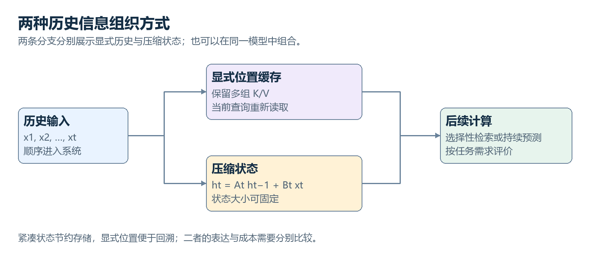

# 20　Transformer 之外：另一种信息保存与交互方式

<!-- v2:nav:start -->
[← 19 Encoder、Decoder 与信息访问方式](19.md)　｜　[全书目录](../../README.md)　｜　[21 预测下一个 token 为什么能训练出广泛能力 →](../03-language/21.md)
<!-- v2:nav:end -->

<!-- v2:toc:start -->

本章目录

- [先用一个状态看保留与遗忘](#section-01)
- [选择性更新怎样适应不同输入](#section-02)
- [有递推依赖，为什么还能并行训练](#section-03)
- [线性注意力汇总什么](#section-04)
- [压缩访问与显式访问为什么可以混合](#section-05)
- [图中的邻居怎样影响一个节点](#section-06)
- [消息传递如何保留连接结构](#section-07)
- [回到模型结构的共同检查方式](#section-08)
- [状态空间模型的共同形式](#section-09)
- [为什么不只是回到普通 RNN](#section-10)
- [Mamba 的“选择性”解决什么](#section-11)
- [线性注意力怎样避免显式构造全部位置对](#section-12)
- [遗忘与快速权重更新](#section-13)
- [进一步深入：固定状态如何保留与遗忘](#section-14)
- [结合性怎样帮助并行扫描](#section-15)
- [测试长期记忆不能只问序列能不能输入](#section-16)
- [混合架构为何自然出现](#section-17)
- [不把“替代者”当作历史必然](#section-18)

<!-- v2:toc:end -->
注意力让位置之间可以显式匹配，但长序列的关联计算与缓存也带来成本。另一类结构希望把历史整合进持续更新的状态，或者把大量键和值汇成较小的统计对象。

我们在这一章看三种信息组织：状态空间、线性注意力和图消息传递。前两者主要回应序列访问与成本，第三者回应数据本身的连接结构。它们共享“怎样传递信息”的问题，但不能被混成同一种替代技术。

## 先用一个状态看保留与遗忘

设初始状态为零，每步更新为旧状态乘 0.8，再加当前输入乘 0.2。输入依次为 1、0、0，状态依次得到 0.2、0.16、0.128。

第一步信息没有立刻消失，但随着更新衰减。若任务需要它在很久以后仍精确可用，这组更新可能不够。若任务希望平滑最近读数，这种衰减反而合理。

一般状态空间模型把状态、输入和输出通过矩阵联系。连续时间系统还要转成离散步长下的更新，采样条件也参与其中。状态可以有许多坐标，并不是一个平均数就能承担全部任务。

固定状态大小意味着历史越长，也可以不增加同样形式的状态存储；代价是历史被压缩，不能承诺随时取回全部细节。**输入能够很长，与每项旧信息都能可靠恢复，是两个判据。**

## 选择性更新怎样适应不同输入

若每步使用完全相同保留方式，某些任务会遇到限制：噪声应当忽略，关键信号应当写入，特定位置又需要读出。选择性结构让部分更新参数根据当前输入变化。

Mamba 的代表思路在状态空间计算中引入输入相关选择，并结合适合硬件的实现。具体参数化需要看公开结构，不能笼统理解为“模型像人一样决定记住什么”。

我们可以在教学中让保留系数随输入类别改变，看到不同序列得到不同状态。真实模型的选择来自可训练映射，多个坐标可以保留不同信息。

这也与门控 RNN 有思想联系，但离散化、参数形式、状态运算和实现不同。技术发展存在重新组合，不应该为了叙述方便把每个新名字写成完全凭空出现。

## 有递推依赖，为什么还能并行训练

某些状态更新具有可组合的线性或仿射结构。两步更新分别为 A₁s+b₁、A₂s+b₂，合起来就是 A₂A₁s+A₂b₁+b₂。

这项组合满足相应结合关系，能够用并行扫描组织多步前缀计算。若每步参数可以由当前输入先取得，就不必用普通逐步循环的方式完成所有运算。

这不是把依赖关系删除，也不意味着任意非线性递推都能同样处理。并行算法利用的是具体数学结构，实际速度还取决于设备、内存与序列长度。

## 线性注意力汇总什么

普通注意力为每个查询与许多键计算关系。线性注意力的一类方法用特征映射把匹配写成较容易分解的形式，再预先汇总键和值的组合。

设键经过映射得到 φ(k)，可以保存 φ(k) 与值的外积总和，再保存 φ(k) 的总和。一个查询到来，用 φ(q) 与这些汇总计算分子和归一化分母，就不必显式构造全部位置对。

这些汇总是固定或受控维度的状态，压缩了历史关联。它们不是把每个键和值完整保存在一个隐形数据库里。映射选择、归一化、数值和遗忘机制都会影响效果。

有些方法近似 Softmax 核，有些直接采用另一种关联函数。不能把所有线性注意力都宣称与普通 Softmax 注意力完全等价。

## 压缩访问与显式访问为什么可以混合

显式注意力擅长按当前查询重新访问许多具体位置，状态结构则可能在流式成本上更有优势。某些任务同时需要长期统计和细节检索，于是混合架构自然出现。

不同层交替使用这些结构，或者一部分路径维护状态、另一部分访问窗口，能够组合性质。但也增加设计、训练和状态管理的复杂度。

比较时需要给出相同预算和任务。长输入吞吐很好，未必证明细节问答最好；检索任务表现强，也不表示连续流处理成本最低。架构优势总与测量对象有关。

## 图中的邻居怎样影响一个节点

图数据的连接来自对象关系，不一定是一条时间顺序。一个节点可以读取邻居表示，聚合后与自身表示组合，得到新状态。这是消息传递神经网络的一项常见骨架。

看一个教学节点，自身表示为 [1,1]，两个邻居为 [1,0] 和 [0,2]。邻居平均为 [0.5,1]。若简单各取一半，自身与邻居汇总结合为 [0.75,1]。

真实模型通常还包含可训练映射、边特征和非线性，聚合可以求和、平均或使用注意力。我们用简单数字只是确认对象与关系：不是节点编号相邻就互相读取，而是图中的边允许交互。

## 消息传递如何保留连接结构

同一种更新可以在很多节点上共享，聚合通常设计为不依赖邻居任意排列。这样图数据换一种编号方式，计算仍能保持相应性质。

多层传播扩大可利用的邻域范围，也可能让节点表示逐渐相似，出现过平滑；某些远处信息还可能被压缩在有限通路中，涉及过挤压等问题。层数增加不是免费扩大可靠理解。

动态图、异构关系和三维物理结构还需不同设计。科学任务中，旋转和平移等对称性可以进一步参与结构，卷五会把它接到分子和实验问题。

## 回到模型结构的共同检查方式

这一卷从一个小网络走到训练、卷积、序列、注意力与其他结构。每次变化，都可以问同样几件事：输入对象是什么，哪些参数共享，信息怎样访问，中间结果怎样产生，目标怎样影响参数。

下面继续展开状态空间和线性汇总的典型关系。带着刚才的数字再看公式，固定状态、扫描与遗忘就能对应实际计算。下一卷则在已知结构上加入语料、规模、后训练和生成，把现代语言模型真正形成能力的过程接起来。

## 状态空间模型的共同形式

线性离散状态空间模型可写为：

$$
h_t=Ah_{t-1}+Bx_t,\qquad y_t=Ch_t+Dx_t.
$$

$h_t$ 是内部状态，$x_t$ 是当前输入，$y_t$ 是输出。A 决定旧状态怎样演化，B 决定输入怎样写入，C 决定怎样读取，D 是可能存在的直接通路。它与控制、信号处理中的状态模型有直接数学联系，但用于序列学习时，参数与结构可以通过训练选择。

如果状态维度固定，每步存储不必随历史长度无限增加。代价是过去信息经过压缩，某些精确细节可能丢失。固定状态可以表达有用长期统计，却不能简单等同于任意长度原始记录的无损保存。

## 为什么不只是回到普通 RNN

一般 RNN 的非线性递推不容易在时间维度并行。某些具有特定结构的状态更新可以利用卷积表示、并行扫描或分块算法提高训练效率。例如仿射变换的复合具有结合性，可以把长序列计算组织成树状或分块组合。

这不表示所有状态空间模型都一样，也不意味着有递推式就自动获得高速。矩阵结构、参数化、离散化以及硬件实现共同决定效率。S4 等工作强调有结构的长程动态，后来的选择性模型进一步让更新依赖输入。

## Mamba 的“选择性”解决什么

固定线性系统对每个输入使用相同动态，难以根据内容决定哪些信息保留、哪些忽略。选择性状态空间模型让部分参数或时间步相关量依赖当前输入，使状态更新对内容敏感。

可以把它理解为输入不仅写入一个值，还影响写入与遗忘的方式。但具体公式比“一个遗忘门”更有结构，不能把它完全等同于 LSTM。高效扫描与硬件实现也是这条路线的重要组成部分。

Mamba-2 的状态空间对偶框架揭示某些结构化状态空间计算与特定注意力形式之间的联系。标题中的“Transformers are SSMs”不表示所有标准 Softmax Transformer 与任意固定状态模型完全等价，也不表示二者在任意任务上可无损互换。联系有明确的模型类别与数学条件。

## 线性注意力怎样避免显式构造全部位置对

标准注意力含有对全部位置分数进行 Softmax 的步骤，通常不能随意交换矩阵乘法顺序。某些线性注意力使用特征映射 $\phi$ 构造另一种核匹配，让计算能写成累计统计：

$$
S_t=S_{t-1}+\phi(k_t)v_t^\top,\qquad
z_t=z_{t-1}+\phi(k_t),
$$

$$
o_t=\frac{\phi(q_t)^\top S_t}{\phi(q_t)^\top z_t}.
$$

此处把向量写成列向量以方便外积。S 累计键特征与值的关联，z 累计归一化项。新查询读取这些统计，不必逐一重新访问全部过去 token。

它通常不是对标准 Softmax 的简单恒等重排，而是采用不同核形式或近似。状态大小取决于特征和内容维度，序列长度上的线性不表示所有维度成本都很小。表达能力、数值稳定性与精确检索行为也需要分别考察。

## 遗忘与快速权重更新

纯累加会让旧信息不断混合，一些模型引入衰减、门控或类似误差修正的更新，让状态更有选择地覆盖和保留。Delta-rule 风格方法会根据当前状态对某个键的预测误差，修正关联表示，而不是只做无条件叠加。

这使序列处理与在线学习的某些思想相连。要小心区分：推理过程中更新的是临时状态或快速权重，不一定是预训练长期参数。名称里出现“学习”，也可能指内部状态适应，而非标准优化器对模型权重做长期训练。

## 进一步深入：固定状态如何保留与遗忘

考虑一个最简单的标量状态：$h_t=0.9h_{t-1}+x_t$，初值为零。输入依次是1、0、0，状态依次为1、0.9、0.81。第一项输入的影响逐步衰减，十步以后仍有残余，却不再保持原始幅度。

若后面不断有新输入，状态包含许多历史项按不同衰减系数加权的和。它适合估计平滑趋势，但仅凭一个数字通常无法恢复每项原始输入。增加多个状态坐标、使用不同动态，可以保留不同时间尺度的结构，但仍需面对表示容量。

注意力缓存则保留多个历史位置的键和值，当前查询可直接区分它们。两条路线的取舍不是“一个有记忆、一个没记忆”，而是记忆以压缩状态还是显式位置集合保存，以及如何被读取。

## 结合性怎样帮助并行扫描

把某一步更新写成 $h'=ah+b$。两步复合得到 $h''=a_2a_1h+a_2b_1+b_2$，仍是同类仿射变换。多个变换可以先分组计算，再组合，只要保持原始顺序。

这种结合性允许树状前缀扫描，减少严格逐步执行的依赖深度。对矩阵或结构化状态可推广，但实际效率取决于中间对象大小和结构。并行扫描并没有取消序列顺序，它只是以等价的计算组织方式利用硬件。

如果更新中的某些系数由当前输入产生，但不依赖尚未计算的完整前一状态，仍可能构造高效扫描。若存在一般非线性状态依赖，情况会更困难。这是不同递推架构训练效率差异的一个来源。

## 测试长期记忆不能只问序列能不能输入

持续输入很长序列与准确回忆其中任意细节是不同要求。平滑信号预测可以从紧凑状态获益，逐字复制某个远处随机字符串则需要更精确存储。

比较架构应同时包含选择性检索、顺序推理、连续预测和噪声干扰等任务。否则某个模型在一种长序列任务表现好，容易被误读为它解决了所有长上下文问题。

## 混合架构为何自然出现

注意力善于灵活检索历史，状态模型善于以较小存储持续处理长流。混合架构可以在某些层使用注意力，在其他层使用递推或线性模块，兼顾不同需求。

这种组合不是折中就必然最好。各模块比例、训练规模、任务类型、位置处理和缓存系统都影响结果。某些长文检索任务可能偏好保留显式历史，某些持续信号任务更适合紧凑状态。评价需要在相同资源与任务下比较。

## 不把“替代者”当作历史必然

许多架构研究解决特定瓶颈，并不需要宣布 Transformer 已失效才有价值。模型也可能保留 Transformer 的残差、归一化和 FFN，只更换序列交互模块。此时“是不是 Transformer”取决于命名习惯，真正重要的是计算图改变了哪里。

到这里，语言和序列的共同基础已建立。后面进入图像：输入不再是一维 token 序列，空间结构与分辨率开始成为主要约束。

<!-- v2:footer:start -->
---

[← 19 Encoder、Decoder 与信息访问方式](19.md)　｜　[全书目录](../../README.md)　｜　[21 预测下一个 token 为什么能训练出广泛能力 →](../03-language/21.md)

[方法与案例来源](../../sources/README.md)
<!-- v2:footer:end -->
