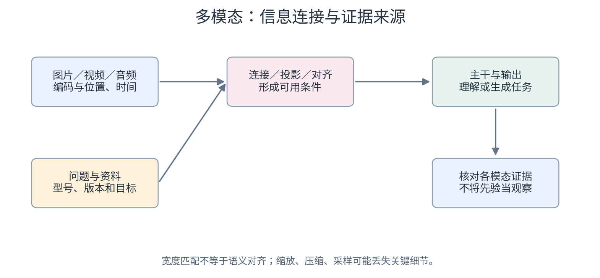

# 40　一个模型怎样同时读取多种输入

<!-- v2:nav:start -->
[← 39 文字怎样变成语音和其他声音](39.md)　｜　[全书目录](../../README.md)　｜　[41 视频为什么比连续生成图片更难 →](41.md)
<!-- v2:nav:end -->

<!-- v2:toc:start -->

本章目录

- [模态编码器先保留什么信息](#section-01)
- [拼接怎样让模态在序列中交互](#section-02)
- [对齐训练解决哪一个缺口](#section-03)
- [“右边那个”怎样与视觉位置对应](#section-04)
- [高分辨率与动态输入为什么需要组织](#section-05)
- [视频和音频还带有时间轴](#section-06)
- [语言先验为何会压过视觉证据](#section-07)
- [原生多模态需要看实际定义](#section-08)
- [多模态评价怎样隔离证据来源](#section-09)
- [一个典型视觉语言模型的通路](#section-10)
- [拼接与交叉注意力是两种连接方式](#section-11)
- [对齐训练与指令训练各解决什么](#section-12)
- [高分辨率为什么改变问题](#section-13)
- [空间定位与 grounding](#section-14)
- [视频理解增加了时间关系](#section-15)
- [进一步深入：混合序列的掩码怎样安排](#section-16)
- [视觉幻觉如何被语言先验放大](#section-17)
- [模态之间的信息不总对称](#section-18)
- [同一张设备照片怎样进入一个语言回答](#section-19)
- [原生多模态不是一个统一的精确定义](#section-20)

<!-- v2:toc:end -->
维护人员上传设备照片，同时说“右边那个插头是不是松了”。系统要利用文字指向、图像位置和音频内容，而不是对三份输入分别给无关答案。多模态把不同表示接到一个任务，但接通的计算方式可以不同。我们从一条视觉语言通路看共同关系，再说明声音、视频和空间条件增加什么。

## 模态编码器先保留什么信息

图片编码器形成视觉 token 或特征图，音频编码器形成声学表示，文字则从词表嵌入进入。它们的维度、长度和训练经历不一定相同。投影层可以把某种表示映到语言主干宽度。维度相同方便接口，不自动说明语义已经对齐。模型需要配对、目标与适配训练。

如果视觉编码已经压成一个整图向量，精确位置可能受限；如果保留很多高分辨率 token，又增加成本。连接选择要对应任务。

## 拼接怎样让模态在序列中交互

一种路线把视觉表示与文字表示组织成混合序列，按规定掩码送进模型。图像位置与文字位置可能有不同编码和访问安排。另一种路线让文字侧通过交叉注意力读取外部模态表示。查询来自文字状态，键和值来自视觉或音频，不必把全部内容都当作同一离散词表。

两种路线都需要实际数据路径，不能只在系统提示里说“你现在能看图”。输入格式、编码与训练使能力有机会形成。

## 对齐训练解决哪一个缺口

先用图文配对训练连接，让视觉信息能够影响语言输出，再用多模态指令示范训练任务行为，是一类常见组织。也有更联合的训练路线。图文相似度目标与逐字回答目标不同。CLIP 类表示可以提供基础，但视觉问答还要形成条件生成关系。

示范若主要问图片主题，精确计数和定位可能不足。能力来自实际任务约束，不由“多模态”名称完整描述。

## “右边那个”怎样与视觉位置对应

系统需要从文字指向找到相应视觉区域。两个相似插头的区别可能在位置、上下文和遮挡，粗粒度主题向量不够。Grounding 任务用框、点、掩码或坐标目标增加位置对应训练。生成坐标时，范围、单位和归一化约定都要明确。语言输出“右边”与真正定位右边是不同证据。可以改变图像布局、交换对象和遮掉区域测试系统有没有用视觉信息。

## 高分辨率与动态输入为什么需要组织

把大图缩小可能丢失铭牌文字，分成多个裁剪又可能失去整体关系。系统可以结合全图和局部块，或采用动态分辨率与压缩。这些安排改变 token 数量、位置和成本。哪一块来自哪里，需要让模型获得相应关系，不能把裁剪列表当成无序图片集合后期待精确空间回答。

图像大小与长宽比变化也影响编码。适配位置和采样不是纯粹显示设置，而是输入表示的一部分。

## 视频和音频还带有时间轴

视频帧需要时间位置，声音片段需要与帧和文字相关。说“现在把它拿起来”时，指令可能对应某段动作，不只是静态对象。不同采样率和延迟使同步复杂。时间戳、流式状态与跨模态对齐需要进入系统组织，不能仅把每种输入独立总结后拼回答。

某些任务允许完整媒体输入再判断，实时任务则只能使用已经到来的信息。访问边界仍然服从任务。

## 语言先验为何会压过视觉证据

训练中常见场景可以帮助推断模糊内容，也可能让模型把“通常有两个插头”当成当前图片事实。视觉幻觉不一定只是缺少语言知识，可能涉及没有正确使用观察。提高分辨率、增强位置目标、改善数据和外部检查可以针对不同原因。不能只要求模型“仔细看”就认为视觉证据已经增强。

回答要区分看见的内容与推测。图像模糊时，合理下一步可以是取得清晰局部，而不是补一段确定说明。

## 原生多模态需要看实际定义

有的系统联合处理多模态训练，有的由独立编码器连接语言主干，有的还具备多模态输出。宣传中的“原生”没有一套通用精确定义。应当具体问：哪些模态可输入，哪些可输出，何处共享参数，训练有哪些目标，实时状态如何管理。这样才能比较真实结构。

模态之间信息也不对称。文字说明不包含全部视觉细节，图片也不能还原所有声音。共同空间不意味着互相可以无损转换。

## 多模态评价怎样隔离证据来源

把图片换成空白、改变关键位置、保留文字问题，观察输出如何变化，可以帮助检查模型是否依赖视觉。声音和视频也可以做对应干预。这类实验有条件，不能以一次变化证明完整机制。但比只看到流畅答案更接近能力证据。

下面把混合序列、掩码和模态桥接写得更具体。之后我们进入视频生成，再把实时听看说的状态与时间关系接起来。

## 一个典型视觉语言模型的通路

图像经过视觉编码器，得到一组视觉特征；连接模块把特征映射到语言模型可处理的宽度；视觉向量与文本嵌入以约定方式进入语言模型；语言模型根据问题和视觉内容生成回答。连接模块可以是线性投影、小型多层网络、查询压缩器或其他结构。它不是简单“把图片翻译成一段中文”。输入语言模型的通常仍是连续向量，包含信息的方式与自然语言句子不同。

假设视觉编码器输出 576 个 d_v 维特征，语言模型宽度为 d_l，投影矩阵可以把 576×d_v 映射成 576×d_l。位置数不一定改变；若使用压缩器，则可能用较少的输出 token 汇总。压缩节约计算，也可能丢失小字或局部细节。

## 拼接与交叉注意力是两种连接方式

一种方案把视觉向量放入语言序列，模型通过自注意力使用它们。另一种方案保留独立视觉表示，在语言层里增加交叉注意力读取。还有更深的联合主干，让不同模态在多个阶段交互。

它们在缓存、输入长度、训练参数与信息瓶颈方面不同。拼接较直接，但高分辨率产生大量视觉 token；交叉注意力提供明确接口，却增加模块和训练协调。不能只用“模型能看图”判断内部是哪一种。图像向量通常不从语言词表查表获得，所以“所有东西都是 token”容易遮住真实差别。共同的是离散位置与连续特征组成的序列接口，并不要求所有模态都用同一套离散符号词典。

## 对齐训练与指令训练各解决什么

初期可以冻结部分预训练模块，只训练连接层，让视觉特征进入语言模型可利用的空间。随后使用图像描述、视觉问答、文档理解或多轮对话等数据，训练模型按指令使用视觉证据。也可以采用更广泛的联合训练，阶段划分不是唯一标准。

如果语言模型很强、视觉信号较弱，它可能凭问题中的常识猜答案。比如问“图中的停车标志是什么颜色”，它可能依靠常见颜色而没有真正辨认。这种捷径会在常见场景看起来有效，在反常图像上暴露问题。要让模型确实使用图像，需要数据设计、困难负例、定位任务和评估。把同一问题配不同图片，看答案是否随证据合理变化，比只看单张演示图更能测试视觉依赖。

## 高分辨率为什么改变问题

把整张文档缩到固定小尺寸，会丢失小字。切成多个高分辨率块可以保留细节，但增加 token 数，并要求模型知道块的空间关系。动态分辨率、局部裁剪、层级编码和视觉 token 压缩都在处理这个取舍。

OCR 还涉及字符、版面、表格和阅读顺序。识别每个字不等于理解表格哪一列对应哪一行；模型回答数字问题可能需要结合位置与结构。图像语言能力因此不能只用“识图准确率”一个指标概括。

## 空间定位与 grounding

把语言中的对象指向图像区域称为视觉定位或 grounding。模型可能输出边界框、点、分割掩码，或通过外部检测分割组件完成。这些输出需要坐标体系和适当训练信号，不是普通文本描述自然附带的精确能力。

“左边第二个按钮”要求识别对象、排序、理解参照系。镜像、视角变化和多个相似对象会增加难度。即使模型能说出图片内容，也未必能可靠点击指定对象，所以视觉理解与界面操作还需要系统验证。

## 视频理解增加了时间关系

将视频抽帧后交给视觉语言模型，可以利用已有图像编码器，但抽样间隔可能漏掉短暂事件。帧越多，上下文越长；压缩越强，细节越少。视频表示还要区分相机移动、对象运动与场景切换。

“有人先打开阀门再启动电机”需要时间顺序；“是否一直保持关闭”需要覆盖整个区间。一个几帧图集不一定足以回答。专门视频编码器、时间位置编码和分层摘要可以改进，但仍需评估具体时间分辨率和证据覆盖。

## 进一步深入：混合序列的掩码怎样安排

假设输入由一组视觉token、用户问题token和助手回答token组成。助手位置需要读取图像与问题，回答内部通常保持因果性。视觉位置之间是否双向交流，可能已由视觉编码器完成，也可能在联合主干中使用专门掩码。

如果把所有位置机械使用同一种下三角掩码，放在后面的视觉块就无法影响前面的视觉位置；这未必符合设计目标。不同系统可以使用前缀双向、输出因果等组合。必须看具体计算图，不能因为都叫decoder就忽略模态内部访问规则。

同一条样本可以在文本回答上使用交叉熵，在视觉或音频侧使用其他辅助目标。损失加权决定各任务如何推动共享参数。如果一种模态数据量远大于其他模态，采样比例也会成为实际能力分配的一部分。

## 视觉幻觉如何被语言先验放大

问题里出现“警告标志”，模型可能预期红色三角形；若图片很小或模糊，这种先验会压过弱视觉证据。输出可能非常符合常识，却没有忠实描述当前图片。

验证可以使用反常图像、改变文字诱导、遮住关键区域或交换图片，观察回答是否相应变化。还可以要求定位证据，但模型给出的框也需要检查。一个带解释的错误回答仍然是错误，解释并不能自行证明视觉依赖。

## 模态之间的信息不总对称

图片可能包含无法由短标题表达的空间细节，声音可能包含转写丢失的情绪，文字可能提供图像看不见的时间和身份信息。对齐不是把所有模态压成完全相同的内容，而是建立可共享部分，同时保留专门信息。

因此某些架构使用共享表示加模态专用分支。过度压缩到单一公共空间，可能损害专门任务；完全分开又难以形成跨模态推理。模型设计在共享与保留之间寻找平衡。

图中箭头表示本章的主要数据与反馈关系；具体计算和条件沿正文展开。

## 同一张设备照片怎样进入一个语言回答

用户上传一张设备照片，问：“右侧那盏灯亮了吗？如果亮了，按手册意味着什么？”这是一个很小的多模态任务，却包含视觉、空间指代和外部资料。模型先要看清哪盏灯、判断亮灭，再按正确型号解释。语言回答流畅，并不能证明前面两项已经做对。

我们使用一套虚构配置追踪形状。图片预处理成 224×224，按 16×16 分块，得到 14×14＝196 个块。若每块编码成 768 维视觉表示，视觉编码器输出约 196×768 的数组；实际模型还可能增加特殊 token、使用多尺度或先做其他压缩。语言主干宽度为 1024，投影模块把每个视觉表示转成 1024 维，才方便放进相应混合序列。

这些数字只说明接口。一个 1024 维向量不是一条被预先写好的句子，也不要求某一维就对应灯的亮度。视觉编码器保存的是训练形成的特征，投影和语言层需要学习怎样把它们用于问题。将数组宽度匹配，是必要的连接条件，却不是语义对齐的全部。

### 位置和指代如何保留

图像块有二维位置，文本问题里有“右侧那盏灯”。如果位置关系在编码或后续连接里被完全抹掉，模型就很难区分左右。视觉编码器或主干通过位置表示保留空间关系，注意力再让问题相关的位置影响答案。但一个块可能同时含灯与背景，小灯又可能只占几像素，表示分辨率会影响判断。

如果图片有两排灯，“右侧”可能指右上、右下或整个右侧面板。用户问题存在歧义时，系统应结合上下文或请求明确，而不是强行选一个对象。Grounding 可以通过区域、坐标或其他输出把指代与位置关联，便于检查它实际看的是哪里。文本描述“右侧灯”没有可见位置证据时，读者很难验证这项对应。

### 混合序列怎样安排可读取条件

一种方案把视觉 token 与问题 token 放进共同主干。图像前缀可以采用相应的可见关系，文本生成位置读取图像和已有文本。因果生成并不要求所有模态都采用相同的掩码细节，模型训练时怎样安排，运行时就应匹配。另一种方案保留独立视觉表示，让文本通过交叉注意力读取它。两者都是连接办法，各有表示与计算条件。

无论哪种方式，当前回答只使用实际进入模型的视觉信息。如果高分辨率图片先被缩得很小，灯颜色可能已经丢失；如果视觉压缩只保留整体语义，模型也可能知道“这是一台设备”，却读不清小指示灯。上下文很长、主干很大，都不能自动补回前面漏掉的细节。

### 对齐与指令训练怎样让接口有用途

训练资料可以包含图像与描述，帮助模型关联视觉特征和语言对象；也可以包含问题与答案，训练它使用图片解决任务。对比目标擅长形成匹配关系，生成目标训练条件输出，定位目标约束空间对应。不同目标帮助不同能力，图文匹配很好不等于所有小字 OCR 或精细空间推理都很好。

如果训练描述常写“设备右侧红灯表示故障”，模型可能在看不清图片时仍回答红灯亮了。语言先验在资料缺失时有时有帮助，在视觉证据相反时却会造成幻觉。我们可以把灯改成熄灭、交换左右位置、遮住灯区域，检查回答是否随实际变化。如果模型始终输出同一常见结论，就提示它没有充分使用视觉条件。

### 手册如何接进后一段解释

假设视觉部分确认右侧灯亮起且颜色为黄色，接下来要确定型号。设备铭牌可能需要 OCR，用户也可能已经提供型号；信息冲突时要核对。检索只取回当前型号与版本的灯号说明。手册中“黄灯闪烁”与“黄灯常亮”又可能含义不同，一张静态照片只能支持某个瞬间亮灭，未必支持是否闪烁。

因此正确回答可能分为两层：“照片右侧灯看起来处于亮起状态，颜色接近黄色；单张图片不能确定闪烁。按所提供 M2 手册，常亮与闪烁对应不同提示，需要短视频或现场确认。”这没有假装问题被全部解决，却准确使用了两类证据。视觉观察与资料解释分别写清，读者也能发现是哪一层需要补充。

### 时间模态会引入新的对齐条件

如果上传五秒视频，模型可以观察灯是否闪烁，但采样帧率可能遗漏快速变化。音频又可能包含蜂鸣器，必须把声音与画面对应到相同时间范围。简单地先转写声音，再看图片，可能丢失音色、节奏或同步关系；原生联合输入可以保留更多信息，也增加表示与计算要求。

评估可以分别移除画面、音频或文本，检查答案依赖哪种证据。对同样任务比较模态组合时，数据、预算和目标应匹配。多模态能力的增加不是只看支持几种文件扩展名，而是看信息能否在正确条件下进入共同判断。

### 一项回答怎样被完整核对

最终检查至少包括：指代区域是否正确，灯的可见状态是否准确，是否把静态图推断成闪烁，型号是否确认，手册是否适用，解释是否扩大条件。每项都指向一个具体接口。系统可以用高分辨率区域读取、OCR、检索和验证组合完成，不必要求单次主干计算包办全部过程。

从照片到回答，我们已经走过预处理、视觉表示、位置、连接、问题条件、输出、资料匹配和证据核对。多模态模型于是有了可追踪的内部与外部过程。可爱或自然的语言可以帮助阅读，技术上真正让答案成立的，仍是每一种输入信息都被准确地带到它应当承担的判断里。

## 原生多模态不是一个统一的精确定义

某些系统先用独立编码器再连接语言模型，另一些从较早阶段就联合训练多种模态。产品所说的“原生”可能强调联合训练、直接音频输入或共享生成主干，具体含义要看公开结构。

同样，理解图像与生成图像是不同能力。一个模型可以读图后输出文字，却没有图像生成器；可以通过工具调用另一个生成模型，也可以内部联合生成。前面的生成机制现在可以接到时间维度上。接下来走进视频，看看对象、相机和跨帧细节怎样共同影响一段生成，而不仅是一张图片。

<!-- v2:footer:start -->
---

[← 39 文字怎样变成语音和其他声音](39.md)　｜　[全书目录](../../README.md)　｜　[41 视频为什么比连续生成图片更难 →](41.md)

[方法与案例来源](../../sources/README.md)
<!-- v2:footer:end -->
