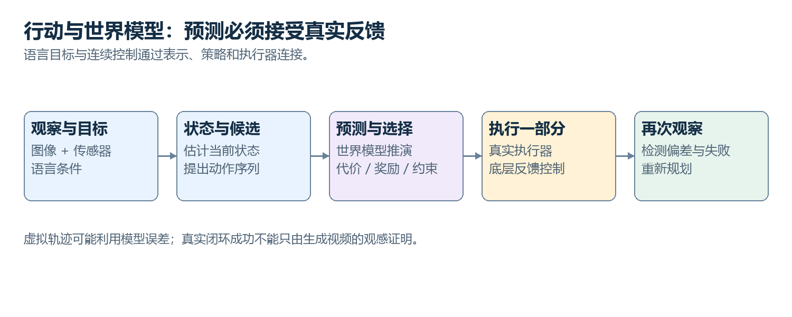

# 51　从模拟走到机器人：感知、控制和行动学习

<!-- v2:nav:start -->
[← 50 世界模型怎样预测行动之后的变化](50.md)　｜　[全书目录](../../README.md)　｜　[52 AI 怎样面对科学中的结构与探索 →](52.md)
<!-- v2:nav:end -->

<!-- v2:toc:start -->

本章目录

- [观察里有哪些不同量](#section-01)
- [坐标转换为什么是必要计算](#section-02)
- [高层意图与低层动作怎样分工](#section-03)
- [反馈控制怎样处理偏差](#section-04)
- [示范怎样形成行为克隆目标](#section-05)
- [动作分块为什么有价值](#section-06)
- [Diffusion Policy 生成什么](#section-07)
- [VLA 怎样连接视觉、语言与动作](#section-08)
- [仿真到现实为什么还有距离](#section-09)
- [怎样确认任务真的完成](#section-10)
- [观察、状态与动作不在同一个空间](#section-11)
- [行为克隆怎样学习示范](#section-12)
- [为什么一次预测一段动作](#section-13)
- [Diffusion Policy 如何生成连续动作](#section-14)
- [模仿、强化学习与规划怎样组合](#section-15)
- [仿真到现实的差距来自哪里](#section-16)
- [一次抓取怎样经过几何、运动与反馈](#section-17)
- [真实闭环为何是最终检验](#section-18)

<!-- v2:toc:end -->
维护机器人要拿起一个插头，并把它放到指定位置。图片回答“插头在右边”还不够，它要把感知变成几何目标，再把目标变成可以执行的动作，并观察是否真的完成。本章沿这个虚构任务把输入、坐标、控制与学习接起来。真实机器人有设备和安全要求，教学只解释机制，不给未经验证的动作配置。

## 观察里有哪些不同量

相机提供图像，深度提供距离，关节传感器提供姿态，力或触觉提供接触信息。它们有不同采样率、延迟与坐标。机器人状态不仅是照片。夹爪是否已经闭合、手里是否有物体、目标是否被遮挡，都会影响下一步。历史与状态估计可以补充观察，但估计要区别于确认事实。

任务还需要语言或其他目标条件，例如拿哪个对象、放到哪里、保留什么限制。目标不能被视觉主题自动替代。

## 坐标转换为什么是必要计算

相机坐标里的位置，不直接等于机器人基座坐标里的目标。系统需要标定变换，包括旋转和平移，并检查单位与时间。看二维教学例子：相机点为 (0.2,0.1)，先旋转 90 度得到 (-0.1,0.2)，再平移 (1,0)，得到基座点 (0.9,0.2)。真实三维还要处理完整姿态。这里计算错误，语言模型再会解释也不能让夹爪准确到达。空间接口是实际行动链的一部分。

## 高层意图与低层动作怎样分工

“拿起插头”可以分解为接近、对准、闭合、抬起与检查。运动规划考虑可达性和碰撞，控制器把目标转成电机或关节命令。低层反馈可能运行得比视觉与语言决策更快。大模型每次输出文字，不适合直接承担全部实时稳定控制；系统需要明确层次。

策略也可以直接输出关节、末端位置变化或其他连续量。动作表示决定可执行接口与约束，不是一个通用动作向量到处能用。

## 反馈控制怎样处理偏差

控制器比较目标与当前测量，调整输出。比例、积分、微分等经典方法针对误差、累计偏差与变化提供不同作用，实际稳定性要按系统条件分析。学习可以预测动态、补偿或选择目标，传统控制仍承担明确反馈。新技术与旧思想在这里共同工作，不是只有神经网络才算智能行动。

执行之前还要检查速度、范围、碰撞与其他约束。把模型输出截到允许范围可以防一部分数值问题，不保证所有物理风险都已解决。

## 示范怎样形成行为克隆目标

记录人在某观察下采取的动作，模型学习相同条件输出。数据可以来自遥操作、记录或其他可追溯方式。示范包含观察与动作对齐，延迟或时间错位会改变关系。目标也可能是一段动作而不是单步，编码要明确。模型执行有小误差以后，会进入示范未覆盖的状态，后续又更容易偏离。数据聚合、补示范与闭环训练尝试处理这项分布变化。

## 动作分块为什么有价值

一次预测接下来一段动作，可以表达短期连贯结构，也减少高层调用频率。但环境可能在段内变化，不能盲目执行整段。滚动执行少数步、取得新观察再预测，是一类常见安排。动作块长度与反馈频率共同决定响应和连贯性。

时间顺序、单位和执行间隔需要接口匹配。预测十项动作不说明它们对应十秒，也不保证每项可执行。

## Diffusion Policy 生成什么

把一段连续动作当作目标，在观察与任务条件下学习去噪或相关生成过程。采样产生候选动作序列，再按控制安排执行。它利用生成模型表达多种合理动作，不是为机器人生成一段动画。训练数据、约束和执行反馈决定实际有效性。

动作单位和范围会影响损失与表示，模型输出也要接受物理接口检查。图像生成里看似细小的误差，在控制中可能有不同后果。

## VLA 怎样连接视觉、语言与动作

视觉与任务文字进入共同或连接的表示，动作头或动作 token 输出具体控制相关目标。不同 VLA 的动作表示、训练和执行层次不同。预训练视觉语言基础可以帮助任务与对象理解，动作数据才提供实际操作关系。会描述抓取步骤，不自动等于拥有可靠抓取策略。

跨设备泛化还要处理不同关节、夹爪、坐标与动态。共同语言目标不能抹掉硬件接口差异。

## 仿真到现实为什么还有距离

摩擦、质量、柔性、传感器、光照和延迟都可能不同。仿真中成功的动作，真实中可能滑落或偏移。域随机化、系统辨识、真实数据与适配可以减少部分差距，评价要看实际闭环。模拟规模大不能直接证明现实安全。世界模型也可能在熟悉场景准确、陌生条件失效。规划需要保留不确定与反馈，不把预测画面当作已发生观察。

## 怎样确认任务真的完成

夹爪发送闭合命令，不等于抓住物体；位置到达，不等于放置稳定。可以用图像、力、状态与检查综合确认。失败要更新状态，判断能否重试或需要人介入。恢复流程和停止条件同样属于能力，不只看一次成功动作。下面进一步看行为克隆、动作生成与真实闭环。下一章把结构、预测和实验反馈放到科学问题中，看 AI 怎样成为研究过程的一部分。

## 观察、状态与动作不在同一个空间

观察可能是相机图像、关节角、力传感器和历史信息；状态是对环境和自身情况的描述；动作可能是关节目标、速度、末端位姿或更抽象的命令。不同机器人具有不同动作空间，不能直接把一个机器人的输出数字复制到另一个。

一个视觉语言动作模型 VLA 将视觉和语言条件映射到动作。动作可以离散化为 token，用类似自回归方式生成；也可以由连续动作头、扩散或流匹配模型产生。把动作写成 token 方便复用序列工具，却引入精度和序列长度取舍。

## 行为克隆怎样学习示范

给定专家观测与动作对，训练策略预测专家动作，这是监督学习。它不要求奖励函数，可以利用遥操作和已有轨迹。困难是部署时策略会进入示范未覆盖的状态。

例如抓取位置偏了一点，下一帧就与专家轨迹不同，后续动作误差继续累积。收集策略实际访问状态下的反馈、加入扰动、扩大示范覆盖或使用交互训练，可以缓解这种分布偏移。但真实机器人试错有成本，不能像纯软件环境无限探索。

## 为什么一次预测一段动作

高频逐步生成动作容易受延迟影响。动作分块让模型一次输出未来若干步，再执行其中一部分后重新观察、重新规划。它降低调用频率，也让模型直接学习连续动作结构。这种滚动执行与模型预测控制在组织上相似：规划一个时域，只执行前部，再用新反馈修正。相似不等于具备相同稳定性理论，学习策略的模型误差和约束处理仍需独立分析。

## Diffusion Policy 如何生成连续动作

把一段未来动作视为高维数组，以当前观察为条件，训练扩散模型从噪声逐步产生动作序列。动作分布可能有多个合理模式，例如从左侧或右侧绕过障碍；简单均方误差预测容易平均成不合适的中间动作，生成式策略能表达多模态选择。

采样得到动作后，系统仍要检查范围、速度和碰撞等约束。生成分布中概率较高，不等于物理上绝对安全。延迟也限制采样步数，少步生成与控制频率需要共同设计。

## 模仿、强化学习与规划怎样组合

示范提供可用初始行为，强化学习根据任务奖励改进，模型式规划在运行时评估具体候选。底层控制器处理高频稳定执行，上层模型处理较慢的语义目标。这些层次可以在不同频率运行。

例如上层每几百毫秒选择一个抓取子目标，底层以更高频率跟踪关节或力目标。具体频率由硬件和任务决定。大型语言模型不必也通常不适合直接承担每个高频电流控制周期，但可以参与目标理解和任务协调。

## 仿真到现实的差距来自哪里

仿真中的摩擦、质量、传感器噪声、接触和延迟可能与真实情况不同。域随机化在训练中变化这些因素，使策略不只依赖单一精确模拟；系统辨识尝试根据真实数据校准动力学。两者都不能保证覆盖所有现实变化。软物体、复杂接触和长期磨损尤其困难。因此离线漂亮轨迹、仿真高成功率与真实长期可靠性是不同级别证据，必须逐步验证。

## 一次抓取怎样经过几何、运动与反馈

教学机器人要把桌上的插头放到收纳盒里。相机先检测出插头在图像中的像素区域，深度传感器给出该区域的距离。像素坐标只是照片上的位置，机器人不能直接拿“第 320 列”作为机械臂目标。系统要用相机的几何参数把像素和深度还原成相机坐标中的三维点，再利用标定关系变换到机器人基座坐标。

前面的二维计算可以帮助我们看清顺序：点 (0.2,0.1) 在相机坐标中，旋转 90 度后是 (−0.1,0.2)，再加上平移 (1,0)，得到 (0.9,0.2)。先平移后旋转通常给出另一个结果，因此变换的次序不能交换。三维系统用矩阵把旋转和平移组织起来，还要表示夹爪的朝向。插头中心到达了，并不意味着夹爪姿态也合适。

坐标还有单位和时刻。一个接口以米输出，另一个以毫米解释，会把目标放大一千倍；相机观察的是 0.5 秒前的物体，桌面此刻又移动了，正确的几何变换也可能针对过时位置。**机器人需要的是坐标、单位、时间和标定共同确定的位置。** 数据字段里看似不起眼的几项信息，实际直接参与动作的含义。

### 从末端目标到关节动作

机械臂的末端位置由各关节角度共同决定。正运动学从关节状态计算夹爪在哪里，逆运动学尝试为目标位置和姿态寻找关节组合。一处目标可能有多个关节解，也可能根本不可达。选择时要检查关节范围、碰撞、奇异位置和其他条件，不能只要求夹爪最后坐标一致。

如果桌上有一个高杯子，直接从当前位置沿直线到插头，可能会撞到杯子。运动规划可以先抬升、绕开障碍、再接近目标。规划器在配置空间里比较可行路径，感知模型提供障碍位置，控制器负责跟踪选中的路径。神经网络也可以参与生成候选或估计碰撞，但最终输出必须对应具体机器的动作接口。

抵达前还要设置速度与加速度。相同几何路径，以很大的速度经过可能产生振动、滑落或者制动不足。轨迹包含时间安排，路径只是空间路线。这两者分开以后，读者便能理解为什么“规划成功”仍不等于“执行稳定”：几何可行、动力学可行和反馈可跟踪各有条件。

### 一个最小反馈例子

假设我们只看一个简化的一维位置控制：当前位置 x 为 0，目标为 1。每个控制间隔令位移等于 0.5 倍的位置误差，那么第一步移动 0.5 到达 0.5；第二步误差为 0.5，移动 0.25 到达 0.75；第三步到达 0.875。误差在这个特定模型中逐次减半。真实执行器有惯性、延迟和噪声，不能把这组数当作通用控制参数，但它清楚展示反馈在每一步重新读取当前位置。

若第一次实际只移动到 0.4，下一次误差会按 1−0.4 计算，输出改为 0.3。这与一次性预写“先移动 0.5，再移动 0.25”不同。积分项可积累长期偏差，微分项可反映变化趋势；使用这些项要根据系统动力学调节，否则也可能振荡或放大噪声。控制理论在这里仍有明确位置，并没有因为上层使用大模型就失去作用。

抓取阶段又加入接触。夹爪闭合命令成功，并不能证明物体已经握住。电机位置、夹持力、视觉变化或触觉信息可以帮助判断：空夹、握住、滑动和卡住是不同状态。抬起之后再观察物体是否随夹爪移动，能提供额外证据。完成“拿起”需要外部状态变化，而不是控制接口只返回一次成功。

### 学习动作为什么容易受到执行分布影响

行为克隆可以从人在这些阶段的示范学习：在某张图像和关节状态下，输出一个末端位移或关节动作。若示范总在插头正前方开始，模型实际偏到侧面以后，就可能不知道怎样恢复。每一步小误差把状态推离示范分布，后续误差再增大，这叫分布偏移或误差累积的一类表现。

补充恢复示范、在模型访问的新状态上重新标注、加入交互反馈，能针对这个缺口。单纯把同一段熟练示范重复更多遍，未必覆盖偏离状态。数据质量不只看“人做得很完美”，还要看模型运行时会遇到的状态是否得到指导。这与传统监督学习的独立测试相联系，同时又多了动作改变未来输入的闭环性质。

动作分块则一次预测一小段连续轨迹。假如模型生成接下来十个控制间隔的动作，系统只执行前两个，再用新观测重新预测，可以保留短期连贯性并及时响应变化。执行全部十步更省高层调用，却更容易错过物体滑动。动作块长度和实际执行长度是两个设置，不能看到“一次预测十步”就假定十步全部开环完成。

### 生成模型与动作的多种合理答案

同一插头可以从左侧抓，也可以从右侧抓。把两种示范简单平均，可能得到正中间一条并不合适的路线。条件生成模型可以表达多个动作模式：以观察、目标和当前状态为条件，生成一个完整且内部连贯的动作序列，再选择或执行其中一部分。Diffusion Policy 将去噪生成的对象换成动作序列，原理与图像生成相接，但输出单位、控制频率和物理条件不同。

VLA 则进一步把视觉与语言目标接入动作预测。语言说明该拿哪个插头，视觉定位对象，动作头把共享表示映射到可执行空间。它可能使用离散动作 token，也可能用连续预测或生成结构；“视觉、语言、动作”描述三类信息的连接，不规定所有模型都采用同一输出办法。成功还依赖训练设备、动作定义与实际平台匹配。

最终验收要观察插头是否在收纳盒里，夹爪是否放开，路径是否满足约束，以及失败时能否恢复。机器人让我们看见 AI 系统的一条完整落地链：语义目标、感知表示、几何关系、路径与轨迹、低层反馈、接触观察、状态验证。神经网络可以进入多处，经典方法也可以共同承担作用。把每个接口讲清，才不会将所有运动都藏在“智能体决定了动作”这一句话里。

## 真实闭环为何是最终检验

机器人动作改变物体状态，新的观测再影响动作。可靠性取决于误差是否被反馈纠正、约束是否持续满足，而不是某次离线动作预测与专家接近多少。这也给 AI 研究一个更广阔视角：语言与图像模型提供丰富表示，控制、规划、几何与系统工程提供结构和验证。后来的大型模型没有取消这些领域，反而需要与它们连接。

动作与反馈已经把模型放进物理世界。科学任务同样需要真实验证，却常常以结构、方程和昂贵实验为对象。接下来从分子与材料出发，看 AI 怎样利用领域关系，选择值得取得的新证据。

<!-- v2:footer:start -->
---

[← 50 世界模型怎样预测行动之后的变化](50.md)　｜　[全书目录](../../README.md)　｜　[52 AI 怎样面对科学中的结构与探索 →](52.md)

[方法与案例来源](../../sources/README.md)
<!-- v2:footer:end -->
