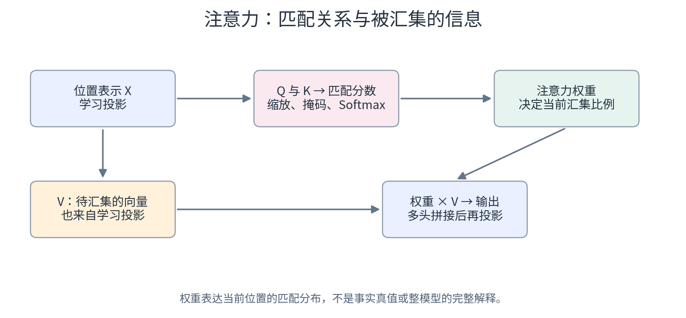

# 17　把注意力完整算一遍

<!-- v3:nav:start -->
[← 16 文字进入模型以前：token、嵌入与位置](16.md)　｜　[全书目录](../../README.md)　｜　[18 一层 Transformer 怎样把信息继续处理下去 →](18.md)
<!-- v3:nav:end -->

<!-- v3:toc:start -->
<details>
<summary>本章目录</summary>

- [1. 告别模糊隐喻：Q、K、V 的数据库检索直觉](#section-01)
- [2. 亲手算一遍注意力权重：点积、缩放与 Softmax](#section-02)
- [3. 信息的最终汇总：用权重加权值向量 V](#section-03)
- [4. 因果掩码（Causal Mask）：绝不允许偷看未来的算术证明](#section-04)
- [5. 为什么一定要除以根号 dk：方差控制与梯度饱和陷阱](#section-05)
- [6. 多头注意力（Multi-Head Attention）：多重视角的并行分工](#section-06)
- [7. 全句矩阵化计算：n 平方复杂度的物理来源](#section-07)

</details>
<!-- v3:toc:end -->
在几乎所有关于现代大语言模型的介绍中，“注意力机制（Attention）”都被捧为皇冠上的明珠。然而，许多通俗读物往往停留在“模型就像人类阅读时把目光聚焦在重点词汇上”这种浅显的文学比喻中。

一旦进入工程代码，你会发现这里根本没有“目光”，没有神秘的“意图”，只有三个大写字母：**Q（Query）、K（Key）、V（Value）**，以及一行简洁明了的矩阵乘法：
$$\text{Attention}(Q, K, V) = \text{Softmax}\left(\frac{Q K^\top}{\sqrt{d_k}}\right) V$$

这一行算式到底在算什么？Q、K、V 是从哪冒出来的？为什么要除以 $\sqrt{d_k}$？因果掩码又是怎么切断未来信息的？

这一章我们就彻底抛开云山雾罩的修辞，拿着铅笔，用一组最直观的二维教学数字，把注意力的每一个中间数值从头到尾亲手手算一遍！

---

<a id="section-01"></a>
## 1. 告别模糊隐喻：Q、K、V 的数据库检索直觉

理解自注意力最接地气的工程类比，是**现代数据库（或搜索引擎）的软性模糊检索系统**：



想象你打开视频网站搜索栏：
1. **查询（Query, Q）**：你在搜索框敲下的关键词，代表**当前位置的 Token“正在寻找什么样的信息”**。
2. **键（Key, K）**：库里成千上万个视频标题和标签，代表**各个候选 Token“我能提供什么样的特征来被匹配”**。
3. **匹配打分（$Q \times K$）**：用你的查询去和每一个视频的标签做相关度计算，算出每一个候选视频对当前查询的吸引力分数。
4. **值（Value, V）**：视频本身真正播放的内容。一旦匹配分数确定，系统就按照相关度的高低，把对应视频的实际内容打包加权返回给你。

在神经网络里，这一套检索全部变成了连续的浮点向量：
- 每一个词都通过三套可学习的权重矩阵（$W_Q, W_K, W_V$），各自投影出属于自己的 $Q$、$K$、$V$；
- 所谓“自注意力（Self-Attention）”，无非就是**输入序列里的所有词，彼此既当“寻找者（Q）”，又当“被寻找者（K）”，还当“内容提供者（V）”**！

---

<a id="section-02"></a>
## 2. 亲手算一遍注意力权重：点积、缩放与 Softmax

现在，让我们拿出具体的二维教学数值，亲眼看一遍这套算术如何运转。

假设当前序列里有 3 个位置，我们正站在第 2 个位置（比如教学句子里的“发现”）。
当前这个 Token 产生的**查询向量（Query）**为：
$$q = [1, 0]$$

而这 3 个位置各自对外广播的**键向量（Key）**分别为：
- 位置 1 的键：$k_1 = [0, 1]$
- 位置 2 的键：$k_2 = [2, 0]$
- 位置 3 的键：$k_3 = [1, 1]$

每个键的特征维度是 $d_k = 2$。

### 第一步：计算点积相似度（Dot Product）
向量点积衡量两个方向的重合度（对应位置相乘再相加）：
- 与位置 1 匹配：$s_1 = q \cdot k_1 = 1 \times 0 + 0 \times 1 = \mathbf{0}$
- 与位置 2 匹配：$s_2 = q \cdot k_2 = 1 \times 2 + 0 \times 0 = \mathbf{2}$
- 与位置 3 匹配：$s_3 = q \cdot k_3 = 1 \times 1 + 0 \times 1 = \mathbf{1}$

这 3 个原始匹配分数为：$[0, 2, 1]$。显然，当前查询与位置 2 的匹配度最高。

### 第二步：尺度缩放（除以 $\sqrt{d_k}$）
因为键的维度是 $d_k = 2$，为了控制数值方差，我们要除以 $\sqrt{2} \approx 1.4142$：
- 缩放分数 1：$\frac{0}{\sqrt{2}} = \mathbf{0}$
- 缩放分数 2：$\frac{2}{\sqrt{2}} = \sqrt{2} \approx \mathbf{1.4142}$
- 缩放分数 3：$\frac{1}{\sqrt{2}} \approx \mathbf{0.7071}$

### 第三步：经过 Softmax 归一化为概率权重
将这 3 个缩放分数取指数，然后按比例归一化为总和为 1 的概率分布：
- $e^0 = 1.0$
- $e^{1.4142} \approx 4.113$
- $e^{0.7071} \approx 2.028$
- 3 项总和：$\sum = 1.0 + 4.113 + 2.028 = \mathbf{7.141}$

计算最终注意力分配权重（保留三位小数）：
- 位置 1 权重：$a_1 = \frac{1.0}{7.141} \approx \mathbf{0.140}$
- 位置 2 权重：$a_2 = \frac{4.113}{7.141} \approx \mathbf{0.576}$
- 位置 3 权重：$a_3 = \frac{2.028}{7.141} \approx \mathbf{0.284}$

注意力权重向量精确算得：
$$a = [\mathbf{0.140}, \mathbf{0.576}, \mathbf{0.284}]$$
（核验：$0.140 + 0.576 + 0.284 = 1.000$，完全闭合！）

这组权重清晰地传达了当前查询的态度：它把 57.6% 的精力投向了位置 2，把 28.4% 的精力投向了位置 3，把 14.0% 的精力投向了位置 1。

---

<a id="section-03"></a>
## 3. 信息的最终汇总：用权重加权值向量 V

分配好了注意力比例，接下来就是真正的“提取信息”。
这 3 个位置真正提供的内容是它们的**值向量（Value, V）**。假设具体数值为：
- 位置 1 的值：$v_1 = [1, 0]$
- 位置 2 的值：$v_2 = [0, 2]$
- 位置 3 的值：$v_3 = [1, 1]$

我们按照刚才算出的权重 $a = [0.140, 0.576, 0.284]$，对它们进行线性加权求和：
$$\text{输出向量 } \text{Out} = a_1 v_1 + a_2 v_2 + a_3 v_3$$

- **第 1 个坐标**：
  $$0.140 \times 1 + 0.576 \times 0 + 0.284 \times 1 = 0.140 + 0.284 = \mathbf{0.424}$$
- **第 2 个坐标**：
  $$0.140 \times 0 + 0.576 \times 2 + 0.284 \times 1 = 1.152 + 0.284 = \mathbf{1.436}$$

最终汇集得到的综合特征向量为：
$$\text{Out} = [\mathbf{0.424}, \mathbf{1.436}]$$

看！原本孤立在位置 2 的 Token，经过这一轮自注意力，成功把全句其他位置的关键特征按照相关度比例，水乳交融地编织进了自己崭新的特征向量里！

---

<a id="section-04"></a>
## 4. 因果掩码（Causal Mask）：绝不允许偷看未来的算术证明

在文本生成模型（如 GPT、DeepSeek）中，模型在位置 2 预测下一个词时，**绝对不能提前偷看位置 3（未来词）的内容**！

但在训练时，整篇包含全部文字的文章是一次性送入 GPU 的。我们怎么在物理矩阵层面，彻底封死位置 2 窥探位置 3 的通路？

答案就是**因果掩码（Causal Mask）**：在做 Softmax 之前，强行把所有属于未来位置的匹配分数改成负无穷大（$-\infty$）！

让我们看看负无穷大会带来什么神奇的数学反应：
- 位置 2 只能看位置 1 和位置 2，位置 3 的分数被强行置为 $-\infty$；
- 缩放分数变为：$[0, \sqrt{2}, -\infty]$；
- 取指数：
  $$e^0 = 1.0,\quad e^{\sqrt{2}} \approx 4.113,\quad e^{-\infty} = \mathbf{0.0}$$
  （负无穷大的指数精确地变成了绝对的 0！）
- 此时有效总和为：$1.0 + 4.113 = \mathbf{5.113}$；
- 重新计算归一化权重：
  - 位置 1 权重：$a_1 = \frac{1.0}{5.113} \approx \mathbf{0.196}$
  - 位置 2 权重：$a_2 = \frac{4.113}{5.113} \approx \mathbf{0.804}$
  - 位置 3 权重：$a_3 = \frac{0.0}{5.113} = \mathbf{0.000}$（彻底封死！）

现在，重新加权值向量：
- 第 1 个坐标：$0.196 \times 1 + 0.804 \times 0 = \mathbf{0.196}$
- 第 2 个坐标：$0.196 \times 0 + 0.804 \times 2 = \mathbf{1.609}$

带掩码的最终输出向量变成了：
$$\text{Out}_{\text{masked}} = [\mathbf{0.196}, \mathbf{1.609}]$$

未来位置 3 的信息被完全阻断在外，一丝一毫都没有渗透进来！这就保证了训练时的并行计算与实际部署时的一步步真实自回归生成在数学上完全等价。

---

<a id="section-05"></a>
## 5. 为什么一定要除以根号 dk：方差控制与梯度饱和陷阱

注意力公式分母上的 $\sqrt{d_k}$ 绝不是可有可无的装饰，它是一个生死攸关的工程防爆阀。

假设每个向量维度有 $d_k$ 个元素，每个元素都是均值为 0、方差为 1 的独立随机变量：
- 两个维度相乘，方差为 1；
- 把 $d_k$ 个维度的乘积加起来算点积，总和的**方差就会暴涨到 $d_k$**，标准差就是 $\sqrt{d_k}$。

在现代大模型中，$d_k$ 通常是 64 或 128：
- 如果不除以 $\sqrt{d_k}$，点积出来的原始数值动辄达到几十甚至上百；
- 面对如此悬殊的输入（例如一个分数是 50，另一个是 10），Softmax 函数会瞬间产生极端的“赢者通吃”效应：最大的一项概率飙到 0.999999，其余全部被压到 0；
- 一旦概率无限接近 1 或 0，Softmax 的局部导数就无限趋近于 0（陷入严重的饱和区）！
- **反向传播的梯度在这一步被彻底掐死，整个注意力层将完全丧失学习能力！**

除以 $\sqrt{d_k}$ 巧妙地把点积的方差强行拉回到了温和可控的 1，让 Softmax 永远工作在导数充沛、梯度健康的敏感区间。

---

<a id="section-06"></a>
## 6. 多头注意力（Multi-Head Attention）：多重视角的并行分工

如果只用单一的一套 Q、K、V（单头注意力），当前词在某一时刻往往只能关注一种主要联系（比如“温度”只能盯住“电机”）。
但自然语言往往交织着复杂的双重或多重关系：一个词既要在**主谓逻辑**上与远处的代词呼应，又要在**修饰关系**上与邻近的形容词修饰，还要在**时间状语**上对齐背景。

为了拥有多重视角，Transformer 设计了**多头注意力（Multi-Head Attention）**：

```
输入特征 X (维度 d)
    │
    ├─> 头 1 投影 (W_Q1, W_K1, W_V1) ──> 算第一套注意力 ──> 输出 Head_1 (维度 d/h)
    ├─> 头 2 投影 (W_Q2, W_K2, W_V2) ──> 算第二套注意力 ──> 输出 Head_2 (维度 d/h)
    │   ...
    └─> 头 h 投影 (W_Qh, W_Kh, W_Vh) ──> 算第 h 套注意力 ──> 输出 Head_h (维度 d/h)
                                                                 │
                                                    拼接所有头的输出 (Concat)
                                                                 │
                                                    经过线性输出投影 W_O (回到维度 d)
```

多头的精髓在于：**它没有增加总的特征维度，而是把原本大维度 $d$ 均匀切分成了 $h$ 个小房间（每个房间维度为 $d_k = d/h$）**：
- 比如总维度 $d = 4096$，划分成 32 个头，每个头只在 128 维的空间里玩耍；
- 算力开销与一个单头大矩阵几乎完全相同，但模型却同时获得了 32 个独立的观察窗口——有的头专攻临近修饰，有的头专攻长程指代，有的头专攻事实对齐。

---

<a id="section-07"></a>
## 7. 全句矩阵化计算：n 平方复杂度的物理来源

最后，当我们从单个查询推广到整篇文档的所有 $n$ 个 Token 时，整套注意力被打包为两次大规模的 GPU 矩阵乘法（GEMM）：

1. **第一次矩阵乘**：$Q$（形状 $n \times d_k$）乘以 $K^\top$（形状 $d_k \times n$），生成一个 **$n \times n$** 的巨大注意力打分方阵！
2. **第二次矩阵乘**：这个 $n \times n$ 的方阵乘以 $V$（形状 $n \times d_v$），得到 $n \times d_v$ 的汇总输出。

这正是让大模型开发者既爱又恨的 **$O(n^2)$ 时间与空间复杂度**的物理根源：
- 序列长度 $n = 1000$ 时，$n \times n = 1,000,000$（一百万格打分）；
- 序列长度 $n = 128,000$ 时，$n \times n = 16,384,000,000$（一百六十亿格！）！

这个方阵的显存占用和计算量随长度呈平方级爆炸，这也是后续发展出 FlashAttention、Mamba、线性注意力以及 KV Cache 压缩等一系列前沿工程技术的源动力。

---

现在，注意力机制已经为当前位置收集到了全句的综合特征。但这就结束了吗？
一个完整的 Transformer 层内部，除了自注意力，还有残差相加、层归一化（LayerNorm）以及逐位置的前馈网络（FFN）。这些模块是如何拼接成一个精密咬合的“Transformer 积木块”的？

下一章，我们就把视野拉升到整层 Transformer，看信息是如何在层间不断加工深化的。

<!-- v3:footer:start -->
---

[← 16 文字进入模型以前：token、嵌入与位置](16.md)　｜　[全书目录](../../README.md)　｜　[18 一层 Transformer 怎样把信息继续处理下去 →](18.md)

[方法与案例来源](../../sources/README.md)
<!-- v3:footer:end -->
