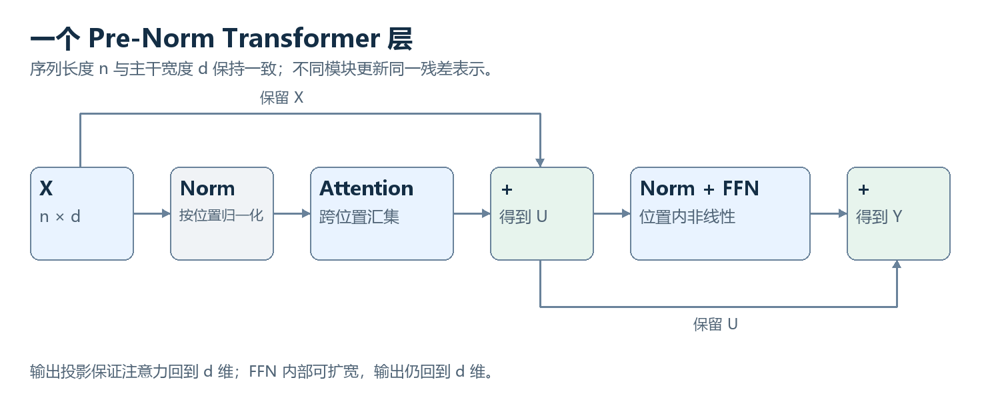

# 18　一层 Transformer 怎样把信息继续处理下去

<!-- v3:nav:start -->
[← 17 把注意力完整算一遍](17.md)　｜　[全书目录](../../README.md)　｜　[19 Encoder、Decoder 与信息访问方式 →](19.md)
<!-- v3:nav:end -->

<!-- v3:toc:start -->

本章目录

- [残差相加的是哪两个对象](#section-01)
- [LayerNorm 在一个位置里比较哪些坐标](#section-02)
- [前馈网络为什么在每个位置单独工作](#section-03)
- [门控前馈怎样让两条表示相乘](#section-04)
- [为什么还要重复很多层](#section-05)
- [一次前向计算怎样走到词表](#section-06)
- [掩码在训练与生成之间保持什么一致](#section-07)
- [结构图怎样帮助我们检查理解](#section-08)
- [先看一层的真实连接](#section-09)
- [残差为什么写成“输入加更新”](#section-10)
- [LayerNorm 在哪个范围内归一化](#section-11)
- [为什么注意力后面还有 FFN](#section-12)
- [门控前馈网络多出了一条什么路径](#section-13)
- [多层为什么不只是反复做同一件事](#section-14)
- [进一步深入：一层里参数主要花在哪里](#section-15)
- [为什么主干宽度经常保持不变](#section-16)
- [一次前向计算没有在层间生成自然语言草稿](#section-17)
- [最后如何变成下一个 token 的分布](#section-18)

<!-- v3:toc:end -->
注意力已经把其他位置的信息汇到当前位置。但一层 Transformer 并不只有注意力。汇来的信息怎样和原表示结合，怎样继续变换，怎样进入下一层，决定了完整计算结构。我们用一个位置的教学向量跟踪这几件事。示例数值帮助理解连接，不对应某个真实语言模型；归一化、残差和前馈的具体顺序，也要按采用的架构说明。

## 残差相加的是哪两个对象

设当前位置主干表示为 [2,4]，注意力分支返回的更新为 [0.5,-1]。两者相加，得到 [2.5,3]。原表示没有被直接丢掉，分支也没有独立生成一句回答。加法要求维度对应。若多个注意力头拼起来宽度不同，需要输出投影回到主干宽度，再与主干相加。这是多头输出投影的一个结构作用。

下一分支读取更新后的表示继续处理。残差提供信息和梯度的直接通路，但不是说网络永远只作小修改；分支输出可以大也可以小，取决于参数和输入。**一层内部传递的是隐藏数值表示。** 它不会在注意力之后先写一句中文草稿，再把草稿交给前馈层重新读。

## LayerNorm 在一个位置里比较哪些坐标

对向量 [2,4]，均值是 3，方差是 1。暂忽略数值稳定项与可学习缩放偏移，减均值并除标准差，得到 [-1,1]。这项计算是在当前向量的特征坐标里进行，不是把整批句子的所有 token 一起取平均。真实使用还要加小的稳定项，避免方差很小时分母出现问题。

归一化之后通常有可训练缩放和偏移，因此输出不被永久限制在一套固定尺度。它也不是把两个不同输入都转成相同向量，只是依据对应统计调整。放在分支之前的 Pre-Norm，与放在残差之后的 Post-Norm，前后依赖不同。教材中的流程图要标明采用哪一种，不能给出一条线再把所有模型都套进去。

## 前馈网络为什么在每个位置单独工作

注意力负责位置之间的交互。常见前馈子层则在每个位置上用同一套矩阵进行非线性变换：先把主干向量映射到较宽空间，经激活后再投回主干宽度。假设主干宽度为二，中间宽度为三。一个位置从两个坐标得到三个中间组合，再经非线性处理，最后生成两个更新坐标。其他位置执行同样形式，但输入不同，结果也不同。

这种处理能够重新组合当前位置已经汇集的特征，增加非线性表达。它与注意力不是重复功能，也不只是“让模型有思考能力”的抽象黑盒。中间宽度通常增加参数和计算。保持主干宽度则方便残差和层间接口稳定。规模很大时，前馈参数可能占据重要部分，这与后面 MoE 把某些前馈改成专家结构有关。

## 门控前馈怎样让两条表示相乘

某些现代结构用两条投影路径：一条形成内容，一条经激活形成门，两者逐坐标相乘，再投影返回。SiLU、SwiGLU 等名称涉及具体激活和门控方式。门来自实际参数计算，不是模型先判断某段文字重要才手工开关。乘法让一路表示控制另一路的通过程度，提供不同的非线性组织。

门控也改变参数和中间计算，比较模型时要把宽度安排一起看。不能只按“多一道门”就认定表达和成本完全相同。

## 为什么还要重复很多层

第一层可以利用原输入的关系，第二层读取已经经过交互和变换的表示，再建立新的关系。深层计算因此不是机械地把相同向量做同一件事很多次。各层通常有自己的参数。层数增加提供更多连续计算深度，也增加训练和运行代价。主干宽度相同不意味着参数共享，更不意味着每层形成同样表示。

由于每层读取已有上下文表示，一个位置能够逐步整合多种关系。但“第几层一定负责哪种知识”不能凭结构决定，需要实际证据。层级含义与训练、输入和分析口径有关。

## 一次前向计算怎样走到词表

在语言生成配置中，最后的隐藏表示经过输出映射，为词表每项产生一个分数。分数再通过 Softmax 形成下一个 token 的预测分布。输出词表维度与主干宽度不是同一个数。假如隐藏宽度为 d、词表有 V 项，输出映射需要连接这两种空间。某些模型与输入嵌入共享权重，也有不共享的安排。

生成时从分布中选出 token，加入序列，再继续下一步。训练时已知正确后续 token，比较分布与标签，损失通过输出映射、各层分支和嵌入回传。于是我们终于能把单层、深层与最终目标连起来。哪条中间通路有利于预测，会通过共同目标影响参数，不需要给每个头手工规定任务。

## 掩码在训练与生成之间保持什么一致

因果模型训练时可以同时取得多个位置的表示，但每个查询只能看对应前缀。并行计算多个预测，不等于每个预测都看到未来。生成时未来 token 尚未产生，缓存复用以前位置的键和值，当前新位置仍执行同样类型的层计算。它省略重复计算，不改变“本次输出由哪个前缀条件决定”的基本关系。

若修改前缀，相关缓存可能不再适用。不同位置编码、窗口和系统安排会影响复用条件，不能把缓存看成可随意拼接的独立文字记忆。

## 结构图怎样帮助我们检查理解

看到一张 Transformer 图，先找主干宽度、分支输入、残差加法和归一化位置，再找哪些操作在位置之间交互，哪些只处理特征。最后确认训练目标与输出在哪。这样可以把许多名称放回同一套数据流。后面的架构章将改变访问方式与输入输出组织；它们仍然使用我们刚才接好的部件，不会突然从一个模型跳到完全无关的故事。

## 先看一层的真实连接

现代语言模型常见一种 Pre-Norm 结构：

$$
U=X+\operatorname{Attention}(\operatorname{Norm}(X)),
$$

$$
Y=U+\operatorname{FFN}(\operatorname{Norm}(U)).
$$

这里 Attention 包含 Q/K/V 投影、多头操作和输出投影；Norm 表示归一化；FFN 是逐位置前馈网络。两次加法要求形状一致，因此注意力和 FFN 输出通常都回到 $n\times d$。顺序需要看清：从 X 计算归一化副本，交给注意力产生更新量，再把更新量加回 X，得到 U；随后在 U 上重复类似流程，但使用 FFN。归一化分支参与计算，残差主路径保留未经该次归一化直接替换的表示。

早期 Transformer 常用 Post-Norm，即残差相加后再归一化。它并非同一个公式随意换个位置，梯度路径与数值行为会改变。这里以现代常见 Pre-Norm 为主线，具体模型仍可能采用其他排序。

## 残差为什么写成“输入加更新”

如果每层都强制用全新结果替换输入，网络必须在进行新加工时重新保存仍有用的信息。残差让层学习增量 $F(X)$，输出为 $X+F(X)$。当某种变换暂时没有用时，增量可以较小，让已有表示保留下来。对于训练，加法提供更直接的梯度传播路径，减少所有信号必须穿过每个复杂变换的限制。它不能保证梯度永远稳定，也不表示每层必然只作小改动，但为深层优化提供了更有利的结构。

“保留输入”也不等于每层都有原文的无损档案。相加以后，信息在同一向量空间里混合。后续是否能恢复细节，取决于表示和计算。贯穿各层的这些向量常被叫作残差流，许多模块向它写入更新，也从中读取信息。

## LayerNorm 在哪个范围内归一化

对于单个位置的向量 $x$，LayerNorm 常写成：

$$
\operatorname{LN}(x)=\gamma\odot\frac{x-\mu}{\sqrt{\sigma^2+\epsilon}}+\beta.
$$

$\mu$ 是这个向量各坐标的平均值，$\sigma^2$ 是各坐标相对平均值的平方偏差的平均，$\epsilon$ 防止分母过小。$\gamma$ 和 $\beta$ 是可学习的缩放和偏移向量。这通常对每个位置独立进行，不是把整句话的全部 token 混在一起算一个均值。

某个位置数值尺度扩大时，归一化可减轻这种变化对后续映射的影响，再由可学习参数恢复需要的尺度自由度。它不直接使向量“语义正确”，也不把每个坐标限制在零和一之间。

RMSNorm 使用均方根进行缩放，典型形式为：

$$
\operatorname{RMSNorm}(x)=\gamma\odot
\frac{x}{\sqrt{\frac1d\sum_{r=1}^{d}x_r^2+\epsilon}}.
$$

它通常不减均值，也没有同样的偏移项，结构更简化。看到“归一化”时，要继续问对象是什么、沿哪个维度计算、有没有可训练参数。LayerNorm 与 RMSNorm 的具体处理不同，不能用同一个含糊的“让数据变标准”概括。

## 为什么注意力后面还有 FFN

注意力主要负责跨位置的信息交互，FFN 负责位置内部的非线性特征变换。经典形式是：

$$
\operatorname{FFN}(x)=\phi(xW_1+b_1)W_2+b_2.
$$

若输入宽度为 $d$，第一矩阵把它映到更宽的 $d_{\mathrm{ff}}$，在中间使用非线性，再由第二矩阵映回 $d$。扩大中间宽度为特征组合提供空间，恢复原宽度便于残差相加和下一层连接。FFN 不直接让位置之间通信，所以称为逐位置前馈网络。每个位置使用同一组参数，但注意力已经整合了上下文，不同位置的输入不同，输出也不同。“逐位置”并不表示它只知道孤立词义。

为什么不让注意力一并完成？可以设计不同网络，但固定形式的加权汇总与位置内非线性变换具有不同表达特点。这种交替形成了有效的可训练组合。不要把“注意力理解关系，FFN 储存知识”当作严格分区；功能和知识可以分布在多个模块里。

## 门控前馈网络多出了一条什么路径

现代模型常使用 SwiGLU 一类门控 FFN，简化形式为：

$$
\operatorname{FFN}(x)
=\left[\operatorname{SiLU}(xW_g)\odot(xW_u)\right]W_d.
$$

$W_g$ 产生门控信号，$W_u$ 产生待调制内容，两者逐坐标相乘，再通过 $W_d$ 映回模型宽度。SiLU 是 $z\,\operatorname{sigmoid}(z)$，提供平滑非线性。这里的门控值并不都在零和一之间，不能照搬 LSTM 门的数值解释。

输入不仅产生特征，还调制各特征怎样通过。与普通两矩阵 FFN 相比，参数布局发生变化，所以比较规模不能只看中间宽度倍数。门控的共同思想是用内容相关的乘法控制信息流，但每个架构中的具体取值和作用位置需要分别理解。

## 多层为什么不只是反复做同一件事

第二层处理的是第一层输出，不再是原始词嵌入。它可以依据上一层整合的关系重新匹配和汇总，FFN 也在新表示上构造新特征。因此，后续计算建立在更复杂的条件上。

不同层通常拥有不同参数，并非几十次重复同一个固定函数。有些研究结构共享层参数或循环使用模块，那是特定设计。也不能保证第几层一定负责某个语言学阶段，层功能往往重叠、分布，并依赖具体输入。

深度的意义在于组合：先得到某些中间结果，再以它们为条件做进一步计算。比如第一层可以汇集附近的实体信息，后续层再根据更完整的表示处理指代。这里描述的是一种可能的功能组织，并不是预先写进每层的固定程序。

## 进一步深入：一层里参数主要花在哪里

取模型宽度 d，标准多头注意力在总查询、键、值宽度都等于 d 时，四个主要矩阵 $W_Q,W_K,W_V,W_O$ 大约包含 $4d^2$ 个参数，暂不计偏置与归一化。普通FFN若中间宽度为4d，两次投影约有 $8d^2$ 个参数。因此FFN往往占一层相当大的参数与计算比例。大量介绍只讲注意力，会让人误以为网络成本几乎都来自QK乘法。长序列时位置交互成本突出，较短序列时投影和FFN也非常重要。具体模型采用GQA、门控FFN或MoE后，计数又会改变。

以d=1024为例，单个1024×1024矩阵约有一百万个参数。多个矩阵、很多层以及词表嵌入叠加，才构成较大规模。一个向量维度1024，不意味着整个模型只有1024个“神经元”，更不能由这个数字直接推算参数量。

## 为什么主干宽度经常保持不变

若每层都改变序列位置数与宽度，残差路径和模块替换会复杂许多。保持 $n\times d$ 的接口，让每个模块专注更新表示，内部可以扩宽、分头或选择专家，输出再回到统一尺寸。

这种规则化接口也适合硬件批处理。然而保持尺寸并非数学必需，一些架构会下采样、压缩token或调整宽度。视觉层级网络尤其常这样做，因为空间分辨率逐渐变化有助于多尺度表示。语言主干常保持位置，是为了持续为每个token形成对应状态和预测。

## 一次前向计算没有在层间生成自然语言草稿

隐藏向量在层间传递，但一般不会先变成一个词，再重新编码为下层输入。直到输出头，才给词表分数。中间层可以用探针或共享输出头观察某些预测趋势，但这属于分析手段，不能自动当作模型正常执行时的离散思考记录。

同理，残差流经过多个模块，也不表示每个模块各自写一句结论。真实运算在连续空间中展开。把它们翻译为“第一层看词、第二层理解语法、第三层推理”，只是过于整齐的教学故事，往往会掩盖实际分布式计算。

## 最后如何变成下一个 token 的分布

经过多层后，最后位置有隐藏向量 $h\in\mathbb R^d$。输出投影映射到词表大小：

$$
z=hW_{\mathrm{out}}+b,\qquad p=\operatorname{softmax}(z).
$$

这次 Softmax 在词表维度上计算；注意力里的 Softmax 在可读取的位置维度上计算。相同数学函数在回答两个不同问题：一处决定怎样汇总信息，另一处预测下一 token。

某些模型将输出权重与输入嵌入矩阵绑定，使用嵌入矩阵的转置作为输出映射。这能节省参数并联系两端表示，但不是所有模型都采用。输出层不是将隐藏向量无损解码成“它原来对应的那个词”，而是为全部候选 token 计算分数。

完整路径现在是：输入表示进入一系列跨位置交互与位置内变换，残差和归一化支持这些运算叠加，最终输出层给出预测分布。下一章需要区分不同访问规则，因为不是所有 Transformer 都使用因果生成结构。

<!-- v3:footer:start -->
---

[← 17 把注意力完整算一遍](17.md)　｜　[全书目录](../../README.md)　｜　[19 Encoder、Decoder 与信息访问方式 →](19.md)

[方法与案例来源](../../sources/README.md)
<!-- v3:footer:end -->
