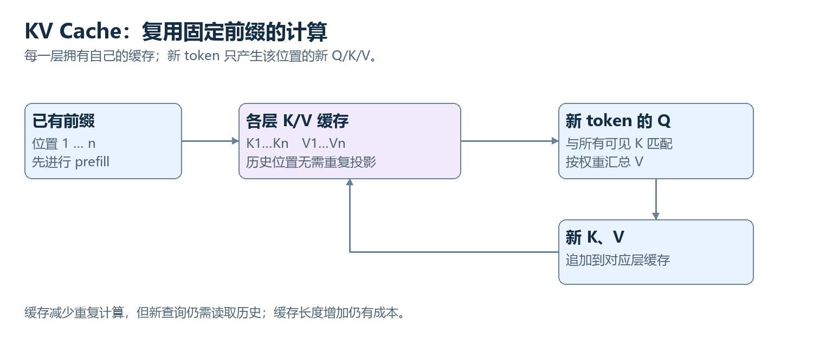

# 24　一句话怎样逐个 token 生成出来

<!-- v3:nav:start -->
[← 23 从续写到助手：示范、偏好与奖励](23.md)　｜　[全书目录](../../README.md)　｜　[25 推理模型把更多计算花在哪里 →](25.md)
<!-- v3:nav:end -->

<!-- v3:toc:start -->
<details>
<summary>本章目录</summary>

- [1. 两个截然不同的物理阶段：预填充（Prefill）与自回归解码（Decode）](#section-01)
- [2. 贪心搜索 vs 随机采样：从概率分布中捞出一个词](#section-02)
- [3. 温度系数（Temperature）：手算平滑与尖锐的概率变形（0.783 vs 0.473）](#section-03)
- [4. 截断护栏：Top-k 与 Top-p（核采样）的动态筛选](#section-04)
- [5. 推理显存的无底洞：KV Cache 到底存了什么](#section-05)
- [6. KV 压缩救星：MHA、MQA 与 GQA（分组查询注意力）](#section-06)
- [7. 颠覆串行瓶颈：投机解码（Speculative Decoding）的极速奇迹](#section-07)

</details>
<!-- v3:toc:end -->
在训练定型并完成对齐后，大模型终于迎来了面对真实用户的这一刻。
当你在 ChatGPT、Claude 或网页端输入一个复杂问题并点击发送后，屏幕上的光标开始闪烁，随后一行行文字如同打字机一般平滑、飞快地向外流淌。

许多人以为大模型是“思考完毕后，把整篇写好的文章打包发给浏览器”。
**完全不是！在现代自回归 Transformer 的底层，模型是极其严格地“一次只吐一个 Token，吐出一个词后再把这个词塞回输入端，重新跑一遍全网计算去预测下一个词”！**

为什么在网页上能看到流式打字效果？解码参数里的 Temperature、Top-p、Top-k 到底是如何控制模型“严谨”还是“富有创造力”的？为什么模型生成很长的文章时服务器显存会吃紧？

这一章我们就掀开大模型推理引擎的盖子，手算概率分布的变形，看懂现代大模型推理服务背后的全部硬核机制。

---

<a id="section-01"></a>
## 1. 两个截然不同的物理阶段：预填充（Prefill）与自回归解码（Decode）

在 GPU 服务器内部，一次用户的对话请求被严格切分成两个物理特性完全不同的阶段：



1. **预填充阶段（Prefill / Prompt Processing）**：
   - **输入**：用户发送的一整篇提示词（包含系统设定、历史对话、参考文档，可能有几千个 Token）；
   - **计算特征**：整篇文档的所有 Token 是已知且同时存在的！GPU 可以在一个时钟周期内利用强大的并行矩阵乘法，把这几千个词的 Q、K、V 一次性全部算完；
   - **硬件瓶颈**：**算力受限（Compute-bound）**。GPU 的流处理器（CUDA 核心/Tensor 核心）火力全开，利用率极高，决定了用户的“首字等待时间（TTFT, Time to First Token）”。
2. **解码阶段（Decode / Token Generation）**：
   - **输入**：每一步仅仅输入刚刚产生的“前一个 Token”；
   - **计算特征**：串行步进。前一个词没出来，后一个词根本无法计算！每生成一个 Token，GPU 就必须把模型几十 GB 的权重矩阵完整从高带宽显存（HBM）搬运到片上缓存读一遍；
   - **硬件瓶颈**：**显存带宽受限（Memory-bandwidth bound）**。GPU 核心大部分时间都在无聊地等待显存把参数搬过来，决定了后续每个字蹦出来的流畅度（TPOT, Time Per Output Token）。

---

<a id="section-02"></a>
## 2. 贪心搜索 vs 随机采样：从概率分布中捞出一个词

在解码阶段的每一个微秒，输出层都会为全词表的候选 Token 吐出一组概率分布。
我们怎么从这组概率中决定最终打在屏幕上的那个词？

- **贪心搜索（Greedy Search）**：
  永远挑选概率最大的那一个候选词。
  - **优点**：极度确定、可复现，适合严密的数学计算与代码生成；
  - **致命弱点**：极其容易陷入“局部最优死循环”——一旦某个短语高频出现，贪心算法会一次次选择同一个句式，导致模型陷入神经质的重复车轱辘话。
- **随机采样（Random Sampling）**：
  把这组概率分布当成一个轮盘赌，概率越大的扇区面积越大，掷骰子随机决定落点。这赋予了模型丰富的文采与多样性，但如果直接全词表采样，可能会偶尔摇出一个概率极其微弱的荒谬生僻字。

为了在“死板复读”与“胡言乱语”之间找到黄金平衡，我们需要两把精密的控制手术刀：**温度（Temperature）** 与 **截断（Top-k / Top-p）**。

---

<a id="section-03"></a>
## 3. 温度系数（Temperature）：手算平滑与尖锐的概率变形（0.783 vs 0.473）

**温度（Temperature, 记为 $T$）** 是大模型 API 中最常用的调节旋钮。它的数学本质是：**在 Softmax 之前，把所有的未归一化打分（Logits）除以 $T$**：
$$p_i = \frac{e^{\text{Logit}_i / T}}{\sum_j e^{\text{Logit}_j / T}}$$

为了直观体会温度是如何改变命运的，我们用一组具体的教学数据来手算一次：

假设当前有 3 个候选词，它们原本的基础概率分别为：
- 候选 1（词 A）：$p_1 = \mathbf{0.6}$（领先优势明显）
- 候选 2（词 B）：$p_2 = \mathbf{0.3}$
- 候选 3（词 C）：$p_3 = \mathbf{0.1}$

在数学上，给 Logits 除以 $T$，等价于对原概率做 $\frac{1}{T}$ 次方后再重新归一化！

### 实验 A：降低温度（严谨模式，$T = 0.5$）
当 $T = 0.5$ 时，指数为 $\frac{1}{0.5} = 2$，即对每个概率做**平方**！
- 词 A：$0.6^2 = \mathbf{0.36}$
- 词 B：$0.3^2 = \mathbf{0.09}$
- 词 C：$0.1^2 = \mathbf{0.01}$
- 平方总和：$0.36 + 0.09 + 0.01 = \mathbf{0.46}$

重新归一化：
- $p_1^{\text{new}} = \frac{0.36}{0.46} \approx \mathbf{0.783}$
- $p_2^{\text{new}} = \frac{0.09}{0.46} \approx \mathbf{0.196}$
- $p_3^{\text{new}} = \frac{0.01}{0.46} \approx \mathbf{0.022}$

新的概率分布变成了：**$[0.783, 0.196, 0.022]$**！
看！原本优势就不小的词 A，概率从 60% 暴涨到了 **78.3%**；而弱小词 C 的概率被暴压到微不足道的 **2.2%**！分布变得极其陡峭尖锐，模型展现出极高确定性与专注度。

### 实验 B：升高温度（发散模式，$T = 2.0$）
当 $T = 2.0$ 时，指数为 $\frac{1}{2.0} = 0.5$，即对每个概率开**平方根**！
- 词 A：$\sqrt{0.6} \approx \mathbf{0.7746}$
- 词 B：$\sqrt{0.3} \approx \mathbf{0.5477}$
- 词 C：$\sqrt{0.1} \approx \mathbf{0.3162}$
- 开方总和：$0.7746 + 0.5477 + 0.3162 = \mathbf{1.6385}$

重新归一化：
- $p_1^{\text{new}} = \frac{0.7746}{1.6385} \approx \mathbf{0.473}$
- $p_2^{\text{new}} = \frac{0.5477}{1.6385} \approx \mathbf{0.334}$
- $p_3^{\text{new}} = \frac{0.3162}{1.6385} \approx \mathbf{0.193}$

新的概率分布变成了：**$[0.473, 0.334, 0.193]$**！
原本被压制的词 C 概率从 10% 猛增到了近 **20%**，原本领跑的词 A 跌到了不到 50%。所有选项的差距被大幅抹平，整个轮盘赌变得百花齐放，模型表现出极强的发散性、意外感与拟人化想象力。

---

<a id="section-04"></a>
## 4. 截断护栏：Top-k 与 Top-p（核采样）的动态筛选

温度改变了概率分布的胖瘦，但为了彻底杜绝小概率胡言乱语的风险，我们还需要加上**截断护栏**：

| 采样策略 | 运作机制 | 核心优势 | 局限与适用场景 |
| :--- | :--- | :--- | :--- |
| **Top-k 采样** | 简单粗暴：只保留概率最高的**前 $k$ 个词**（例如 $k=50$），其余词全部从词表中一脚踢开（概率归零） | 计算极其简单，彻底封死生僻长尾词的作死风险 | 死板固定：当模型极度自信时（只有一个词概率 99%），它依然会强留 49 个干扰项；当模型极度迷茫时，前 50 个词可能根本覆盖不全有效语义 |
| **Top-p 采样（核采样）** | **动态自适应**：将所有词按概率从大到小排队累加，刚好累加达到阈值 $p$（例如 $p=0.9$）的这批词被留下，其余剔除 | **现代大模型标配**：自信时自动收缩为 1~2 个候选，犹豫时自动扩大到数百个候选，弹性极佳 | 对排序开销稍大，但绝大部分现代推理引擎都原生优化 |

---

<a id="section-05"></a>
## 5. 推理显存的无底洞：KV Cache 到底存了什么

如果说算力决定了生成文字的速度，那么 **KV Cache（键值缓存）** 则决定了你的服务器会不会瞬间被撑爆。

在自回归解码中，为了预测第 1001 个词，模型需要用到前 1000 个词的信息。
如果不用缓存，每吐一个词，你就必须把前 1000 个词从第 1 层到第 32 层重新完整跑一遍前向传播！
但仔细回想第 17 章的注意力公式：
- 在第 1001 步，唯一的查询是当前新词的 $q_{1001}$；
- 它只需要去和历史上那 1000 个词的 $k_1, \ldots, k_{1000}$ 做点积，并加权 $v_1, \ldots, v_{1000}$；
- **历史那些词的 Key 和 Value 在此前的计算中早就已经算过了，而且绝对不会随着新词的到来而发生任何改变！**

因此，工程上最自然的优化就是：**把过去所有词在每一层的 Key 向量和 Value 向量，完整保留在显存中！每产生一个新词，只算当前词的 $q, k, v$，把新的 $k, v$ 像排队一样追加进显存缓存即可！**

### 算一算 KV Cache 的显存胃口

KV Cache 占用的显存字节数公式为：
$$\text{KV Cache 显存} = 2 \times B \times L \times n \times h_{\text{kv}} \times d_{\text{head}} \times \text{bytes}$$
其中：
- $2$ 代表同时存 Key 和 Value 两个矩阵；
- $B$：并发批次大小（Batch Size）；
- $L$：网络层数（Layers）；
- $n$：当前上下文的序列长度（Sequence Length）；
- $h_{\text{kv}}$：Key/Value 的注意力头数；
- $d_{\text{head}}$：每个头的特征维度；
- $\text{bytes}$：数据精度字节数（FP16/BF16 为 2 字节）。

以一个经典的 70B 模型为例（$L = 80$ 层，$n = 8192$ 长度，使用多头注意力 $h_{\text{kv}} = 64$ 个头，$d_{\text{head}} = 128$，FP16 存储）：
$$\text{单个并发序列的 KV} = 2 \times 1 \times 80 \times 8192 \times 64 \times 128 \times 2 = \mathbf{21,474,836,480\text{ 字节}} \approx \mathbf{20\text{ GB}}！$$

仅仅服务**一个用户的一轮 8k 长对话**，单单存放 KV Cache 就需要吃掉整整 **20 GB 显存**！如果并发同时涌入 100 个用户，仅缓存就需要 2000 GB 显存，没有任何机房能够承受这种开销。

---

<a id="section-06"></a>
## 6. KV 压缩救星：MHA、MQA 与 GQA（分组查询注意力）

为了扑灭 KV Cache 引发的显存海啸，网络架构经历了一场漂亮的显存瘦身战：

```
[MHA 多头注意力]          [MQA 多查询注意力]          [GQA 分组查询注意力]
Q头: 8  KV头: 8          Q头: 8  KV头: 1           Q头: 8  KV头: 2
Q1 Q2 Q3 Q4 Q5 Q6 Q7 Q8  Q1 Q2 Q3 Q4 Q5 Q6 Q7 Q8   Q1 Q2 Q3 Q4 Q5 Q6 Q7 Q8
 │  │  │  │  │  │  │  │   \  \  \  │  /  /  /  /    \  /  \  /   \  /  \  /
K1 K2 K3 K4 K5 K6 K7 K8          [唯一 KV]            [KV 1]       [KV 2]
 (显存开销 100%)              (显存仅 12.5%, 易掉点)      (折中平衡: 现代主流标配)
```

1. **MHA（Multi-Head Attention）**：传统的每个 Query 头配一个专属的 Key/Value 头。显存开销最大。
2. **MQA（Multi-Query Attention）**：极端方案，所有 Query 头共享同一套全局唯一的 Key/Value。显存暴降至 $\frac{1}{h}$，但极易造成复杂语义掉点。
3. **GQA（Grouped-Query Attention）**：
   **现代大模型（LLaMA 2/3、Mistral、DeepSeek）的绝对标配！**
   把 32 个 Query 头分成 8 组，每组 4 个 Query 头共享同一套 Key/Value。既将 KV Cache 显存暴降了 **75%**，又几乎毫发无损地保留了多头注意力的强大表达能力！

配合加州大学伯克利分校提出的 **vLLM（PagedAttention）** 技术——借鉴操作系统的虚拟内存分页机制，彻底消灭了 KV Cache 显存碎片，让大模型线上服务的并发吞吐量直接原地暴涨 3~5 倍！

---

<a id="section-07"></a>
## 7. 颠覆串行瓶颈：投机解码（Speculative Decoding）的极速奇迹

尽管有了 KV Cache，自回归模型每生成一个词依然要经历一次串行计算。有没有可能让大模型一次吐出一整句话？

2023 年横空出世的 **投机解码（Speculative Decoding）** 彻底打破了这个僵局：

它的构想绝妙无比：**让一个小弟（草稿小模型）先以极快速度狂奔草拟几个词，然后让大哥（千亿大模型）一瞬间批量并行审核！**

```
[步骤一: 极速草拟]
一个极其轻巧的小模型 (如 1B 参数) 在几毫秒内飞快吐出 5 个候选词:
草稿序列: "今天" -> "天气" -> "非常" -> "晴朗" -> "适合"

[步骤二: 大哥一锤定音]
大模型 (如 70B 参数) 利用预填充阶段的矩阵并行能力，在一个时钟周期内同时对这 5 个词进行打分验证！
如果大模型判定前 4 个词完全正确，只有第 5 个词想改成"不错":
则瞬间接受前 4 个词，并直接输出修改后的第 5 个词！
```

原本大模型需要串行跑 5 次的时间，现在**只用跑 1 次验证，就一口气收获了 4 到 5 个合格的 Token！**
更不可思议的是，数学上可以严格证明：**投机解码输出的最终概率分布，与大模型独自一个字一个字慢慢生成的结果完全严格等价，精度没有丝毫损耗！** 这一工程创举让大语言模型的生成速度直接飙升了 2 到 3 倍。

---

现在，我们已经把大模型从文字输入、概率采样、KV 显存管理直到高速输出的完整管道彻底打通。
但细心的读者一定会追问：在面对前沿复杂的奥数竞赛、复杂架构代码编写时，常规的自回归往往显得“有口无心”——它急于吐出第一个字，缺乏像人类一样在动笔之前“深思熟虑、草稿推演”的能力。

2024 年以 **OpenAI o1** 和 **DeepSeek-R1** 为代表的“推理模型（Reasoning Models）”，究竟通过怎样的全新范式把大量计算搬到了思考时间（Test-Time Compute）？
下一章，我们就推开大模型思维链与慢思考的最前沿大门！

<!-- v3:footer:start -->
---

[← 23 从续写到助手：示范、偏好与奖励](23.md)　｜　[全书目录](../../README.md)　｜　[25 推理模型把更多计算花在哪里 →](25.md)

[方法与案例来源](../../sources/README.md)
<!-- v3:footer:end -->
