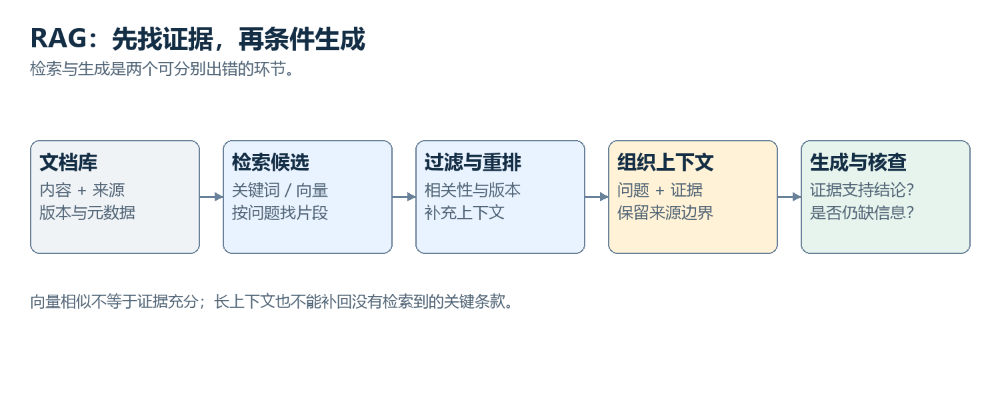

# 30　RAG 从文档走到回答，中间有哪些步骤

<!-- v3:nav:start -->
[← 29 上下文为什么会变长，又为什么不等于记忆](29.md)　｜　[全书目录](../../README.md)　｜　[31 一张图片有哪些可计算的结构 →](../04-multimodal/31.md)
<!-- v3:nav:end -->

<!-- v3:toc:start -->

本章目录

- [在问题到来之前，资料已经要被组织](#section-01)
- [查询怎样取得候选](#section-02)
- [元数据为什么是依据的一部分](#section-03)
- [检索内容怎样成为模型输入](#section-04)
- [一个条件被遗漏，错误怎样发生](#section-05)
- [多跳检索如何取得缺少的关系](#section-06)
- [没有依据时，系统应该怎样表达](#section-07)
- [RAG 与微调怎样选择](#section-08)
- [评估要沿管线定位错误](#section-09)
- [将语言模型放回系统的位置](#section-10)
- [检索为什么能节省上下文](#section-11)
- [关键词检索与向量检索各擅长什么](#section-12)
- [文档切块不是无关紧要的预处理](#section-13)
- [引用了来源，为什么仍然可能说错](#section-14)
- [进一步深入：一次故障码检索怎样出错](#section-15)
- [多跳检索怎样逐步构造问题](#section-16)

<!-- v3:toc:end -->
维护人员问：“A 型设备在固件 3 下出现 E17，应该先检查哪里？”模型训练过很多文本，却未必包含这份最新手册。团队给它连接文档库，希望回答依据当前资料。这个虚构场景让我们看 RAG，也就是检索增强生成。它不是把整个数据库装进权重，也不是给模型一条“请认真检索”的提示就完成连接，而是一条实际数据管线。

## 在问题到来之前，资料已经要被组织

系统取得手册，提取文本与表格，保留标题、页码、型号、版本和来源，再切成可检索片段。若图片中的关键标注没有提取，索引里就可能根本没有那份信息。切块时要保留条件和结论的关系。例如“仅适用于固件 2”不能被切到另一块，使后面的处理方法看起来通用。重叠可以缓解边界，但也增加重复。

向量索引需要编码片段，关键词索引保存词与文档关系。更新资料以后，还要更新对应索引、删除旧版本或设置有效范围。文件上传成功不代表检索已正确使用新内容。

## 查询怎样取得候选

用户问题包含型号、固件和故障码。系统可以用精确字段筛选，再以关键词和向量召回候选。故障码适合精确匹配，解释性描述可能需要语义召回。假设召回三段：A 型固件 2 的 E17，A 型固件 3 的 E17，B 型固件 3 的类似现象。它们字面相近，适用条件不同。

重排模型可以把问题与片段一起阅读，结合字段判断更合适的来源。若正确片段没有召回，重排无法自行创造它，系统需要扩大搜索或明确缺少资料。

## 元数据为什么是依据的一部分

标题和版本不是装饰。A 型固件 2 的处理方式可能已经改变，不能因为文字清楚就用于固件 3。系统应当让适用字段随正文片段一起进入上下文，还要保留可追溯来源。只把几句正文摘出，会丢掉判断条件。来源可信度也需要考虑。用户论坛可以提供线索，官方手册可以提供规定，维修记录又包含现场经验。它们并非永远同一等级，也不能无条件假定某来源完全无误。

## 检索内容怎样成为模型输入

选中片段被组织进提示或相应上下文。模型随后依然执行同样的分词、隐藏表示和生成过程，依据加入的文本预测回答。系统可以要求区分材料明确说明与模型推测，并限制回答只能使用已取得依据。要求有帮助，但模型仍可能遗漏、误读或把无关片段组合起来。

**检索提供材料，生成负责整合，两者都可能出错。** 外部连接没有取消模型的训练目标与生成机制。

## 一个条件被遗漏，错误怎样发生

假设正确手册写着：“若 E17 持续且转速记录有效，先检查转速传感器连接；若记录无效，完成读数确认后再判断。”模型回答只留下“先检查风扇机械结构”。它可能被旧版本段落影响，也可能按常见故障解释补出一个看似合理步骤。引用正确手册标题，并不能修复正文与依据不匹配。

检查需要把回答中的关键主张逐一对照片段：条件有没有保留，动作是否真的写在来源里，未知情况是否被补成事实。单纯检查“有没有引用”不足以完成验证。

## 多跳检索如何取得缺少的关系

问题可能先需要解释故障码，再需要查询部件编号，最后取得检查规范。一次检索未必得到全部材料，系统可以根据已有结果构造下一查询。每次要区分文档事实和生成假设。若模型第一步误解编号，后续可能沿错误关系查到很丰富却无关的资料。

多跳过程应保留取得了什么、为什么继续查、哪些条件还未知。完成度由证据链决定，不由调用次数决定。

## 没有依据时，系统应该怎样表达

若库里没有固件 3 的资料，可以说明现有材料仅覆盖固件 2，提出需要新版本手册，或者在明确条件下给一般性检查建议。不能把旧资料悄悄改成新资料。这项行为需要目标、提示、训练与系统设计共同支持。模型若被要求必须给确定回答，可能更容易编补缺口。

拒绝没有依据的结论与完全不帮助用户也不同。系统可以整理已知条件、指出缺什么、提供可验证下一步，让任务继续推进。

## RAG 与微调怎样选择

频繁更新的事实、可追溯文档和大资料库，适合通过检索按需输入。稳定的格式、任务行为和领域表达，可以考虑微调。微调不保证精确保存每个文档，也不容易提供出处索引；RAG 不自动教会模型新的复杂技能。两者可以组合，例如适配模型更好使用某类检索材料。

选择还受权限、成本、延迟与维护影响。不能给所有问题一条“RAG 总比微调好”的通用结论。

## 评估要沿管线定位错误

可以分别检查资料提取、切分、召回、重排、上下文组织、生成事实和引用对应。最终任务分数之外，分阶段指标帮助知道该改哪里。如果召回质量差，增加生成模型规模未必解决；如果条件已经取得却被忽略，就要检查上下文和生成过程；如果来源过时，需要更新库和索引。

权限过滤必须在相关访问环节生效，不能先检索到不允许内容，再寄希望于模型不要说出来。更广泛的提示注入与来源隔离，在安全章会继续展开。

## 将语言模型放回系统的位置

RAG 让我们看到，实际助手的能力来自模型、资料、检索、提示和验证等多个环节。模型参数没有因为取得新手册而自动改变，当前回答却可以使用训练后才出现的信息。下面用故障码检索的典型失败再检查切块、引用和多跳关系。语言卷在这里把结构、训练、生成与外部资料接好了。接下来输入换成图片、声音和视频，我们会认真处理它们自己的数据结构。

## 检索为什么能节省上下文

如果知识库有几百万份文档，全部放进一次输入既昂贵又包含大量无关信息。检索先用较低成本缩小候选，再把相关片段交给生成模型。RAG 的核心是这种条件生成流程，而不是一种新的神经网络层。

一个典型系统先将文档切块，为块保存内容、来源和元数据，再构建索引。用户问题到来时，检索候选，必要时重排，将选定片段与问题组合，最后生成回答。更新知识可以发生在文档和索引层，不必立即修改模型权重。

## 关键词检索与向量检索各擅长什么

关键词检索利用词项匹配与统计权重，对精确型号、错误码和少见术语很有效。向量检索用嵌入模型把查询和文档变成向量，根据相似度寻找语义相关内容，能够弥补措辞不同的问题。但相似不等于能回答问题。一个介绍同类设备的片段可能语义接近，却型号不对；包含相反结论的文段可能共享大量表达。混合检索、元数据过滤和重排序用于进一步提高候选质量。

重排模型可以同时读取问题与候选片段，细致判断相关性，比独立向量比较更昂贵，因此常只用于少量候选。这里又出现分层计算：便宜方法覆盖大范围，昂贵方法处理缩小后的集合。

## 文档切块不是无关紧要的预处理

块太短，定义与例外容易分离；块太长，检索精度和上下文利用下降。标题、章节层级、表格、代码和跨段引用都影响意义。重叠窗口可以缓解边界切断，但也增加重复内容。对于“某参数在固件升级后何时有效”这样的提问，答案可能分散在版本说明、配置表与例外条款中。系统需要多步检索或问题分解。简单取相似度最高的几个片段不保证覆盖全部证据。

## 引用了来源，为什么仍然可能说错

RAG 至少存在三类错误：检索没找到正确内容；找到了，但上下文组织丢失限制条件；证据正确，却被模型错误解释或与参数记忆混合。链接存在并不证明链接支持所述结论。因此“证据是否支持答案”需要单独评估。一个可靠系统应能区分没有找到资料与找到了反证，也要处理多个来源互相矛盾和日期不同的情况。检索提高可核查性，但不自动把生成变成逻辑证明。

## 进一步深入：一次故障码检索怎样出错

用户问“固件3.2的E042是否必须立即停机”。关键词检索很可能命中E042，但库里同时有固件2.8的旧手册、新版说明与论坛讨论。语义检索也会找到“过温告警”相关片段，却未必保留版本条件。

系统需要先明确设备型号和版本，再用元数据过滤或重排。若最新说明写着“在传感器自检期间出现不代表实际过温”，只取包含“E042”和“停机”的孤立句子会得出相反结论。块边界与来源优先级在这里直接决定正确性。

生成阶段应把每个结论与证据对应，而不是把所有片段平均成一个听起来合理的答案。若来源冲突，应保留条件和差异；若缺少版本信息，不能把旧手册的确定语气当作新情况的证据。

## 多跳检索怎样逐步构造问题

有时第一次检索只找出故障码属于哪个模块，再根据模块名找到电路说明，最后查特定传感器的异常处理。后一次查询依赖前一次结果，这叫多跳检索的一种形式。

它与一次扩大top-k不同。更多候选会增加噪声，而逐步查询可以利用新信息缩小范围。但每跳都可能引入错误假设，所以应保存来源和查询依据，必要时回溯。检索型Agent也不能因为调用了很多次搜索就自动更可靠。

资料检索把当前证据接进语言回答，完成了卷三的一条系统链。进入卷四，我们让输入不再只有文字：先从图片怎样采样、编码和形成视觉表示开始，再逐步连接定位、生成与其他模态。

<!-- v3:footer:start -->
---

[← 29 上下文为什么会变长，又为什么不等于记忆](29.md)　｜　[全书目录](../../README.md)　｜　[31 一张图片有哪些可计算的结构 →](../04-multimodal/31.md)

[方法与案例来源](../../sources/README.md)
<!-- v3:footer:end -->
