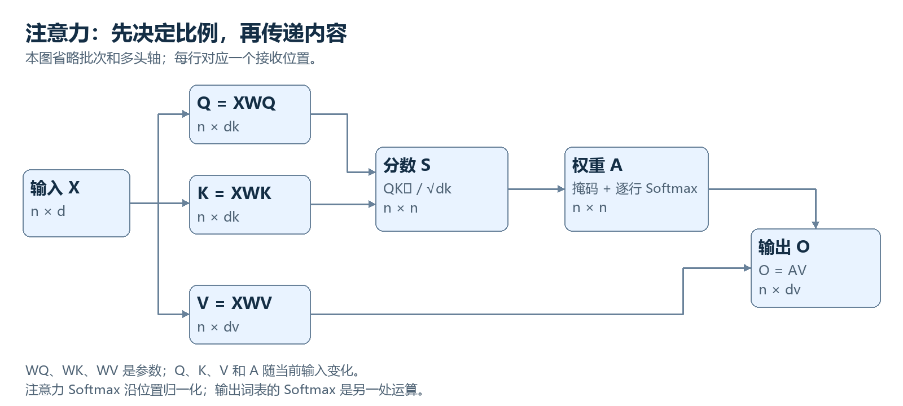

# 07　把注意力完整算一遍：Q、K、V 到底在做什么

<!-- generated:nav:start -->
[← 06　文字怎样进入模型：token、嵌入与位置](06-tokens.md)　｜　[总目录](../README.md)　｜　[08　完整的 Transformer 层：信息汇集以后，还要做什么 →](08-transformer-block.md)
<!-- generated:nav:end -->

<!-- generated:toc:start -->

本章目录

- [先定义“谁接收信息，谁提供信息”](#s01)
- [三种向量如何从同一个输入得到](#s02)
- [为什么不直接让输入与输入做点积](#s03)
- [点积给出什么样的分数](#s04)
- [为什么除以平方根](#s05)
- [掩码决定“允许看哪里”](#s06)
- [Softmax 是按每一行做的](#s07)
- [汇总时为什么乘的是 V](#s08)
- [一个从 X 开始的完整数值例子](#s09)
- [多头不是让多个完整模型投票](#s10)
- [进一步深入：同一组内容为什么可以形成不同关系](#s11)
- [注意力输出怎样收到最终损失的反馈](#s12)
- [注意力与数据库检索相似到哪里为止](#s13)
- [这里训练的究竟是什么](#s14)

<!-- generated:toc:end -->

现在我们有一个形状为 $n\times d$ 的矩阵 $X$：每行对应一个位置，每行有 $d$ 个数字。输入可能刚经过嵌入，也可能已经经过许多层处理。注意力这一层要完成的事情是：让每个位置根据当前内容，从允许访问的位置汇总信息。下面把这件事分成几个计算上真正不同的步骤。

## 先定义“谁接收信息，谁提供信息”

在“传感器／发现／电机／温度／异常”中，处理“异常”对应位置时，模型可能需要结合“温度”和“电机”。但我们不能直接向程序下达“理解语义后找到相关词”的命令，因为语义关联本身正是需要学习的东西。

一种可训练方案是，为接收位置生成一个用于匹配的向量，为每个候选提供位置生成另一个用于匹配的向量，再根据它们的点积产生分数。最后，用分数决定各位置内容的汇总比例。这个方案把抽象需求拆成了可微分操作，训练目标能够影响每一步的参数。

查询 Query 对应接收位置用于匹配的表示；键 Key 对应提供位置用于被匹配的表示；值 Value 对应该位置实际提供的内容表示。“查询、键、值”是功能名称，它们本身仍只是向量，不是自然语言问题、数据库地址与文件内容。

## 三种向量如何从同一个输入得到

在单头自注意力中：

$$
Q=XW_Q,\qquad K=XW_K,\qquad V=XW_V.
$$

为了避免词表大小 $V$ 与值矩阵 $V$ 混淆，本章中的 $V$ 专指值矩阵；词表暂时不参与计算。$W_Q$、$W_K$、$W_V$ 是可训练参数，$Q$、$K$、$V$ 是当前输入通过这些参数算出的中间结果。

| 对象 | 形状 | 此时的职责 |
|---|---|---|
| $X$ | $n\times d$ | 当前层每个位置的输入 |
| $W_Q$ | $d\times d_k$ | 把输入转为查询特征 |
| $W_K$ | $d\times d_k$ | 把输入转为匹配特征 |
| $W_V$ | $d\times d_v$ | 把输入转为可传递内容 |
| $Q,K$ | $n\times d_k$ | 用于计算位置之间的分数 |
| $V$ | $n\times d_v$ | 用于按权重汇总 |

为什么查询和键维度相同？因为后面要计算点积，把相同坐标逐项相乘再求和。值维度可以不同，因为它不参与这次点积，而是作为内容被组合。真实实现为了高效计算，经常把三个映射合并成一次较大的矩阵乘法，再把结果拆开，数学职责仍然相同。

## 为什么不直接让输入与输入做点积

直接使用 $x_i\cdot x_j$ 并非不能计算，但它把“当前表示里有什么”与“这次匹配应重视什么”绑在一起。学习不同映射后，模型可以让匹配关注输入中的某些组合，而让实际传递内容使用另一些组合。

查询与键分开还允许不对称关系。一般而言，$q_i\cdot k_j$ 不必等于 $q_j\cdot k_i$。位置 $i$ 需要从位置 $j$ 获取信息，不意味着位置 $j$ 同样需要从位置 $i$ 获取信息。两者采用独立映射为这种关系提供了表达空间。

但不应把独立 Q、K、V 说成数学上唯一可能或唯一合理的设计。确实存在共享参数、不同匹配函数以及其他注意力变体。这套结构的价值是表达力、可训练性和矩阵计算效率的良好组合。它是一种成功的参数化方式，不是被逻辑证明为所有智能的必然结构。

## 点积给出什么样的分数

设 $q_i=[q_{i1},\ldots,q_{id_k}]$，$k_j=[k_{j1},\ldots,k_{jd_k}]$，点积为：

$$
q_i\cdot k_j=\sum_{r=1}^{d_k}q_{ir}k_{jr}.
$$

这里 $r$ 遍历向量坐标。得到的是一个实数，可能为负，也不是概率。它反映学习到的匹配空间中的一种兼容程度，不能简单理解成日常语义相似度。一个动词可能需要关注名词，二者并非同义，但在当前关系上相容。

把全部查询与全部键一次相乘，得到 $QK^\top$。转置符号 $\top$ 把键矩阵从 $n\times d_k$ 变成 $d_k\times n$，所以结果是 $n\times n$。第 $i$ 行第 $j$ 列对应“接收位置 $i$ 对提供位置 $j$ 的分数”。这一行列约定值得始终保持清楚，否则很容易把谁读取谁看反。

## 为什么除以平方根

常见分数为 $s_{ij}=(q_i\cdot k_j)/\sqrt{d_k}$。如果坐标大致具有合适尺度且相对独立，点积方差会随维度增长。分数差异过大时，Softmax 容易变得非常尖锐，训练中的梯度行为可能不理想。除以 $\sqrt{d_k}$ 是一种尺度控制。

这是初始化和统计假设下的设计解释，不表示每个训练完成的查询与键都严格服从独立同分布。归一化、可学习温度等变体会改变相关处理。你只需把这一项与它解决的问题连接起来：维度增加时，避免匹配分数尺度无控制地扩大。

## 掩码决定“允许看哪里”

自回归语言模型训练时，位置 $i$ 只能使用到 $i$ 为止的输入，不能偷看未来目标。因此在 Softmax 之前加入掩码 $M$：

$$
M_{ij}=
\begin{cases}
0,&j\leq i,\\
-\infty,&j>i.
\end{cases}
$$

加零不改变分数，加负无穷让指数结果为零，于是未来位置权重为零。实现中可能使用专门掩码操作或合适的极小数值，不必真的以常规浮点表示负无穷。

这是因果掩码，其中“因果”表示信息访问的方向约束，不表示模型已经发现现实世界的因果关系。补齐批次长度时还可能有 padding mask；多个独立文档打包时，也可能限制跨文档读取。不同掩码解决不同问题，不能都简单叫“忽略无用词”。

## Softmax 是按每一行做的

对位置 $i$，将允许的分数归一化：

$$
a_{ij}=\frac{\exp(s_{ij}+M_{ij})}
{\sum_{r=1}^{n}\exp(s_{ir}+M_{ir})}.
$$

分母只在该接收位置对应的一行内求和。因此每个位置拥有自己的一组权重，而不是整张注意力矩阵共用一个概率分布。权重非负，每行总和为一，屏蔽位置为零。

Softmax 并不必然只选一个位置。分数相近时，权重比较分散；差异较大时，权重集中。多个头或多层还可以承担不同关系。它也没有保证“正确位置”拿到大权重，正确行为来自训练目标提供的压力，而不是归一化运算本身。

## 汇总时为什么乘的是 V

输出为：

$$
o_i=\sum_{j=1}^{n}a_{ij}v_j,
\qquad
O=AV.
$$

权重矩阵 $A$ 的形状是 $n\times n$，值矩阵是 $n\times d_v$，所以输出是 $n\times d_v$。每个接收位置得到一个新的内容向量。分数阶段使用 Q 与 K 决定混合比例，汇总阶段使用 V 提供被混合的内容。

把所有步骤连起来，就是熟悉的公式：

$$
\operatorname{Attention}(Q,K,V)
=
\operatorname{softmax}\left(\frac{QK^\top}{\sqrt{d_k}}+M\right)V.
$$

这时公式应该已经不再是一团符号：先做匹配，限制可访问位置，将每行变成比例，最后按比例汇总内容。它没有包括残差、前馈网络和所有输出投影，我们稍后还要把这些部分接回来。

## 一个从 X 开始的完整数值例子

为避免复杂乘法遮住过程，取三个位置、四维输入、二维 Q/K/V。下面的数值全部是人为设计的教学数据，不是实际训练出的“电机、温度、异常”的语义编码。

$$
X=
\begin{bmatrix}
1&0&1&0\\
0&1&0&2\\
1&1&1&1
\end{bmatrix},
\quad
W_Q=W_K=
\begin{bmatrix}
1&0\\0&1\\0&0\\0&0
\end{bmatrix},
\quad
W_V=
\begin{bmatrix}
0&0\\0&0\\1&0\\0&1
\end{bmatrix}.
$$

本例让 Q 与 K 暂时使用相同参数，只为容易核对；一般模型不要求它们相同。前两个矩阵取输入的前两维，值映射取后两维，因此：

$$
Q=K=
\begin{bmatrix}1&0\\0&1\\1&1\end{bmatrix},
\qquad
V=
\begin{bmatrix}1&0\\0&2\\1&1\end{bmatrix}.
$$

先看第三个位置。它的查询为 $[1,1]$，与三个键点积依次为 $1,1,2$。除以 $\sqrt2$ 后得到约 $[0.7071,0.7071,1.4142]$。第三行没有未来位置，所以因果掩码不再排除任何一项。

为了方便手算，三个分数同时减去 $0.7071$，得到 $[0,0,0.7071]$，Softmax 不变。指数约为 $[1,1,2.0281]$，归一化后：

$$
a_3\approx[0.2483,0.2483,0.5035].
$$

这组权重作用到三个值向量：

$$
o_3
=0.2483[1,0]+0.2483[0,2]+0.5035[1,1]
\approx[0.7517,1.0000].
$$

输出的第二维为什么接近一？第二个位置贡献约 $0.4966$，第三个位置贡献约 $0.5035$，第一位置贡献零。你可以清楚看到每个输入内容怎样进入结果，不需要假设内部存在一句“重点看温度”的自然语言命令。

再看前两行。第一位置只能读取自身，所以权重是 $[1,0,0]$，输出为 $[1,0]$。第二位置对前两个键的原始点积为 $[0,1]$，缩放并归一化后权重约为 $[0.3302,0.6698,0]$，输出约为 $[0.3302,1.3395]$。完整结果是：

$$
A\approx
\begin{bmatrix}
1&0&0\\
0.3302&0.6698&0\\
0.2483&0.2483&0.5035
\end{bmatrix},
\qquad
O\approx
\begin{bmatrix}
1&0\\
0.3302&1.3395\\
0.7517&1.0000
\end{bmatrix}.
$$

图与这个例子的对应关系是：输入生成三组向量，Q 与 K 决定权重，V 被按权重组合。图中标注的形状可以换成真实模型的较大数字，但运算关系不变。

## 多头不是让多个完整模型投票

一个头只有一组匹配空间和一组值空间。多头注意力让多个头分别投影、匹配、汇总，然后把输出拼接，并通过输出矩阵 $W_O$ 混合：

$$
Y=\operatorname{Concat}(O^{(1)},\ldots,O^{(h)})W_O.
$$

$h$ 表示头数，上标区分头，不是乘方。若每头输出维度为 $d_v$，拼接后的宽度为 $h d_v$，$W_O$ 常将它映回模型宽度 $d$。每个头可能形成不同关联，但不能保证“第一头负责语法、第二头负责情感”。功能可以重叠、分散，也会随层和输入改变。

固定总宽度时增加头数，通常意味着每头变窄，计算资源并非无限增加。多头的价值是允许多种内容相关混合并行存在，再由输出映射组合。它不是多数投票，也不是几个独立语言模型各自完成任务后选答案。

## 进一步深入：同一组内容为什么可以形成不同关系

前面的数值例子特意让 $W_Q=W_K$，实际训练往往不如此。设两个位置原始表示分别包含“需要的属性”与“可提供的属性”，独立投影可以把不同输入坐标映射到同一个匹配坐标。例如一个位置里的动作线索，经查询投影后与另一位置的对象线索匹配；这不要求两个原向量彼此相似。

点积还同时受到方向和长度影响。如果把某个键整体放大，其与查询的分数可能增大或更负。模型可以利用这些尺度，但也可能造成训练不稳。余弦注意力、Q/K归一化或可学习温度对这种自由度作不同控制。因此“注意力就是余弦相似度”并不准确，标准缩放点积没有自动除以每个向量长度。

即使匹配空间学得很好，一次加权平均仍可能混合多项内容。若任务需要从几个位置提取不同属性，多头能用不同权重分别读取，再通过输出映射组合。后续非线性变换可以判断这些组合是否满足某种关系。完整功能来自跨位置读取与位置内加工的交替，而不只是一张漂亮的注意力热图。

## 注意力输出怎样收到最终损失的反馈

设某个输出向量在下游导致错误。沿值路径，梯度会告诉模型各个被汇总内容应如何改变；沿权重路径，梯度会影响混合比例，再影响Q与K及其投影矩阵。两条路径同时存在。

在一个简化情形中，某个值的一个坐标对正确预测有帮助，而当前权重偏小，损失可能推动相关分数上升。但这不是独立、确定的“给正确词加权”规则。所有值坐标、后续矩阵与其他训练样本共同影响梯度，某个头也可能通过负输出投影间接发挥作用。

训练中通常没有人工提供每一层每一个头应该关注谁的标签。模型根据最终预测误差自行形成内部路由。可视化看到一个头经常关联主语和动词，可以帮助研究，但这种功能是训练产物，不是Q/K公式先验规定的内容。

## 注意力与数据库检索相似到哪里为止

二者都有查询与候选内容，但数据库常按离散记录返回结果，注意力通常在连续表示上进行可微混合。模型没有保证一个键唯一对应一条事实，一个值也不是原始文本的无损拷贝。

在交叉注意力里，键值可以来自另一模态或另一序列，因此匹配空间要通过训练对齐。例如文字查询“左边的物体”与图像区域键匹配，值向量传递视觉信息。公式可以相同，但“位置”从词序位置变成空间区域，掩码与位置机制也要相应改变。

这种统一是注意力的重要价值：它给不同信息源提供相似的可训练交互接口。统一的是计算形式，不是宣布文字、图像和声音拥有相同原始结构。

## 这里训练的究竟是什么

注意力权重 $A$ 不是一张训练结束后固定的“词与词关系表”。每次输入不同，$X$ 不同，Q/K/V 及 A 都会改变。长期学习的是投影矩阵，以及周围各层参数。反向传播让最终损失影响这些矩阵，使生成的匹配与内容汇总更有利于任务。

同样的一个词在不同上下文、不同层里可以形成完全不同的注意力分布。这个动态性是注意力区别于固定权重混合的重要方面。另一方面，注意力图并不等于完整解释：值向量、输出投影、残差和后续层共同决定结果。一个位置权重大，不足以单独证明它对最终回答具有多大的因果影响。

最后还有一个结构边界：单头 Softmax 注意力的某个输出是当前值向量的凸组合，但整个 Transformer 不受“只能平均已有内容”的限制。多头输出投影可以使用任意正负权重，前馈网络进行非线性变换，残差保留并组合不同路径。下一章就是把这些缺失部分补齐，看看注意力怎样成为完整的计算层。

<!-- generated:footer:start -->
---

[← 06　文字怎样进入模型：token、嵌入与位置](06-tokens.md)　｜　[总目录](../README.md)　｜　[08　完整的 Transformer 层：信息汇集以后，还要做什么 →](08-transformer-block.md)

[本章方法出处](../SOURCES.md#chapter-07)
<!-- generated:footer:end -->
